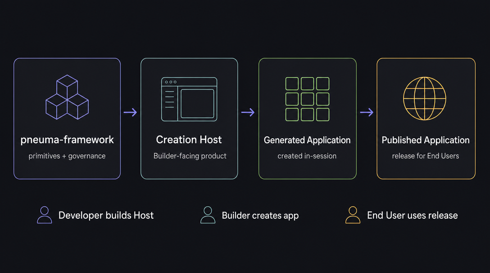
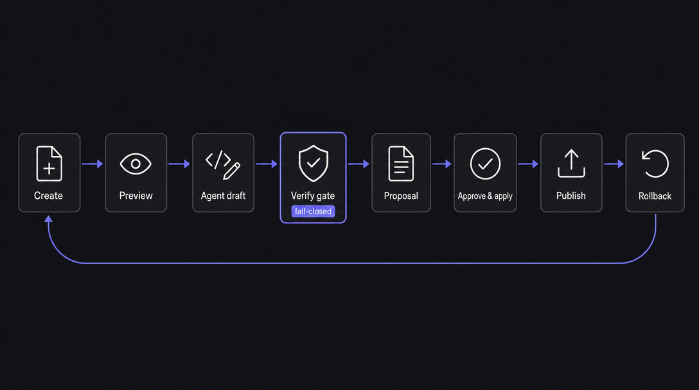
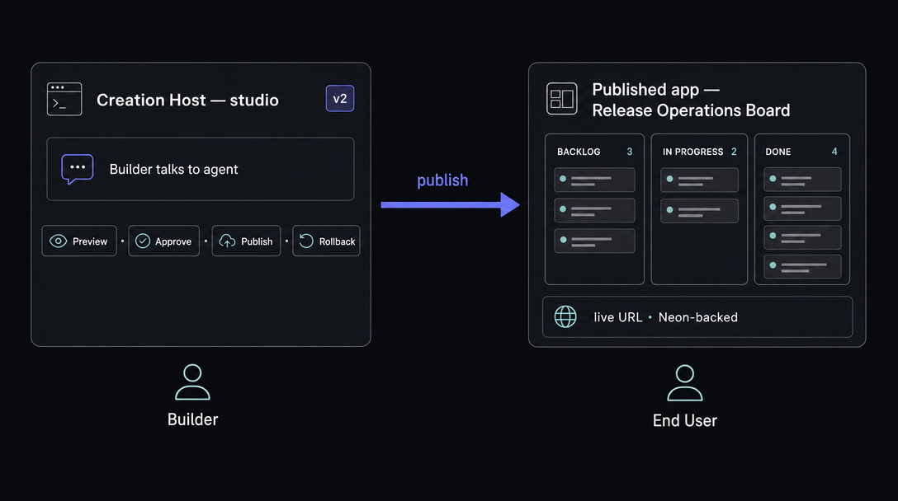

<p align="center">
  
</p>

<h1 align="center">pneuma-framework</h1>

<p align="center">
  Infrastructure for building <b>AI-native creation tools</b> — products where the
  user creates and evolves a <i>real</i> application by <b>talking to an agent</b>, safely.
</p>

<p align="center">
  <a href="https://pandazki.github.io/pneuma-framework/">Documentation</a> ·
  <a href="https://pandazki.github.io/pneuma-framework/architecture/">Architecture</a> ·
  <a href="https://pandazki.github.io/pneuma-framework/guide/">Build a Host</a> ·
  <a href="./CHANGELOG.md">Changelog</a>
</p>

---

## The problem: AI can write the app — now who governs the change?

AI coding agents can now build and modify a working application straight from a
conversation. That unlocks a new product shape: tools where the *user* creates the
app by **talking**, not by clicking and coding. It also creates a new, subtle
problem.

The moment you let an agent change a *real, running* application, you inherit a
set of questions that ordinary app development never had to answer at this speed:

- When is a change actually **done**? ("The agent said so" is not an answer.)
- How do you **preview** a change without corrupting live data?
- How do you keep the agent **off the live app** while it experiments?
- What gets **reviewed** before a change ships — and what happens to data on **rollback**?

Every team building one of these tools rebuilds the same plumbing to answer them:
an agent loop, a versioned workspace, a disposable preview, a governed
propose → review → approve → apply flow, and publish/rollback with real
persistence. This is the part that is easy to get *subtly* wrong.

## The approach: own the governed loop, not the product

The framework's bet is a strict separation of concerns, captured as four layers:



> **Framework → Creation Host → Generated Application → Published Application.**
> The framework owns **sequencing and governance**; you own **every effect** — the
> stack, the domain, the UI, the database, the deploy target. The framework never
> renders your UI or picks your database; it owns the *order* of the loop and its
> *gates*.

That loop is the core primitive:



`create-from-profile → preview → code-agent draft → `**`verify gate`**` → proposal
→ approve/apply → publish → rollback` — **fail-closed at every step**. A draft
becomes a reviewable proposal *only if* the scaffold's own `verify` passes;
approval gates mutation; rollback is code-only (data is forward-compatible, so it
is never silently dropped).

→ The full model and step-by-step deep dives live in the
**[Architecture](https://pandazki.github.io/pneuma-framework/architecture/)** and
**[Concepts](https://pandazki.github.io/pneuma-framework/concepts/)** docs.

## Quick start: understand it through the example

The fastest way to *get* the framework is to run the clean-room example — a real
Creation Host that drives the whole loop against a full-stack app
(Bun · Hono · React · Drizzle · Zod).

```bash
bun install   # examples use local dependency-linking; run once at the repo root

# 1) the Generated App scaffold on its own — typecheck + tests + build
bun run --cwd examples/clean-room-release-board verify

# 2) the Creation Host studio — deterministic lane, no credentials needed
PORT=8870 bun run --cwd examples/clean-room-release-host serve
# then open http://127.0.0.1:8870
```

In the studio you walk the entire loop:
**Create from profile → Preview → Run the agent → Approve & apply → Publish → Rollback.**



Follow it top-down — from the finished product down to the running code — in the
**[Build a Host](https://pandazki.github.io/pneuma-framework/guide/)** guide. To
drive the *full* real loop (a real Codex code agent, a Neon database branch, a
Vercel deploy), set `PNEUMA_AGENT=codex-app-server` plus the provider env vars in
a **gitignored `.env`** — see the guide's
**[end-to-end](https://pandazki.github.io/pneuma-framework/guide/end-to-end)** page.

## Go deeper (for developers)

Start on the documentation site — it is the canonical, navigable entry point
(bilingual: English, plus 简体中文 under `/zh/`):

- **[Architecture](https://pandazki.github.io/pneuma-framework/architecture/)** — the four-layer model, the governed loop, and the framework-vs-Host boundary.
- **[Concepts](https://pandazki.github.io/pneuma-framework/concepts/)** — each loop step and each domain primitive up close: the verify gate, proposal evidence, definition-as-data, BuildThread, and the two change models.
- **[Build a Host](https://pandazki.github.io/pneuma-framework/guide/)** — assemble a Host by *consuming* the framework, wiring effects as closures.
- **[For coding agents](https://pandazki.github.io/pneuma-framework/agents/)** — a router + standing-rules sheet, with a machine-readable [`llms.txt`](https://pandazki.github.io/pneuma-framework/llms.txt), for Claude Code / Codex extending a Host.

Then, in the repo:

- **`packages/host-kit`** — the governed-loop backbone + workspace mechanics ([guide](./docs/developer/host-kit.md)).
- **`packages/backend-codex`, `packages/adapter-vercel`, `packages/adapter-neon`** — opt-in, batteries-included reference adapters; the core never depends on them.
- **`examples/`** — the clean-room example above, plus Workflow App Studio and more.
- Developer contracts under **`docs/developer/`** — [BuildThread](./docs/developer/build-thread.md), [Code Change Lane](./docs/developer/code-change-lane.md), [Scaffold Project](./docs/developer/scaffold-project-contract.md), [Build Assurance](./docs/developer/build-assurance.md).

## Scope & boundaries

The framework is only valuable if it stays out of your way. For a `0.5.0`
release the line is drawn deliberately — these are documented boundaries, not
gaps (full detail:
[boundaries & ownership](https://pandazki.github.io/pneuma-framework/architecture/boundaries)
and the [global alignment review](./docs/architecture/spec/global-alignment-review-0.4.md)).

**Runtime: Bun-only.** The framework ships TypeScript source consumed by Bun
(`main`/`types` point at `src/*.ts`); it is Bun-resident, not a general
Node/Deno runtime. A Host must state this.

**The framework owns** (pure sequencing / governance / mechanics — reach for the
helper, don't re-implement):

- the Build-phase agent loop and the `AgentBackend` abstraction;
- the semantic / lifecycle tool API and governance + permission vocabulary;
- definition-as-data (tables / columns / operations / views / policies as governed rows);
- the BuildThread transcript, the Code Change Lane, and build-assurance primitives;
- the viewer **wire protocol** + the React SDK (`@pneuma-framework/viewer-react`);
- shadow-git / checkpoint / version & diff mechanics.

**The Host owns — explicitly NOT framework, for 0.5.0** (anything touching stack,
domain, UI, data shape, deploy target, or identity):

- multi-user / multi-tenant identity & IAM;
- hosted secret vaults;
- real provider SDKs — Vercel / Neon / Codex etc. ship as **opt-in reference
  adapters / examples**, never in the core;
- cloud deployment control planes and zero-downtime orchestration;
- compliance / audit retention backends;
- the product UX.

The litmus test: *does it touch the stack, the domain, the UI, the data shape,
the deploy target, or identity?* If yes, it is Host-owned — the framework gives
you a contract or a slot, never an implementation. This is what keeps the
framework from becoming a hosting platform that constrains your product.

> The viewer integrates over an **open wire protocol**. A **React SDK**
> (`@pneuma-framework/viewer-react`) ships on top of it; any other stack
> (vanilla JS, Vue, etc.) integrates directly against the documented wire
> protocol — a vanilla SDK is bring-your-own, not shipped.

## Milestones & roadmap

**Current release: `0.4.0`** — the implementation-framework version: a real
Creation Host now *consumes* Host Kit + reference adapters, and the full governed
loop is proven end-to-end against live Codex / Neon / Vercel.

| Train | Theme |
|---|---|
| `0.1.x` | First developer RC: Authoring Kit, Sharing Governance, BuildThread, Code Change Lane |
| `0.2.0` | Developer-contract roll-up + package-consumption gate; Build Assurance |
| `0.3.0` | Minimum enterprise governance: roles, review routing, fail-closed publish gate |
| **`0.4.0`** | **Implementation framework: Host Kit, reference adapters, a production profile, proven E2E** |

- Per-version scope → **[CHANGELOG.md](./CHANGELOG.md)**
- This release → **[release-0.4.0-notes](./docs/architecture/release-0.4.0-notes.md)**
- What's next → **[1.0 readiness review](./docs/architecture/release-1.0-readiness-review.md)** · **[roadmap](./docs/architecture/roadmap.md)**
- Historical milestone evidence (M1–M53) → **[docs/archive](./docs/archive/README.md)**

> **Scope note.** This is not a production SaaS platform. Multi-tenant identity,
> hosted secret vaults, zero-downtime deploy, and compliance backends are
> deliberately **Host-owned** — see [Scope & boundaries](#scope--boundaries) above.
