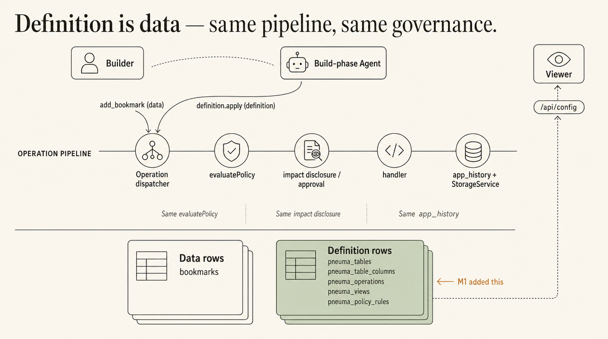
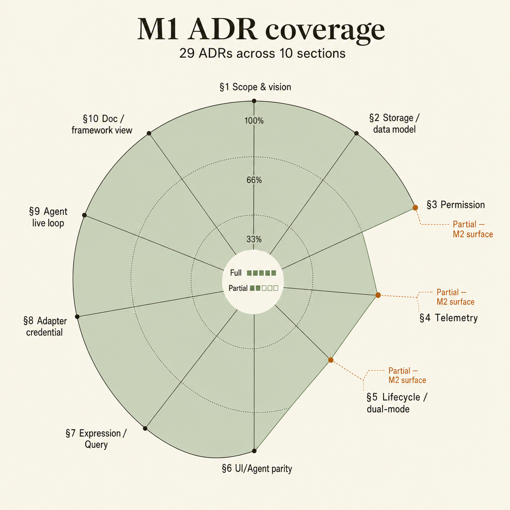

# Milestone 1 Snapshot: Governed App Evolution

**Date:** 2026-04-28
**Status:** Milestone snapshot for team alignment
**Audience:** teammates with zero Pneuma context
**Scope:** what the current milestone proves, what it does not prove yet, and what should become the next phase.

中文摘要：

> 这个快照不是任务列表，而是一次鸟瞰：我们已经从"Pneuma 应该如何设计"推进到"一个 framework primitive 真的成立"。Builder 可以通过 Agent 改变 app 的软件结构；framework 负责审批、记录、运行时发现、权限暴露和回滚。

## Executive Summary

Pneuma's current milestone proves a new software construction loop:

```text
Builder intent
  -> Agent proposal
  -> governed app-definition operation
  -> system-owned definition rows
  -> app_history attribution
  -> runtime rediscovery
  -> policy-gated end-user surface
  -> reversible rollback
```

中文讲法：

```text
Builder 不是只让 Agent 写一条数据；
Builder 是通过 Agent 让一个 app 长出新的 schema / domain service / API / app view / policy surface。
这些变化不是随意写文件，而是进入 framework 的治理路径。
```

The key shift is this:

| Before this milestone | After this milestone |
|---|---|
| Pneuma had a strong architecture thesis. | Pneuma has an executable primitive proof. |
| Agent-assisted app building was mostly a design claim. | Builder/Agent-governed app-definition mutation is demonstrable. |
| Definition changes could have become ad-hoc JSON/file overlays. | Definition changes are system-owned rows using the same storage/history/governance path as app data. |
| Rollback was a governance aspiration. | Rollback validates impact, asks permission, executes cleanup, and preserves business data for the supported slice. |

## Milestone Thesis

> A Pneuma app can evolve its own software surface in-session, through a governed framework primitive, without the Agent directly editing arbitrary runtime code.

中文：

> Pneuma 的里程碑不只是"AI 帮我改了页面"，而是"app definition 本身成为可治理、可审计、可回滚的 runtime primitive"。

This is the architectural line that matters for the project:

- **Not data mutation:** add one bookmark row.
- **Not codegen demo:** generate a one-off React component.
- **Yes definition mutation:** add an Operation, mount a View, expose it through `/api/config`, gate it by PolicyRule, and rollback the definition rows.

## Where Pneuma Sits

Pneuma is **infrastructure for AI-native creation tools** — applications where the **end-user builds the app's behavior and UI by talking to an agent**. The framework is the primitive; shipped pneuma-apps are the product.

| | Retool / n8n | Airtable / Notion | Rails / Next.js | **Pneuma** |
|---|---|---|---|---|
| Construction model | drag fields, wire forms | prebuilt blocks, configure | code-first | **conversation-first** |
| Agent role | bolt-on chatbox | bolt-on AI features | absent | **first-class** primitive ([ADR-0018](./adr/0018-operations-as-primitive.md)) |
| Audience | developer / power user | knowledge worker | developer | **Builder** (non-developer) |
| Permission model | imperative RBAC | imperative RBAC | per-app | **declarative DSL with NL bidirectionality** ([ADR-0007](./adr/0007-permission-dsl.md), [ADR-0008](./adr/0008-nl-bidirectional.md)) |

Three differentiators that no other framework offers together:

1. **UI binding and Agent tool-call derive from one declaration.** Click a button = call a tool. Same Operation primitive. ([ADR-0018](./adr/0018-operations-as-primitive.md), [ADR-0023](./adr/0023-operation-surface-contract.md))
2. **Permission DSL is conversational both ways.** Builder says "only Alice can see"; agent translates to a rule. End-user asks "why can't I see this?"; agent reverse-explains. ([ADR-0008](./adr/0008-nl-bidirectional.md))
3. **One AST powers filter / policy / trigger.** Learn `WhereClause` once, it covers the stack. ([ADR-0019](./adr/0019-where-clause-ast.md))

中文：

> Pneuma 不是"更快写代码的工具"，是"让非程序员通过对话创造应用"的 framework。它把 agent 当 first-class primitive，而不是套在传统应用上的 chatbox。

## System At A Glance

The architectural insight of M1: **definition rows and data rows go through the same Operation pipeline.** Whatever guarantees apply to "add a bookmark row" also apply to "add a callable URL-export Operation."



The sage panel is what M1 added: a class of Operations (`definition.apply(...)`) whose handler writes definition rows. Everything else is reused — `evaluatePolicy`, impact disclosure, `app_history`, `StorageService`. No parallel governance channel, no JSON overlay, no separate audit path.

## What Is Proven

| Capability | Current proof |
|---|---|
| App definition as data | `pneuma_tables`, `pneuma_table_columns`, `pneuma_operations`, `pneuma_views`, and `pneuma_policy_rules` are system-owned Tables. |
| Governed definition mutation | `definition.apply(...)` handles additive definition changes through framework semantic operations. |
| Attribution and history | `app_history` records definition snapshots and the framework can compute rollback impact. |
| Runtime rediscovery | After restart, `/api/config` and runtime operation registration reflect the new definition rows. |
| End-user app surface | A Builder-authored Operation can become an API capability; a Builder-authored View can become visible in the app. |
| Policy-gated visibility | `add_policy_rule` can make a View visible to `reviewer` while keeping `guest` blocked. |
| Reversible supported changes | Rollback removes added Tables, columns, query-backed Operations, Operation-backed Views, and additive PolicyRules. |
| Contract hygiene | Operation output schemas, `invocation_method`, surface classification, and read-only storage isolation are aligned enough for the current slice. |
| Team-share narrative | The studio demo explains the same change through end-user app, system viewer, and Builder/Agent governance surfaces. |

## Current Primitive Surface

The milestone now covers five definition primitives:

```text
Schema          -> add_table, add_table_column
Domain service  -> add_operation(query/read-only)
API surface     -> /api/config + operation invocation route
App surface     -> add_view(Operation-backed declarative View)
Policy surface  -> add_policy_rule(additive allow rule)
```

中文：

> 这五层让团队能从传统软件视角理解 Pneuma：不是抽象地说"Agent 改 app"，而是明确看到 schema、domain service、API、app view、policy 分别发生了什么。

## Working Definition Surface

The five primitive surfaces above are stored as system-owned Tables, on the same storage / history / governance path as app data. No separate JSON overlay file channel.

| System-owned Table | Stores |
|---|---|
| `pneuma_tables` | Builder/agent-declared stored Tables |
| `pneuma_table_columns` | Builder/agent-declared columns on stored Tables |
| `pneuma_operations` | Builder/agent-declared query-backed read Operations |
| `pneuma_views` | Builder/agent-declared Views mounted on read Operations |
| `pneuma_policy_rules` | Builder/agent-declared additive PolicyRules |

Each Operation carries a normalized `surface` contract instead of inferring exposure from `reads_only` alone:

```ts
{
  agent_callable: boolean;
  public_surface: boolean;
  view_mountable: boolean;
  framework_internal: boolean;
}
```

Builder-authored read Operations default to `public_surface=true` and `view_mountable=true`. Framework governance Operations are explicitly `framework_internal=true`, `public_surface=false`, and `view_mountable=false`, while remaining `agent_callable=true`. See [ADR-0023](./adr/0023-operation-surface-contract.md).

## Supported Definition Mutations

`definition.apply` currently supports five additive shapes. Each goes through the same governed pipeline: approval → write definition row + `app_history` snapshot → restart → rediscover via `/api/config`.

### `add_table` / `add_table_column`

```text
before: row for unknown table / unknown column is rejected
apply:  writes pneuma_tables / pneuma_table_columns row + app_history entry
after:  StorageService validation accepts rows for the new schema
```

### `add_operation` (query-backed read)

```ts
{
  kind: "add_operation",
  operation_id: "list_bookmark_urls",
  handler: {
    kind: "query",
    on: "bookmarks",
    fields: ["title", "url", "source", "lens"],
    pagination: { kind: "offset", size: 10 }
  },
  surface: {
    agent_callable: true,
    public_surface: true,
    view_mountable: true,
    framework_internal: false
  }
}
```

### `add_view` (Operation-backed)

```ts
{
  kind: "add_view",
  view_id: "review_queue",
  name: "Review Queue",
  view_kind: "table",
  source: { kind: "operation", operation_id: "list_bookmark_urls" },
  presentation: {
    title: "Review Queue",
    columns: [
      { field: "title",  label: "Title",  role: "title" },
      { field: "url",    label: "URL",    role: "url" },
      { field: "source", label: "Origin", role: "metadata" },
      { field: "lens",   label: "Lens",   role: "metadata" }
    ],
    empty_state: "No sources are waiting for review."
  }
}
```

### `add_policy_rule` (additive allow)

```ts
{
  kind: "add_policy_rule",
  rule_id: "reviewers-can-read-review-queue",
  allow: [{ kind: "role", name: "reviewer" }],
  actions: ["read"],
  resource: { kind: "view", id: "review_queue" }
}
```

Acceptance pattern (consistent across all five):

```text
before:  capability absent in /api/config and runtime
apply:   definition row + app_history snapshot
restart: runtime rehydrates and exposes the new surface
after:   request-scoped policy gates visibility
rollback: removes the definition row and restores prior surface
```

## End-To-End Loop


What changed is not hidden in the demo UI. Each step maps to an actual framework concept:

| Demo moment | Framework concept |
|---|---|
| Agent asks to install capability | Semantic framework operation, not arbitrary script editing |
| Approval card appears | Wire permission envelope + impact disclosure |
| `pneuma_operations` row appears | App definition stored as system-owned Table rows |
| Restart progress is visible | Framework event protocol for definition restart phases |
| Operation appears in app/API | Runtime rediscovery and `/api/config` |
| Review Queue appears | View presentation contract + reusable React renderer |
| Reviewer can see it, Guest cannot | Request-scoped policy evaluation |
| Rollback removes the capability | app_history-based rollback with cleanup |

## Demo Story

The recommended milestone demo is:

```text
examples/p5-viewer-approval-e2e
?scenario=capability-lifecycle&variant=studio
```

Story:

1. **Baseline:** Reader Bookmarks already has a real source row. The missing thing is not data; the missing thing is a capability surface.
2. **Operation:** Builder asks Agent to expose selected bookmark URLs. Framework writes a `pneuma_operations` row and rediscovery exposes `list_bookmark_urls`.
3. **View:** Builder asks Agent to mount a Review Queue. Framework writes a `pneuma_views` row and the end-user app renders it through the View contract.
4. **Policy:** Builder asks Agent to let reviewers see the queue. Framework writes a `pneuma_policy_rules` row; reviewer sees it, guest remains blocked.
5. **Rollback:** Builder reviews rollback impact and approves execution. Operation, View, and PolicyRule disappear; the original bookmark row remains.

中文讲法：

> 这个 demo 的目标不是展示一个"酷页面"，而是让团队在一个业务故事里看到：同一个 Builder 意图，如何变成 Operation、View、PolicyRule 三类 app definition row，并且被 framework 治理。

For the full presenter runbook (opening narrative, screen map, talk track, FAQ), see [`team-share-demo.md`](./team-share-demo.md).

## Rollback Path

Rollback is split into validation/approval and execution.

```text
definition.rollback.validate
  -> reconstruct target overlay state from app_history
  -> compute removed Tables / columns / Operations / Views / PolicyRules
  -> disclose destructive impact

definition.rollback.prepare
  -> call validate
  -> request approval when needed
  -> return ready_to_execute or denied

definition.rollback.execute
  -> write pre-rollback backup
  -> remove affected definition rows
  -> delete removed overlay table rows when needed
  -> clean removed column cells from retained rows
  -> append post-rollback definition snapshot
  -> restart / refetch / verify
```

| Rollback impact | Status |
|---|---|
| Removed overlay Table | Supported, destructive row deletion with backup |
| Removed overlay column | Supported, affected cell cleanup with backup |
| Removed query-backed Operation | Supported, deletes `pneuma_operations` definition row |
| Removed Operation-backed View | Supported, deletes `pneuma_views` definition row |
| Removed PolicyRule | Supported, deletes `pneuma_policy_rules` definition row |
| Restored Table / column / Operation / View / PolicyRule | Not supported yet |
| Non-query Operation rollback | Not supported yet |

## Why These Design Choices

Three design decisions are doing most of the load-bearing work in this milestone. If a reviewer is going to push back, they will push back on one of these three.

### 1. App definition is data, not code

`pneuma_tables / pneuma_table_columns / pneuma_operations / pneuma_views / pneuma_policy_rules` are stored as system-owned rows in the same storage layer as app data. Not as JSON overlay files, not as generated TypeScript modules.

**Why:** definition rows then automatically inherit the framework's existing primitive pipeline — `PermissionContext`, `app_history`, `evaluatePolicy`, telemetry, rollback. Adding a JSON overlay file would have meant building a parallel governance path. ([ADR-0022](./adr/0022-view-system.md), [ADR-0017](./adr/0017-rollback-data-semantics.md), [ADR-0029](./adr/0029-supersede-v0-design-spec.md))

**Cost:** restart is required to rediscover; hot reload is M2/M3 work.

### 2. Rollback is three-stage, not one-step

`validate → prepare → execute`. Validation reconstructs the target overlay state and discloses what disappears; prepare gates approval; execute writes a backup and removes definition rows.

**Why:** definition mutation can erase capability surfaces that other rows depend on (Views referencing Operations, PolicyRules referencing Views). A single-step destructive rollback would either fail mid-way or silently break invariants. The three-stage flow forces impact disclosure to land before destruction starts. ([ADR-0017](./adr/0017-rollback-data-semantics.md))

**Cost:** rollback flow is more steps for the Builder; mitigated by the impact-disclosure card (Builder only sees the validation summary, not three confirmations).

### 3. Restart phases are visible, not hidden

`framework-event` envelopes carry definition apply / rollback restart phases (`applying-definition`, `stopping-for-definition-apply`, `starting-after-definition-apply`, `refreshing-definition`, `running` / `failed`) over the wire protocol.

**Why:** restart is the current rediscovery boundary. Hiding it would force the demo (and the Builder) to narrate around a black box. Surfacing it as a state snapshot makes the boundary itself a feature. The same channel will eventually carry hot-reload phases without protocol churn. ([ADR-0028](./adr/0028-framework-event-protocol.md))

**Cost:** the wire protocol gains a new envelope kind; viewer SDKs that ignored it would still work, but they would not show the "restarting" UI.

中文：

> 三条线是这次 milestone 的脊柱：app definition is data（治理就免费了）；rollback 三段式（破坏前必先披露）；重启是 protocol（不是不可见的黑盒）。

## M1 Verification Matrix

Each definition primitive is verified end-to-end. Tests live in `packages/core-domain` (aggregates + lifecycle), `packages/runtime` (apply / api-config / framework-operations), `packages/core` (tools / bridges), `packages/viewer-react` (PermissionPrompt + ViewRenderer), and `examples/p5-viewer-approval-e2e` (live browser).

| Capability dimension | `add_table` | `add_column` | `add_operation` | `add_view` | `add_policy_rule` |
|---|:-:|:-:|:-:|:-:|:-:|
| Definition row write | ✅ | ✅ | ✅ | ✅ | ✅ |
| `app_history` snapshot | ✅ | ✅ | ✅ | ✅ | ✅ |
| Restart rediscovery | ✅ | ✅ | ✅ | ✅ | ✅ |
| Policy gating | — | — | — | ✅ | ✅ |
| `rollback.validate` | ✅ | ✅ | ✅ | ✅ | ✅ |
| `rollback.execute` | ✅ | ✅ | ✅ | ✅ | ✅ |
| Restored rollback | ❌ | ❌ | ❌ | ❌ | ❌ |
| Hot reload | ❌ | ❌ | ❌ | ❌ | ❌ |
| Non-query Operation | — | — | ❌ | — | — |

Legend: ✅ supported · ❌ not yet · — not applicable.

Targeted suite (run as smoke before team share):

```text
packages/viewer-react/test/PermissionPrompt.test.tsx
packages/viewer-react/test/ViewRenderer.test.tsx
packages/core-domain/test/aggregates/operation.test.ts
packages/core-domain/test/lifecycle/pneuma-operations.test.ts
packages/core-domain/test/lifecycle/pneuma-views.test.ts
packages/core-domain/test/lifecycle/pneuma-policy-rules.test.ts
packages/runtime/test/framework-operations.test.ts
packages/runtime/test/definition-apply.test.ts
packages/runtime/test/api-config.test.ts
packages/runtime/test/runtime.test.ts
packages/core/test/operation-tool-bridge.test.ts
packages/core/test/template-mcp-bridge.test.ts
packages/core/test/tools/definition-apply.test.ts
examples/p5-viewer-approval-e2e/capability-lifecycle.test.ts
packages/core-domain/test/services/operation-executor.test.ts
templates/bookmarks-core-domain/test/operation-declarations.test.ts
templates/weekly-linear-digest/test/operation-declarations.test.ts
```

Full repo state (2026-04-28):

```text
bun run typecheck                                     PASS
bun test                                              851 pass / 0 fail / 2731 expect()
(cd examples/p5-viewer-approval-e2e && bun run build) PASS
git diff --check                                      PASS
```

## Project Progress By Layer

Two views — qualitative ("how does this layer feel?") and structural ("which ADRs are landed in code?"). Use both.

### Qualitative

| Layer | Current state | Implication |
|---|---|---|
| Vision / positioning | Strong. The project has a clear wedge: conversational, governed app creation. | Continue using this as the product north star. |
| Core domain primitives | Strong for the current milestone. Tables, Operations, Views, PolicyRules, history, and rollback now connect. | We can stop proving whether app-definition mutation is possible. |
| Governance skeleton | Real but MVP. Approval, impact disclosure, attribution, policy gating, and rollback exist. | Next risk is depth and correctness under enterprise constraints. |
| Demo / narrative | Usable for team sharing. The studio demo is much clearer than a single-click engineering harness. | Rehearse with zero-context teammates before adding more primitives. |
| Runtime protocol | Improving. Permission prompts and framework events are live, but reconnect/persistence/versioning are not settled. | Needs hardening before production claims. |
| Enterprise readiness | Early. The primitives point in the right direction, but auth, default policy posture, concurrent edits, and transaction boundaries need work. | This is the natural next milestone theme. |

### ADR coverage (by §)



29 ADRs sit in 10 sections. Coverage = ADR exists + matching code path + at least one scenario / test that exercises it. "Partial" means decision recorded and code path landed but enterprise-level surface is still demo-grade.

| § | Topic | ADRs | Status | Notes |
|---|---|---|---|---|
| §1 | Scope & vision | 0001 | ✅ Full | archetype A+B in code; C/D interface slots reserved |
| §2 | Storage / data model | 0002–0005 | ✅ Full | Tables, CellTypes, Adapters, capabilities — all in `core-domain` with tests |
| §3 | Permission | 0006–0012 | 🟡 Partial | DSL + evaluator + default posture in code; NL-bidirectional + agent-permission UI is demo-only |
| §4 | Telemetry | 0013–0015 | 🟡 Partial | 5-event model + audit subset + pluggable sinks landed; product-level trace UI not built |
| §5 | Lifecycle / dual-mode | 0016–0017 | 🟡 Partial | Dev/Prod isolation conceptual; rollback on add path concrete; fork/redeploy stub |
| §6 | UI / Agent parity | 0018, 0023 | ✅ Full | Operation primitive + surface contract drive the M1 demo |
| §7 | Expression / query | 0019–0020 | ✅ Full | WhereClause AST + Query DSL in `core-domain` |
| §8 | Adapter credential | 0021 | ✅ Full | `admin_delegated` + Linear adapter live in `weekly-linear-digest` |
| §9 | Agent / live loop | 0025–0028 | ✅ Full | Conversation persistence + tool-call binding + SSE + framework event — all in M1 demo |
| §10 | Doc / framework view | 0029 | ✅ Full | v0 supersedure executed |

Visual roll-up:

```text
§1   Scope                ▰▰▰▰▰▰▰▰▰▰  Full
§2   Storage              ▰▰▰▰▰▰▰▰▰▰  Full
§3   Permission           ▰▰▰▰▰▰▰▱▱▱  Partial (auth surface + bidi NL pending)
§4   Telemetry            ▰▰▰▰▰▰▱▱▱▱  Partial (trace UI pending)
§5   Lifecycle            ▰▰▰▰▰▱▱▱▱▱  Partial (fork/redeploy pending)
§6   UI/Agent parity      ▰▰▰▰▰▰▰▰▰▰  Full
§7   Expression / query   ▰▰▰▰▰▰▰▰▰▰  Full
§8   Adapter credential   ▰▰▰▰▰▰▰▰▰▰  Full
§9   Agent live loop      ▰▰▰▰▰▰▰▰▰▰  Full
§10  Doc / framework view ▰▰▰▰▰▰▰▰▰▰  Full
```

§3 / §4 / §5 are the partial bars — they are not M1 blockers but they are the natural pressure surfaces M2 will lean on.

## What This Does Not Prove Yet

This boundary is important. The milestone is real, but it is not yet a production enterprise platform.

| Not yet proven | Why it matters |
|---|---|
| Hot reload | Current definition changes still rely on restart/rediscovery. Acceptable for primitive proof, not final UX. |
| Full enterprise auth | PolicyRule rows exist, but default posture, deny/edit/delete semantics, Builder/Agent scopes, and organization identity are not complete. |
| Arbitrary code distribution | `add_operation` supports query-backed read Operations, not arbitrary Builder-authored code handlers. |
| Custom View components | Views use a declarative presentation contract and React renderer, not packaged custom components. |
| Multi-builder concurrency | Definition writes can still race without serialization/database constraints. |
| External `/api/config` versioning | Useful and cleaner now, but not yet a formal public client contract. |
| Cross-store atomicity | Definition row + history write is not yet an enterprise-grade transaction guarantee. |
| Durable permission center | Live prompts work, but the product surface for pending approvals and reconnect recovery remains demo-level. |
| Restored definition rollback | Removed-then-restored rollback is not implemented. |
| Non-query Operation rollback | Code-handler Operations are not part of the rollback supported slice. |

中文：

> 所以我们应该说"framework primitive 成立"，而不是说"企业版已经 ready"。这两句话的差别很关键。

## Strategic Read

My read is that Milestone 1 should be considered **closed enough for team alignment** once the team has seen the studio demo and agrees with the boundaries above.

The next question should not be "what random next feature can we add?" It should be:

> Which risk blocks Pneuma from becoming credible infrastructure rather than a clever prototype?

The answer is now less about adding another primitive and more about hardening the governance model:

- Who is allowed to ask for definition changes?
- Who is allowed to approve them?
- What default policy posture applies before explicit rules exist?
- How are deny/edit/delete policy changes represented?
- How do we serialize concurrent Builder/Agent definition writes?
- What protocol guarantees does the viewer need across restart/reconnect?

中文判断：

> 现在最有价值的下一阶段不是继续堆 demo capability，而是把"企业治理主线"拉实。因为 app-definition primitive 已经能讲通；真正会被团队和未来客户追问的是权限、审计、并发、审批、恢复这些治理问题。

## Recommended Next Phase

Recommended next phase:

> **Milestone 2: Enterprise Governance Hardening**

Suggested workstreams (full list in [`roadmap.md`](./roadmap.md) §"Stage 5"):

| Workstream | Goal |
|---|---|
| Policy lifecycle | Move beyond additive allow rules: edit/delete, deny semantics, default posture, explanation. |
| Authorization model | Separate Builder, Agent, Framework, Reviewer, Guest capabilities clearly. |
| Permission center | Make approvals durable, inspectable, recoverable, and not only live prompt cards. |
| Protocol hardening | Persist framework events, define reconnect semantics, version permission/config envelopes. |
| Transaction/concurrency | Make definition row + history writes atomic enough, and serialize competing definition versions. |
| Reference app pressure | Keep the Reader Bookmarks demo as the teaching harness, but introduce one real app-template pressure test before calling the phase complete. |

## Team Decision Gate

For the team share, I would end with these decisions:

1. Do we agree Milestone 1 proves the app-definition primitive?
2. Do we agree the next milestone should be governance hardening, not more unrelated primitives?
3. Do we keep Reader Bookmarks as the canonical teaching demo while using a second reference app as pressure test?
4. Which enterprise governance gap is most dangerous: authorization, policy lifecycle, protocol recovery, or transaction/concurrency?

If the team agrees, the project has a clean phase boundary:

```text
Milestone 1:
  "Can a Builder/Agent governably evolve an app definition?"
  Answer: yes, for the supported slice.

Milestone 2:
  "Can the same primitive survive enterprise governance requirements?"
  Answer: next work.
```

## Evidence

Recent commits leading into this snapshot:

```text
4340d9b Add milestone snapshot overview
781437b Clean up operation contract semantics
c3eea71 Harden policy-gated lifecycle demo
254f401 Add policy rule definition primitive
10fe4b6 Extract reusable React view renderer
704f29e Add explicit view presentation renderer contract
d5260e0 Polish framework event demo narrative
e72b1c4 Show framework event progress in lifecycle demo
45f9d14 Add framework event protocol for restarts
```

Recorded verification from the milestone:

```text
bun run typecheck
bun test
(cd examples/p5-viewer-approval-e2e && bun run build)
git diff --check
```

Latest recorded full test state:

```text
851 pass / 0 fail / 2731 expect() calls
```

## Reading Path

For a teammate with no context:

1. Read this snapshot first.
2. Read [`team-share-demo.md`](./team-share-demo.md) before the live share.
3. Read [`OPEN-QUESTIONS.md`](./OPEN-QUESTIONS.md) only after agreeing on the milestone boundary.
4. Read [`roadmap.md`](./roadmap.md) for the post-M1 phasing.

For deeper architecture, follow [`README.md`](./README.md) into the ADR set.

## Appendix — Historical Slice Ledger (P2–P23)

Kept as a brief ledger; do not accumulate per-slice reports. Future work updates this snapshot, ADRs, or OPEN-QUESTIONS.

| Slice | Durable result |
|---|---|
| P2  | `definition.apply(add_table_column)` end to end |
| P4  | `definition.apply(add_table)` on the same primitive path |
| P5  | approval UI, overlay warning visibility, rollback semantics draft |
| P6  | non-destructive rollback validation |
| P7  | rollback approval disclosure in viewer |
| P8  | rollback prepare boundary in core tool lifecycle |
| P9  | destructive rollback executor for removed overlay Tables |
| P10 | removed-column rollback with affected cell cleanup |
| P11 | live browser rollback execute E2E |
| P12 | query-backed `add_operation` and `pneuma_operations` overlay |
| P13 | Operation impact disclosure in apply/rollback approval |
| P14 | rollback execute for removed query-backed Operations |
| P15 | replayable live browser capability lifecycle demo |
| P16 | Operation-backed View primitive, `pneuma_views`, full Operation → View → rollback demo |
| P17 | Operation surface contract (`agent_callable`, `public_surface`, `view_mountable`, `framework_internal`) |
| P18 | 0-prep team-share package |
| P19 | Request-scoped View visibility policy (`read view:<id>` + `invoke operation:<source>`) |
| P20 | Wire-protocol framework events for definition restart phases |
| P21 | PolicyRule definition primitive (`pneuma_policy_rules` + `add_policy_rule`) |
| P22 | Policy-gated live demo with request-scoped Reviewer/Guest visibility |
| P23 | Operation contract cleanup (object output, `invocation_method`, read-only storage isolation) |
