# Milestone 1 Snapshot: Governed App Evolution

**Date:** 2026-04-28
**Status:** Milestone snapshot for team alignment
**Audience:** teammates with zero Pneuma context
**Scope:** what the current milestone proves, what it does not prove yet, and what should become the next phase.

中文摘要：

> 这个快照不是任务列表，而是一次鸟瞰：我们已经从“Pneuma 应该如何设计”推进到“一个 framework primitive 真的成立”。Builder 可以通过 Agent 改变 app 的软件结构；framework 负责审批、记录、运行时发现、权限暴露和回滚。

## Executive Summary

Pneuma's current milestone proves a new software construction loop:

```text
Builder intent
  -> Agent proposal
  -> governed app-definition operation
  -> system-owned definition rows
  -> app_history attribution
  -> runtime rediscovery
  -> policy-gated end-user surface
  -> reversible rollback
```

中文讲法：

```text
Builder 不是只让 Agent 写一条数据；
Builder 是通过 Agent 让一个 app 长出新的 schema / domain service / API / app view / policy surface。
这些变化不是随意写文件，而是进入 framework 的治理路径。
```

The key shift is this:

| Before this milestone | After this milestone |
|---|---|
| Pneuma had a strong architecture thesis. | Pneuma has an executable primitive proof. |
| Agent-assisted app building was mostly a design claim. | Builder/Agent-governed app-definition mutation is demonstrable. |
| Definition changes could have become ad-hoc JSON/file overlays. | Definition changes are system-owned rows using the same storage/history/governance path as app data. |
| Rollback was a governance aspiration. | Rollback validates impact, asks permission, executes cleanup, and preserves business data for the supported slice. |

## Milestone Thesis

> A Pneuma app can evolve its own software surface in-session, through a governed framework primitive, without the Agent directly editing arbitrary runtime code.

中文：

> Pneuma 的里程碑不只是“AI 帮我改了页面”，而是“app definition 本身成为可治理、可审计、可回滚的 runtime primitive”。

This is the architectural line that matters for the project:

- **Not data mutation:** add one bookmark row.
- **Not codegen demo:** generate a one-off React component.
- **Yes definition mutation:** add an Operation, mount a View, expose it through `/api/config`, gate it by PolicyRule, and rollback the definition rows.

## What Is Proven

| Capability | Current proof |
|---|---|
| App definition as data | `pneuma_tables`, `pneuma_table_columns`, `pneuma_operations`, `pneuma_views`, and `pneuma_policy_rules` are system-owned Tables. |
| Governed definition mutation | `definition.apply(...)` handles additive definition changes through framework semantic operations. |
| Attribution and history | `app_history` records definition snapshots and the framework can compute rollback impact. |
| Runtime rediscovery | After restart, `/api/config` and runtime operation registration reflect the new definition rows. |
| End-user app surface | A Builder-authored Operation can become an API capability; a Builder-authored View can become visible in the app. |
| Policy-gated visibility | `add_policy_rule` can make a View visible to `reviewer` while keeping `guest` blocked. |
| Reversible supported changes | Rollback removes added Tables, columns, query-backed Operations, Operation-backed Views, and additive PolicyRules. |
| Contract hygiene | Operation output schemas, `invocation_method`, surface classification, and read-only storage isolation are aligned enough for the current slice. |
| Team-share narrative | The studio demo explains the same change through end-user app, system viewer, and Builder/Agent governance surfaces. |

## Current Primitive Surface

The milestone now covers five definition primitives:

```text
Schema          -> add_table, add_table_column
Domain service  -> add_operation(query/read-only)
API surface     -> /api/config + operation invocation route
App surface     -> add_view(Operation-backed declarative View)
Policy surface  -> add_policy_rule(additive allow rule)
```

中文：

> 这五层让团队能从传统软件视角理解 Pneuma：不是抽象地说“Agent 改 app”，而是明确看到 schema、domain service、API、app view、policy 分别发生了什么。

## End-To-End Loop

```mermaid
flowchart LR
  A["Builder asks for a capability"] --> B["Build-phase Agent proposes definition.apply"]
  B --> C["Viewer permission prompt"]
  C --> D["System-owned definition row"]
  D --> E["app_history snapshot"]
  E --> F["Runtime restart / rediscovery"]
  F --> G["/api/config exposes new surface"]
  G --> H["End-user app changes"]
  H --> I["Rollback validate / prepare / execute"]
  I --> J["Definition rows removed / app_history advances"]
  J --> F
```



What changed is not hidden in the demo UI. Each step maps to an actual framework concept:

| Demo moment | Framework concept |
|---|---|
| Agent asks to install capability | Semantic framework operation, not arbitrary script editing |
| Approval card appears | Wire permission envelope + impact disclosure |
| `pneuma_operations` row appears | App definition stored as system-owned Table rows |
| Restart progress is visible | Framework event protocol for definition restart phases |
| Operation appears in app/API | Runtime rediscovery and `/api/config` |
| Review Queue appears | View presentation contract + reusable React renderer |
| Reviewer can see it, Guest cannot | Request-scoped policy evaluation |
| Rollback removes the capability | app_history-based rollback with cleanup |

## Demo Story

The recommended milestone demo is:

```text
examples/p5-viewer-approval-e2e
?scenario=capability-lifecycle&variant=studio
```

Story:

1. **Baseline:** Reader Bookmarks already has a real source row. The missing thing is not data; the missing thing is a capability surface.
2. **Operation:** Builder asks Agent to expose selected bookmark URLs. Framework writes a `pneuma_operations` row and rediscovery exposes `list_bookmark_urls`.
3. **View:** Builder asks Agent to mount a Review Queue. Framework writes a `pneuma_views` row and the end-user app renders it through the View contract.
4. **Policy:** Builder asks Agent to let reviewers see the queue. Framework writes a `pneuma_policy_rules` row; reviewer sees it, guest remains blocked.
5. **Rollback:** Builder reviews rollback impact and approves execution. Operation, View, and PolicyRule disappear; the original bookmark row remains.

中文讲法：

> 这个 demo 的目标不是展示一个“酷页面”，而是让团队在一个业务故事里看到：同一个 Builder 意图，如何变成 Operation、View、PolicyRule 三类 app definition row，并且被 framework 治理。

## Project Progress By Layer

| Layer | Current state | Implication |
|---|---|---|
| Vision / positioning | Strong. The project has a clear wedge: conversational, governed app creation. | Continue using this as the product north star. |
| Core domain primitives | Strong for the current milestone. Tables, Operations, Views, PolicyRules, history, and rollback now connect. | We can stop proving whether app-definition mutation is possible. |
| Governance skeleton | Real but MVP. Approval, impact disclosure, attribution, policy gating, and rollback exist. | Next risk is depth and correctness under enterprise constraints. |
| Demo / narrative | Usable for team sharing. The studio demo is much clearer than a single-click engineering harness. | Rehearse with zero-context teammates before adding more primitives. |
| Runtime protocol | Improving. Permission prompts and framework events are live, but reconnect/persistence/versioning are not settled. | Needs hardening before production claims. |
| Enterprise readiness | Early. The primitives point in the right direction, but auth, default policy posture, concurrent edits, and transaction boundaries need work. | This is the natural next milestone theme. |

## What This Does Not Prove Yet

This boundary is important. The milestone is real, but it is not yet a production enterprise platform.

| Not yet proven | Why it matters |
|---|---|
| Hot reload | Current definition changes still rely on restart/rediscovery. That is acceptable for primitive proof, not final UX. |
| Full enterprise auth | PolicyRule rows exist, but default posture, deny/edit/delete semantics, Builder/Agent scopes, and organization identity are not complete. |
| Arbitrary code distribution | `add_operation` supports query-backed read Operations, not arbitrary Builder-authored code handlers. |
| Custom View components | Views use a declarative presentation contract and React renderer, not packaged custom components. |
| Multi-builder concurrency | Definition writes can still race without serialization/database constraints. |
| External `/api/config` versioning | It is useful and cleaner now, but not yet a formal public client contract. |
| Cross-store atomicity | Definition row + history write is not yet an enterprise-grade transaction guarantee. |
| Durable permission center | Live prompts work, but the product surface for pending approvals and reconnect recovery remains demo-level. |

中文：

> 所以我们应该说“framework primitive 成立”，而不是说“企业版已经 ready”。这两句话的差别很关键。

## Strategic Read

My read is that Milestone 1 should be considered **closed enough for team alignment** once the team has seen the studio demo and agrees with the boundaries above.

The next question should not be “what random next feature can we add?” It should be:

> Which risk blocks Pneuma from becoming credible infrastructure rather than a clever prototype?

The answer is now less about adding another primitive and more about hardening the governance model:

- Who is allowed to ask for definition changes?
- Who is allowed to approve them?
- What default policy posture applies before explicit rules exist?
- How are deny/edit/delete policy changes represented?
- How do we serialize concurrent Builder/Agent definition writes?
- What protocol guarantees does the viewer need across restart/reconnect?

中文判断：

> 现在最有价值的下一阶段不是继续堆 demo capability，而是把“企业治理主线”拉实。因为 app-definition primitive 已经能讲通；真正会被团队和未来客户追问的是权限、审计、并发、审批、恢复这些治理问题。

## Recommended Next Phase

Recommended next phase:

> **Milestone 2: Enterprise Governance Hardening**

Suggested workstreams:

| Workstream | Goal |
|---|---|
| Policy lifecycle | Move beyond additive allow rules: edit/delete, deny semantics, default posture, explanation. |
| Authorization model | Separate Builder, Agent, Framework, Reviewer, Guest capabilities clearly. |
| Permission center | Make approvals durable, inspectable, recoverable, and not only live prompt cards. |
| Protocol hardening | Persist framework events, define reconnect semantics, version permission/config envelopes. |
| Transaction/concurrency | Make definition row + history writes atomic enough, and serialize competing definition versions. |
| Reference app pressure | Keep the Reader Bookmarks demo as the teaching harness, but introduce one real app-template pressure test before calling the phase complete. |

## Team Decision Gate

For the team share, I would end with these decisions:

1. Do we agree Milestone 1 proves the app-definition primitive?
2. Do we agree the next milestone should be governance hardening, not more unrelated primitives?
3. Do we keep Reader Bookmarks as the canonical teaching demo while using a second reference app as pressure test?
4. Which enterprise governance gap is most dangerous: authorization, policy lifecycle, protocol recovery, or transaction/concurrency?

If the team agrees, the project has a clean phase boundary:

```text
Milestone 1:
  "Can a Builder/Agent governably evolve an app definition?"
  Answer: yes, for the supported slice.

Milestone 2:
  "Can the same primitive survive enterprise governance requirements?"
  Answer: next work.
```

## Evidence

Recent commits leading into this snapshot:

```text
781437b Clean up operation contract semantics
c3eea71 Harden policy-gated lifecycle demo
254f401 Add policy rule definition primitive
10fe4b6 Extract reusable React view renderer
704f29e Add explicit view presentation renderer contract
d5260e0 Polish framework event demo narrative
e72b1c4 Show framework event progress in lifecycle demo
45f9d14 Add framework event protocol for restarts
```

Recorded verification from the milestone:

```text
bun run typecheck
bun test
(cd examples/p5-viewer-approval-e2e && bun run build)
git diff --check
```

Latest recorded full test state:

```text
851 pass / 0 fail / 2731 expect() calls
```

## Reading Path

For a teammate with no context:

1. Read this snapshot first.
2. Read [team-share-demo.md](./team-share-demo.md) before the live share.
3. Read [app-definition-milestone.md](./app-definition-milestone.md) for implementation-level details.
4. Read [OPEN-QUESTIONS.md](./OPEN-QUESTIONS.md) only after agreeing on the milestone boundary.
