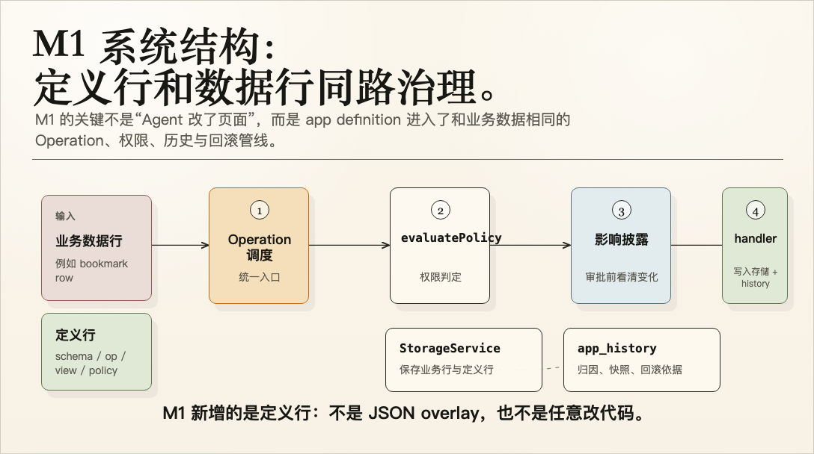
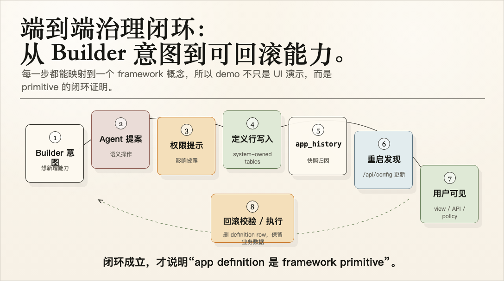
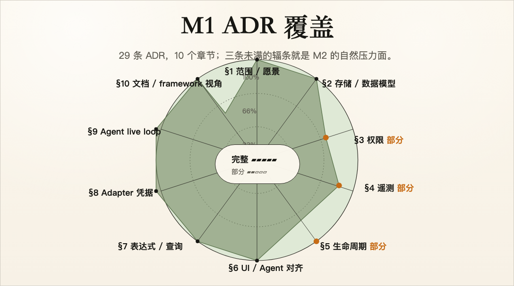

# Milestone 1 快照：可治理的 App Evolution

**日期：** 2026-04-28
**状态：** 用于团队对齐的里程碑快照
**受众：** 对 Pneuma 没有预备知识的团队同事
**范围：** 当前里程碑证明了什么、还没有证明什么、下一阶段应该是什么。
**English version:** [Milestone 1 Snapshot](./milestone-1-snapshot.md)

## 摘要

这个快照不是任务列表，而是一次鸟瞰：我们已经从 “Pneuma 应该如何设计” 推进到 “一个 framework primitive 真的成立”。Builder 可以通过 Agent 改变 app 的软件结构；framework 负责审批、记录、运行时发现、权限暴露和回滚。

Pneuma 当前里程碑证明了一条新的软件构建循环：

```text
Builder intent
  -> Agent proposal
  -> governed app-definition operation
  -> system-owned definition rows
  -> app_history attribution
  -> runtime rediscovery
  -> policy-gated end-user surface
  -> reversible rollback
```

换成中文讲：

```text
Builder 不是只让 Agent 写一条数据；
Builder 是通过 Agent 让一个 app 长出新的 schema / domain service / API / app view / policy surface。
这些变化不是随意写文件，而是进入 framework 的治理路径。
```

关键变化是：

| 里程碑之前 | 里程碑之后 |
|---|---|
| Pneuma 有很强的架构 thesis。 | Pneuma 有了可执行的 primitive proof。 |
| Agent-assisted app building 主要还是设计 claim。 | Builder/Agent-governed app-definition mutation 可以演示。 |
| Definition changes 可能会走 ad-hoc JSON/file overlay。 | Definition changes 是 system-owned rows，走和 app data 相同的 storage/history/governance path。 |
| Rollback 是治理愿景。 | Rollback 可以 validate impact、请求 permission、执行 cleanup，并在当前 slice 保留业务数据。 |

## Milestone 命题

> 一个 Pneuma app 可以在 session 中通过可治理的 framework primitive 演化自己的软件表面，而且 Agent 不需要直接编辑任意 runtime code。

更直接地说：

> Pneuma 的里程碑不只是 “AI 帮我改了页面”，而是 “app definition 本身成为可治理、可审计、可回滚的 runtime primitive”。

这条边界对项目很关键：

- **不是 data mutation：** 只新增一条 bookmark row。
- **不是 codegen demo：** 生成一个一次性的 React component。
- **是 definition mutation：** 新增 Operation，挂载 View，通过 `/api/config` 暴露，用 PolicyRule gate，并能 rollback definition rows。

## Pneuma 所在的位置

Pneuma 是 **AI-native creation tools 的基础设施**：end-user 通过和 agent 对话来构建 app 的行为和 UI。framework 是 primitive；被发布出去的 pneuma-app 才是 product。

| | Retool / n8n | Airtable / Notion | Rails / Next.js | **Pneuma** |
|---|---|---|---|---|
| 构建模型 | 拖字段、接表单 | 配置预制 block | code-first | **conversation-first** |
| Agent 角色 | bolt-on chatbox | bolt-on AI features | 缺席 | **first-class** primitive ([ADR-0018](./adr/0018-operations-as-primitive.md)) |
| 受众 | developer / power user | knowledge worker | developer | **Builder**（非程序员也可） |
| 权限模型 | imperative RBAC | imperative RBAC | per-app | **declarative DSL + NL bidirectionality** ([ADR-0007](./adr/0007-permission-dsl.md), [ADR-0008](./adr/0008-nl-bidirectional.md)) |

三个组合在一起才构成 Pneuma 的差异：

1. **UI binding 和 Agent tool-call 来自同一个 declaration。** 点击按钮 = call tool。都是 Operation primitive。([ADR-0018](./adr/0018-operations-as-primitive.md), [ADR-0023](./adr/0023-operation-surface-contract.md))
2. **Permission DSL 可以双向对话。** Builder 说 “只有 Alice 能看”；agent 翻译成 rule。End-user 问 “为什么我看不到？”；agent 反向解释。([ADR-0008](./adr/0008-nl-bidirectional.md))
3. **一个 AST 支撑 filter / policy / trigger。** 学会 `WhereClause`，就覆盖整条栈。([ADR-0019](./adr/0019-where-clause-ast.md))

一句话：

> Pneuma 不是“更快写代码的工具”，而是“让非程序员通过对话创造应用”的 framework。它把 agent 当 first-class primitive，而不是套在传统应用上的 chatbox。

## 系统一眼看懂

M1 的架构洞察是：**definition rows 和 data rows 走同一条 Operation pipeline。** 对 “add a bookmark row” 生效的治理保证，也应该对 “add a callable URL-export Operation” 生效。



绿色区域是 M1 新增的东西：一类 `definition.apply(...)` Operation，其 handler 写 definition rows。其它机制全部复用：`evaluatePolicy`、impact disclosure、`app_history`、`StorageService`。没有平行治理通道，没有 JSON overlay，没有单独 audit path。

## 当前已经证明什么

| Capability | 当前证明 |
|---|---|
| App definition as data | `pneuma_tables`, `pneuma_table_columns`, `pneuma_operations`, `pneuma_views`, `pneuma_policy_rules` 都是 system-owned Tables。 |
| Governed definition mutation | `definition.apply(...)` 通过 framework semantic operations 处理 additive definition changes。 |
| Attribution and history | `app_history` 记录 definition snapshots，framework 可以计算 rollback impact。 |
| Runtime rediscovery | restart 后，`/api/config` 和 runtime operation registration 会反映新的 definition rows。 |
| End-user app surface | Builder-authored Operation 可以成为 API capability；Builder-authored View 可以在 app 中可见。 |
| Policy-gated visibility | `add_policy_rule` 可以让 `reviewer` 看到 View，同时让 `guest` 被挡住。 |
| Reversible supported changes | Rollback 可以移除新增 Tables、columns、query-backed Operations、Operation-backed Views 和 additive PolicyRules。 |
| Contract hygiene | Operation output schemas、`invocation_method`、surface classification、read-only storage isolation 已经足够支撑当前 slice。 |
| Team-share narrative | studio demo 能用 end-user app、system viewer、Builder/Agent governance surfaces 解释同一个 change。 |

## 当前 Primitive Surface

当前里程碑覆盖五个 definition primitive：

```text
Schema          -> add_table, add_table_column
Domain service  -> add_operation(query/read-only)
API surface     -> /api/config + operation invocation route
App surface     -> add_view(Operation-backed declarative View)
Policy surface  -> add_policy_rule(additive allow rule)
```

这五层让团队能从传统软件视角理解 Pneuma：不是抽象地说 “Agent 改 app”，而是明确看到 schema、domain service、API、app view、policy 分别发生了什么。

## Working Definition Surface

上面的五个 primitive surface 都存成 system-owned Tables，走和 app data 相同的 storage / history / governance path。没有额外 JSON overlay file channel。

| System-owned Table | 存储内容 |
|---|---|
| `pneuma_tables` | Builder/agent-declared stored Tables |
| `pneuma_table_columns` | Builder/agent-declared columns on stored Tables |
| `pneuma_operations` | Builder/agent-declared query-backed read Operations |
| `pneuma_views` | Builder/agent-declared Views mounted on read Operations |
| `pneuma_policy_rules` | Builder/agent-declared additive PolicyRules |

每个 Operation 携带 normalized `surface` contract，而不是只从 `reads_only` 推断 exposure：

```ts
{
  agent_callable: boolean;
  public_surface: boolean;
  view_mountable: boolean;
  framework_internal: boolean;
}
```

Builder-authored read Operations 默认 `public_surface=true` 且 `view_mountable=true`。Framework governance Operations 明确 `framework_internal=true`、`public_surface=false`、`view_mountable=false`。见 [ADR-0023](./adr/0023-operation-surface-contract.md)。

## Supported Definition Mutations

`definition.apply` 当前支持五种 additive shape。每一种都走同一条 governed pipeline：approval → write definition row + `app_history` snapshot → restart → rediscover via `/api/config`。

### `add_table` / `add_table_column`

```text
before: unknown table / unknown column 的 row 被拒绝
apply:  写 pneuma_tables / pneuma_table_columns row + app_history entry
after:  StorageService validation 接受新 schema 的 rows
```

### `add_operation`（query-backed read）

```ts
{
  kind: "add_operation",
  operation_id: "list_bookmark_urls",
  handler: {
    kind: "query",
    on: "bookmarks",
    fields: ["title", "url", "source", "lens"],
    pagination: { kind: "offset", size: 10 }
  },
  surface: {
    agent_callable: true,
    public_surface: true,
    view_mountable: true,
    framework_internal: false
  }
}
```

### `add_view`（Operation-backed）

```ts
{
  kind: "add_view",
  view_id: "review_queue",
  name: "Review Queue",
  view_kind: "table",
  source: { kind: "operation", operation_id: "list_bookmark_urls" },
  presentation: {
    title: "Review Queue",
    columns: [
      { field: "title",  label: "Title",  role: "title" },
      { field: "url",    label: "URL",    role: "url" },
      { field: "source", label: "Origin", role: "metadata" },
      { field: "lens",   label: "Lens",   role: "metadata" }
    ],
    empty_state: "No sources are waiting for review."
  }
}
```

### `add_policy_rule`（additive allow）

```ts
{
  kind: "add_policy_rule",
  rule_id: "reviewers-can-read-review-queue",
  allow: [{ kind: "role", name: "reviewer" }],
  actions: ["read"],
  resource: { kind: "view", id: "review_queue" }
}
```

五个 primitive 的 acceptance pattern 一致：

```text
before:  /api/config 和 runtime 中不存在 capability
apply:   definition row + app_history snapshot
restart: runtime rehydrate 并暴露新 surface
after:   request-scoped policy gate visibility
rollback: 删除 definition row 并恢复之前 surface
```

## 端到端闭环



demo UI 里发生的变化不是黑盒。每一步都能对应到 framework concept：

| Demo moment | Framework concept |
|---|---|
| Agent 要求安装 capability | semantic framework operation，不是任意 script editing |
| approval card 出现 | wire permission envelope + impact disclosure |
| `pneuma_operations` row 出现 | app definition 存成 system-owned Table rows |
| restart progress 可见 | definition restart phases 的 framework event protocol |
| Operation 出现在 app/API | runtime rediscovery 和 `/api/config` |
| Review Queue 出现 | View presentation contract + reusable React renderer |
| Reviewer 能看，Guest 不能看 | request-scoped policy evaluation |
| Rollback 移除 capability | app_history-based rollback with cleanup |

## Demo Story

推荐的 milestone demo：

```text
examples/p5-viewer-approval-e2e
?scenario=capability-lifecycle&variant=studio
```

故事线：

1. **Baseline:** Reader Bookmarks 已经有真实 source row。缺的不是数据，而是 capability surface。
2. **Operation:** Builder 让 Agent 暴露 selected bookmark URLs。Framework 写入 `pneuma_operations` row，rediscovery 暴露 `list_bookmark_urls`。
3. **View:** Builder 让 Agent 挂载 Review Queue。Framework 写入 `pneuma_views` row，end-user app 通过 View contract 渲染它。
4. **Policy:** Builder 让 reviewers 能看到 queue。Framework 写入 `pneuma_policy_rules` row；reviewer 能看到，guest 仍被挡住。
5. **Rollback:** Builder review rollback impact 并批准执行。Operation、View、PolicyRule 消失；原始 bookmark row 保留。

这个 demo 的目标不是展示一个“酷页面”，而是让团队在一个业务故事里看到：同一个 Builder 意图如何变成 Operation、View、PolicyRule 三类 app definition row，并且被 framework 治理。

完整 presenter runbook（开场叙事、screen map、talk track、FAQ）见 [`team-share-demo.md`](./team-share-demo.md)。

## Rollback Path

Rollback 分成 validation/approval 和 execution。

```text
definition.rollback.validate
  -> reconstruct target overlay state from app_history
  -> compute removed Tables / columns / Operations / Views / PolicyRules
  -> disclose destructive impact

definition.rollback.prepare
  -> call validate
  -> request approval when needed
  -> return ready_to_execute or denied

definition.rollback.execute
  -> write pre-rollback backup
  -> remove affected definition rows
  -> delete removed overlay table rows when needed
  -> clean removed column cells from retained rows
  -> append post-rollback definition snapshot
  -> restart / refetch / verify
```

| Rollback impact | 状态 |
|---|---|
| Removed overlay Table | 支持，destructive row deletion with backup |
| Removed overlay column | 支持，affected cell cleanup with backup |
| Removed query-backed Operation | 支持，删除 `pneuma_operations` definition row |
| Removed Operation-backed View | 支持，删除 `pneuma_views` definition row |
| Removed PolicyRule | 支持，删除 `pneuma_policy_rules` definition row |
| Restored Table / column / Operation / View / PolicyRule | 尚不支持 |
| Non-query Operation rollback | 尚不支持 |

## 为什么这样设计

这个 milestone 里最承重的是三条设计决定。reviewer 如果要质疑，大概率会质疑这三条之一。

### 1. App definition is data, not code

`pneuma_tables / pneuma_table_columns / pneuma_operations / pneuma_views / pneuma_policy_rules` 存在和 app data 相同 storage layer 的 system-owned rows 中，而不是 JSON overlay file，也不是生成的 TypeScript module。

**原因：** definition rows 自动继承 framework 现有 primitive pipeline：`PermissionContext`、`app_history`、`evaluatePolicy`、telemetry、rollback。JSON overlay file 会要求我们另建一条平行治理路径。([ADR-0022](./adr/0022-view-system.md), [ADR-0017](./adr/0017-rollback-data-semantics.md), [ADR-0029](./adr/0029-supersede-v0-design-spec.md))

**代价：** rediscover 需要 restart；hot reload 是 M2/M3 工作。

### 2. Rollback is three-stage, not one-step

`validate → prepare → execute`。Validation reconstruct target overlay state 并披露会消失什么；prepare gate approval；execute 写 backup 并移除 definition rows。

**原因：** definition mutation 可能移除其它 rows 依赖的 capability surfaces（例如 View reference Operation、PolicyRule reference View）。一步式 destructive rollback 要么中途失败，要么静默破坏 invariant。三阶段 flow 迫使 impact disclosure 在 destruction 开始前发生。([ADR-0017](./adr/0017-rollback-data-semantics.md))

**代价：** rollback 对 Builder 来说步骤更多；impact-disclosure card 会缓解这一点，Builder 看到的是 validation summary，不是三次确认。

### 3. Restart phases are visible, not hidden

`framework-event` envelope 通过 wire protocol 携带 definition apply / rollback restart phases：`applying-definition`、`stopping-for-definition-apply`、`starting-after-definition-apply`、`refreshing-definition`、`running` / `failed`。

**原因：** restart 是当前 rediscovery boundary。隐藏它会让 demo 和 Builder 都在黑盒外叙事。把它作为 state snapshot 暴露出来，边界本身就变成一个 feature。同一条 channel 以后也能承载 hot-reload phases，而不需要协议 churn。([ADR-0028](./adr/0028-framework-event-protocol.md))

**代价：** wire protocol 增加新的 envelope kind；忽略它的 viewer SDK 仍能工作，但不会展示 “restarting” UI。

一句话：

> 三条线是这次 milestone 的脊柱：app definition is data（治理就复用）；rollback 三段式（破坏前必先披露）；重启是 protocol（不是不可见黑盒）。

## M1 Verification Matrix

每个 definition primitive 都有端到端验证。测试分布在 `packages/core-domain`（aggregates + lifecycle）、`packages/runtime`（apply / api-config / framework-operations）、`packages/core`（tools / bridges）、`packages/viewer-react`（PermissionPrompt + ViewRenderer）、`examples/p5-viewer-approval-e2e`（live browser）。

| Capability dimension | `add_table` | `add_column` | `add_operation` | `add_view` | `add_policy_rule` |
|---|:-:|:-:|:-:|:-:|:-:|
| Definition row write | ✅ | ✅ | ✅ | ✅ | ✅ |
| `app_history` snapshot | ✅ | ✅ | ✅ | ✅ | ✅ |
| Restart rediscovery | ✅ | ✅ | ✅ | ✅ | ✅ |
| Policy gating | — | — | — | ✅ | ✅ |
| `rollback.validate` | ✅ | ✅ | ✅ | ✅ | ✅ |
| `rollback.execute` | ✅ | ✅ | ✅ | ✅ | ✅ |
| Restored rollback | ❌ | ❌ | ❌ | ❌ | ❌ |
| Hot reload | ❌ | ❌ | ❌ | ❌ | ❌ |
| Non-query Operation | — | — | ❌ | — | — |

Legend: ✅ supported · ❌ not yet · — not applicable.

team share 前建议 smoke 的 targeted suite：

```text
packages/viewer-react/test/PermissionPrompt.test.tsx
packages/viewer-react/test/ViewRenderer.test.tsx
packages/core-domain/test/aggregates/operation.test.ts
packages/core-domain/test/lifecycle/pneuma-operations.test.ts
packages/core-domain/test/lifecycle/pneuma-views.test.ts
packages/core-domain/test/lifecycle/pneuma-policy-rules.test.ts
packages/runtime/test/framework-operations.test.ts
packages/runtime/test/definition-apply.test.ts
packages/runtime/test/api-config.test.ts
packages/runtime/test/runtime.test.ts
packages/core/test/operation-tool-bridge.test.ts
packages/core/test/template-mcp-bridge.test.ts
packages/core/test/tools/definition-apply.test.ts
examples/p5-viewer-approval-e2e/capability-lifecycle.test.ts
packages/core-domain/test/services/operation-executor.test.ts
templates/bookmarks-core-domain/test/operation-declarations.test.ts
templates/weekly-linear-digest/test/operation-declarations.test.ts
```

2026-04-28 的 full repo state：

```text
bun run typecheck                                      PASS
bun test                                               851 pass / 0 fail / 2731 expect()
(cd examples/p5-viewer-approval-e2e && bun run build)  PASS
git diff --check                                       PASS
```

## 项目分层进展

这里用两种视角看：一个是定性状态（“这一层现在感觉如何？”），一个是结构覆盖（“哪些 ADR 已经落在代码里？”）。

### 定性视角

| Layer | 当前状态 | 含义 |
|---|---|---|
| Vision / positioning | 强。项目 wedge 清楚：conversational, governed app creation。 | 继续把它作为 product north star。 |
| Core domain primitives | 对当前 milestone 来说强。Tables、Operations、Views、PolicyRules、history、rollback 已经接上。 | 可以停止证明 app-definition mutation 是否可能。 |
| Governance skeleton | 真实但仍是 MVP。Approval、impact disclosure、attribution、policy gating、rollback 都存在。 | 下一个风险是企业约束下的深度和正确性。 |
| Demo / narrative | 可用于团队分享。studio demo 比单击 engineering harness 清楚很多。 | 在继续加 primitive 前，先拿零上下文同事 rehearsal。 |
| Runtime protocol | 正在改善。Permission prompts 和 framework events 已 live，但 reconnect/persistence/versioning 未定。 | production claim 前需要 hardening。 |
| Enterprise readiness | 早期。primitive 指向正确方向，但 auth、default policy posture、concurrent edits、transaction boundaries 需要继续做。 | 这是自然的下一阶段主题。 |

### ADR coverage（按 §）



29 条 ADR 分布在 10 个章节。Coverage = ADR 存在 + 对应 code path + 至少一个 scenario / test 覆盖。Partial 表示 decision 已记录、code path 已落地，但 enterprise-level surface 仍是 demo-grade。

| § | Topic | ADRs | Status | Notes |
|---|---|---|---|---|
| §1 | Scope & vision | 0001 | ✅ Full | archetype A+B 在代码中；C/D interface slots 预留 |
| §2 | Storage / data model | 0002–0005 | ✅ Full | Tables、CellTypes、Adapters、capabilities 都在 `core-domain` 且有测试 |
| §3 | Permission | 0006–0012 | 🟡 Partial | DSL + evaluator + default posture 在代码里；NL-bidirectional + agent-permission UI 仍是 demo-only |
| §4 | Telemetry | 0013–0015 | 🟡 Partial | 5-event model + audit subset + pluggable sinks 已落地；product-level trace UI 未做 |
| §5 | Lifecycle / dual-mode | 0016–0017 | 🟡 Partial | Dev/Prod isolation 概念清楚；add path rollback 具体；fork/redeploy stub |
| §6 | UI / Agent parity | 0018, 0023 | ✅ Full | Operation primitive + surface contract 驱动 M1 demo |
| §7 | Expression / query | 0019–0020 | ✅ Full | WhereClause AST + Query DSL 在 `core-domain` |
| §8 | Adapter credential | 0021 | ✅ Full | `admin_delegated` + Linear adapter 在 `weekly-linear-digest` live |
| §9 | Agent / live loop | 0025–0028 | ✅ Full | Conversation persistence + tool-call binding + SSE + framework event 都在 M1 demo 中 |
| §10 | Doc / framework view | 0029 | ✅ Full | v0 supersedure 已执行 |

Visual roll-up：

```text
§1   Scope                ▰▰▰▰▰▰▰▰▰▰  Full
§2   Storage              ▰▰▰▰▰▰▰▰▰▰  Full
§3   Permission           ▰▰▰▰▰▰▰▱▱▱  Partial (auth surface + bidi NL pending)
§4   Telemetry            ▰▰▰▰▰▰▱▱▱▱  Partial (trace UI pending)
§5   Lifecycle            ▰▰▰▰▰▱▱▱▱▱  Partial (fork/redeploy pending)
§6   UI/Agent parity      ▰▰▰▰▰▰▰▰▰▰  Full
§7   Expression / query   ▰▰▰▰▰▰▰▰▰▰  Full
§8   Adapter credential   ▰▰▰▰▰▰▰▰▰▰  Full
§9   Agent live loop      ▰▰▰▰▰▰▰▰▰▰  Full
§10  Doc / framework view ▰▰▰▰▰▰▰▰▰▰  Full
```

§3 / §4 / §5 是 partial bars。它们不是 M1 blocker，但正是 M2 会压上去的自然压力面。

## 当前还没有证明什么

这个边界很重要。Milestone 是真实的，但它还不是 production enterprise platform。

| Not yet proven | 为什么重要 |
|---|---|
| Hot reload | 当前 definition changes 仍依赖 restart/rediscovery。primitive proof 可以接受，最终 UX 不够。 |
| Full enterprise auth | PolicyRule rows 存在，但 default posture、deny/edit/delete semantics、Builder/Agent scopes、organization identity 还不完整。 |
| Arbitrary code distribution | `add_operation` 支持 query-backed read Operations，不支持 arbitrary Builder-authored code handlers。 |
| Custom View components | Views 使用 declarative presentation contract 和 React renderer，不是 packaged custom components。 |
| Multi-builder concurrency | 没有 serialization/database constraints 时，definition writes 仍可能 race。 |
| External `/api/config` versioning | 现在有用也更清楚，但还不是正式 public client contract。 |
| Cross-store atomicity | Definition row + history write 还不是 enterprise-grade transaction guarantee。 |
| Durable permission center | live prompts 可用，但 pending approvals 和 reconnect recovery 的 product surface 仍是 demo-level。 |
| Restored definition rollback | removed-then-restored rollback 未实现。 |
| Non-query Operation rollback | code-handler Operations 不在当前 rollback supported slice。 |

所以我们应该说：

```text
framework primitive 成立
```

而不是说：

```text
企业版已经 ready
```

这两句话的差别很关键。

## Strategic Read

我的判断是：只要团队看过 studio demo，并认可上面的边界，Milestone 1 就可以被认为 **closed enough for team alignment**。

下一句不应该是 “还能随便加什么 feature？”。应该是：

> 什么风险会阻止 Pneuma 从 clever prototype 变成 credible infrastructure？

现在答案已经不太是 “再加一个 primitive”，而是 governance model hardening：

- 谁可以请求 definition changes？
- 谁可以批准？
- explicit rules 还不存在时 default policy posture 是什么？
- deny/edit/delete policy changes 如何表达？
- 并发 Builder/Agent definition writes 如何串行化？
- viewer 在 restart/reconnect 中需要什么 protocol guarantee？

中文判断：

> 现在最有价值的下一阶段不是继续堆 demo capability，而是把“企业治理主线”拉实。因为 app-definition primitive 已经能讲通；真正会被团队和未来客户追问的是权限、审计、并发、审批、恢复这些治理问题。

## 推荐下一阶段

推荐下一阶段：

> **Milestone 2: Enterprise Governance Hardening**

建议 workstreams（完整列表见 [`roadmap.md`](./roadmap.md) §“Stage 5”）：

| Workstream | Goal |
|---|---|
| Policy lifecycle | 超越 additive allow rules：edit/delete、deny semantics、default posture、explanation。 |
| Authorization model | 清楚拆分 Builder、Agent、Framework、Reviewer、Guest capabilities。 |
| Permission center | 让 approvals durable、inspectable、recoverable，而不只是 live prompt cards。 |
| Protocol hardening | 持久化 framework events，定义 reconnect semantics，version permission/config envelopes。 |
| Transaction/concurrency | 让 definition row + history writes 足够 atomic，并串行化 competing definition versions。 |
| Reference app pressure | 保留 Reader Bookmarks 作为教学 harness，但在 phase complete 前引入一个真实 app-template pressure test。 |

## Team Decision Gate

团队分享最后可以落在四个决策：

1. 我们是否同意 Milestone 1 证明了 app-definition primitive？
2. 我们是否同意下一阶段应该是 governance hardening，而不是更多互不相关的 primitives？
3. 我们是否继续用 Reader Bookmarks 作为 canonical teaching demo，同时用第二个 reference app 做 pressure test？
4. 哪个 enterprise governance gap 最危险：authorization、policy lifecycle、protocol recovery、transaction/concurrency？

如果团队同意，项目就有清楚的阶段边界：

```text
Milestone 1:
  "Can a Builder/Agent governably evolve an app definition?"
  Answer: yes, for the supported slice.

Milestone 2:
  "Can the same primitive survive enterprise governance requirements?"
  Answer: next work.
```

## Evidence

进入这个 snapshot 前的近期 commits：

```text
4340d9b Add milestone snapshot overview
781437b Clean up operation contract semantics
c3eea71 Harden policy-gated lifecycle demo
254f401 Add policy rule definition primitive
10fe4b6 Extract reusable React view renderer
704f29e Add explicit view presentation renderer contract
d5260e0 Polish framework event demo narrative
e72b1c4 Show framework event progress in lifecycle demo
45f9d14 Add framework event protocol for restarts
```

milestone 记录过的 verification：

```text
bun run typecheck
bun test
(cd examples/p5-viewer-approval-e2e && bun run build)
git diff --check
```

最新记录的 full test state：

```text
851 pass / 0 fail / 2731 expect() calls
```

## Reading Path

对没有上下文的同事：

1. 先读这份 snapshot。
2. live share 前读 [`team-share-demo.md`](./team-share-demo.md)。
3. 只有在同意 milestone boundary 后再读 [`OPEN-QUESTIONS.md`](./OPEN-QUESTIONS.md)。
4. 读 [`roadmap.md`](./roadmap.md) 了解 post-M1 phasing。

更深入的架构阅读，从 [`README.md`](./README.md) 进入 ADR set。

## Appendix — Historical Slice Ledger (P2–P23)

保留为简短 ledger；不要继续积累 per-slice reports。未来工作应该更新这个 snapshot、ADR 或 OPEN-QUESTIONS。

| Slice | Durable result |
|---|---|
| P2  | `definition.apply(add_table_column)` end to end |
| P4  | `definition.apply(add_table)` on the same primitive path |
| P5  | approval UI, overlay warning visibility, rollback semantics draft |
| P6  | non-destructive rollback validation |
| P7  | rollback approval disclosure in viewer |
| P8  | rollback prepare boundary in core tool lifecycle |
| P9  | destructive rollback executor for removed overlay Tables |
| P10 | removed-column rollback with affected cell cleanup |
| P11 | live browser rollback execute E2E |
| P12 | query-backed `add_operation` and `pneuma_operations` overlay |
| P13 | Operation impact disclosure in apply/rollback approval |
| P14 | rollback execute for removed query-backed Operations |
| P15 | replayable live browser capability lifecycle demo |
| P16 | Operation-backed View primitive, `pneuma_views`, full Operation → View → rollback demo |
| P17 | Operation surface contract (`agent_callable`, `public_surface`, `view_mountable`, `framework_internal`) |
| P18 | 0-prep team-share package |
| P19 | Request-scoped View visibility policy (`read view:<id>` + `invoke operation:<source>`) |
| P20 | Wire-protocol framework events for definition restart phases |
| P21 | PolicyRule definition primitive (`pneuma_policy_rules` + `add_policy_rule`) |
| P22 | Policy-gated live demo with request-scoped Reviewer/Guest visibility |
| P23 | Operation contract cleanup (object output, `invocation_method`, read-only storage isolation) |
