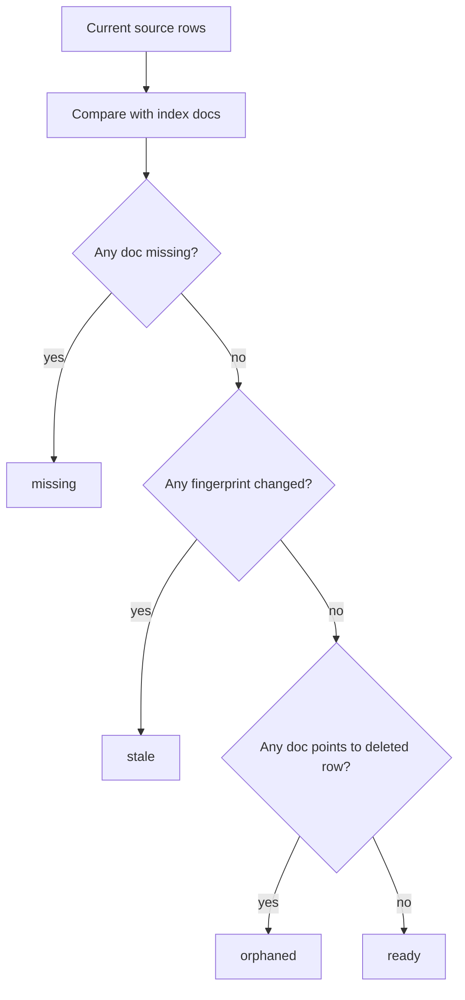

# Milestone 10 Snapshot: Derived Semantic Index

**Date:** 2026-05-03
**Status:** Closed after core semantic-index contract, Knowledge Inbox Operations, runner evidence, viewer surface, Docker release restart smoke, and typecheck verification
**Audience:** teammates with zero Pneuma context
**Scope:** what M10 proves, what it deliberately does not prove, and what should come next.
**Chinese version:** [Milestone 10 Snapshot zh-CN](./milestone-10-snapshot.zh-CN.md)

## Executive Summary

M7-M9 hardened the creation-to-release spine: one Builder intent can be approved once, executed as a governed change set, packaged, and either become a release candidate or fail with recovery evidence.

M10 deliberately returns to a visible product capability:

> Knowledge Inbox can now search by meaning through a derived semantic index, while SQLite app rows remain the source of truth.

This is not "we added vectors to the business table." It proves a more important boundary: AI-native retrieval can be an application capability without splitting the data model into two sources of truth.


## What Changed

| Area | What changed |
|---|---|
| Core domain | Added `SemanticIndexService`, `SemanticIndexStore`, staleness classification, cosine search, and deterministic embeddings. |
| Persistence | Added `BunSqliteSemanticIndexStore` with local `semantic_index_entries` rows stored separately from app rows. |
| Knowledge Inbox | Added `rebuild_semantic_index` and `semantic_search_items` Operations. |
| Viewer | Added a product-level Semantic Search panel in the end-user app view, with rebuild control and index status. |
| Evidence | Added `examples/m10-derived-semantic-index/` runner and Docker release smoke. |

## The Core Data Rule

M10 keeps one rule explicit:

```text
Business data lives in inbox_items.
Semantic vectors live in semantic_index_entries.
semantic_index_entries is rebuildable derived infrastructure.
```

The Knowledge Inbox schema did **not** gain an `embedding` column. That matters because an embedding column would make the first model choice and vector dimension look like durable product data.

M10 instead treats the semantic index like a materialized view or cache:

```text
delete semantic_index_entries
  -> app data still exists
  -> rebuild_semantic_index projects current rows again
  -> semantic_search_items works again
```

## Product Story

The user story is intentionally simple:

```text
Capture three source items
  -> rebuild the semantic index
  -> search "release risk from customer escalation"
  -> top result is "Critical customer signal"
  -> app data still comes from inbox_items
```

The important user-facing shift is that Knowledge Inbox no longer depends only on exact keyword recall. The user can search for intent, risk, and related wording; the app returns current rows with scores.

## Staleness Is Visible

M10 does not silently pretend the index is always complete. Every indexed document records a fingerprint of the projected source row fields.



The `semantic_search_items` Operation returns `index_status`, counts, and result rows. The viewer displays the status, and the API tests cover missing and stale states.

## Why Qdrant Is Not M10

M10 intentionally does **not** start with Qdrant.

Qdrant should become an adapter later, after the semantic index boundary is stable. If Qdrant had been first, the team could easily mistake the service choice for the framework primitive.

M10 proves the primitive:

```text
EmbeddingProvider + SemanticIndexStore + SemanticIndexService
```

SQLite JSON vectors and TypeScript cosine are a first implementation, not the semantic contract.

## Verification Report

Focused M10 suite:

```text
bun test examples/m10-derived-semantic-index/run.test.ts \
  examples/m10-derived-semantic-index/release-smoke.test.ts \
  templates/knowledge-inbox-core-domain/test/semantic-index.test.ts \
  templates/knowledge-inbox-core-domain/test/viewer-contract.test.ts \
  packages/core-domain/test/services/semantic-index.test.ts \
  packages/core-domain/test/repositories/bun-sqlite-semantic-index.test.ts

15 pass, 0 fail
```

Repository checks:

```text
bun run typecheck -> pass
git diff --check -> pass
```

Live app evidence:

```text
Knowledge Inbox dev server -> seeded 3 rows
semantic_search_items before rebuild -> index_status = missing
rebuild_semantic_index -> indexed_count = 3, index_status = ready
semantic_search_items after rebuild -> top hit = Critical customer signal
headless Chrome render -> semantic search panel present and usable
```

Release evidence:

```text
build Knowledge Inbox Docker image
  -> run with mounted SQLite volume
  -> semantic_search_items returns ready + Critical customer signal
  -> docker restart
  -> same semantic search assertion passes again
```

## What Is Proven

| Claim | Evidence |
|---|---|
| Semantic search can be added without changing business row schema | Tests assert `inbox_items` has no `embedding` column. |
| Semantic index is rebuildable derived infrastructure | `rebuild_semantic_index` reconstructs entries from source rows. |
| Staleness is observable | Missing and stale states are covered in Knowledge Inbox operation tests. |
| The core boundary is reusable | `SemanticIndexStore` and `SemanticIndexService` live in `packages/core-domain`, not inside the template. |
| The capability is product-visible | Viewer has a Semantic Search panel with rebuild and status controls. |
| Release packaging still works | Docker release smoke verifies semantic search before and after container restart. |

## What Is Not Proven

M10 does not claim:

- production-scale vector search
- Qdrant or Postgres vector adapter
- network embedding quality
- background incremental indexing
- multi-tenant index isolation
- access-control filtering inside semantic search results beyond current Operation policy
- online reindexing under concurrent writes
- hot reload
- Runtime Agent in release mode
- statistically reliable LLM planning

M10 is the semantic capability boundary. It is intentionally not a production vector platform.

## Strategic Read

The project now has both a correctness spine and a visible AI-native app capability:

```text
M1: app definition is governed data
M2: governance leaves enterprise evidence
M3: app state lives in a real deployable substrate
M4: Knowledge Inbox is a real reference app
M5-M7: Builder/Agent can evolve that app through approval
M8: evolved app state can become a Docker release artifact
M9: approved creation can succeed into a release candidate or fail with recovery evidence
M10: the app gains semantic retrieval without splitting source of truth
```

M10 is a healthy boundary because it exercises a real product capability while preserving the architecture. It also creates a clean future adapter point for Qdrant/Postgres/vector services.

## Recommended Next Options

1. **Qdrant adapter v0:** keep the same `SemanticIndexStore` contract, swap local SQLite vectors for Qdrant, and prove source rows remain canonical.
2. **Rollout adapter v0:** build on M8-M9 with old/new release slots and promotion semantics.
3. **Hot reload slice:** remove restart from a narrow Operation/View/PolicyRule path.
4. **Runtime Agent boundary:** decide what semantic tools, if any, can ship in release mode for End Users.

My recommendation: choose rollout adapter v0 if the team wants to continue release/deploy confidence; choose Qdrant adapter if the next milestone should deepen semantic retrieval while keeping M10's source-of-truth line intact.
