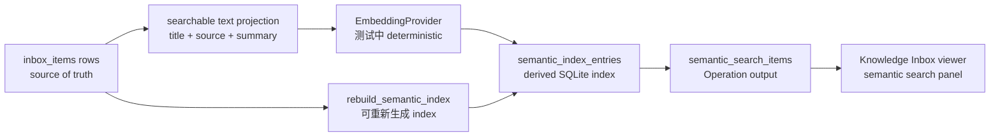
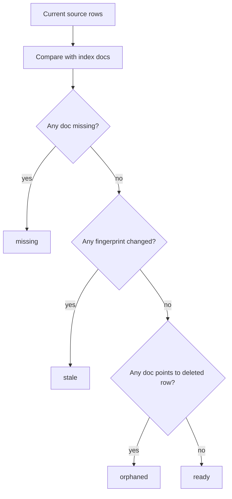

# Milestone 10 快照：Derived Semantic Index

**日期：** 2026-05-03
**状态：** core semantic-index contract / Knowledge Inbox Operations / runner evidence / viewer surface / Docker release restart smoke / typecheck 验证后闭合
**受众：** 0 预备知识团队成员
**范围：** M10 证明了什么、明确没有证明什么，以及下一步该压哪条边界。
**English version:** [Milestone 10 Snapshot](./milestone-10-snapshot.md)

## 摘要

M7-M9 把 creation-to-release 这条主干打硬了：一个 Builder intent 可以被一次性批准，作为 governed change set 执行，被打包，并最终进入 release candidate，或者在失败时留下 recovery evidence。

M10 刻意回到一个用户能直接感知的产品能力：

> Knowledge Inbox 现在可以通过 derived semantic index 做语义搜索，同时 SQLite app rows 仍然是唯一 source of truth。

这不是“给业务表加了向量列”。它验证的是更关键的边界：AI-native retrieval 可以成为 app capability，但不能把数据事实拆成两份。



## 改了什么

| Area | 改动 |
|---|---|
| Core domain | 新增 `SemanticIndexService`、`SemanticIndexStore`、staleness classification、cosine search、deterministic embeddings。 |
| Persistence | 新增 `BunSqliteSemanticIndexStore`，把 `semantic_index_entries` 存在 app rows 之外。 |
| Knowledge Inbox | 新增 `rebuild_semantic_index` 和 `semantic_search_items` Operations。 |
| Viewer | 在 end-user App view 中新增 Semantic Search panel，包含 rebuild control 和 index status。 |
| Evidence | 新增 `examples/m10-derived-semantic-index/` runner 和 Docker release smoke。 |

## 核心数据规则

M10 把一条规则明确写死：

```text
业务数据在 inbox_items。
语义向量在 semantic_index_entries。
semantic_index_entries 是可重建的 derived infrastructure。
```

Knowledge Inbox 的 `inbox_items` schema **没有**增加 `embedding` column。这件事很重要，因为一旦 embedding 写进业务表，第一版 embedding model 和 vector dimension 就会看起来像 durable product data。

M10 把 semantic index 当成 materialized view / cache：

```text
删除 semantic_index_entries
  -> app data 仍然存在
  -> rebuild_semantic_index 从当前 rows 重新 projection
  -> semantic_search_items 恢复可用
```

## 产品故事

用户故事非常简单：

```text
Capture 三条 source items
  -> rebuild semantic index
  -> 搜索 "release risk from customer escalation"
  -> top result 是 "Critical customer signal"
  -> app data 仍然来自 inbox_items
```

关键变化是：Knowledge Inbox 不再只依赖关键词命中。用户可以搜索意图、风险、相关表达；app 返回当前 source rows 和 score。

## Staleness 是可见的

M10 不假装 index 永远完整。每个 indexed document 都记录 projected source row fields 的 fingerprint。



`semantic_search_items` 会返回 `index_status`、counts 和 result rows。viewer 会显示状态，API tests 覆盖 missing / stale。

## 为什么 M10 不先做 Qdrant

M10 刻意没有从 Qdrant 开始。

Qdrant 应该是后续 adapter，而不是 M10 的 primitive。否则团队很容易把“用了某个向量服务”误解成 framework 语义本身。

M10 证明的 primitive 是：

```text
EmbeddingProvider + SemanticIndexStore + SemanticIndexService
```

SQLite JSON vectors 和 TypeScript cosine 只是第一版实现，不是 semantic contract。

## Verification Report

Focused M10 suite：

```text
bun test examples/m10-derived-semantic-index/run.test.ts \
  examples/m10-derived-semantic-index/release-smoke.test.ts \
  templates/knowledge-inbox-core-domain/test/semantic-index.test.ts \
  templates/knowledge-inbox-core-domain/test/viewer-contract.test.ts \
  packages/core-domain/test/services/semantic-index.test.ts \
  packages/core-domain/test/repositories/bun-sqlite-semantic-index.test.ts

15 pass, 0 fail
```

Repository checks：

```text
bun run typecheck -> pass
git diff --check -> pass
```

Live app evidence：

```text
Knowledge Inbox dev server -> seeded 3 rows
semantic_search_items before rebuild -> index_status = missing
rebuild_semantic_index -> indexed_count = 3, index_status = ready
semantic_search_items after rebuild -> top hit = Critical customer signal
headless Chrome render -> semantic search panel present and usable
```

Release evidence：

```text
build Knowledge Inbox Docker image
  -> run with mounted SQLite volume
  -> semantic_search_items returns ready + Critical customer signal
  -> docker restart
  -> same semantic search assertion passes again
```

## 已证明

| Claim | Evidence |
|---|---|
| 可以增加 semantic search，但不改变业务 row schema | Tests 断言 `inbox_items` 没有 `embedding` column。 |
| Semantic index 是可重建 derived infrastructure | `rebuild_semantic_index` 从 source rows 重新生成 entries。 |
| Staleness 可见 | Knowledge Inbox operation tests 覆盖 missing 和 stale。 |
| Core boundary 可复用 | `SemanticIndexStore` 和 `SemanticIndexService` 在 `packages/core-domain`，不是 template 私有逻辑。 |
| 能力是产品可见的 | Viewer 有 Semantic Search panel，包含 rebuild 和 status controls。 |
| Release packaging 没退化 | Docker release smoke 验证 container restart 前后语义搜索都通过。 |

## 尚未证明

M10 不声称已经解决：

- production-scale vector search
- Qdrant 或 Postgres vector adapter
- network embedding quality
- background incremental indexing
- multi-tenant index isolation
- semantic search result 内部的 access-control filtering（目前只证明 Operation policy）
- concurrent writes 下的 online reindexing
- hot reload
- release mode Runtime Agent
- model planning 的统计可靠性

M10 是 semantic capability boundary。它不是 production vector platform。

## 战略解读

项目现在同时有 correctness spine 和一个可感知 AI-native app capability：

```text
M1: app definition is governed data
M2: governance leaves enterprise evidence
M3: app state lives in a real deployable substrate
M4: Knowledge Inbox is a real reference app
M5-M7: Builder/Agent can evolve that app through approval
M8: evolved app state can become a Docker release artifact
M9: approved creation can succeed into a release candidate or fail with recovery evidence
M10: app gains semantic retrieval without splitting source of truth
```

M10 是一个健康的 milestone boundary：它验证真实产品能力，同时没有破坏架构线。它也给后续 Qdrant / Postgres / vector service adapter 留下了干净接口。

## 推荐下一步

1. **Qdrant adapter v0：** 保持 `SemanticIndexStore` contract 不变，把本地 SQLite vector 替换成 Qdrant，并继续证明 source rows 是 canonical。
2. **Rollout adapter v0：** 接上 M8-M9，做 old/new release slots 和 promotion semantics。
3. **Hot reload slice：** 先从 Operation / View / PolicyRule 的窄路径移除 restart。
4. **Runtime Agent boundary：** 决定哪些 semantic tools 可以在 release mode 面向 End Users。

我的建议：如果团队要继续增强 release/deploy confidence，就选 rollout adapter v0；如果下一步要继续深化语义能力，就做 Qdrant adapter，但必须保持 M10 的 source-of-truth 边界。
