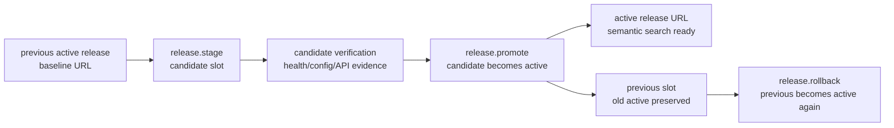

# Milestone 11 Snapshot: Rollout Adapter v0

**Date:** 2026-05-03  
**Status:** Closed after release-slot model, durable rollout store, framework release tools, local Docker rollout smoke, typecheck, and diff verification  
**Audience:** teammates with zero Pneuma context  
**Scope:** what M11 proves, what it deliberately does not prove, and what should come next.  
**Chinese version:** [Milestone 11 Snapshot zh-CN](./milestone-11-snapshot.zh-CN.md)

## Executive Summary

M8 proved a Builder/Agent-evolved app can become a Docker release artifact. M9 proved an approved creation request can become a release candidate or fail with recovery evidence. M10 proved Knowledge Inbox can gain semantic retrieval without splitting source of truth.

M11 closes the next release gap:

> A ready release candidate can now be staged, promoted to active release state, inspected, and rolled back to the previous active release through framework semantic tools.

This is not a production deployment platform. M11 v0 does not do cloud rollout, registry push, reverse proxy traffic switching, or zero-downtime release. It defines the framework primitive that those adapters will later implement.



## What Changed

| Area | What changed |
|---|---|
| Core model | Added `ReleaseRolloutState`, `ReleaseInstance`, release checks, timeline events, stage/promote/rollback transitions, and rollout summary. |
| Persistence | Added `FileReleaseRolloutStore` at `.pneuma/release-rollout.json`, with atomic JSON write. |
| Framework tools | Added `release.status`, `release.stage`, `release.promote`, and `release.rollback` to the default tool registry. |
| Example | Added `examples/m11-local-rollout-adapter/` with deterministic model runner and Docker rollout smoke. |
| Verification hardening | M10/M11 release smokes now reuse existing local images when present, avoiding repeated opaque Docker build waits. |

## The Primitive

M11 introduces three release slots:

```text
active    = release currently considered live by framework state
candidate = staged release under verification or ready for promotion
previous  = release that was active before the latest promotion
```

Promotion is not “run a deploy script”. It is a framework state transition:

```text
candidate(healthy) + active(existing)
  -> active = candidate
  -> previous = old active
  -> candidate = empty
```

Rollback is also a state transition:

```text
previous(healthy) + active(existing)
  -> active = previous
  -> previous = old active
```

The important part is the agent-facing surface:

```text
release.stage
release.promote
release.status
release.rollback
```

The Build-phase Agent does not need to know whether the first implementation uses Docker, a proxy, Fly.io, or another deployment platform.

## M11 Demo Story

The local Docker smoke uses Knowledge Inbox because the team already understands it.

```text
1. Baseline active release runs with normal inbox rows but missing semantic index.
2. Candidate release runs from the same app image with a prepared SQLite volume where semantic index is ready.
3. M11 records baseline as active.
4. M11 stages the semantic-search candidate.
5. M11 promotes candidate to active.
6. M11 rolls back to baseline.
```

The capability boundary is visible:

| Release URL | Evidence |
|---|---|
| baseline active | `semantic_search_items` returns `index_status = missing` |
| candidate | `semantic_search_items` returns `index_status = ready`, top hit = `risk` |
| after rollback | framework active slot points back to baseline URL |

This is intentionally a local adapter proof. It does not claim a stable public hostname has shifted traffic.

## Verification Report

Focused M11 suite:

```text
bun test packages/core/test/release-rollout.test.ts \
  packages/core/test/release-rollout-store.test.ts \
  packages/core/test/tools/release-tools.test.ts \
  packages/core/test/tools/build.test.ts \
  examples/m11-local-rollout-adapter/run.test.ts \
  examples/m11-local-rollout-adapter/release-rollout-smoke.test.ts \
  examples/m10-derived-semantic-index/release-smoke.test.ts

11 pass, 0 fail, 48 expect() calls
```

Repository checks:

```text
bun run typecheck -> pass
git diff --check -> pass
```

Docker evidence:

```text
M10 release smoke -> semantic search survives container restart
M11 rollout smoke -> baseline missing index, candidate ready index, promote, rollback
```

## What Is Proven

| Claim | Evidence |
|---|---|
| Rollout has explicit framework state | `ReleaseRolloutState` records active/candidate/previous slots and timeline. |
| Invalid promotion fails closed | Tests prove unhealthy candidate cannot become active. |
| Rollout state survives restart | `FileReleaseRolloutStore` persists `.pneuma/release-rollout.json` and reloads it. |
| Agent-facing release tools exist | Default registry exposes `release.status/stage/promote/rollback`. |
| Local Docker adapter can demonstrate promotion/rollback | M11 smoke starts baseline and candidate containers, verifies both, records promote/rollback. |
| Earlier release evidence still works | M10 Docker restart smoke remains green after M11. |

## What Is Not Proven

M11 does not claim:

- production traffic switching;
- stable active hostname;
- reverse proxy integration;
- cloud deploy;
- registry push;
- zero-downtime rollout;
- multi-service release graph;
- automatic rollback daemon;
- production IAM around release tools;
- live user traffic migration;
- schema compatibility windows between old and new app versions.

M11 is the release-state primitive plus a local adapter. Production rollout remains a later adapter problem.

## Strategic Read

The project now has a clearer creation-to-release spine:

```text
Builder intent
  -> governed app-definition mutation
  -> real SQLite/Docker app substrate
  -> release candidate readiness
  -> rollout stage/promote/rollback state
```

This matters because it keeps deployment from becoming a pile of scripts. The framework now has an explicit semantic place for “which release is active?” and “what happens if the candidate is bad?”

## Recommended Next Options

1. **Stable active endpoint adapter:** add a tiny local reverse proxy so `active.url` can stay stable while promotion switches target.
2. **Qdrant adapter v0:** continue M10 by replacing local SQLite vectors behind the same semantic index contract.
3. **Hot reload slice:** return to the builder loop and remove restart for a narrow Operation/View/PolicyRule path.
4. **Release authorization:** add policy/approval semantics around release promote/rollback, separate from definition mutation.

My recommendation: do the stable active endpoint adapter next if the team wants M11 to feel more like a real rollout; do Qdrant next if the next milestone should deepen AI-native retrieval.
