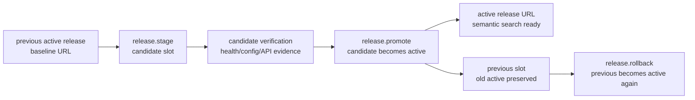

# Milestone 11 快照：Rollout Adapter v0

**日期：** 2026-05-03  
**状态：** release-slot model / durable rollout store / framework release tools / local Docker rollout smoke / typecheck / diff verification 后闭合  
**受众：** 0 预备知识团队成员  
**范围：** M11 证明了什么、明确没有证明什么，以及下一步该压哪条边界。  
**English version:** [Milestone 11 Snapshot](./milestone-11-snapshot.md)

## 摘要

M8 证明 Builder/Agent 演进出来的 app 可以变成 Docker release artifact。M9 证明 approved creation request 可以进入 release candidate ready，或者失败时留下 recovery evidence。M10 证明 Knowledge Inbox 可以获得语义检索，同时不分裂 source of truth。

M11 补上下一段 release 缺口：

> 一个 ready release candidate 现在可以通过 framework semantic tools 被 stage、promote 成 active release、查看状态，并 rollback 到 previous active release。

这不是生产部署平台。M11 v0 不做 cloud rollout、不做 registry push、不做 reverse proxy traffic switch、不做 zero-downtime release。它定义的是未来这些 adapter 要复用的 framework primitive。



## 改了什么

| Area | 改动 |
|---|---|
| Core model | 新增 `ReleaseRolloutState`、`ReleaseInstance`、release checks、timeline events、stage/promote/rollback transitions、rollout summary。 |
| Persistence | 新增 `FileReleaseRolloutStore`，写入 `.pneuma/release-rollout.json`，使用 atomic JSON write。 |
| Framework tools | 默认 tool registry 新增 `release.status`、`release.stage`、`release.promote`、`release.rollback`。 |
| Example | 新增 `examples/m11-local-rollout-adapter/`，包含 deterministic model runner 和 Docker rollout smoke。 |
| Verification hardening | M10/M11 release smokes 在本地已有 image 时复用 image，避免每次重复 Docker build 卡住验证。 |

## Primitive 是什么

M11 引入三个 release slots：

```text
active    = framework state 当前认为 live 的 release
candidate = staged release，正在验证或已经 ready for promotion
previous  = 上一次 promotion 前的 active release，用于 rollback
```

Promotion 不是“跑一个 deploy script”。它是 framework state transition：

```text
candidate(healthy) + active(existing)
  -> active = candidate
  -> previous = old active
  -> candidate = empty
```

Rollback 也是 state transition：

```text
previous(healthy) + active(existing)
  -> active = previous
  -> previous = old active
```

对 agent 来说，关键 surface 是：

```text
release.stage
release.promote
release.status
release.rollback
```

Build-phase Agent 不应该关心第一版是 Docker、未来是 reverse proxy、Fly.io，还是其它部署平台。

## M11 Demo 故事

Local Docker smoke 继续使用 Knowledge Inbox，因为团队已经熟悉这个 reference app。

```text
1. Baseline active release 跑着正常 inbox rows，但 semantic index 是 missing。
2. Candidate release 使用同一个 app image，但挂载 prepared SQLite volume，semantic index 是 ready。
3. M11 把 baseline 记录成 active。
4. M11 stage semantic-search candidate。
5. M11 promote candidate 成 active。
6. M11 rollback 回 baseline。
```

能力边界是可见的：

| Release URL | Evidence |
|---|---|
| baseline active | `semantic_search_items` 返回 `index_status = missing` |
| candidate | `semantic_search_items` 返回 `index_status = ready`，top hit = `risk` |
| after rollback | framework active slot 指回 baseline URL |

这只是 local adapter proof。它不声称稳定公网域名已经完成流量切换。

## Verification Report

Focused M11 suite：

```text
bun test packages/core/test/release-rollout.test.ts \
  packages/core/test/release-rollout-store.test.ts \
  packages/core/test/tools/release-tools.test.ts \
  packages/core/test/tools/build.test.ts \
  examples/m11-local-rollout-adapter/run.test.ts \
  examples/m11-local-rollout-adapter/release-rollout-smoke.test.ts \
  examples/m10-derived-semantic-index/release-smoke.test.ts

11 pass, 0 fail, 48 expect() calls
```

Repository checks：

```text
bun run typecheck -> pass
git diff --check -> pass
```

Docker evidence：

```text
M10 release smoke -> semantic search survives container restart
M11 rollout smoke -> baseline missing index, candidate ready index, promote, rollback
```

## 已证明

| Claim | Evidence |
|---|---|
| Rollout 有显式 framework state | `ReleaseRolloutState` 记录 active/candidate/previous slots 和 timeline。 |
| 非 healthy candidate 不能 promote | Tests 证明 unhealthy candidate promote 会 fail closed。 |
| Rollout state 可持久化 | `FileReleaseRolloutStore` 持久化 `.pneuma/release-rollout.json` 并能 reload。 |
| Agent-facing release tools 存在 | 默认 registry 暴露 `release.status/stage/promote/rollback`。 |
| Local Docker adapter 可以演示 promotion/rollback | M11 smoke 启动 baseline/candidate 两个容器，验证后记录 promote/rollback。 |
| 之前 release evidence 没退化 | M10 Docker restart smoke 在 M11 后仍然通过。 |

## 尚未证明

M11 不声称已经解决：

- production traffic switching
- stable active hostname
- reverse proxy integration
- cloud deploy
- registry push
- zero-downtime rollout
- multi-service release graph
- automatic rollback daemon
- release tools 的 production IAM
- live user traffic migration
- old/new app version 之间的 schema compatibility window

M11 是 release-state primitive 加一个 local adapter。生产 rollout 仍然是后续 adapter 问题。

## 战略解读

项目现在的 creation-to-release spine 更完整了：

```text
Builder intent
  -> governed app-definition mutation
  -> real SQLite/Docker app substrate
  -> release candidate readiness
  -> rollout stage/promote/rollback state
```

这件事重要，是因为 deploy 不应该退化成一堆脚本。framework 现在有一个明确的 semantic 位置来回答：“哪个 release 是 active？”、“candidate 坏了怎么办？”

## 推荐下一步

1. **Stable active endpoint adapter：** 加一个很小的 local reverse proxy，让 `active.url` 在 promotion 时保持稳定，只切换后端 target。
2. **Qdrant adapter v0：** 延续 M10，把 local SQLite vectors 换成 Qdrant adapter，但保持 source rows canonical。
3. **Hot reload slice：** 回到 builder loop，从 Operation / View / PolicyRule 的窄路径移除 restart。
4. **Release authorization：** 为 release promote/rollback 增加独立 policy / approval 语义，不和 definition mutation 混在一起。

我的建议：如果团队想让 M11 更像真实 rollout，就继续做 stable active endpoint adapter；如果下一阶段想深化 AI-native retrieval，就做 Qdrant adapter。
