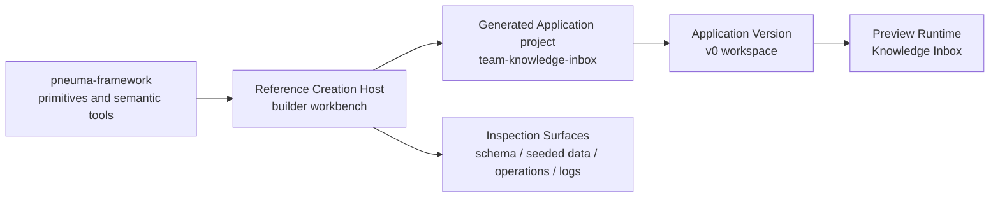

# Milestone 12 Snapshot: Reference Creation Host Substrate

**Date:** 2026-05-04  
**Status:** Closed after host store, preview runtime, host APIs, Builder workbench UI, browser verification, typecheck, and diff verification  
**Audience:** teammates with zero Pneuma context  
**Scope:** what M12 proves, what it deliberately does not prove, and why the next milestone should move governed agent evolution into the host.  
**Chinese version:** [Milestone 12 Snapshot zh-CN](./milestone-12-snapshot.zh-CN.md)

## Executive Summary

M1-M11 proved framework primitives inside an app-shaped reference path: governed app-definition changes, enterprise authorization, real SQLite persistence, real backend-agent evolution, one-intent approval, release packaging, semantic index derivation, and rollout state.

M12 changes the altitude:

> The project now has a reference Creation Host substrate. A Builder can create a Generated Application project, start a real preview runtime, inspect schema/data/operations/logs from the host, and see the generated app as an app rather than as a primitive demo.

This is the first milestone where the top-level model is visible in software:



## What Changed

| Area | What changed |
|---|---|
| Example | Added `examples/m12-reference-creation-host/` as the first host-level example. |
| Host store | Added a JSON-backed host store for generated projects, versions, creation sessions, and deterministic workspace layout. |
| Version layout | `generated-apps/<app_id>/versions/v0/workspace/data/app.db` is now created by the host. |
| Preview runtime | Host starts the existing Knowledge Inbox runtime as a child process, waits for `##pneuma:service-ready`, seeds demo rows, and stops cleanly. |
| Host APIs | Added host-level profile, project, preview start/stop, status, and inspect endpoints. |
| Builder UI | Added a split workbench: generated app preview plus Builder controls and inspection tabs. |
| Demo data | Preview runtime seeds three Knowledge Inbox rows so the Data view is meaningful. |

## The New Boundary

M12 does not promote Creation Host concepts into `packages/core`.

That is intentional. The reference host owns:

```text
generated app identity
stack profile selection
version directory layout
creation session record
preview process lifecycle
schema/data/operation/log inspection
builder-facing workbench
```

The generated app still owns:

```text
app definition
business rows
operations
views
policies
runtime behavior
```

This keeps the framework honest. M12 proves the host-level workflow exists without prematurely declaring host storage, version directories, or Bun local processes as universal framework semantics.

## M12 Demo Story

The browser story is now understandable from outside the primitive set:

```text
1. Developer starts the Reference Creation Host.
2. Builder opens the Creation Host workbench.
3. Builder clicks Create v0.
4. Host creates Generated Application project team-knowledge-inbox and version v0.
5. Builder clicks Start preview.
6. Host starts the Knowledge Inbox preview runtime and seeds three demo rows.
7. Left side shows the running generated app.
8. Right side shows schema, seeded data, operations, and logs.
9. Builder can stop the preview and restart it.
```

The important shift is not the Knowledge Inbox itself. The shift is that the Builder is operating through a Creation Host surface rather than directly running a generated app demo.

## Verification Report

Focused M12 suite:

```text
bun test examples/m12-reference-creation-host

6 pass, 0 fail, 43 expect() calls
```

Repository checks:

```text
bun run typecheck -> pass
git diff --check -> pass
```

Browser verification:

```text
URL: http://127.0.0.1:8879/

Create v0 -> team-knowledge-inbox@v0 visible
Start preview -> status running
Schema tab -> inbox_items visible
Data tab -> 3 seeded Knowledge Inbox rows visible
Operations tab -> capture_item visible
Logs tab -> service-ready marker and seeded demo data visible
Reload while running -> host resumes visible preview state
Stop preview -> status stopped, Start preview enabled, Refresh inspect disabled
Console errors -> none
```

## What Is Proven

| Claim | Evidence |
|---|---|
| Host-level workspace exists | Host store writes `.pneuma-host/host-state.json` and generated-app version directories. |
| Builder can create a Generated Application project | `POST /api/host/projects` creates `team-knowledge-inbox@v0`. |
| Host can start a real preview runtime | Preview runtime starts the existing Knowledge Inbox Bun server as a child process. |
| Host can inspect the generated app | `/api/host/projects/:appId/inspect` returns schema, operations, seeded data, and logs. |
| The generated app feels like an app | Browser workbench embeds the Knowledge Inbox preview, not only JSON primitives. |
| Data view is meaningful | Preview runtime seeds three deterministic demo rows. |
| Process lifecycle is controlled | Preview can be stopped cleanly through host API and UI. |

## What Is Not Proven

M12 does not claim:

- real backend-agent evolution inside the host;
- one-intent approval inside the host;
- `definition.apply_change_set` execution from the host;
- publish / monitor / rollback;
- Published Application surface;
- second generated-app domain;
- production deployment;
- production IAM;
- multi-tenant isolation;
- runtime agent;
- hot reload;
- host concepts as stable `packages/core` contracts.

M12 is deliberately the substrate. It gives M13-M16 a place to happen.

## Strategic Read

Before M12, the team could see strong primitives but still ask: “Where does the Builder actually stand?”

Now the answer is concrete:

```text
Builder stands inside the Creation Host.
The host coordinates project identity, preview, inspection, and later agent evolution and publish.
The generated app remains a separate app with its own definition and data.
```

This validates the correction made before M12: the release-candidate path should not be another direct app-template milestone. It should build toward a developer-usable Creation Host.

## Recommended Next Step

Proceed to **M13: Host-level governed evolution**.

M13 should move the M7/M9 capability-change path into this host:

```text
Builder asks inside the Host
  -> real backend agent receives host + generated-app context
  -> agent proposes one coherent change set
  -> Builder approves one intent-level proposal
  -> Host applies governed definition changes
  -> transcript preserves request / proposal / approval / tool calls / result
```

Publish and rollback should wait until M14. Publishing an app before the host can govern agent evolution would validate the wrong product story.
