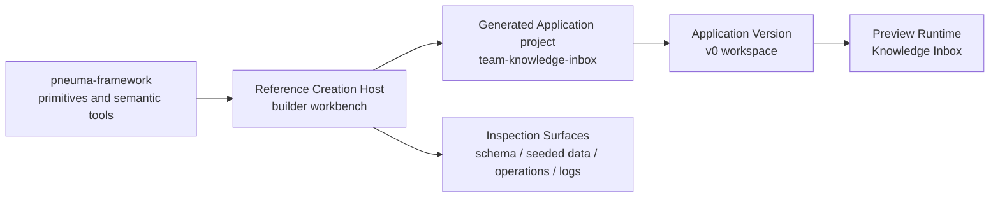

# Milestone 12 快照：Reference Creation Host Substrate

**日期：** 2026-05-04  
**状态：** host store / preview runtime / host APIs / Builder workbench UI / browser verification / typecheck / diff verification 后闭合  
**受众：** 0 预备知识团队成员  
**范围：** M12 证明了什么、明确没有证明什么，以及为什么下一步应该把 governed agent evolution 放进 Host。  
**English version:** [Milestone 12 Snapshot](./milestone-12-snapshot.md)

## 摘要

M1-M11 证明了 app 内部的 framework primitives：governed app-definition changes、enterprise authorization、真实 SQLite persistence、真实 backend-agent evolution、one-intent approval、release packaging、semantic index derivation、rollout state。

M12 改变的是观察高度：

> 项目现在有了第一版 Reference Creation Host substrate。Builder 可以创建一个 Generated Application project，启动真实 preview runtime，从 Host 检查 schema/data/operations/logs，并且看到这个 generated app 像一个 app，而不是只看到 primitive demo。

这是第一次在软件里直接看见顶层模型：



## 改了什么

| Area | 改动 |
|---|---|
| Example | 新增 `examples/m12-reference-creation-host/`，作为第一条 host-level example。 |
| Host store | 新增 JSON-backed host store，记录 generated projects、versions、creation sessions 和 deterministic workspace layout。 |
| Version layout | Host 创建 `generated-apps/<app_id>/versions/v0/workspace/data/app.db`。 |
| Preview runtime | Host 以 child process 启动现有 Knowledge Inbox runtime，等待 `##pneuma:service-ready`，种 demo rows，并能干净 stop。 |
| Host APIs | 新增 profile、project、preview start/stop、status、inspect 等 Host-level endpoints。 |
| Builder UI | 新增 split workbench：generated app preview + Builder controls + inspection tabs。 |
| Demo data | Preview runtime 种三条 Knowledge Inbox rows，让 Data view 有真实内容。 |

## 新边界

M12 没有把 Creation Host concepts 提升进 `packages/core`。

这是刻意的。Reference Host 现在拥有：

```text
generated app identity
stack profile selection
version directory layout
creation session record
preview process lifecycle
schema/data/operation/log inspection
builder-facing workbench
```

Generated Application 仍然拥有：

```text
app definition
business rows
operations
views
policies
runtime behavior
```

这样可以保持 framework 的边界清晰。M12 证明 host-level workflow 存在，但不急着把 host storage、version directories、Bun local processes 说成通用 framework semantics。

## M12 Demo 故事

现在浏览器里的故事可以被 0 预备知识的人理解：

```text
1. Developer 启动 Reference Creation Host。
2. Builder 打开 Creation Host workbench。
3. Builder 点击 Create v0。
4. Host 创建 Generated Application project team-knowledge-inbox 和 version v0。
5. Builder 点击 Start preview。
6. Host 启动 Knowledge Inbox preview runtime，并种三条 demo rows。
7. 左侧显示正在运行的 generated app。
8. 右侧显示 schema、seeded data、operations、logs。
9. Builder 可以 stop preview，再重新 start。
```

重点不是 Knowledge Inbox 本身。重点是 Builder 现在站在 Creation Host 里操作，而不是直接运行一个 generated app demo。

## Verification Report

Focused M12 suite：

```text
bun test examples/m12-reference-creation-host

6 pass, 0 fail, 43 expect() calls
```

Repository checks：

```text
bun run typecheck -> pass
git diff --check -> pass
```

Browser verification：

```text
URL: http://127.0.0.1:8879/

Create v0 -> team-knowledge-inbox@v0 visible
Start preview -> status running
Schema tab -> inbox_items visible
Data tab -> 3 seeded Knowledge Inbox rows visible
Operations tab -> capture_item visible
Logs tab -> service-ready marker and seeded demo data visible
Reload while running -> host resumes visible preview state
Stop preview -> status stopped, Start preview enabled, Refresh inspect disabled
Console errors -> none
```

## 已证明

| Claim | Evidence |
|---|---|
| Host-level workspace 存在 | Host store 写入 `.pneuma-host/host-state.json` 和 generated-app version directories。 |
| Builder 可以创建 Generated Application project | `POST /api/host/projects` 创建 `team-knowledge-inbox@v0`。 |
| Host 可以启动真实 preview runtime | Preview runtime 以 child process 启动现有 Knowledge Inbox Bun server。 |
| Host 可以检查 generated app | `/api/host/projects/:appId/inspect` 返回 schema、operations、seeded data、logs。 |
| Generated app 看起来像一个 app | Browser workbench 嵌入 Knowledge Inbox preview，不只是 JSON primitives。 |
| Data view 有意义 | Preview runtime 种三条 deterministic demo rows。 |
| Process lifecycle 可控 | Preview 可以通过 Host API 和 UI 干净 stop。 |

## 尚未证明

M12 不声称已经解决：

- Host 内的真实 backend-agent evolution
- Host 内的 one-intent approval
- 从 Host 触发 `definition.apply_change_set`
- publish / monitor / rollback
- Published Application surface
- 第二个 generated-app domain
- production deployment
- production IAM
- multi-tenant isolation
- runtime agent
- hot reload
- host concepts 作为稳定 `packages/core` contracts

M12 是 substrate。它给 M13-M16 提供发生的场所。

## 战略解读

M12 之前，团队可以看到很强的 primitives，但仍然会问：“Builder 到底站在哪里？”

现在答案是具体的：

```text
Builder 站在 Creation Host 里。
Host 协调 project identity、preview、inspection，以及后续 agent evolution 和 publish。
Generated app 仍然是独立的 app，拥有自己的 definition 和 data。
```

这验证了 M12 前的路线修正：release-candidate path 不应该继续做另一个 direct app-template milestone，而应该走向 developer 可用的 Creation Host。

## 推荐下一步

继续 **M13: Host-level governed evolution**。

M13 应该把 M7/M9 的 capability-change path 移进这个 Host：

```text
Builder asks inside the Host
  -> real backend agent receives host + generated-app context
  -> agent proposes one coherent change set
  -> Builder approves one intent-level proposal
  -> Host applies governed definition changes
  -> transcript preserves request / proposal / approval / tool calls / result
```

Publish 和 rollback 应该等到 M14。Host 还不能治理 agent evolution 时就去 publish app，会验证错产品故事。
