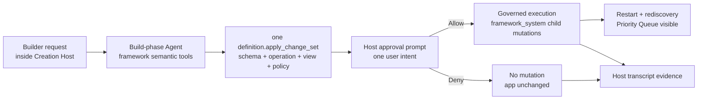

# Milestone 13 Snapshot: Host-Level Governed Evolution

**Date:** 2026-05-04  
**Status:** Closed after Host evolution runtime, one-intent approval API, Builder workbench UI, deterministic allow/deny tests, smoke verification, and browser verification  
**Audience:** teammates with zero Pneuma context  
**Scope:** what M13 proves, what it deliberately does not prove, and why M14 should publish from the Host.  
**Chinese version:** [Milestone 13 Snapshot zh-CN](./milestone-13-snapshot.zh-CN.md)

## Executive Summary

M12 gave the project a visible Creation Host: a Builder can create a Generated Application, start preview, and inspect schema/data/operations/logs.

M13 puts governed agent evolution into that Host:

> A Builder can ask the Creation Host to evolve the generated app. The backend agent proposes one coherent `definition.apply_change_set`; the Host shows one intent-level approval prompt; allow applies the whole capability; deny leaves the app unchanged; the transcript preserves before/work/after evidence.

The important proof is not “Priority Queue exists.” The proof is that a Creation Host can coordinate app evolution without collapsing back into blind file edits or per-child-mutation approval.



## What Changed

| Area | What changed |
|---|---|
| Example | Added `examples/m13-host-agent-evolution/` as the Host-level governed evolution demo. |
| Runtime | Host preview now uses a framework-managed runtime, not only a raw child process. |
| Backend agent | Added deterministic fake backend path and opencode-compatible prompt path. |
| Approval | `definition.apply_change_set` runs with `approval_mode: "defer"` so the Host can show one prompt. |
| Race fix | Host waits for the deferred proposal to register before sending allow/deny. |
| Transcript | Added Host-scoped transcript under the generated-app version workspace. |
| Host APIs | Added evolution start/get/approve/deny and priority-queue endpoints. |
| Workbench | Added one-intent approval panel, Priority Queue data, Schema/API/Transcript tabs. |

## The New Flow

```text
1. Developer starts M13 Creation Host.
2. Builder opens the Host workbench.
3. Builder creates team-knowledge-inbox@v0.
4. Builder starts preview and sees the generated app on the left.
5. Builder asks: Add a Priority Queue for urgent inbox items.
6. Backend agent calls exactly one definition.apply_change_set.
7. Host shows one approval prompt with schema / domain service / view / policy impact.
8. Allow path applies all child mutations and restarts preview.
9. Data view shows P1 / P2 / P3 Priority Queue rows.
10. Transcript tab shows builder message, agent message, tool call, approval prompt, approval response, tool result, and completion.
```

## One Intent, One Approval

M13 explicitly closes the M7 demo weakness the team noticed earlier.

The Builder is not approving these separately:

```text
add_table_column
add_operation
add_view
add_policy_rule
```

The Builder approves the actual product intent:

```text
Add Priority Queue capability
```

The framework then guarantees governed execution of child mutations. If the Builder denies, the app remains unchanged and `list_priority_queue` is absent.

## Verification Report

Focused M13 suite:

```text
bun test examples/m13-host-agent-evolution

6 pass, 0 fail, 34 expect() calls
```

Regression suite:

```text
bun test examples/m12-reference-creation-host

6 pass, 0 fail, 43 expect() calls
```

Smoke verification:

```text
bun run examples/m13-host-agent-evolution/run.ts --backend fake --auto-decision allow --port 0 --smoke-exit
-> evolution: completed
-> priority queue smoke: 3 rows

bun run examples/m13-host-agent-evolution/run.ts --backend fake --auto-decision deny --port 0 --smoke-exit
-> evolution: denied
-> priority queue smoke: denied path left operation absent
```

Browser verification:

```text
URL: http://127.0.0.1:8880/

Create v0 -> team-knowledge-inbox@v0 visible
Start preview -> embedded Knowledge Inbox visible, 3 seeded rows visible
Evolve with agent -> one approval panel visible
Approval impact -> Schema 1, Domain service 1, View 1, Policy 1
Allow -> evolution completed
Data tab -> P1 / P2 / P3 Priority Queue rows visible
Schema tab -> priority column visible
API tab -> list_priority_queue visible
Transcript tab -> builder/tool/approval/result/completion visible
Reload -> completed Host state and transcript remain visible
Console errors -> none
```

## What Is Proven

| Claim | Evidence |
|---|---|
| Host can coordinate agent evolution | `POST /evolution/start` runs backend-agent flow from the Host. |
| Agent uses framework semantics | Fake backend discovers and calls `definition.apply_change_set`; opencode prompt instructs the same. |
| Approval is intent-level | One prompt covers the whole Priority Queue capability. |
| Allow path applies governed definition changes | Priority column, read Operation, View, and PolicyRule appear after approval. |
| Deny path leaves app unchanged | `GET /priority-queue` returns failure after deny because `list_priority_queue` is absent. |
| Transcript is durable evidence | Transcript is written to `.pneuma-host/agent-transcripts/<run_id>.json` under the generated-app version workspace. |
| Host UI tells the story | Left side remains the generated app; right side shows Builder request, approval, data/schema/API/transcript. |

## What Is Not Proven

M13 does not claim:

- production model planning reliability;
- arbitrary app/code generation;
- publish / monitor / rollback;
- Published Application URL;
- production IAM;
- multi-tenant isolation;
- runtime agent inside the published app;
- hot reload;
- second generated-app domain;
- host concepts as stable `packages/core` contracts.

The Host still runs locally. M13 proves the governance loop shape, not production operations.

## Strategic Read

M13 makes the project’s core product story visible:

```text
Builder stands inside the Creation Host.
The Host talks to a Build-phase Agent.
The Agent evolves a Generated Application through framework primitives.
The Builder approves intent, not implementation fragments.
The generated app changes as a real running app.
```

This is a meaningful milestone because the framework primitives now explain a user-facing product workflow. They are no longer only internal architecture.

## Recommended Next Step

Proceed to **M14: Host publish / monitor / rollback**.

M14 should turn the evolved `v0` into a Published Application from the Host:

```text
Builder clicks Publish
  -> Host builds a release candidate
  -> Host starts a published runtime
  -> Host monitors health/config/API
  -> Host can restart or rollback to prior version
```

This is the next missing bridge from “created and evolved in preview” to “usable as an app.”
