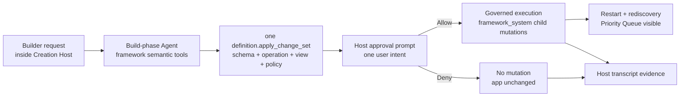

# Milestone 13 快照：Host-Level Governed Evolution

**日期：** 2026-05-04  
**状态：** Host evolution runtime / one-intent approval API / Builder workbench UI / deterministic allow-deny tests / smoke verification / browser verification 后闭合  
**受众：** 0 预备知识团队成员  
**范围：** M13 证明了什么、明确没有证明什么，以及为什么 M14 应该从 Host 进入 publish。  
**English version:** [Milestone 13 Snapshot](./milestone-13-snapshot.md)

## 摘要

M12 让项目第一次有了可见的 Creation Host：Builder 可以创建 Generated Application、启动 preview，并从 Host 检查 schema/data/operations/logs。

M13 把 governed agent evolution 放进这个 Host：

> Builder 可以在 Creation Host 里请求 evolved app。Backend agent 提出一个完整的 `definition.apply_change_set`；Host 展示一个 intent-level approval prompt；allow 会应用整个 capability；deny 会保持 app 不变；transcript 会保存 before/work/after 证据。

重点不是 “Priority Queue 出现了”。重点是 Creation Host 可以协调 app evolution，而不是退回到盲目改文件，或者让用户逐个批准技术子步骤。



## 改了什么

| Area | 改动 |
|---|---|
| Example | 新增 `examples/m13-host-agent-evolution/`，作为 Host-level governed evolution demo。 |
| Runtime | Host preview 改为 framework-managed runtime，不只是 raw child process。 |
| Backend agent | 新增 deterministic fake backend path，也保留 opencode-compatible prompt path。 |
| Approval | `definition.apply_change_set` 使用 `approval_mode: "defer"`，让 Host 能展示一个 prompt。 |
| Race fix | Host 会等 deferred proposal 注册完成，再发送 allow/deny。 |
| Transcript | 新增 Host-scoped transcript，存放在 generated-app version workspace 下。 |
| Host APIs | 新增 evolution start/get/approve/deny 和 priority-queue endpoints。 |
| Workbench | 新增 one-intent approval panel、Priority Queue data、Schema/API/Transcript tabs。 |

## 新流程

```text
1. Developer 启动 M13 Creation Host。
2. Builder 打开 Host workbench。
3. Builder 创建 team-knowledge-inbox@v0。
4. Builder 启动 preview，并在左侧看到 generated app。
5. Builder 提出：Add a Priority Queue for urgent inbox items。
6. Backend agent 只调用一次 definition.apply_change_set。
7. Host 展示一个 approval prompt，说明 schema / domain service / view / policy impact。
8. Allow path 应用所有 child mutations，并重启 preview。
9. Data view 展示 P1 / P2 / P3 Priority Queue rows。
10. Transcript tab 展示 builder message、agent message、tool call、approval prompt、approval response、tool result、completion。
```

## One Intent, One Approval

M13 明确修正了团队在 M7 demo 里指出的问题。

Builder 不应该分别批准这些技术子步骤：

```text
add_table_column
add_operation
add_view
add_policy_rule
```

Builder 批准的是产品意图：

```text
Add Priority Queue capability
```

Framework 再负责治理式执行 child mutations。如果 Builder deny，app 会保持不变，`list_priority_queue` 不会出现。

## Verification Report

Focused M13 suite：

```text
bun test examples/m13-host-agent-evolution

6 pass, 0 fail, 34 expect() calls
```

Regression suite：

```text
bun test examples/m12-reference-creation-host

6 pass, 0 fail, 43 expect() calls
```

Smoke verification：

```text
bun run examples/m13-host-agent-evolution/run.ts --backend fake --auto-decision allow --port 0 --smoke-exit
-> evolution: completed
-> priority queue smoke: 3 rows

bun run examples/m13-host-agent-evolution/run.ts --backend fake --auto-decision deny --port 0 --smoke-exit
-> evolution: denied
-> priority queue smoke: denied path left operation absent
```

Browser verification：

```text
URL: http://127.0.0.1:8880/

Create v0 -> team-knowledge-inbox@v0 visible
Start preview -> embedded Knowledge Inbox visible, 3 seeded rows visible
Evolve with agent -> one approval panel visible
Approval impact -> Schema 1, Domain service 1, View 1, Policy 1
Allow -> evolution completed
Data tab -> P1 / P2 / P3 Priority Queue rows visible
Schema tab -> priority column visible
API tab -> list_priority_queue visible
Transcript tab -> builder/tool/approval/result/completion visible
Reload -> completed Host state and transcript remain visible
Console errors -> none
```

## 已证明

| Claim | Evidence |
|---|---|
| Host 可以协调 agent evolution | `POST /evolution/start` 从 Host 发起 backend-agent flow。 |
| Agent 使用 framework semantics | Fake backend discover 并调用 `definition.apply_change_set`；opencode prompt 也要求同样路径。 |
| Approval 是 intent-level | 一个 prompt 覆盖整个 Priority Queue capability。 |
| Allow path 应用 governed definition changes | approval 后出现 priority column、read Operation、View、PolicyRule。 |
| Deny path 保持 app 不变 | deny 后 `GET /priority-queue` 失败，因为 `list_priority_queue` 不存在。 |
| Transcript 是 durable evidence | Transcript 写入 generated-app version workspace 下的 `.pneuma-host/agent-transcripts/<run_id>.json`。 |
| Host UI 能讲清楚故事 | 左侧始终是 generated app，右侧展示 Builder request、approval、data/schema/API/transcript。 |

## 尚未证明

M13 不声称已经解决：

- production model planning reliability
- arbitrary app/code generation
- publish / monitor / rollback
- Published Application URL
- production IAM
- multi-tenant isolation
- published app 内置 Runtime Agent
- hot reload
- 第二个 generated-app domain
- host concepts 作为稳定 `packages/core` contracts

Host 仍然是本地运行。M13 证明的是治理回路的形状，而不是生产运维。

## 战略解读

M13 让项目的核心产品故事变得可见：

```text
Builder 站在 Creation Host 里。
Host 与 Build-phase Agent 对话。
Agent 通过 framework primitives 演进 Generated Application。
Builder 批准 intent，而不是 implementation fragments。
Generated app 作为真实运行的 app 发生变化。
```

这是一个重要 milestone，因为 framework primitives 已经开始解释用户可感知的产品工作流，而不只是内部架构。

## 推荐下一步

继续 **M14: Host publish / monitor / rollback**。

M14 应该从 Host 把 evolved `v0` 转成 Published Application：

```text
Builder clicks Publish
  -> Host builds a release candidate
  -> Host starts a published runtime
  -> Host monitors health/config/API
  -> Host can restart or rollback to prior version
```

这是从 “created and evolved in preview” 走向 “usable as an app” 的下一座桥。
