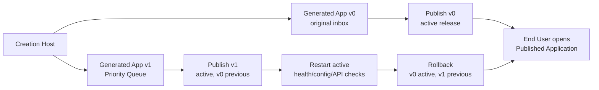

# Milestone 14 Snapshot: Host Publish / Monitor / Rollback

**Date:** 2026-05-04  
**Status:** Closed after Host version store, published runtime manager, rollout state integration, smoke verification, and browser workbench verification  
**Audience:** teammates with zero Pneuma context  
**Scope:** what M14 proves, what it deliberately does not prove, and why M15 should pressure-test a second app shape.  
**Chinese version:** [Milestone 14 Snapshot zh-CN](./milestone-14-snapshot.zh-CN.md)

## Executive Summary

M13 proved that a Creation Host can coordinate Builder/Agent evolution through one intent-level approval.

M14 adds the missing operational bridge:

> A Builder can create two Generated Application versions, publish one as the active Published Application, publish an evolved version, restart the active runtime with health evidence, and roll back to the prior version from the same Host surface.

The important proof is not "a local process starts." The proof is that the Host now owns the lifecycle boundary between construction and use.




## What Changed

| Area | What changed |
|---|---|
| Example | Added `examples/m14-host-publish-rollout/` as the Host publish / monitor / rollback demo. |
| Version store | Added a real `v0 -> v1` generated-app version fork with isolated version directories. |
| Published runtime | Added a Bun process runner that starts selected generated-app versions in release mode. |
| Rollout manager | Reused M11 release state semantics: active / previous / health checks / rollback timeline. |
| Host APIs | Added demo create, publish, rollout status, restart-active, and rollback endpoints. |
| Workbench | Added a split-screen UI: End User Published Application on the left, Host Console on the right. |
| Browser hygiene | Root page, favicon, iframe restart behavior, and console-clean E2E were verified. |

## The New Flow

```text
1. Developer starts M14 Creation Host.
2. Builder clicks Create v0 + v1.
3. Host creates team-knowledge-inbox@v0.
4. Host forks v1 from v0 and runs the M13 fake-governed Priority Queue evolution.
5. Builder publishes v0; End User surface opens the original inbox.
6. Builder publishes v1; End User surface switches to the Priority Queue version.
7. Builder restarts active; Host stops/restarts the v1 process and re-runs health/config/API checks.
8. Builder rolls back; v0 becomes active again and v1 is preserved as previous.
```

## Why This Matters

Before M14, Pneuma had strong evidence for creation and evolution, but the story still ended inside preview.

M14 makes the product boundary explicit:

```text
Generated Application = construction artifact
Published Application = end-user artifact
Creation Host = authority that moves versions across that boundary
```

This is the first time a team member can see the full shape:

```text
Builder changes the app
  -> Host publishes a version
  -> End User uses the active version
  -> Host monitors and can restart
  -> Host can restore the previous version
```

## Verification Report

Focused M14 suite:

```text
bun test examples/m14-host-publish-rollout

4 pass, 0 fail, 38 expect() calls
```

Smoke verification:

```text
bun run examples/m14-host-publish-rollout/run.ts --port 0 --smoke-exit

created demo versions: v0, v1
publish v0: active team-knowledge-inbox-v0
publish v1: active team-knowledge-inbox-v1 previous team-knowledge-inbox-v0
restart active: healthy
rollback: active team-knowledge-inbox-v0
smoke verification: passed
```

Browser verification:

```text
URL: http://127.0.0.1:8881/

Create v0 + v1 -> Host creates original and evolved version workspaces
Publish v0 -> iframe shows original Knowledge Inbox, no priority column
Publish v1 -> iframe shows Priority Queue rows and priority column
Restart active -> v1 process restarts and health remains healthy
Rollback -> active returns to v0, previous becomes v1
Console messages -> none
Screenshot -> docs/architecture/assets/m14-host-publish-workbench.png
```

Regression checks:

```text
bun test examples/m13-host-agent-evolution
```

M13 remains important because M14 deliberately reuses its governed evolution path to create the evolved v1.

## What Is Proven

| Claim | Evidence |
|---|---|
| Host can maintain distinct app versions | `forkGeneratedAppVersion` copies v0 into v1 and advances host state. |
| Published Application is a separate runtime boundary | `startPublishedRuntime` starts the selected version with release-mode env and mounted SQLite path. |
| Host can publish v0 then v1 | `publishVersion` stages/promotes candidates and preserves previous active release. |
| Host can monitor active runtime | health check verifies `/healthz`, `/api/config`, and operation discovery. |
| Host can restart active | restart stops and relaunches the active version, then refreshes health evidence. |
| Host can roll back | rollback restores previous release state and points the End User surface back to v0. |
| Demo is user-visible | Workbench keeps Published Application visible while Host actions happen on the right. |

## What Is Not Proven

M14 does not claim:

- production traffic switching;
- stable active hostname / reverse proxy routing;
- cloud deployment;
- registry push;
- Docker as the Host runtime dependency;
- zero-downtime rollout;
- automatic rollback daemon;
- schema compatibility across old and new app versions;
- production IAM;
- runtime agent inside the published app;
- arbitrary app templates beyond Knowledge Inbox.

The Host still runs locally, and the Published Application is a Bun process. That is intentional. M14 proves the product lifecycle boundary before optimizing deployment machinery.

## Strategic Read

M14 turns the framework story from a builder-only loop into a creation-to-use loop:

```text
Developer builds a Creation Host.
Builder uses the Host to create and evolve a Generated Application.
Host publishes a selected version.
End User uses the Published Application.
Host remains the control plane for monitor / restart / rollback.
```

This matters because Pneuma is not "a way to generate an app once." It is infrastructure for applications whose shape is created, governed, published, and operated through a Host.

## Recommended Next Step

Proceed to **M15: Generality Pressure App**.

M15 should prove the Host is not secretly a Knowledge Inbox product shell:

```text
same Host
  -> create Knowledge Inbox style app
  -> create Team Decision Log style app
  -> preview both
  -> inspect distinct schema / operations / views / policies
```

This should stay small. The goal is not a product suite; the goal is framework generality evidence before M16 release-candidate review.
