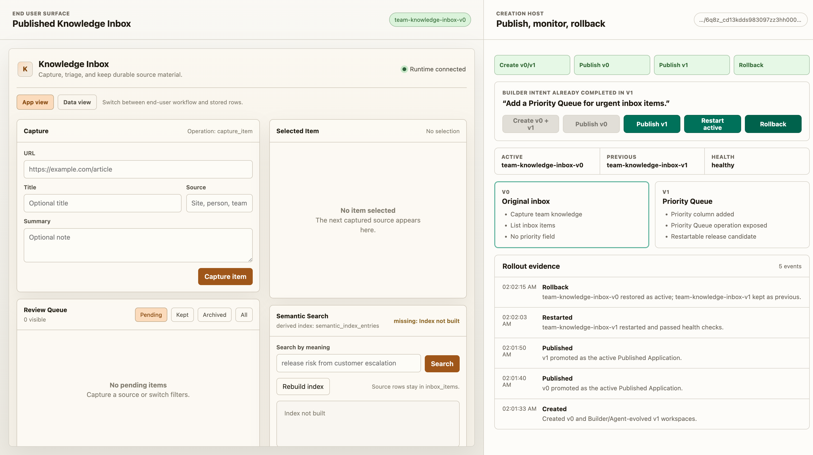
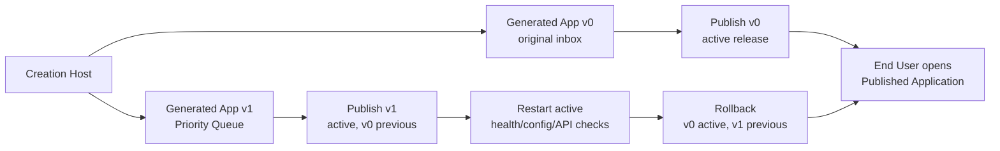

# Milestone 14 快照：Host Publish / Monitor / Rollback

**日期：** 2026-05-04  
**状态：** Host version store / published runtime manager / rollout state integration / smoke verification / browser workbench verification 后闭合  
**受众：** 0 预备知识团队成员  
**范围：** M14 证明了什么、明确没有证明什么，以及为什么 M15 应该用第二种 app 形态做压力测试。  
**English version:** [Milestone 14 Snapshot](./milestone-14-snapshot.md)

## 摘要

M13 证明了 Creation Host 可以通过一次 intent-level approval 协调 Builder/Agent evolution。

M14 补上了缺失的运营桥梁：

> Builder 可以创建两个 Generated Application 版本，把其中一个发布成 active Published Application，再发布 evolved version，重启 active runtime 并拿到 health evidence，也可以从同一个 Host surface 回滚到前一个版本。

重点不是“本地进程能启动”。重点是 Host 现在拥有了从 construction 到 use 的生命周期边界。





## 改了什么

| Area | 改动 |
|---|---|
| Example | 新增 `examples/m14-host-publish-rollout/`，作为 Host publish / monitor / rollback demo。 |
| Version store | 新增真实的 `v0 -> v1` generated-app version fork，两个 version 目录彼此隔离。 |
| Published runtime | 新增 Bun process runner，可以按选定 version 以 release mode 启动 generated app。 |
| Rollout manager | 复用 M11 release state 语义：active / previous / health checks / rollback timeline。 |
| Host APIs | 新增 demo create、publish、rollout status、restart-active、rollback endpoints。 |
| Workbench | 新增左右分屏 UI：左侧 End User Published Application，右侧 Host Console。 |
| Browser hygiene | 根页面、favicon、iframe restart 行为、console-clean E2E 都已验证。 |

## 新流程

```text
1. Developer 启动 M14 Creation Host。
2. Builder 点击 Create v0 + v1。
3. Host 创建 team-knowledge-inbox@v0。
4. Host 从 v0 fork 出 v1，并运行 M13 fake-governed Priority Queue evolution。
5. Builder 发布 v0；End User surface 打开 original inbox。
6. Builder 发布 v1；End User surface 切换到 Priority Queue 版本。
7. Builder 重启 active；Host 停止并重启 v1 进程，重新跑 health/config/API checks。
8. Builder 回滚；v0 重新成为 active，v1 被保留为 previous。
```

## 为什么重要

M14 之前，Pneuma 对 creation 和 evolution 已经有较强证据，但故事还停在 preview 里。

M14 把产品边界显式化了：

```text
Generated Application = construction artifact
Published Application = end-user artifact
Creation Host = 把 version 推过边界的权威控制面
```

这是第一次团队成员可以看到完整形状：

```text
Builder 修改 app
  -> Host 发布某个 version
  -> End User 使用 active version
  -> Host 监控并重启
  -> Host 可以恢复 previous version
```

## Verification Report

Focused M14 suite：

```text
bun test examples/m14-host-publish-rollout

4 pass, 0 fail, 38 expect() calls
```

Smoke verification：

```text
bun run examples/m14-host-publish-rollout/run.ts --port 0 --smoke-exit

created demo versions: v0, v1
publish v0: active team-knowledge-inbox-v0
publish v1: active team-knowledge-inbox-v1 previous team-knowledge-inbox-v0
restart active: healthy
rollback: active team-knowledge-inbox-v0
smoke verification: passed
```

Browser verification：

```text
URL: http://127.0.0.1:8881/

Create v0 + v1 -> Host 创建 original 与 evolved version workspaces
Publish v0 -> iframe 展示 original Knowledge Inbox，没有 priority column
Publish v1 -> iframe 展示 Priority Queue rows 与 priority column
Restart active -> v1 process 重启，health 仍为 healthy
Rollback -> active 回到 v0，previous 变成 v1
Console messages -> none
Screenshot -> docs/architecture/assets/m14-host-publish-workbench.png
```

Regression checks：

```text
bun test examples/m13-host-agent-evolution
```

M13 仍然重要，因为 M14 是复用 M13 的 governed evolution path 来生成 evolved v1。

## 已证明

| Claim | Evidence |
|---|---|
| Host 可以维护不同 app versions | `forkGeneratedAppVersion` 把 v0 复制成 v1，并推进 host state。 |
| Published Application 是独立 runtime boundary | `startPublishedRuntime` 用 release-mode env 和 SQLite path 启动选定 version。 |
| Host 可以先发布 v0 再发布 v1 | `publishVersion` stage/promote candidates，并保留 previous active release。 |
| Host 可以监控 active runtime | health check 验证 `/healthz`、`/api/config`、operation discovery。 |
| Host 可以重启 active | restart 会停止并重启 active version，再刷新 health evidence。 |
| Host 可以 rollback | rollback 恢复 previous release state，并让 End User surface 回到 v0。 |
| Demo 是用户可见的 | Workbench 左侧始终保留 Published Application，右侧执行 Host actions。 |

## 尚未证明

M14 不声称已经解决：

- production traffic switching
- stable active hostname / reverse proxy routing
- cloud deployment
- registry push
- Docker 作为 Host runtime dependency
- zero-downtime rollout
- automatic rollback daemon
- old/new app versions 之间的 schema compatibility
- production IAM
- published app 内置 Runtime Agent
- Knowledge Inbox 之外的 arbitrary app templates

Host 仍然本地运行，Published Application 是 Bun process。这是有意的。M14 要先证明 product lifecycle boundary，再优化部署机器。

## 战略解读

M14 把 framework story 从 builder-only loop 推进到 creation-to-use loop：

```text
Developer 构建 Creation Host。
Builder 用 Host 创建并演进 Generated Application。
Host 发布选定 version。
End User 使用 Published Application。
Host 继续作为 monitor / restart / rollback 的 control plane。
```

这很重要，因为 Pneuma 不是“一次性生成 app 的工具”。它是让 app 的形状可以被创建、治理、发布和运营的基础设施。

## 推荐下一步

继续 **M15: Generality Pressure App**。

M15 应该证明 Host 不是 Knowledge Inbox 专用产品壳：

```text
same Host
  -> create Knowledge Inbox style app
  -> create Team Decision Log style app
  -> preview both
  -> inspect distinct schema / operations / views / policies
```

这个阶段应该保持小。目标不是做 product suite，而是在 M16 release-candidate review 之前补上 framework generality evidence。
