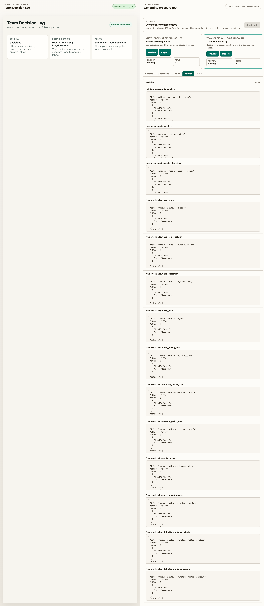
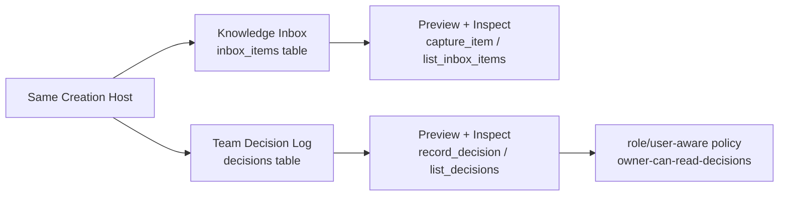

# Milestone 15 Snapshot: Generality Pressure App

**Date:** 2026-05-04  
**Status:** Closed after second app template, generic Host profile/store/runtime, smoke verification, browser workbench verification, and M13/M14 regression checks  
**Audience:** teammates with zero Pneuma context  
**Scope:** what M15 proves, what it deliberately does not prove, and why M16 should be a release-candidate review rather than another feature milestone.  
**Chinese version:** [Milestone 15 Snapshot zh-CN](./milestone-15-snapshot.zh-CN.md)

## Executive Summary

M14 proved that a Creation Host can publish, restart, and roll back a Generated Application version.

M15 asks a harder question:

> Is the Host a Knowledge Inbox-specific shell, or can the same Host create and inspect apps with different domain shapes?

M15 answers with a deliberately small second app: **Team Decision Log**.

The important proof is not that Team Decision Log is a finished product. It is that the same Host surfaces can create, preview, and inspect two different app shapes:





## What Changed

| Area | What changed |
|---|---|
| Example | Added `examples/m15-generality-pressure-app/`. |
| Second app | Added a Team Decision Log template under the M15 example. |
| Profile registry | Host now has two profiles: Knowledge Inbox and Team Decision Log. |
| Host store | M15 owns a local profile-id union rather than widening M12's single-profile store. |
| Preview runtime | One runtime path starts either app and seeds profile-specific demo data. |
| Inspection | One inspection path reads schema / operations / views / policies / data for either app. |
| Workbench | Browser UI shows two app cards, shared Host controls, preview iframe, and inspector tabs. |

## The Two App Shapes

| Dimension | Knowledge Inbox | Team Decision Log |
|---|---|---|
| Primary table | `inbox_items` | `decisions` |
| Main write operation | `capture_item` | `record_decision` |
| Main read operation | `list_inbox_items` | `list_decisions` |
| View | existing Knowledge Inbox viewer | `decision_log` table view |
| Policy signal | public operation rules | `owner-can-read-decisions` user/role-aware rule |
| Seed data | captured sources | decisions with owner/status |

This is intentionally not a full product suite. The second app exists to pressure the framework boundary.

## Verification Report

Focused M15 suite:

```text
bun test examples/m15-generality-pressure-app

4 pass, 0 fail, 26 expect() calls
```

Smoke verification:

```text
bun run examples/m15-generality-pressure-app/run.ts --port 0 --smoke-exit

created apps: team-knowledge-inbox, team-decision-log
team-knowledge-inbox: tables=inbox_items,... operations=capture_item,list_inbox_items,...
team-decision-log: tables=decisions,... operations=record_decision,list_decisions,...
smoke verification: passed
```

Regression checks:

```text
bun test examples/m14-host-publish-rollout
4 pass, 0 fail, 39 expect() calls

bun test examples/m13-host-agent-evolution
6 pass, 0 fail, 34 expect() calls

bun run typecheck
exit 0

git diff --check
exit 0
```

Browser verification:

```text
URL: http://127.0.0.1:8882/

Create both -> team-knowledge-inbox and team-decision-log appear
Preview Knowledge Inbox -> iframe shows Knowledge Inbox
Inspect Knowledge Inbox -> inbox_items and capture_item visible
Preview Decision Log -> iframe shows Team Decision Log
Inspect Decision Log -> decisions, record_decision, decision_log visible
Policies tab -> owner-can-read-decisions visible with role/user subjects
Console messages -> none
Screenshot -> docs/architecture/assets/m15-generality-workbench.png
```

## What Is Proven

| Claim | Evidence |
|---|---|
| Host profile selection is not hard-coded to Knowledge Inbox | `STACK_PROFILES` contains two independent profiles with different template dirs and read/data metadata. |
| Host store can create different generated-app profiles | `createGeneralityHostStore` creates both projects with isolated workspaces and SQLite paths. |
| Runtime start is generic | `startM15PreviewRuntime` starts either profile using the same process and readiness protocol. |
| Inspection is generic | `inspectM15PreviewRuntime` reads `/api/config` plus the profile read operation for either app. |
| Second app has different domain primitives | Team Decision Log declares `decisions`, `record_decision`, `list_decisions`, and `decision_log`. |
| Policy shape can differ by app | Team Decision Log exposes `owner-can-read-decisions` with user/role subjects. |
| Browser story is understandable | The workbench keeps the selected app preview on the left and Host inspection on the right. |

## What Is Not Proven

M15 does not claim:

- arbitrary app generation;
- statistically reliable model planning;
- a finished Team Decision Log product;
- production role/identity management;
- tenant isolation;
- publish/rollback for both M15 apps in one combined host;
- stable plugin/template marketplace;
- hot reload;
- runtime agent in published apps;
- Pneuma 2.x mode dogfood coverage.

M15 deliberately avoids adding a product suite. It proves that the Host abstraction can carry more than one domain shape.

## Strategic Read

M15 closes a key conceptual risk:

```text
If every Host demo is Knowledge Inbox, teammates can reasonably suspect
that the framework is just a polished Knowledge Inbox builder.
```

After M15, the shape is clearer:

```text
Developer authors app profiles/templates.
Builder uses one Creation Host.
The Host can create different Generated Application shapes.
Each app still exposes framework primitives: Table, Operation, View, Policy.
The Host can inspect them through one control surface.
```

That is the right stopping point before release-candidate review. More features would risk hiding the real question.

## Recommended Next Step

Proceed to **M16: Release Candidate Snapshot / Review Gate**.

M16 should not automatically release. It should first run a complete end-to-end review:

```text
M12 create/preview/inspect
  + M13 governed evolution
  + M14 publish/restart/rollback
  + M15 second app generality
  + project-goal review
  + subagent third-party review
  -> decide whether candidate release is justified
```

If M16 finds a missing abstraction, fix that before tagging a release candidate.
