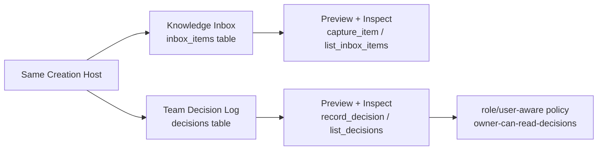

# Milestone 15 快照：Generality Pressure App

**日期：** 2026-05-04  
**状态：** second app template / generic Host profile-store-runtime / smoke verification / browser workbench verification / M13-M14 regression checks 后闭合  
**受众：** 0 预备知识团队成员  
**范围：** M15 证明了什么、明确没有证明什么，以及为什么 M16 应该是 release-candidate review，而不是继续加一个小 feature。  
**English version:** [Milestone 15 Snapshot](./milestone-15-snapshot.md)

## 摘要

M14 证明了 Creation Host 可以 publish、restart、rollback 某个 Generated Application version。

M15 问了一个更关键的问题：

> Host 到底是 Knowledge Inbox 专用壳，还是同一个 Host 能创建和检查不同 domain shape 的 app？

M15 用一个刻意很小的第二个 app 来回答：**Team Decision Log**。

重点不是 Team Decision Log 是完整产品。重点是同一个 Host surface 可以创建、preview、inspect 两种不同 app shape：




## 改了什么

| Area | 改动 |
|---|---|
| Example | 新增 `examples/m15-generality-pressure-app/`。 |
| Second app | 在 M15 example 下新增 Team Decision Log template。 |
| Profile registry | Host 现在有两个 profile：Knowledge Inbox 与 Team Decision Log。 |
| Host store | M15 拥有本地 profile-id union，不把 M12 的单 profile store 直接扩成长期 API。 |
| Preview runtime | 同一条 runtime path 可以启动任意 profile，并做 profile-specific demo seed。 |
| Inspection | 同一条 inspection path 可以读取 schema / operations / views / policies / data。 |
| Workbench | Browser UI 展示两个 app card、共享 Host controls、preview iframe 和 inspector tabs。 |

## 两种 app shape

| Dimension | Knowledge Inbox | Team Decision Log |
|---|---|---|
| Primary table | `inbox_items` | `decisions` |
| Main write operation | `capture_item` | `record_decision` |
| Main read operation | `list_inbox_items` | `list_decisions` |
| View | existing Knowledge Inbox viewer | `decision_log` table view |
| Policy signal | public operation rules | `owner-can-read-decisions` user/role-aware rule |
| Seed data | captured sources | decisions with owner/status |

这不是 product suite。第二个 app 的目的只是压力测试 framework boundary。

## Verification Report

Focused M15 suite：

```text
bun test examples/m15-generality-pressure-app

4 pass, 0 fail, 26 expect() calls
```

Smoke verification：

```text
bun run examples/m15-generality-pressure-app/run.ts --port 0 --smoke-exit

created apps: team-knowledge-inbox, team-decision-log
team-knowledge-inbox: tables=inbox_items,... operations=capture_item,list_inbox_items,...
team-decision-log: tables=decisions,... operations=record_decision,list_decisions,...
smoke verification: passed
```

Regression checks：

```text
bun test examples/m14-host-publish-rollout
4 pass, 0 fail, 39 expect() calls

bun test examples/m13-host-agent-evolution
6 pass, 0 fail, 34 expect() calls

bun run typecheck
exit 0

git diff --check
exit 0
```

Browser verification：

```text
URL: http://127.0.0.1:8882/

Create both -> team-knowledge-inbox 与 team-decision-log 出现
Preview Knowledge Inbox -> iframe 展示 Knowledge Inbox
Inspect Knowledge Inbox -> inbox_items 与 capture_item 可见
Preview Decision Log -> iframe 展示 Team Decision Log
Inspect Decision Log -> decisions、record_decision、decision_log 可见
Policies tab -> owner-can-read-decisions 可见，且包含 role/user subjects
Console messages -> none
Screenshot -> docs/architecture/assets/m15-generality-workbench.png
```

## 已证明

| Claim | Evidence |
|---|---|
| Host profile selection 不再硬编码 Knowledge Inbox | `STACK_PROFILES` 包含两个独立 profile，template dir / read operation / data table 都不同。 |
| Host store 可以创建不同 generated-app profiles | `createGeneralityHostStore` 创建两个 project，并隔离 workspace 与 SQLite path。 |
| Runtime start 是 generic 的 | `startM15PreviewRuntime` 用同一套 process readiness protocol 启动任意 profile。 |
| Inspection 是 generic 的 | `inspectM15PreviewRuntime` 对任意 app 读取 `/api/config` 与 profile read operation。 |
| 第二个 app 有不同 domain primitives | Team Decision Log 声明 `decisions`、`record_decision`、`list_decisions`、`decision_log`。 |
| Policy shape 可以因 app 而异 | Team Decision Log 暴露 `owner-can-read-decisions`，包含 user/role subjects。 |
| Browser story 可理解 | Workbench 左侧保留 selected app preview，右侧是 Host inspection。 |

## 尚未证明

M15 不声称已经解决：

- arbitrary app generation
- statistically reliable model planning
- 完整 Team Decision Log 产品
- production role/identity management
- tenant isolation
- 在同一个 M15 host 里 publish/rollback 两个 app
- stable plugin/template marketplace
- hot reload
- published app 内置 Runtime Agent
- Pneuma 2.x mode dogfood coverage

M15 刻意避免做 product suite。它只证明 Host abstraction 能承载不止一种 domain shape。

## 战略解读

M15 关闭了一个关键认知风险：

```text
如果所有 Host demo 都是 Knowledge Inbox，
团队完全可能怀疑 framework 只是一个精致的 Knowledge Inbox builder。
```

M15 后，形状更清楚：

```text
Developer 编写 app profiles/templates。
Builder 使用同一个 Creation Host。
Host 可以创建不同 Generated Application shapes。
每个 app 仍然暴露 framework primitives：Table, Operation, View, Policy。
Host 用同一个 control surface 检查它们。
```

这是 release-candidate review 前合适的停点。继续加 feature 反而可能掩盖真正的问题。

## 推荐下一步

进入 **M16: Release Candidate Snapshot / Review Gate**。

M16 不应该自动 release。它应该先做完整端到端回顾：

```text
M12 create/preview/inspect
  + M13 governed evolution
  + M14 publish/restart/rollback
  + M15 second app generality
  + project-goal review
  + subagent third-party review
  -> decide whether candidate release is justified
```

如果 M16 发现缺失的关键抽象，应该先修抽象，再打 release candidate。
