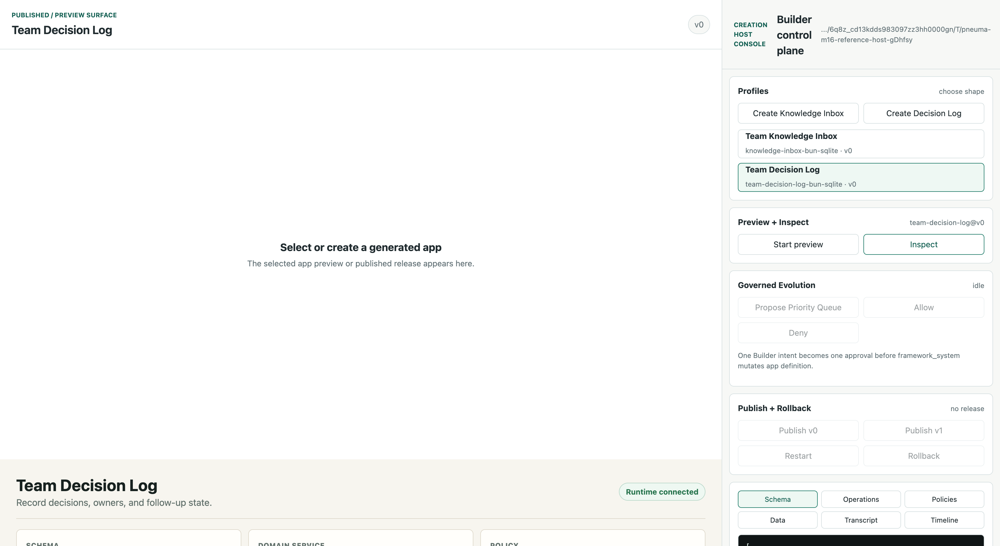
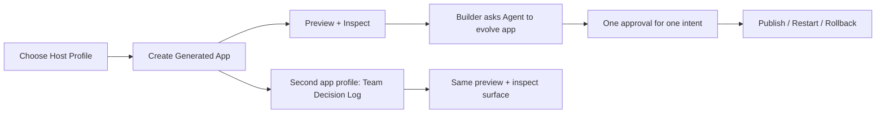

# Milestone 16 Snapshot: Reference Creation Host Integration Gate

**Date:** 2026-05-04  
**Status:** Closed after integrated host contract, full workbench, smoke verification, live browser E2E, and regression fixes  
**Audience:** teammates with zero Pneuma context  
**Scope:** what M16 proves, what it deliberately does not prove, and why the next step is a release-candidate review rather than automatic release.  
**Chinese version:** [Milestone 16 Snapshot zh-CN](./milestone-16-snapshot.zh-CN.md)

## Executive Summary

M12 through M15 each proved one part of the Creation Host story:

- M12: create, preview, and inspect a Generated Application.
- M13: evolve it through one governed Builder approval.
- M14: publish, restart, and roll back a Published Application.
- M15: prove the Host is not Knowledge Inbox-specific by adding Team Decision Log.

M16 asks a different question:

> Can one canonical Reference Creation Host connect those pieces into a single Builder-facing workflow?

The answer is now yes, at concept-implementation quality:





M16 is an **integration gate**, not a production release. It proves that the project has a coherent end-to-end shape. It also exposes the next review question clearly: whether this integrated host path is strong enough to become a release candidate after project-goal review.

## What Changed

| Area | What changed |
|---|---|
| Core contract | Added `CreationHostProfile`, `CreationHostProject`, `CreationHostVersion`, and a local `CreationHostStore`. |
| Canonical example | Added `examples/m16-reference-creation-host/` as the integrated Host. |
| Profiles | The Host can create Knowledge Inbox and Team Decision Log from one profile registry. |
| Version model | Generated apps live in explicit `v0`, `v1`, ... version directories. |
| Preview | One preview runtime starts the selected app profile and exposes app/config/data evidence. |
| Evolution | Knowledge Inbox can enter governed Priority Queue evolution through one visible approval. |
| Publish | Knowledge Inbox versions can be published as active releases and restarted. |
| Rollback | The Host can roll back active release from v1 to v0 and refresh the live app iframe. |
| Workbench | Left side shows the End User app. Right side shows Creation Host project state, inspector tabs, transcript, timeline, and rollout controls. |

## The End-to-End Story

The M16 Host is intentionally simple, but it now tells the complete project story:

```text
Developer configures Host profiles
  -> Builder creates a Knowledge Inbox Generated Application
  -> Builder previews and inspects schema / operations / policies / data
  -> Builder asks the Build-phase Agent for Priority Queue
  -> Host shows one proposal-level approval
  -> Allow applies schema / operation / view / policy together
  -> Host publishes v0, then v1
  -> End User opens the active Published Application
  -> Builder restarts active runtime
  -> Builder rolls back active release to v0
  -> Builder also creates Team Decision Log through the same Host shell
```

That is the key milestone: the framework is no longer only a pile of primitives or isolated examples. It can be experienced as a small Creation Host product.

## Why This Is Not Just Another Demo

M16 intentionally reuses previous milestone code instead of replacing it:

| Prior milestone | M16 integration point |
|---|---|
| M12 | Host project/version creation and preview/inspection. |
| M13 | Governed Builder/Agent app evolution. |
| M14 | Publish/restart/rollback release operations. |
| M15 | Multiple app profiles with different schema and policy shapes. |

This matters because a false-positive demo could be built by hard-coding one happy path. M16 instead pressures the seams between earlier proofs. The live browser run found two real integration defects, both fixed before snapshot.

## Defects Found During E2E

| Defect | What happened | Fix |
|---|---|---|
| Rollback kept a stale app URL | After rollback, the Host state said v0 was active, but the iframe still pointed at a stopped v1-era runtime URL. | Rollback now refreshes the previous release URL and health checks from the newly ensured runtime before saving rollout state. |
| Multi-app selection leaked selected app state | After creating Team Decision Log, the iframe and rollout controls still reflected Knowledge Inbox state. | UI selection now scopes preview URL, surface pill, rollout status, and controls to the selected app. |

These are useful failures. They show M16 tested the integrated workflow, not just individual modules.

## Verification Report

Focused unit and integration tests:

```text
bun test packages/core/test/creation-host.test.ts
3 pass, 0 fail, 11 expect() calls

bun test examples/m16-reference-creation-host/run.test.ts
1 pass, 0 fail, 26 expect() calls

bun test examples/m14-host-publish-rollout/publish-rollout.test.ts
1 pass, 0 fail, 13 expect() calls
```

M16 smoke verification:

```text
bun run examples/m16-reference-creation-host/run.ts --port 0 --smoke-exit

created generated app: team-knowledge-inbox
knowledge inbox preview + inspect: passed
publish v0 active team-knowledge-inbox-v0
evolution proposal v1 awaiting approval
evolution approval completed with 3 priority rows
publish v1 active team-knowledge-inbox-v1 previous team-knowledge-inbox-v0
restart active healthy
rollback active team-knowledge-inbox-v0
created generated app: team-decision-log
team decision log preview + inspect: passed
smoke verification: passed
```

Browser verification:

```text
URL: http://127.0.0.1:8883/

Create Knowledge Inbox
  -> preview starts
  -> inspect shows schema / operations / policies / data
  -> publish v0
  -> propose Priority Queue
  -> allow proposal
  -> publish v1
  -> restart active
  -> rollback to v0 with fresh iframe URL

Create Team Decision Log
  -> selection switches to the second app
  -> release controls stay disabled for this preview-only profile
  -> preview starts
  -> inspect shows decisions / record_decision / list_decisions / role-aware policy

Console messages -> none
Screenshot -> docs/architecture/assets/m16-reference-host-workbench.png
```

Regression checks run before closure:

```text
bun test examples/m16-reference-creation-host packages/core/test/creation-host.test.ts
4 pass, 0 fail, 31 expect() calls

bun run typecheck
exit 0

git diff --check
exit 0
```

Full-suite caveat:

```text
bun test

M16 / M15 / M14 / M13 / M12 / M10 / M4 / M3 early Docker tests passed before
examples/m3-deployable-substrate/capability-release-smoke.test.ts timed out
after 180000ms while blocked in Docker CLI.
```

This is not hidden as a green full-suite result. The M16 integration path is verified by focused tests, smoke CLI, and browser E2E; the old M3 Docker full-suite timeout should be carried into M17 release-candidate review as a test isolation / Docker reliability item.

## What Is Proven

| Claim | Evidence |
|---|---|
| The Creation Host has a reusable contract | `packages/core/src/creation-host.ts` defines profiles, projects, versions, and store operations outside the example. |
| Host profile selection is explicit | Knowledge Inbox and Team Decision Log are selected through profile metadata, not hidden conditionals in the UI. |
| Version directories are understandable | Generated apps are visible as `v0`, `v1`, ... workspaces, which keeps source inspection simple for developers. |
| Preview and inspection share one workbench | The same Host surface shows End User app, schema, operations, policies, data, transcript, and timeline. |
| One Builder intent maps to one approval | Priority Queue evolution uses a proposal-level approval, not four independent mutation approvals. |
| Publish/restart/rollback can be operated from the Host | The Host publishes v0/v1, restarts active runtime, and rolls back to v0 with fresh runtime evidence. |
| The Host is not Knowledge Inbox-only | Team Decision Log proves a second app shape can be created, previewed, and inspected through the same shell. |

## What Is Not Proven

M16 does not claim:

- production-grade authentication or tenant isolation;
- production traffic switching or zero-downtime deploy;
- cloud deploy, registry push, or managed hosting;
- arbitrary app generation from scratch;
- production LLM planning reliability;
- hot reload;
- custom Builder-authored code handlers;
- full transactionality across every child mutation and release action;
- stable Runtime Agent inside published apps;
- Pneuma 2.x mode dogfood coverage;
- polished product UX for a real commercial Creation Host.

Those are future pressure lines. M16's job is to show that the central model is coherent enough to review as a candidate product direction.

## Strategic Read

Before M16, the project had strong primitives and strong milestone demos, but the demos still required the team to mentally compose the product:

```text
M12 create/inspect + M13 evolution + M14 publish + M15 generality
```

After M16, the product shape is visible from the outside:

```text
Developer builds a Creation Host.
Builder uses the Host to create and evolve Generated Applications.
End User opens the Published Application.
The Host remains the control plane for preview, inspection, publish, restart, and rollback.
```

That is the milestone. The framework is beginning to look like infrastructure for building Creation Hosts, not only infrastructure for building one app.

## Recommended Next Step

Proceed to **M17: Release Candidate Review / Packaging Gate**.

M17 should be a review gate, not a feature grab bag:

```text
project-goal review
  -> full test sweep
  -> fresh clone / getting-started check
  -> docs navigation check
  -> example health check
  -> decide whether to tag a candidate release
```

If M17 finds a missing top-level abstraction, fix that before release candidate. If it only finds polish gaps, tag the candidate and move the next feature pressure to a new post-RC milestone.
