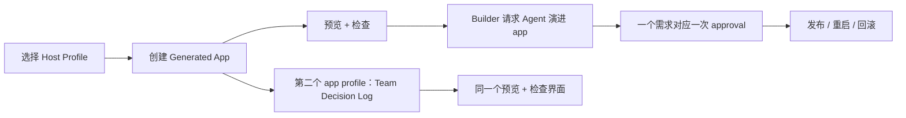

# Milestone 16 Snapshot：Reference Creation Host 集成门

**日期：** 2026-05-04  
**状态：** 已闭合：完成 Host contract、完整 workbench、smoke verification、live browser E2E，以及 E2E 发现的 regression 修复  
**读者：** 对 Pneuma 没有预备知识的团队成员  
**范围：** M16 证明了什么、没有证明什么，以及为什么下一步是 release-candidate review，而不是自动 release。  
**English version:** [Milestone 16 Snapshot](./milestone-16-snapshot.md)

## 摘要

M12 到 M15 分别证明了 Creation Host 故事中的几个局部：

- M12：创建、预览、检查一个 Generated Application。
- M13：通过一次 Builder approval 治理式演进这个 app。
- M14：发布、重启、回滚一个 Published Application。
- M15：加入 Team Decision Log，证明 Host 不是 Knowledge Inbox 专用壳。

M16 问的是另一个问题：

> 同一个 Reference Creation Host，能不能把这些能力串成一条 Builder 能理解的完整链路？

现在答案是：可以，达到概念实现质量。




M16 是一个**集成门**，不是生产 release。它证明项目已经有一个连贯的端到端形状；同时也把下一个问题暴露清楚：这个 Host 路径是否已经足够进入 release candidate review。

## 发生了什么变化

| 区域 | 变化 |
|---|---|
| Core contract | 新增 `CreationHostProfile`、`CreationHostProject`、`CreationHostVersion` 和本地 `CreationHostStore`。 |
| Canonical example | 新增 `examples/m16-reference-creation-host/` 作为集成 Host。 |
| Profiles | 同一个 Host 可以从 profile registry 创建 Knowledge Inbox 和 Team Decision Log。 |
| Version model | Generated app 明确存放在 `v0`、`v1` 等 version 目录里。 |
| Preview | 同一个 preview runtime 启动选中的 app profile，并暴露 app/config/data 证据。 |
| Evolution | Knowledge Inbox 可以通过一次可见 approval 进入 Priority Queue 治理式演进。 |
| Publish | Knowledge Inbox 的版本可以发布为 active release，并被重启。 |
| Rollback | Host 可以把 active release 从 v1 回滚到 v0，并刷新左侧 app iframe。 |
| Workbench | 左侧展示 End User app，右侧展示 Creation Host 的项目状态、inspector tabs、transcript、timeline、rollout controls。 |

## 端到端故事

M16 的 Host 很小，但它第一次讲清楚了完整项目故事：

```text
Developer 配置 Host profiles
  -> Builder 创建一个 Knowledge Inbox Generated Application
  -> Builder 预览并检查 schema / operations / policies / data
  -> Builder 请求 Build-phase Agent 添加 Priority Queue
  -> Host 展示一次 proposal-level approval
  -> Allow 后一起应用 schema / operation / view / policy
  -> Host 发布 v0，再发布 v1
  -> End User 打开 active Published Application
  -> Builder 重启 active runtime
  -> Builder 回滚 active release 到 v0
  -> Builder 也可以通过同一个 Host shell 创建 Team Decision Log
```

这是 M16 的核心意义：框架不再只是 primitives 或孤立 example。它已经可以被体验成一个小型 Creation Host 产品。

## 为什么这不只是另一个 demo

M16 有意复用之前 milestone 的代码，而不是重新写一个假 happy path：

| 前置 milestone | M16 的集成点 |
|---|---|
| M12 | Host project/version 创建，以及 preview/inspection。 |
| M13 | 治理式 Builder/Agent app evolution。 |
| M14 | publish/restart/rollback release operations。 |
| M15 | 多 app profiles，不同 schema 和 policy shape。 |

这很重要。一个硬编码的 demo 很容易看起来顺滑，但不能证明框架边界。M16 压的是前面几块之间的连接处。live browser 过程中确实发现了两个真实集成缺陷，并且在 snapshot 前修复。

## E2E 发现并修复的问题

| 问题 | 现象 | 修复 |
|---|---|---|
| Rollback 保留了过期 app URL | rollback 后 Host state 显示 v0 active，但 iframe 还指向已经停止的旧 runtime URL。 | rollback 现在会从 newly ensured runtime 刷新 previous release URL 和 health checks，再保存 rollout state。 |
| 多 app selection 泄漏旧 app 状态 | 创建 Team Decision Log 后，iframe 和 rollout controls 仍然反映 Knowledge Inbox 状态。 | UI selection 现在按 selected app 作用域计算 preview URL、surface pill、rollout status 和 controls。 |

这两个问题是有价值的失败：它们说明 M16 测的是集成链路，而不是单个模块。

## 验证报告

聚焦单测和集成测试：

```text
bun test packages/core/test/creation-host.test.ts
3 pass, 0 fail, 11 expect() calls

bun test examples/m16-reference-creation-host/run.test.ts
1 pass, 0 fail, 26 expect() calls

bun test examples/m14-host-publish-rollout/publish-rollout.test.ts
1 pass, 0 fail, 13 expect() calls
```

M16 smoke verification：

```text
bun run examples/m16-reference-creation-host/run.ts --port 0 --smoke-exit

created generated app: team-knowledge-inbox
knowledge inbox preview + inspect: passed
publish v0 active team-knowledge-inbox-v0
evolution proposal v1 awaiting approval
evolution approval completed with 3 priority rows
publish v1 active team-knowledge-inbox-v1 previous team-knowledge-inbox-v0
restart active healthy
rollback active team-knowledge-inbox-v0
created generated app: team-decision-log
team decision log preview + inspect: passed
smoke verification: passed
```

Browser verification：

```text
URL: http://127.0.0.1:8883/

Create Knowledge Inbox
  -> preview starts
  -> inspect shows schema / operations / policies / data
  -> publish v0
  -> propose Priority Queue
  -> allow proposal
  -> publish v1
  -> restart active
  -> rollback to v0 with fresh iframe URL

Create Team Decision Log
  -> selection switches to the second app
  -> release controls stay disabled for this preview-only profile
  -> preview starts
  -> inspect shows decisions / record_decision / list_decisions / role-aware policy

Console messages -> none
Screenshot -> docs/architecture/assets/m16-reference-host-workbench.png
```

闭合前 regression checks：

```text
bun test examples/m16-reference-creation-host packages/core/test/creation-host.test.ts
4 pass, 0 fail, 31 expect() calls

bun run typecheck
exit 0

git diff --check
exit 0
```

Full-suite caveat：

```text
bun test

M16 / M15 / M14 / M13 / M12 / M10 / M4 / M3 early Docker tests 在前面已经通过，
随后 examples/m3-deployable-substrate/capability-release-smoke.test.ts
在 Docker CLI 层阻塞，并在 180000ms 后 timeout。
```

这里不把全量 suite 写成绿色。M16 的集成路径由 focused tests、smoke CLI 和 browser E2E 验证；旧 M3 Docker full-suite timeout 应该进入 M17 release-candidate review，作为测试隔离 / Docker reliability 问题处理。

## 已经证明的事情

| 结论 | 证据 |
|---|---|
| Creation Host 有可复用 contract | `packages/core/src/creation-host.ts` 在 example 之外定义了 profiles、projects、versions 和 store operations。 |
| Host profile selection 是显式模型 | Knowledge Inbox 和 Team Decision Log 通过 profile metadata 选择，而不是藏在 UI 条件分支里。 |
| Version directories 对开发者可理解 | Generated app 以 `v0`、`v1` 等 workspace 呈现，方便直接看源码和数据。 |
| Preview 与 inspection 进入同一个 workbench | 同一个 Host surface 同时展示 End User app、schema、operations、policies、data、transcript 和 timeline。 |
| 一个 Builder intent 对应一次 approval | Priority Queue evolution 使用 proposal-level approval，而不是四个独立 mutation approval。 |
| Host 可以操作 publish/restart/rollback | Host 发布 v0/v1、重启 active runtime，并带 fresh runtime evidence 回滚到 v0。 |
| Host 不是 Knowledge Inbox 专用壳 | Team Decision Log 证明第二种 app shape 可以通过同一个 shell 创建、预览、检查。 |

## 没有证明的事情

M16 不声称：

- 生产级 authentication 或 tenant isolation；
- 生产 traffic switching 或 zero-downtime deploy；
- cloud deploy、registry push 或 managed hosting；
- 任意 app from scratch 生成；
- 生产级 LLM planning reliability；
- hot reload；
- Builder-authored custom code handlers；
- 每个 child mutation / release action 的完整事务性；
- Published app 内稳定运行 Runtime Agent；
- Pneuma 2.x mode dogfood coverage；
- 真正商业 Creation Host 的产品级 UX polish。

这些都是未来压力线。M16 的职责是证明中心模型足够连贯，值得进入候选版本审查。

## 战略判断

M16 之前，项目有很强的 primitives 和 milestone demos，但团队仍然需要在脑中拼接产品形状：

```text
M12 create/inspect + M13 evolution + M14 publish + M15 generality
```

M16 之后，从外部看，产品形状变清楚了：

```text
Developer 构建 Creation Host。
Builder 在 Host 里创建和演进 Generated Applications。
End User 打开 Published Application。
Host 仍然是 preview、inspection、publish、restart、rollback 的控制平面。
```

这就是本阶段的里程碑。framework 开始看起来像用于构建 Creation Hosts 的基础设施，而不只是用于构建一个 app 的基础设施。

## 推荐下一步

进入 **M17：Release Candidate Review / Packaging Gate**。

M17 应该是 review gate，而不是 feature grab bag：

```text
project-goal review
  -> full test sweep
  -> fresh clone / getting-started check
  -> docs navigation check
  -> example health check
  -> decide whether to tag a candidate release
```

如果 M17 发现顶层抽象缺失，就先修抽象再发 candidate。如果只剩 polish gap，就可以 tag candidate，再把下一条功能压力线放到 post-RC milestone。
