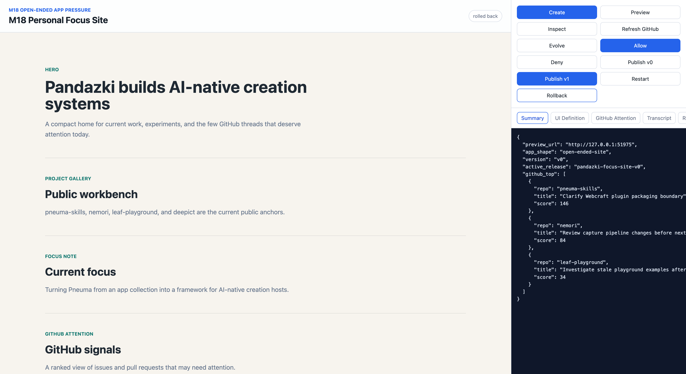

# Milestone 18 Snapshot: Open-Ended App Pressure

**Date:** 2026-05-04
**Status:** Closed after M18 implementation, live browser E2E, focused regression tests, and documentation review
**Audience:** teammates with zero Pneuma context
**Scope:** whether the Creation Host model and Operation-centered governance still hold for a less schema-shaped generated application.
**Chinese version:** [Milestone 18 Snapshot zh-CN](./milestone-18-snapshot.zh-CN.md)

## Executive Summary

M17 closed security and architecture acceptance. It also made one thing explicit:

> Release-candidate review would be premature if Pneuma only works for schema-driven queue/list apps.

M18 answered that pressure with a new example:

```text
Creation Host
  -> Generated Application: Personal Focus Site
  -> Published Application: a small maintainer home page
  -> dynamic module: GitHub attention for pandazki's public work
```

This is deliberately not another inbox, decision log, or table workflow. The end-user surface is a polished personal site with freeform sections, style tokens, routes, and a dynamic GitHub attention module. The Builder still sees the same host workflow: create, preview, inspect, evolve, approve, publish, restart, and rollback.

M18's conclusion:

> The current four-artifact model is still healthy. We do not need to invent a new core primitive before M19 release-candidate review, but open-ended UI definition should remain a watch item for future `Surface / Route / ComponentTree` work if more examples repeat the same shape.

## Browser Evidence



The screenshot captures the important teaching shape:

- left: the actual Generated Application preview, a personal site rather than a table/list tool;
- right: the Creation Host controls and inspector;
- summary evidence: `app_shape: "open-ended-site"`, active release `pandazki-focus-site-v0`, and top GitHub attention items from the deterministic pandazki fixture.

## What M18 Built

New canonical example:

```text
examples/m18-open-ended-personal-focus-site/
```

Its generated app is **Personal Focus Site / Maintainer Home**:

| Surface | What the End User sees |
|---|---|
| Hero | Pandazki's current work identity and focus |
| Project gallery | Public anchors: `pneuma-skills`, `nemori`, `leaf-playground`, `deepict` |
| Focus note | A narrative current-focus section |
| GitHub attention | Top 3 issues/PRs ranked by personal relevance and maintenance pressure |
| Contact | A lightweight follow-the-work section |

The app definition is not table-first. It contains:

```text
routes
sections
style tokens
dynamic modules
GitHub attention ranking config
```

The GitHub module intentionally stays inside the example/profile. GitHub is not promoted into framework core semantics.

## Proof Path

```text
create personal-focus-site-bun-sqlite
  -> preview v0 open-ended Personal Focus Site
  -> inspect UI definition and GitHub attention evidence
  -> evolve one Builder intent into one approval proposal
  -> approve v1 changes across section copy, style tokens, and ranking config
  -> publish v0
  -> publish v1
  -> restart active runtime and verify health/site API
  -> rollback to v0
```

This matters because the same host control loop now works for:

```text
schema-driven business apps   -> Knowledge Inbox, Team Decision Log
open-ended site app           -> Personal Focus Site
```

## GitHub Attention Fixture

M18 uses deterministic public-profile evidence for `pandazki` so the demo is repeatable without private auth.

Profile fixture:

```text
login: pandazki
display name: Pandazki
profile: https://github.com/pandazki
public repos: >= 80
pinned repositories: pneuma-skills, nemori, leaf-playground, deepict
```

Top ranked attention items:

| Rank | Item | Why it matters |
|---|---|---|
| 1 | `pneuma-skills #184` — Clarify Webcraft plugin packaging boundary | assigned / high personal relevance |
| 2 | `nemori #57` — Review capture pipeline changes before next release | review pressure |
| 3 | `leaf-playground #32` — Investigate stale playground examples after dependency bump | maintenance pressure |

Live GitHub auth is deliberately not part of the M18 claim. The point is framework shape, not GitHub OAuth.

## What Changed From v0 To v1

One Builder request:

```text
"Make GitHub attention more useful and highlight the top 3 things I should handle."
```

One proposal-level approval:

```text
rewrite hero and GitHub attention section copy
switch visual tone to editorial focus
rank GitHub attention by assignment, review request, mentions, priority labels, and recent activity
```

The approved evolution changes:

| Definition area | v0 | v1 |
|---|---|---|
| Sections | general GitHub signals | "What needs attention now" |
| Style tokens | calm personal site | editorial focus tone |
| GitHub ranking module | top 3 attention list | explicit signals: assigned, review requested, mentioned, priority label, recent activity |

This is the key M18 pressure: the governed change is not only adding a column, view, or query. It changes the app's UI definition and dynamic module behavior.

## Live Browser Bugs Found

The live browser pass caught two integration defects that unit tests alone did not make obvious:

| Defect | Fix |
|---|---|
| Re-clicking **Create** returned an error once the project already existed. | Create is now idempotent and reuses the existing generated app when the profile matches. |
| After rollback, server rollout state returned to v0 but the workbench iframe stayed on the stale v1 preview URL. | Rollback now syncs the preview iframe and summary to the active published URL. |

This is useful evidence for M19: the Reference Creation Host is testable enough that browser E2E finds real workflow defects.

## Verification Report

M18 focused tests:

```text
bun test examples/m18-open-ended-personal-focus-site

6 pass
0 fail
54 expect() calls
```

M16 regression:

```text
bun test examples/m16-reference-creation-host/run.test.ts

1 pass
0 fail
26 expect() calls
```

M18 smoke runner:

```text
bun run examples/m18-open-ended-personal-focus-site/run.ts --port 0 --smoke-exit

created generated app: pandazki-focus-site
preview + GitHub attention: passed
inspect UI definition: passed
evolution proposal: awaiting approval
evolution approval: completed
publish v0: active pandazki-focus-site-v0
publish v1: active pandazki-focus-site-v1 previous pandazki-focus-site-v0
restart: healthy
rollback: active pandazki-focus-site-v0
smoke verification: passed
```

Static checks:

```text
bun run typecheck
exit 0

git diff --check
exit 0
```

Full-suite caveat remains: M18 used focused M18/M16 coverage plus typecheck. It does not claim the entire historical Docker-heavy suite is green in one run.

## What Is Proven

| Claim | Evidence |
|---|---|
| The four-artifact model handles a non-table-first app | Personal Focus Site flows through Creation Host -> Generated Application -> Published Application. |
| The host workflow is not Knowledge-Inbox-specific | M18 has a different app surface and definition shape from Knowledge Inbox / Team Decision Log. |
| Open-ended UI definition can be inspected | Host exposes UI definition summary, routes, sections, style tokens, modules, and GitHub attention evidence. |
| One Builder intent can govern UI/module evolution | v1 changes section copy, style tokens, and GitHub ranking config behind one approval. |
| External data can stay profile-owned | GitHub ranking lives inside the M18 example/profile, not framework core. |
| Publish/restart/rollback still work | v0/v1 release state, active runtime restart, and rollback were verified by tests and browser E2E. |

## What Is Not Proven

M18 does not claim:

- a full Webflow/Webcraft editor;
- arbitrary code generation;
- drag-and-drop editing;
- GitHub OAuth or private issue access;
- generic external-source adapter protocol;
- production notification ingestion;
- hosted secret management;
- production traffic switching;
- Runtime Agent inside the published site;
- hot reload or custom component distribution.

## Strategic Read

M18 is not a product milestone. It is a framework-generalization gate.

Before M18, the project could be accused of overfitting to one shape:

```text
table
  -> list view
  -> governed operation
  -> publish
```

After M18, the stronger claim is:

```text
app definition can include open-ended UI/module state,
and the same Creation Host / approval / release workflow still holds.
```

That does not mean open-ended creation is solved forever. It means the next missing abstraction is not obvious enough to block release-candidate review. If M19 or post-RC dogfood repeatedly needs route trees, component trees, custom code handlers, or custom view components, that should become Stage 7 work rather than an emergency pre-RC rewrite.

## Next Milestone

M19 should now be **Release Candidate Review**.

The M19 question is:

> Given M1-M18 evidence, is pneuma-framework ready to tag a candidate release for developers building Creation Hosts?

M19 should avoid adding a large feature by default. It should review:

- project-goal alignment;
- API and package boundaries;
- docs navigation;
- getting-started / fresh-clone experience;
- M1-M18 example health;
- release tags and milestone provenance;
- whether open-ended pressure exposed a missing top-level primitive.

If M19 finds only polish gaps, tag the candidate and move hot reload, Runtime Agent, custom code, and broader Pneuma 2.x dogfood to post-RC milestones. If it finds a missing top-level abstraction, that becomes the real RC blocker.
