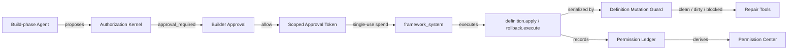

# Milestone 2 Snapshot: Enterprise Governance Evidence

**Date:** 2026-04-30
**Status:** Draft after M2.7 Permission Center v0
**Audience:** teammates with zero Pneuma context
**Scope:** what the governance hardening phase proves so far, why the design is shaped this way, and what remains outside the current claim.

中文摘要：

> M1 证明 app definition 可以作为 runtime primitive 被治理。M2 证明 AI-created software capability 不是 chat side effect，而是有 authority separation、approval token、durable ledger、policy semantics、recoverable mutation boundary 的企业级变更链路。

## Executive Summary

Milestone 2 moves the project from "the app can evolve" to "the app can evolve under an enterprise governance model."

The current proof chain is:

```text
Build-phase Agent proposes a software capability
  -> Authorization Kernel rejects direct mutation authority
  -> Builder sees an approval prompt
  -> framework mints a scoped, single-use approval token
  -> framework_system spends that token to execute the change
  -> definition mutation guard serializes the attempt
  -> framework verifies the observed app definition after restart
  -> permission ledger records request, approval, token hash, execution, and outcome
  -> repair tools block or explain dirty state instead of allowing silent half-success
  -> viewer receives a Permission Center read model with summary, filters, and authority proof
```

中文讲法：

```text
Agent 不是拿到无限权力去改 app；
Agent 只能提出变更。
Builder approval 不是一个 UI click，而是被转换成 scoped approval token。
真正执行的是 framework_system。
执行过程被 guard 包住：成功要验证，失败要变成可见的 dirty state。
这条链路被 ledger 记录，并且可以在 Permission Center 中被解释。
```

## M2 Thesis

> AI-created software capability must be governed as an enterprise change, not treated as a chat side effect.

M1 thesis was about the primitive:

```text
App definition is governed runtime data.
```

M2 thesis is about trust:

```text
AI can propose software changes, but authority to execute those changes is separated, scoped, recorded, explainable, and recoverably blocked when the definition state becomes untrusted.
```

The important product distinction:

| Weak version | M2 direction |
|---|---|
| "Agent asked, user clicked allow." | "Agent proposed, Builder approved, framework_system executed with a scoped token." |
| Prompt approval is only live UI state. | Approval becomes durable ledger evidence. |
| Security is a claim in docs. | Security is visible as records: who, what, why, token, executor, outcome. |
| Definition mutation either works or leaves mystery state. | Definition mutation ends clean, fails before mutation, or enters explicit dirty repair state. |
| Enterprise governance is postponed to a future admin console. | The primitive already carries the evidence an admin console needs later. |

## M2 Slice Ledger

| Slice | What it added | Governance question it answers |
|---|---|---|
| M2.0 Authorization Kernel | Static framework authority boundary and principal taxonomy | "Can the Agent do this by itself?" |
| M2.1 Approval Token Chain | Scoped, single-use execution handoff from Builder approval to `framework_system` | "What authorized execution?" |
| M2.2 Durable Permission Ledger | Append-only request / response / token / execution records | "Can we inspect what happened after reconnect or restart?" |
| M2.3 Governance Evidence Loop | Viewer-facing pending/recent approval read model | "Can a human understand the chain without reading logs?" |
| M2.4 Policy Lifecycle Design | Product model for mutable app policy as app definition | "Can policy change through the same governed primitive?" |
| M2.5 Policy Semantics | Explicit deny, deny-over-allow, default posture, rollback support | "Can policy behavior be explained instead of inferred?" |
| M2.6 Recoverable Mutation | Single in-process writer, durable dirty guard, repair status/reset | "Can failed definition mutation stop safely instead of silently half-succeeding?" |
| M2.7 Permission Center v0 | Ledger query, summary, viewer panel, and lifecycle demo integration | "Can a Builder/admin inspect AI-created software changes as a product surface?" |

## Evidence Chain

M2.0 to M2.7 deliberately separates seven responsibilities:



The eight questions the evidence record and repair state answer:

| Question | Evidence field or surface |
|---|---|
| Who asked? | `requested_principal` |
| What did they ask to change? | `tool`, `capability`, `target`, `target_fingerprint`, `detail` |
| Why was approval needed or execution allowed? | `authorization_reason_code` |
| Who approved? | `decided_by`, `approved_by` |
| What authorized execution? | `approval_token_hash`, `approved_capability`, `approval_token_expires_at_ms`, `approval_token_single_use` |
| Who executed? | `execution_principal` |
| What happened finally? | `status`, `completed_at_ms`, `message` |
| Is the app definition trusted after failure? | `definition.repair.status`, mutation guard `status`, `phase`, `error`, `last_known_good_summary` |

Raw approval token IDs are intentionally not exposed. The ledger records a hash and scoped metadata, enough to prove the execution chain without leaking bearer authority.

## What Is Proven So Far

| Layer | Current proof |
|---|---|
| Authority split | `build_agent` can propose; `framework_system` executes approved mutations. |
| Static framework boundary | Authorization Kernel encodes framework-level invariants that app policy cannot override. |
| Builder approval | `require_approval` paths produce approval prompts for definition mutation and rollback execution. |
| Scoped execution authority | Approval token carries app, workspace, capability, target fingerprint, TTL, and single-use semantics. |
| Durable ledger | Permission events are appended for request, response, token issuance, execution authorization or denial, completion, failure, and expiration. |
| Reconnect seed | Viewer reconnect receives `permission-ledger-state` with pending and recent records. |
| Evidence surface | `GovernanceEvidencePanel` still renders the compact chain: proposer, approver, token hash, executor, status. |
| Permission Center v0 | `permission_center` read model plus `PermissionCenterPanel` add summary counters, filters, search, approval actions, token proof, executor proof, and dirty-state callout support. |
| Policy lifecycle | `add_policy_rule`, `update_policy_rule`, `delete_policy_rule`, and `policy.explain` make app policy mutable, reversible, and explainable through the same app-definition primitive path. |
| Explicit policy semantics | `PolicyRule.effect=deny`, deny-over-allow precedence, `set_default_posture`, `pneuma_policy_settings`, and rollback support make policy behavior explainable as governed app-definition data. |
| Mutation serialization | One `definition.apply`, `definition.rollback.execute`, or repair attempt runs at a time inside one running framework process. |
| Dirty-state recovery boundary | Failed post-mutation verification marks the app definition dirty and blocks later definition mutation until repair. |
| Repair surface | `definition.repair.status` exposes clean/running/dirty state; `definition.repair.reset_to_last_good` clears dirty state only when the observed definition still matches the last known good summary. |
| Canonical demo | `capability-lifecycle&variant=governance` shows app evolution and the Permission Center side by side. |

## Demo Story

The M2 demo should be told from the outside, not from implementation order:

1. The left side is the end-user app: Reader Bookmarks.
2. The Builder asks the Agent to expose a new capability.
3. The Agent proposes a capability, but the Kernel does not let the Agent directly mutate the app.
4. The Builder approves the proposed change.
5. The framework mints a scoped approval token and executes as `framework_system`.
6. The app changes: schema/domain/API/view/policy become visible through the same M1 primitive path.
7. The right side shows Permission Center evidence: who proposed, who approved, what token authorized execution, who executed, and what final state the request reached.
8. The reliability appendix shows the failure story: if verification fails after mutation begins, the framework marks dirty state, blocks later mutation, and tells the Agent which repair tools to call.

This is the sentence the demo should make obvious:

> The AI can help create software, but the framework owns the authority boundary, audit evidence, and recovery boundary.

## Security Model

M2 is intentionally not "RBAC everywhere" as a slogan. The security model is more specific:

| Boundary | Meaning |
|---|---|
| Principal | Describes the actor: Builder, Build-phase Agent, Runtime Agent, End User, framework_system, extension. |
| Kernel | Static framework authority rules compiled into the framework at development time. |
| App policy | Runtime app-specific policy for end-user and app surface access; policy rows can now be added, updated, deleted, denied explicitly, rolled back, and explained. Default posture can also be changed as governed app-definition data. |
| Approval token | Scoped handoff from Builder approval to framework execution. |
| Mutation guard | Framework-owned reliability boundary for definition mutation attempts; it serializes attempts and records dirty state. |
| Ledger | Durable evidence of approval and execution, without raw token leakage. |
| Viewer evidence | Product-facing explanation of the ledger read model through Permission Center v0. |

This supports enterprise reasoning because denial, approval, and failed mutation are no longer opaque:

```text
Agent cannot apply definition directly
  because Kernel says build_agent lacks mutation authority.

Framework can apply definition after approval
  because Builder approved a capability + target and framework_system spent the matching token.

Framework blocks the next definition change after dirty failure
  because the last mutation did not verify cleanly and the app definition is not trusted.
```

## Still Not Claimed

This snapshot should not be read as a full enterprise security product claim.

Still open:

| Area | Not claimed yet |
|---|---|
| Production Permission Center | v0 has summary, search, filters, and request records; retention, admin workflows, bulk actions, assignment, and policy authoring are not implemented. |
| Multi-approver workflow | Current approval is single Builder approval. |
| Enterprise IAM | No SSO, SCIM, org sync, tenant RBAC import, or external policy engine integration. |
| Policy product surface | The policy model now has explicit deny and default posture, but there is no admin-facing Permission Center for authoring, review queues, assignment, or retention. |
| Cross-store transaction boundary | M2.6 detects and blocks ambiguous post-mutation failure; it is not an ACID transaction across definition row storage and app history. |
| Distributed concurrency | M2.6 serializes mutations inside one running framework process; it is not a distributed lock, database compare-and-swap, or multi-builder collaboration model. |
| Full automatic repair | `reset_to_last_good` is conservative; it does not yet do surgical compensation or guaranteed overlay restore for every partial failure. |
| Hot reload | Definition changes still rely on restart for the current supported flow. |
| Production threat model | Prompt injection, untrusted content, and extension supply-chain boundaries need a dedicated pass. |

## Next Decision Gate

M2.7 closes enough of the governance reliability loop for a team-facing M2 alignment checkpoint. The next decision should choose the first production-hardening workstream:

| Candidate | Why choose it next |
|---|---|
| Permission Center productization | Turns v0 inspection into admin workflows: queues, assignment, retention, bulk actions, policy authoring, and repair workflows. |
| Protocol hardening | Versioned envelopes, reconnect semantics, and durable replay for framework events. |
| Cross-store transaction and distributed concurrency | Moves from "detect and block ambiguous mutation" toward stronger production guarantees under multi-runtime pressure. |
| IAM and threat model | Decides how enterprise identity, org structure, external policy sources, untrusted content, and extension boundaries enter the framework without weakening the primitive boundary. |

Recommended framing:

```text
M1 proved the primitive.
M2 proves the governance chain.
M2.6 proves the chain does not silently continue from untrusted definition state.
M2.7 makes the chain inspectable as a product surface.
Next should pick the biggest gap between "team-demo trustworthy" and "enterprise-production trustworthy".
```
