# Milestone 2 Snapshot: Enterprise Governance Evidence

**Date:** 2026-04-30
**Status:** Draft after M2.5 policy semantics slice
**Audience:** teammates with zero Pneuma context
**Scope:** what the governance hardening phase proves so far, why the design is shaped this way, and what remains outside the current claim.

中文摘要：

> M1 证明 app definition 可以作为 runtime primitive 被治理。M2 证明 AI-created software capability 不是 chat side effect，而是有 authority separation、approval token、durable ledger、evidence surface 的企业级变更链路。

## Executive Summary

Milestone 2 moves the project from "the app can evolve" to "the app can evolve under an enterprise governance model."

The current proof chain is:

```text
Build-phase Agent proposes a software capability
  -> Authorization Kernel rejects direct mutation authority
  -> Builder sees an approval prompt
  -> framework mints a scoped, single-use approval token
  -> framework_system spends that token to execute the change
  -> permission ledger records request, approval, token hash, execution, and outcome
  -> viewer receives a governance evidence read model
  -> demo shows the same chain as an inspectable product surface
```

中文讲法：

```text
Agent 不是拿到无限权力去改 app；
Agent 只能提出变更。
Builder approval 不是一个 UI click，而是被转换成 scoped approval token。
真正执行的是 framework_system。
这条链路被 ledger 记录，并且可以在 viewer 中被解释。
```

## M2 Thesis

> AI-created software capability must be governed as an enterprise change, not treated as a chat side effect.

M1 thesis was about the primitive:

```text
App definition is governed runtime data.
```

M2 thesis is about trust:

```text
AI can propose software changes, but authority to execute those changes is separated, scoped, recorded, and explainable.
```

The important product distinction:

| Weak version | M2 direction |
|---|---|
| "Agent asked, user clicked allow." | "Agent proposed, Builder approved, framework_system executed with a scoped token." |
| Prompt approval is only live UI state. | Approval becomes durable ledger evidence. |
| Security is a claim in docs. | Security is visible as records: who, what, why, token, executor, outcome. |
| Enterprise governance is postponed to a future admin console. | The primitive already carries the evidence an admin console needs later. |

## Evidence Chain

M2.0 to M2.5 deliberately separates four responsibilities:

```mermaid
flowchart LR
  A["Build-phase Agent"] -->|"proposes"| B["Authorization Kernel"]
  B -->|"approval_required"| C["Builder Approval"]
  C -->|"allow"| D["Scoped Approval Token"]
  D -->|"single-use spend"| E["framework_system"]
  E -->|"executes"| F["definition.apply / rollback.execute"]
  F -->|"records"| G["Permission Ledger"]
  G -->|"derives"| H["Governance Evidence Panel"]
```



The seven questions the evidence record answers:

| Question | Evidence field |
|---|---|
| Who asked? | `requested_principal` |
| What did they ask to change? | `tool`, `capability`, `target`, `target_fingerprint`, `detail` |
| Why was approval needed or execution allowed? | `authorization_reason_code` |
| Who approved? | `decided_by`, `approved_by` |
| What authorized execution? | `approval_token_hash`, `approved_capability`, `approval_token_expires_at_ms`, `approval_token_single_use` |
| Who executed? | `execution_principal` |
| What happened finally? | `status`, `completed_at_ms`, `message` |

Raw approval token IDs are intentionally not exposed. The ledger records a hash and scoped metadata, enough to prove the execution chain without leaking bearer authority.

## What Is Proven So Far

| Layer | Current proof |
|---|---|
| Authority split | `build_agent` can propose; `framework_system` executes approved mutations. |
| Static framework boundary | Authorization Kernel encodes framework-level invariants that app policy cannot override. |
| Builder approval | `require_approval` paths produce approval prompts for definition mutation and rollback execution. |
| Scoped execution authority | Approval token carries app, workspace, capability, target fingerprint, TTL, and single-use semantics. |
| Durable ledger | Permission events are appended for request, response, token issuance, execution authorization or denial, completion, failure, and expiration. |
| Reconnect seed | Viewer reconnect receives `permission-ledger-state` with pending and recent records. |
| Evidence surface | `GovernanceEvidencePanel` renders pending/recent records as a compact chain: proposer, approver, token hash, executor, status. |
| Policy lifecycle | `add_policy_rule`, `update_policy_rule`, `delete_policy_rule`, and `policy.explain` make app policy mutable, reversible, and explainable through the same app-definition primitive path. |
| Explicit policy semantics | `PolicyRule.effect=deny`, deny-over-allow precedence, `set_default_posture`, `pneuma_policy_settings`, and rollback support make policy behavior explainable as governed app-definition data. |
| Canonical demo | `capability-lifecycle&variant=governance` shows app evolution and the governance evidence side by side. |

## Demo Story

The M2 demo should be told from the outside, not from implementation order:

1. The left side is the end-user app: Reader Bookmarks.
2. The Builder asks the Agent to expose a new capability.
3. The Agent proposes a capability, but the Kernel does not let the Agent directly mutate the app.
4. The Builder approves the proposed change.
5. The framework mints a scoped approval token and executes as `framework_system`.
6. The app changes: schema/domain/API/view/policy become visible through the same M1 primitive path.
7. The right side shows governance evidence: who proposed, who approved, what token authorized execution, who executed, and what final state the request reached.

This is the sentence the demo should make obvious:

> The AI can help create software, but the framework owns the authority boundary and the audit evidence.

## Security Model

M2 is intentionally not "RBAC everywhere" as a slogan. The security model is more specific:

| Boundary | Meaning |
|---|---|
| Principal | Describes the actor: Builder, Build-phase Agent, Runtime Agent, End User, framework_system, extension. |
| Kernel | Static framework authority rules compiled into the framework at development time. |
| App policy | Runtime app-specific policy for end-user and app surface access; policy rows can now be added, updated, deleted, denied explicitly, rolled back, and explained. Default posture can also be changed as governed app-definition data. |
| Approval token | Scoped handoff from Builder approval to framework execution. |
| Ledger | Durable evidence of approval and execution, without raw token leakage. |
| Viewer evidence | Product-facing explanation of the ledger read model. |

This supports enterprise reasoning because denial and approval are no longer opaque:

```text
Agent cannot apply definition directly
  because Kernel says build_agent lacks mutation authority.

Framework can apply definition after approval
  because Builder approved a capability + target and framework_system spent the matching token.
```

## Still Not Claimed

This snapshot should not be read as a full enterprise security product claim.

Still open:

| Area | Not claimed yet |
|---|---|
| Production Permission Center | Search, filters, retention, admin workflows, bulk actions, and assignment are not implemented. |
| Multi-approver workflow | Current approval is single Builder approval. |
| Enterprise IAM | No SSO, SCIM, org sync, tenant RBAC import, or external policy engine integration. |
| Policy product surface | The policy model now has explicit deny and default posture, but there is no admin-facing Permission Center for authoring, review queues, assignment, or retention. |
| Transaction boundary | Definition row writes and history writes are not yet one cross-store transaction. |
| Concurrency | Concurrent Builder/Agent definition writes still need serialization or database constraints. |
| Hot reload | Definition changes still rely on restart for the current supported flow. |
| Production threat model | Prompt injection, untrusted content, and extension supply-chain boundaries need a dedicated pass. |

## Next Decision Gate

M2.5 closes the current governance semantics loop enough for team alignment. The next decision should choose the first production-hardening workstream:

| Candidate | Why choose it next |
|---|---|
| Transaction and concurrency | Makes governed definition writes durable under real multi-user pressure. |
| Permission Center | Turns the evidence loop into an actual product surface for teams and admins. |
| Protocol hardening | Versioned envelopes, reconnect semantics, and durable replay for framework events. |
| IAM integration | Decides how enterprise identity, org structure, and external policy sources enter the framework without weakening the primitive boundary. |

Recommended framing:

```text
M1 proved the primitive.
M2 proves the governance chain.
M2 next should pick the biggest gap between "demo-trustworthy" and "enterprise-trustworthy".
```
