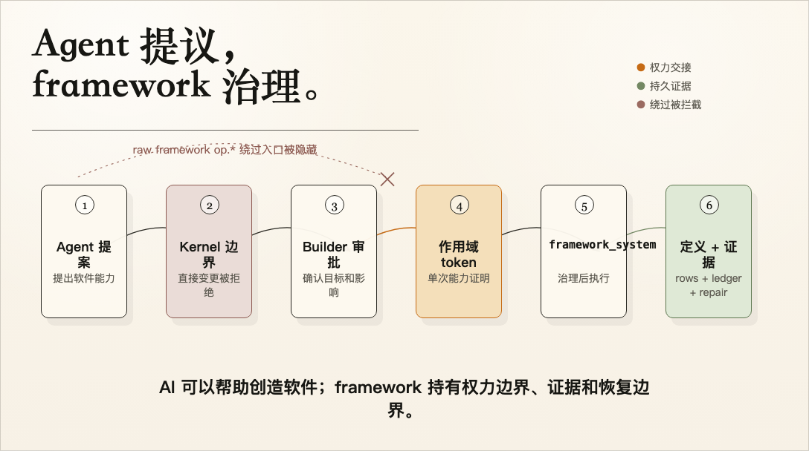
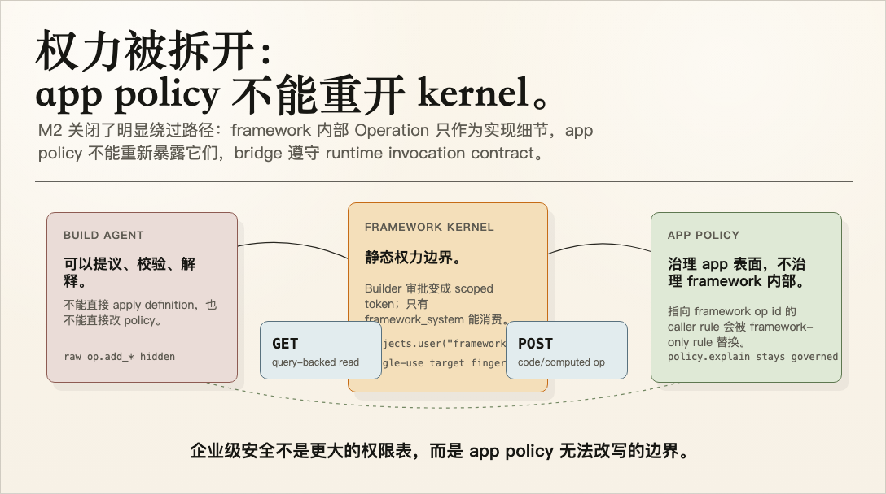
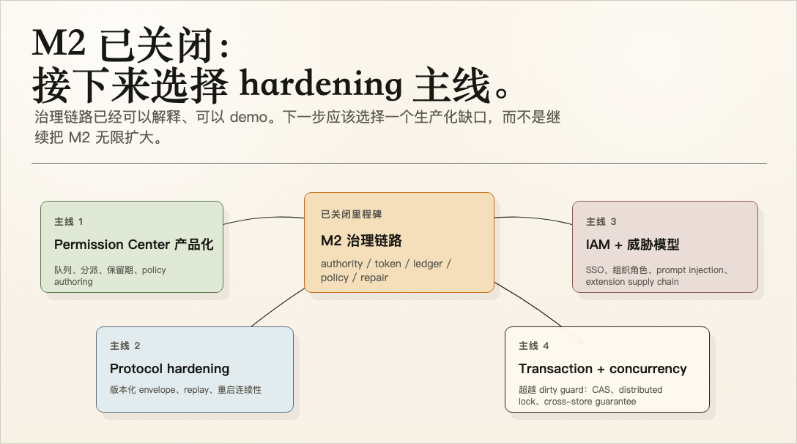

# Milestone 2 快照：企业级治理证据链

**日期：** 2026-04-30
**状态：** M2.8 closure hardening 后关闭
**受众：** 对 Pneuma 没有预备知识的团队同事
**范围：** 当前治理强化阶段已经证明了什么、为什么这样设计、以及哪些事情仍然不属于当前 claim。
**English version:** [Milestone 2 Snapshot](./milestone-2-snapshot.md)

## 摘要

M1 证明 app definition 可以作为 runtime primitive 被治理。M2 证明 AI-created software capability 不是 chat side effect，而是有 authority separation、approval token、durable ledger、policy semantics、recoverable mutation boundary 的企业级变更链路。

M2 把项目从：

```text
这个 app 可以被 Builder/Agent 改变
```

推进到：

```text
这个 app 可以在企业级治理模型下被 Builder/Agent 改变
```

当前证明链路是：

```text
Build-phase Agent 提出一个软件能力
  -> Authorization Kernel 拒绝直接 mutation authority
  -> raw framework implementation Operations 不暴露为 agent op.* tools
  -> Builder 看到 approval prompt
  -> framework mint 一个 scoped、single-use approval token
  -> framework_system 消费 token 执行变更
  -> definition mutation guard 串行化这次尝试
  -> framework 在 restart 后验证观察到的 app definition
  -> permission ledger 记录 request、approval、token hash、execution、outcome
  -> repair tools 阻止或解释 dirty state，而不是默默 half-success
  -> viewer 收到 Permission Center read model：summary、filters、authority proof
```



从左到右看，这就是 M2 的完整故事。AI 的价值在于它能提议和解释软件能力；framework 的可信度来自它持有 authority handoff、durable evidence 和 recovery boundary。

## M2 命题

> AI-created software capability 必须被当成 enterprise change 治理，而不是当成一次聊天副作用。

M1 的命题是 primitive：

```text
App definition is governed runtime data.
```

M2 的命题是 trust：

```text
AI 可以提议软件变更，但执行这件事的权力必须被拆开、限定、记录、解释；
当 definition state 不可信时，后续变更必须被可恢复地阻断。
```

产品表达上的差异很重要：

| 弱版本 | M2 方向 |
|---|---|
| “Agent 问了，用户点了 allow。” | “Agent 提议，Builder 批准，framework_system 用 scoped token 执行。” |
| Prompt approval 只是 live UI state。 | Approval 变成 durable ledger evidence。 |
| Security 是文档里的 claim。 | Security 可见为记录：谁、改什么、为什么、token、executor、结果。 |
| Definition mutation 成功或留下谜一样的状态。 | Definition mutation 要么 clean，要么 mutation 前失败，要么进入明确的 dirty repair state。 |
| Enterprise governance 推迟到未来 admin console。 | Primitive 已经携带未来 admin console 需要的证据。 |

## M2 Slice Ledger

| Slice | 新增内容 | 回答的治理问题 |
|---|---|---|
| M2.0 Authorization Kernel | 静态 framework authority boundary 和 principal taxonomy | “Agent 能不能自己做这件事？” |
| M2.1 Approval Token Chain | Builder approval 到 `framework_system` 的 scoped、single-use execution handoff | “是什么授权了执行？” |
| M2.2 Durable Permission Ledger | append-only request / response / token / execution records | “重连或重启后还能不能检查发生了什么？” |
| M2.3 Governance Evidence Loop | Viewer-facing pending/recent approval read model | “人类不用读 log 能不能理解这条链？” |
| M2.4 Policy Lifecycle Design | 把 mutable app policy 作为 app definition 的产品模型 | “policy change 能不能走同一个 governed primitive？” |
| M2.5 Policy Semantics | explicit deny、deny-over-allow、default posture、rollback support | “policy 行为能不能被解释，而不是靠猜？” |
| M2.6 Recoverable Mutation | 单进程 writer、durable dirty guard、repair status/reset | “definition mutation 失败时能不能停止，而不是默默 half-succeed？” |
| M2.7 Permission Center v0 | ledger query、summary、viewer panel、lifecycle demo integration | “Builder/admin 能不能把 AI-created software change 当作产品表面检查？” |
| M2.8 Closure Hardening | raw framework ops hidden from agent tools、framework op policy ownership、GET/POST bridge parity、Permission Center query parity | “治理链路会不会被实现细节绕过？” |

## 证据链

M2.0 到 M2.8 有意拆开了八个职责：

```mermaid
flowchart LR
  A["Build-phase Agent"] -->|"proposes"| B["Authorization Kernel"]
  B -->|"raw framework ops hidden"| C["Operation Surface Boundary"]
  C -->|"approval_required"| D["Builder Approval"]
  D -->|"allow"| E["Scoped Approval Token"]
  E -->|"single-use spend"| F["framework_system"]
  F -->|"executes"| G["definition.apply / rollback.execute"]
  G -->|"serialized by"| H["Definition Mutation Guard"]
  H -->|"clean / dirty / blocked"| I["Repair Tools"]
  G -->|"records"| J["Permission Ledger"]
  J -->|"derives"| K["Permission Center"]
```



证据记录和 repair state 回答这八个问题：

| 问题 | Evidence field / surface |
|---|---|
| 谁提出？ | `requested_principal` |
| 想改什么？ | `tool`, `capability`, `target`, `target_fingerprint`, `detail` |
| 为什么需要审批或允许执行？ | `authorization_reason_code` |
| 谁批准？ | `decided_by`, `approved_by` |
| 什么授权了执行？ | `approval_token_hash`, `approved_capability`, `approval_token_expires_at_ms`, `approval_token_single_use` |
| 谁执行？ | `execution_principal` |
| 最后发生了什么？ | `status`, `completed_at_ms`, `message` |
| 失败后 app definition 是否可信？ | `definition.repair.status`, mutation guard `status`, `phase`, `error`, `last_known_good_summary` |

Raw approval token id 不暴露。Ledger 只记录 hash 和 scoped metadata，足以证明执行链路，但不会泄漏 bearer authority。

## 当前已经证明什么

| Layer | 当前证明 |
|---|---|
| Authority split | `build_agent` 可以 propose；`framework_system` 执行已批准的 mutation。 |
| Static framework boundary | Authorization Kernel 编码 framework-level invariant，app policy 不能 override。 |
| Raw framework op boundary | Framework-internal Operations 是 `agent_callable=false`；`OperationToolBridge` 和 standalone MCP bridge 不把它们暴露为 raw `op.*` tools。 |
| Framework policy ownership | Framework policy injection 会用 framework-only invocation rules 替换 caller-provided rules targeting framework Operation ids。 |
| Builder approval | `require_approval` path 会为 definition mutation 和 rollback execution 产生 approval prompt。 |
| Scoped execution authority | Approval token 携带 app、workspace、capability、target fingerprint、TTL、single-use semantics。 |
| Durable ledger | permission events 会 append request、response、token issuance、execution authorization/denial、completion、failure、expiration。 |
| Reconnect seed | viewer reconnect 会收到 `permission-ledger-state`，包含 pending 和 recent records。 |
| Evidence surface | `GovernanceEvidencePanel` 继续渲染 compact chain：proposer、approver、token hash、executor、status。 |
| Permission Center v0 | `permission_center` read model + `PermissionCenterPanel` 提供 summary counters、filters、search、approval actions、token proof、executor proof、dirty-state callout。 |
| Permission Center query parity | Viewer-side filtering 现在 honors `target_kind`，和 ledger / seeded read model query surface 对齐。 |
| Agent/UI invocation parity | Agent bridges 消费 `invocation_method`：query-backed Operations 用 GET；code/computed Operations 用 POST。 |
| Policy lifecycle | `add_policy_rule`, `update_policy_rule`, `delete_policy_rule`, `policy.explain` 让 app policy 通过同一 app-definition primitive path 可变、可逆、可解释。 |
| Explicit policy semantics | `PolicyRule.effect=deny`、deny-over-allow precedence、`set_default_posture`、`pneuma_policy_settings`、rollback support 让 policy 行为成为可解释的 governed app-definition data。 |
| Mutation serialization | 一个 running framework process 内，同一时间只允许一个 `definition.apply`、`definition.rollback.execute` 或 repair attempt。 |
| Dirty-state recovery boundary | post-mutation verification 失败会把 app definition 标记为 dirty，并阻止后续 definition mutation，直到 repair。 |
| Repair surface | `definition.repair.status` 暴露 clean/running/dirty；`definition.repair.reset_to_last_good` 只在 observed definition 仍匹配 last known good summary 时清除 dirty state。 |
| Canonical demo | `capability-lifecycle&variant=governance` 并排展示 app evolution 和 Permission Center。 |

## Demo 叙事

M2 demo 应该从外部读者视角讲，不要从实现顺序讲：

1. 左边是 end-user app：Reader Bookmarks。
2. Builder 让 Agent 暴露一个新能力。
3. Agent 提出 capability，但 Kernel 不允许 Agent 直接 mutate app。
4. Builder 审批这次 proposed change。
5. framework mint scoped approval token，并以 `framework_system` 执行。
6. app 发生变化：schema/domain/API/view/policy 通过 M1 的 primitive path 变得可见。
7. 右边 Permission Center 展示证据：谁提出、谁批准、什么 token 授权执行、谁执行、请求最终到达什么状态。
8. reliability appendix 展示失败故事：如果 mutation 已开始但 verification 失败，framework 标记 dirty state，阻止后续 mutation，并告诉 Agent 应该调用什么 repair tool。

这句话应该是 demo 的核心：

> AI 可以帮助创造软件，但 framework 持有 authority boundary、audit evidence 和 recovery boundary。

## 安全模型

M2 不是把“企业级安全”泛化成一句 “RBAC everywhere”。这里的安全模型更具体：



| Boundary | 含义 |
|---|---|
| Principal | 描述 actor：Builder、Build-phase Agent、Runtime Agent、End User、framework_system、extension。 |
| Kernel | 在 framework 开发期编译进 framework 的静态 authority rules。 |
| App policy | runtime app-specific policy，用于 end-user 和 app surface access；policy rows 现在可以 add/update/delete、explicit deny、rollback、explain，default posture 也能作为 governed app-definition data 变更。 |
| Approval token | 从 Builder approval 到 framework execution 的 scoped handoff。 |
| Mutation guard | framework-owned reliability boundary；串行化 definition mutation attempt 并记录 dirty state。 |
| Ledger | approval 和 execution 的 durable evidence，不泄漏 raw token。 |
| Viewer evidence | 通过 Permission Center v0 把 ledger read model 变成 product-facing explanation。 |

企业级推理成立，是因为 denial、approval、failed mutation 都不再 opaque：

```text
Agent 不能直接 apply definition
  因为 Kernel 说 build_agent 没有 mutation authority。

Framework 可以在 approval 后 apply definition
  因为 Builder 批准了 capability + target，framework_system 消费了匹配 token。

Framework 在 dirty failure 后阻止下一次 definition change
  因为上一次 mutation 没有 cleanly verify，app definition 不可信。
```

## M2 Close Checklist

| Close criterion | 状态 | 证据 |
|---|---|---|
| Agent 不能直接 apply definition 或 mutate policy。 | Closed | Authorization Kernel deny `build_agent` direct execution；approval path 把 execution 交给 `framework_system`。 |
| Approval 有作用域且不可复用。 | Closed | Approval token 携带 capability、app、workspace、target fingerprint、TTL、single-use spend semantics。 |
| Raw framework implementation ops 不能绕过 approval。 | Closed | Framework ops 不 agent-callable，bridges skip 它们，framework policy injection 拥有它们的 invocation rules。 |
| App policy changes 是 governed app-definition data。 | Closed | `add/update/delete_policy_rule`、explicit deny、default posture、explain、rollback 都在同一 primitive path。 |
| Failed definition mutation 不会静默继续。 | Closed | Mutation guard 串行化 attempts，failed verification 后标记 dirty，并阻止后续 mutation 直到 repair。 |
| Governance evidence 对人可见。 | Closed | Ledger 记录 request/response/token/execution/outcome；Permission Center v0 暴露 summary、filters、records、proof。 |
| Agent tool-call path 匹配 runtime invocation contract。 | Closed | 两条 bridge 都按 `invocation_method`：query-backed Operations 用 GET，code/computed Operations 用 POST。 |
| M2 边界明确。 | Closed | “仍未 claim”保留 production IAM、multi-approver workflow、distributed concurrency、full repair。 |

## 仍未 Claim

这个 snapshot 不能被理解为“完整企业安全产品已经 ready”。

| Area | 尚未 claim |
|---|---|
| Production Permission Center | v0 有 summary、search、filters、request records；retention、admin workflows、bulk actions、assignment、policy authoring 未实现。 |
| Multi-approver workflow | 当前 approval 是 single Builder approval。 |
| Enterprise IAM | 没有 SSO、SCIM、org sync、tenant RBAC import、external policy engine integration。 |
| Policy product surface | policy model 已有 explicit deny 和 default posture，但还没有 admin-facing Permission Center 用于 authoring、review queues、assignment、retention。 |
| Cross-store transaction boundary | M2.6 能 detect/block ambiguous post-mutation failure；它不是 definition row storage 和 app_history 之间的 ACID transaction。 |
| Distributed concurrency | M2.6 只在单 running framework process 内串行化 mutation；不是 distributed lock、database compare-and-swap、multi-builder collaboration model。 |
| Full automatic repair | `reset_to_last_good` 很保守；还不能为所有 partial failure 做 surgical compensation 或 guaranteed overlay restore。 |
| Hot reload | 当前 supported flow 仍依赖 restart。 |
| Production threat model | Prompt injection、untrusted content、extension supply-chain boundary 需要专门过一遍。 |

## 下一道决策门

M2 已经可以用于团队分享。治理链路可以解释、可以 demo；下一步应该选择第一条 production-hardening workstream：



| Candidate | 为什么选择它 |
|---|---|
| Permission Center productization | 把 v0 inspection 变成 admin workflows：queues、assignment、retention、bulk actions、policy authoring、repair workflows。 |
| Protocol hardening | versioned envelopes、reconnect semantics、framework events durable replay。 |
| Cross-store transaction and distributed concurrency | 从 “detect and block ambiguous mutation” 走向 multi-runtime pressure 下更强的 production guarantees。 |
| IAM and threat model | 决定 enterprise identity、org structure、external policy sources、untrusted content、extension boundaries 如何进入 framework，而且不削弱 primitive boundary。 |

推荐团队分享收束语：

```text
M1 proved the primitive.
M2 proved the governance chain.
M2.6 proves the chain does not silently continue from untrusted definition state.
M2.7 makes the chain inspectable as a product surface.
M2.8 closes the obvious implementation bypasses around raw framework ops and method parity.
Next should pick the biggest gap between "team-demo trustworthy" and "enterprise-production trustworthy".
```
