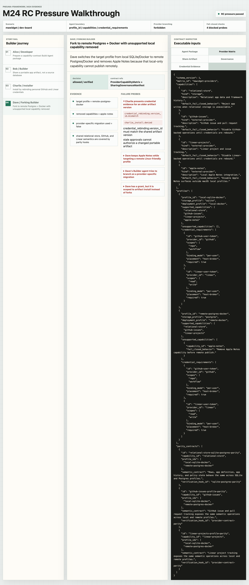

# Milestone 24 Snapshot: Creation Host RC Pressure

**Status:** Closed after executable RC pressure story, interactive walkthrough demo, positive and fail-closed tests, roadmap update, and package/typecheck verification.

**Date:** 2026-05-06

**Chinese version:** [milestone-24-snapshot.zh-CN.md](./milestone-24-snapshot.zh-CN.md)

## Why M24 Exists

M22 and M23 pinned the first Creation Host authoring and sharing governance contracts:

```text
Build Agent Package
Provider Capability Matrix
Share Artifact
Sharing Governance Manifest
Credential Rebinding Evidence
```

The remaining pre-RC question was whether those contracts could describe a realistic Developer-built Creation Host story instead of only validating isolated files.

M24 turns the mawidget / dev-board discussion into executable contract pressure:

```text
Alice builds a Creation Host.
Bob uses it to build dev-board with local SQLite + Docker.
Charlie installs Bob's default artifact and binds his own GitHub/Linear credentials.
Dave forks it to remote Postgres + Docker, removes Apple Notes, and keeps provider logic out of the Builder agent.
```

M24 does not build the mawidget desktop app, a marketplace, a real credential broker, a real Postgres adapter, or a production OAuth flow. It tests whether the framework contracts can carry the story cleanly.

## What Changed

### 1. Creation Host RC Pressure Story + Walkthrough

The M24 example defines local helpers:

```ts
buildDevBoardRcPressureScenario()
evaluateCreationHostRcPressure(scenario)
buildCreationHostRcWalkthrough()
```

These helpers live under `examples/m24-creation-host-rc-pressure-walkthrough/` and intentionally do **not** ship from `@pneuma-framework/core`. They consume public core contracts and validators as example/test evidence. The repo-level pressure tests import the same story model, so the browser walkthrough and automated tests cannot drift silently.

The walkthrough can be started with:

```bash
PATH="$HOME/.bun/bin:/opt/homebrew/bin:/usr/local/bin:$PATH" bun run examples/m24-creation-host-rc-pressure-walkthrough/run.ts --port 8885
```

Open English at `http://127.0.0.1:8885/` and Chinese at `http://127.0.0.1:8885/?lang=zh-CN`.

It exposes a review-console style UI:

- left rail: Alice / Bob / Charlie / Dave journey;
- center panel: current decision, contract references, and evidence;
- right inspector: Build Agent Package, Provider Capability Matrix, Share Artifact, Sharing Governance Manifest, and Credential Rebinding Evidence.




The story models:

- Alice's Developer-authored Build Agent Package;
- Bob's `dev-board` share artifact at version `v3`;
- local SQLite/Docker and remote Postgres/Docker provider profiles;
- GitHub and Linear credential requirements;
- Apple Notes as a local-only capability;
- Charlie install evidence;
- Dave fork evidence and target profile switch.

### 2. Capability-Contract Agent Boundary

M24 makes this rule executable:

```text
Builder-mode agent may see:
  profile_id
  capabilities
  credential_requirements

Builder-mode agent may not do:
  provider-specific implementation branches
  raw credential handling
  raw database/provider migration
```

This is the main answer to the Bob/Dave concern: the Build-phase Agent should work against Host-provided capability contracts. Alice's Creation Host owns provider compatibility, not Bob's agent session.

### 3. Provider Profile Parity Pressure

The M24 fixture requires parity contracts for every capability supported by both profiles:

```text
relational-store  -> SQLite/Postgres semantic parity
github-issues     -> GitHub tracking parity across profiles
linear-projects   -> Linear tracking parity across profiles
```

This keeps provider choice from becoming an implicit branch inside the Builder agent. If a Host supports both SQLite and Postgres, or both local and remote profiles, it must prove the same semantic capability at the Host contract layer.

### 4. Sharing/Forking Fail-Closed Tests

M24 adds tests and walkthrough failure probes that deny the scenario when:

- Charlie's credential rebinding evidence is for the wrong version;
- Dave forks without removing unsupported Apple Notes;
- Dave uses a provider-specific migration path;
- Dave's fork grant is scoped to `artifact` instead of `forks`.

These are deliberately negative tests. They show the framework contract fails closed in the places where a real team/org sharing product would otherwise become unsafe.

## Alice / Bob / Charlie / Dave After M24

```text
Alice prepares the Creation Host
  -> Build Agent Package says "capability-contract-only"
  -> Provider Capability Matrix defines local and remote profiles
  -> parity hooks prove shared capabilities behave the same

Bob creates and shares dev-board
  -> share artifact includes definition + init recipe + provider requirements
  -> share artifact excludes source database, secrets, and private derived cache
  -> governance manifest names Bob as owner

Charlie installs
  -> Host checks artifact-scoped install grant
  -> Host checks version-bound credential rebinding evidence
  -> Charlie binds his own GitHub/Linear refs

Dave forks
  -> Host checks forks-scoped fork grant
  -> Host checks remote profile compatibility
  -> Dave removes Apple Notes because the target profile does not support it
  -> no provider-specific migration path is used
```

## What M24 Proves

M24 proves the post-M23 contract set can describe a realistic Creation Host flow before candidate release:

```text
Creation Host authoring contract
  + sharing governance contract
  + provider capability parity
  + credential rebinding evidence
  + fail-closed fork/install decisions
  = enough contract surface for RC review
```

This is not a production-readiness claim. It is a release-candidate readiness pressure: the core model can now express the two big questions we identified:

- how a Developer prepares a Creation Host for Builder-owned agent sessions;
- how sharing/forking starts to work in multi-person and future team/org scenarios.

## Verification

M24 was verified with:

```bash
PATH="$HOME/.bun/bin:/opt/homebrew/bin:/usr/local/bin:$PATH" bun test tests/pressure/creation-host-rc-pressure.test.ts packages/core/test/developer-experience.test.ts packages/core/test/sharing-governance.test.ts
PATH="$HOME/.bun/bin:/opt/homebrew/bin:/usr/local/bin:$PATH" bun test tests/pressure/creation-host-rc-pressure.test.ts examples/m24-creation-host-rc-pressure-walkthrough/run.test.ts
PATH="$HOME/.bun/bin:/opt/homebrew/bin:/usr/local/bin:$PATH" bun run examples/m24-creation-host-rc-pressure-walkthrough/run.ts --smoke-exit
PATH="$HOME/.bun/bin:/opt/homebrew/bin:/usr/local/bin:$PATH" bun test packages/core-domain packages/core packages/cli
for p in packages/core-domain/tsconfig.json packages/runtime/tsconfig.json packages/provider-openrouter/tsconfig.json packages/adapter-linear/tsconfig.json packages/core/tsconfig.json packages/cli/tsconfig.json packages/backend-opencode/tsconfig.json packages/viewer-react/tsconfig.json templates/doc/viewer/tsconfig.json templates/ai-bookmarks/tsconfig.json templates/bookmarks-core-domain/tsconfig.json templates/knowledge-inbox-core-domain/tsconfig.json templates/weekly-linear-digest/tsconfig.json templates/ai-bookmarks-core-domain/tsconfig.json; do /opt/homebrew/bin/node node_modules/typescript/bin/tsc --noEmit -p "$p" || exit 1; done
git diff --check
```

## What Remains Before or After RC

The next decision can return to candidate release review.

Still not implemented, by design:

- real credential broker;
- real OAuth/account binding flow;
- signed artifact transport;
- marketplace/share server;
- product UI for install/fork governance;
- real Postgres adapter;
- real provider migration engine;
- team/org admin console.

Those are productization lanes. M24 closes the contract pressure lane.
