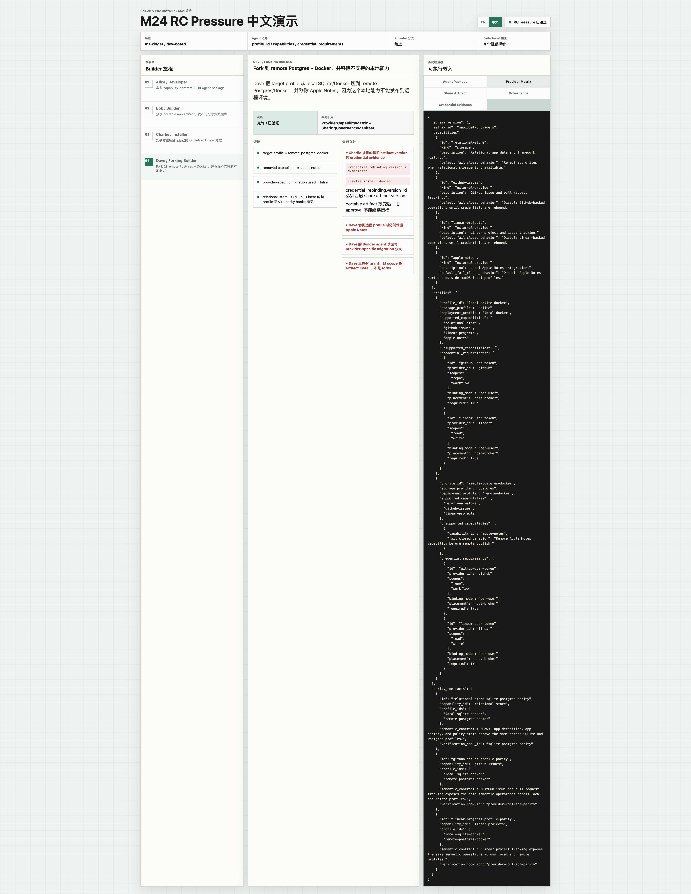

# Milestone 24 快照：Creation Host RC Pressure

**状态：** 已闭合。已完成可执行 RC pressure story、交互式 walkthrough demo、正向与 fail-closed 测试、roadmap 更新，以及 package/typecheck 验证。

**日期：** 2026-05-06

**英文版：** [milestone-24-snapshot.md](./milestone-24-snapshot.md)

## 为什么需要 M24

M22 和 M23 已经 pin 住第一版 Creation Host authoring 和 sharing governance contracts：

```text
Build Agent Package
Provider Capability Matrix
Share Artifact
Sharing Governance Manifest
Credential Rebinding Evidence
```

RC 前剩下的问题是：这些 contract 能不能描述一个真实的 Developer-built Creation Host 故事，而不是只会校验彼此孤立的文件。

M24 把 mawidget / dev-board 讨论变成可执行 contract pressure：

```text
Alice 构建一个 Creation Host。
Bob 用它创建 dev-board，选择 local SQLite + Docker。
Charlie 安装 Bob 的默认 artifact，并绑定自己的 GitHub/Linear credentials。
Dave fork 到 remote Postgres + Docker，移除 Apple Notes，并且不让 Builder agent 走 provider-specific 逻辑。
```

M24 不实现 mawidget 桌面应用、marketplace、真实 credential broker、真实 Postgres adapter 或生产 OAuth flow。它测试的是 framework contract 能不能干净承载这个故事。

## 改了什么

### 1. Creation Host RC Pressure Story + Walkthrough

M24 example 定义了本地 helper：

```ts
buildDevBoardRcPressureScenario()
evaluateCreationHostRcPressure(scenario)
buildCreationHostRcWalkthrough()
```

这些 helper 位于 `examples/m24-creation-host-rc-pressure-walkthrough/`，有意不从 `@pneuma-framework/core` 发布。它们只消费 core 已公开的 contracts 和 validators，作为 example/test evidence。repo-level pressure tests 会 import 同一份 story model，因此浏览器 walkthrough 和自动化测试不会悄悄漂移。

walkthrough 可以这样启动：

```bash
PATH="$HOME/.bun/bin:/opt/homebrew/bin:/usr/local/bin:$PATH" bun run examples/m24-creation-host-rc-pressure-walkthrough/run.ts --port 8885
```

英文版地址是 `http://127.0.0.1:8885/`，中文版地址是 `http://127.0.0.1:8885/?lang=zh-CN`。

它提供一个 review-console 风格的 UI：

- 左侧 rail：Alice / Bob / Charlie / Dave journey；
- 中间面板：当前 decision、contract references 和 evidence；
- 右侧 inspector：Build Agent Package、Provider Capability Matrix、Share Artifact、Sharing Governance Manifest 和 Credential Rebinding Evidence。



story 建模了：

- Alice 作为 Developer 准备的 Build Agent Package；
- Bob 的 `dev-board` share artifact，版本为 `v3`；
- local SQLite/Docker 与 remote Postgres/Docker provider profiles；
- GitHub 和 Linear credential requirements；
- Apple Notes 作为 local-only capability；
- Charlie 的 install evidence；
- Dave 的 fork evidence 与 target profile switch。

### 2. Capability-Contract Agent Boundary

M24 把这条规则变成了可执行测试：

```text
Builder-mode agent 可以看到：
  profile_id
  capabilities
  credential_requirements

Builder-mode agent 不可以做：
  provider-specific implementation branches
  raw credential handling
  raw database/provider migration
```

这是 Bob/Dave 问题的核心答案：Build-phase Agent 应该面向 Host 提供的 capability contracts 工作。provider compatibility 是 Alice 的 Creation Host 的职责，不是 Bob 这次 agent session 的职责。

### 3. Provider Profile Parity Pressure

M24 fixture 要求所有跨 profile 共同支持的 capability 都有 parity contract：

```text
relational-store  -> SQLite/Postgres semantic parity
github-issues     -> GitHub tracking parity across profiles
linear-projects   -> Linear tracking parity across profiles
```

这样 provider choice 就不会变成 Builder agent 里面的隐式分支。如果 Host 同时支持 SQLite 和 Postgres，或同时支持 local 和 remote profile，它必须在 Host contract 层证明同一个 semantic capability。

### 4. Sharing/Forking Fail-Closed Tests

M24 增加了以下拒绝测试和 walkthrough failure probes：

- Charlie 的 credential rebinding evidence 指向错误 version；
- Dave fork 时没有移除 unsupported Apple Notes；
- Dave 使用了 provider-specific migration path；
- Dave 的 fork grant 被错误地标成 `artifact` scope，而不是 `forks` scope。

这些负例是有意设计的。它们证明在真实 team/org sharing product 里容易变危险的位置，framework contract 会 fail closed。

## M24 后的 Alice / Bob / Charlie / Dave

```text
Alice 准备 Creation Host
  -> Build Agent Package 写明 "capability-contract-only"
  -> Provider Capability Matrix 定义 local 和 remote profiles
  -> parity hooks 证明 shared capabilities 行为一致

Bob 创建并分享 dev-board
  -> share artifact 包含 definition + init recipe + provider requirements
  -> share artifact 排除 source database、secrets、private derived cache
  -> governance manifest 把 Bob 记为 owner

Charlie 安装
  -> Host 检查 artifact-scoped install grant
  -> Host 检查 version-bound credential rebinding evidence
  -> Charlie 绑定自己的 GitHub/Linear refs

Dave fork
  -> Host 检查 forks-scoped fork grant
  -> Host 检查 remote profile compatibility
  -> Dave 移除 Apple Notes，因为目标 profile 不支持它
  -> 不使用 provider-specific migration path
```

## M24 证明了什么

M24 证明 post-M23 contract set 已经可以在 candidate release 前描述一个真实 Creation Host flow：

```text
Creation Host authoring contract
  + sharing governance contract
  + provider capability parity
  + credential rebinding evidence
  + fail-closed fork/install decisions
  = enough contract surface for RC review
```

这不是 production-readiness claim。它是 release-candidate readiness pressure：核心模型现在可以表达我们识别出的两个大问题：

- Developer 如何为 Builder-owned agent sessions 准备 Creation Host；
- sharing/forking 如何走向多人以及未来 team/org 场景。

## Verification

M24 使用以下命令验证：

```bash
PATH="$HOME/.bun/bin:/opt/homebrew/bin:/usr/local/bin:$PATH" bun test tests/pressure/creation-host-rc-pressure.test.ts packages/core/test/developer-experience.test.ts packages/core/test/sharing-governance.test.ts
PATH="$HOME/.bun/bin:/opt/homebrew/bin:/usr/local/bin:$PATH" bun test tests/pressure/creation-host-rc-pressure.test.ts examples/m24-creation-host-rc-pressure-walkthrough/run.test.ts
PATH="$HOME/.bun/bin:/opt/homebrew/bin:/usr/local/bin:$PATH" bun run examples/m24-creation-host-rc-pressure-walkthrough/run.ts --smoke-exit
PATH="$HOME/.bun/bin:/opt/homebrew/bin:/usr/local/bin:$PATH" bun test packages/core-domain packages/core packages/cli
for p in packages/core-domain/tsconfig.json packages/runtime/tsconfig.json packages/provider-openrouter/tsconfig.json packages/adapter-linear/tsconfig.json packages/core/tsconfig.json packages/cli/tsconfig.json packages/backend-opencode/tsconfig.json packages/viewer-react/tsconfig.json templates/doc/viewer/tsconfig.json templates/ai-bookmarks/tsconfig.json templates/bookmarks-core-domain/tsconfig.json templates/knowledge-inbox-core-domain/tsconfig.json templates/weekly-linear-digest/tsconfig.json templates/ai-bookmarks-core-domain/tsconfig.json; do /opt/homebrew/bin/node node_modules/typescript/bin/tsc --noEmit -p "$p" || exit 1; done
git diff --check
```

## RC 前后仍然没做什么

下一步可以回到 candidate release review。

以下内容仍然没有实现，这是有意的：

- 真实 credential broker；
- 真实 OAuth/account binding flow；
- signed artifact transport；
- marketplace/share server；
- install/fork governance 的产品 UI；
- 真实 Postgres adapter；
- 真实 provider migration engine；
- team/org admin console。

这些是 productization lanes。M24 关闭的是 contract pressure lane。
