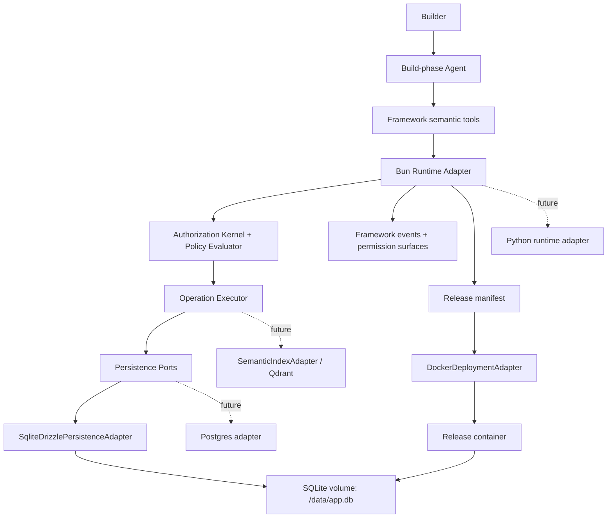

# M3 Deployable App Substrate Design

**Date:** 2026-05-01
**Status:** Design input accepted; implementation outcome is summarized in [M3 snapshot](./milestone-3-snapshot.md)
**Milestone:** M3 — Deployable App Substrate Prototype
**Scope:** first real deployable substrate after M1/M2; preserved as design rationale, not the current state summary.
**中文版：** [M3 可部署 App Substrate 设计](./milestone-3-deployable-substrate-design.zh-CN.md)

中文摘要：

> M1 证明 app definition 可以作为 framework primitive 被治理；M2 证明 AI-created software capability 可以进入一条可解释的治理链。M3 不继续把 enterprise security 做满，而是转向真实 substrate：一个有真实 backend、真实持久化、真实 release artifact、Docker 打包和重启持久性的可运行 pneuma-app 原型。目标是用真实实现反查抽象，而不是在 demo runtime 上继续加抽象。

## Thesis

M3 should prove:

```text
A Builder/Agent-created app capability can be persisted, packaged, run, restarted,
and still be explainable through the same framework primitive model.
```

This is deliberately different from the post-M2 enterprise-hardening path.

```text
M1 proved the primitive.
M2 proved the governance chain.
M3 should prove a deployable app substrate.
```

The project should pause full enterprise security hardening until a real app substrate exists. Otherwise we risk polishing governance abstractions on top of a demo runtime and only later discovering that real persistence, release packaging, and deployment reshape the foundation.

## Why This Pivot Now

M2 leaves a tempting next step: production Permission Center, IAM, threat model, distributed concurrency, and stronger protocol replay. Those are real needs, but they are not the highest-leverage next proof.

The current larger risk is:

> Do Pneuma's primitives survive contact with a real backend, real database, real migration system, and real deployable artifact?

M3 is the first pressure test for that question.

## Non-Goals

M3 intentionally does **not** claim:

- Production enterprise IAM, SSO, SCIM, org sync, or external policy engine integration.
- Multi-tenant SaaS isolation.
- Multi-approver approval workflow.
- Distributed locks or cross-store ACID guarantees.
- Production-grade Permission Center workflows.
- Qdrant or any vector database implementation.
- Postgres adapter implementation.
- Python runtime implementation.
- Worker / scheduler / supervisor implementation.
- Full hot reload.
- Builder-authored arbitrary code handler sandbox.

M3 may reserve extension points for these; it should not implement them.

## Chosen First Implementation

M3 chooses a concrete, simple first substrate:

| Layer | M3 choice | Why |
|---|---|---|
| Backend runtime | Bun + TypeScript | Already matches repo/tooling; fastest path to a real backend without framework churn. |
| HTTP server | minimal Bun server | Avoid premature web framework choice; keep runtime contract visible. |
| Physical database | SQLite file under a volume | Real persistence, easy local/dev/release story, low operational overhead. |
| Migration tooling | Drizzle + drizzle-kit | Mature TS ecosystem path for schema definitions and SQL migrations. |
| Release target | Docker image + volume | First deployable artifact; easy to verify restart persistence. |
| Reference app | Reader Bookmarks / Knowledge Inbox continuation | Keeps cognitive load low; pressure is substrate, not a new product story. |
| Scaffold | thin reference scaffold | Enough structure for an agent to extend; not yet a polished generator. |

These are implementation choices, not framework semantics.

## Guardrails

### 1. Implementation Choice, Not Semantic Boundary

The following must not leak into the framework domain model:

```text
Bun.serve
Drizzle table objects
SQLite file paths
Docker image layout
TypeScript-only helper types
```

They belong behind adapters, manifests, and ports. Pneuma concepts remain:

```text
Table
CellType
Operation
View
PolicyRule
app_history
permission ledger
framework events
runtime / lifecycle contracts
```

### 2. Protocol-First Runtime

Future Python support becomes plausible only if the runtime contract is protocol-level, not TS-library-level.

Stable contracts:

```text
/healthz
/api/config
Operation invocation
framework operation endpoints
framework events
permission prompt / ledger surfaces
lifecycle scripts
release manifest
```

Possible future implementations:

```text
BunRuntimeAdapter
PythonRuntimeAdapter
GoRuntimeAdapter
```

M3 implements only Bun/TS, but the design must not imply that a pneuma-app backend must be TypeScript forever.

### 3. Storage-Port-First Persistence

Drizzle manages the first physical schema. It does not define the domain model.

The framework should depend on ports such as:

```text
DefinitionStore
RowStore
HistoryStore
PermissionLedgerStore
MigrationStore
```

M3 implementation:

```text
SqliteDrizzlePersistenceAdapter
```

Future implementation:

```text
PostgresDrizzlePersistenceAdapter
PythonPostgresPersistenceAdapter
```

M3 physical schema should stay portable:

- Prefer text ids, integer timestamps, JSON text, explicit indexes.
- Avoid domain dependence on SQLite rowid, file paths, dialect-specific upsert behavior, or SQLite-only locking semantics.
- Treat SQLite single-process behavior as an M3 constraint, not a permanent architecture assumption.

### 4. App Definition Is Runtime Data, Not Database Migration

Drizzle migrations manage framework-owned physical schema:

```text
framework physical tables
app row/cell storage
system-owned definition tables
app_history
permission ledger
migration metadata
```

Builder/Agent definition evolution remains runtime governed data:

```text
add_table
add_table_column
add_operation
add_view
add_policy_rule
```

These do **not** become Drizzle migrations. A Builder saying "add a column" should not generate and apply physical DDL. The first real substrate should preserve the M1/M2 model:

```text
physical SQLite schema:
  pneuma_tables
  pneuma_table_columns
  pneuma_operations
  pneuma_views
  pneuma_policy_rules
  app_rows
  app_cells
  app_history
  permission_ledger
```

This keeps runtime app creation governed, reversible, and portable.

### 5. Relational Source Of Truth, Vector As Derived Index

Future Qdrant support should be modeled as:

```text
SemanticIndexAdapter
```

not:

```text
StorageService replacement
```

Relational storage remains source of truth:

```text
rows
cells
definition rows
app_history
permission ledger
document metadata
vector index metadata
```

Qdrant or another vector store would hold derived index state:

```text
collection
point id
vector
payload
source row id
source cell id
embedding model
embedding version
chunk range
```

Semantic retrieval flow:

```text
row / cell changed
  -> persist source data in relational DB
  -> enqueue indexing job
  -> embed chunk
  -> upsert point to vector store
  -> semantic query returns source row/cell ids
  -> framework evaluates policy against source rows
  -> return allowed results
```

The vector index answers "what is semantically relevant?" It must not answer "is this user allowed to see it?"

### 6. Artifact-First Deployment

M3 is Docker-first, not Docker-semantic.

Framework deploy semantics should be:

```text
deploy = produce a release artifact + run it under a target runtime
```

Docker is the first deployment adapter:

```text
DockerDeploymentAdapter
```

Future adapters might target:

```text
local process
Fly.io / Render / Railway
Cloud Run
Kubernetes
serverless / edge, if constraints allow
```

The release artifact should describe:

```text
build output
backend entry
static assets
migrations
runtime config contract
process manifest
healthcheck
data directory / volume expectation
```

### 7. Process-Model-First Runtime

M3 should not hard-code "a pneuma-app is one HTTP server forever."

The process model should allow:

```text
web
worker
scheduler
supervisor
```

M3 implements only:

```text
web
```

But the manifest should leave room for:

```json
{
  "processes": {
    "web": {
      "command": "bun run start",
      "health": "/healthz"
    },
    "worker": {
      "command": "bun run worker",
      "optional": true
    }
  }
}
```

This matters because future background responsibilities are likely:

- semantic indexing worker
- embedding queue consumer
- scheduled sync
- adapter webhook reconciliation
- outbox retry
- checkpoint compaction
- history cleanup
- permission ledger retention
- deployment health monitor
- agent session supervisor

M3 may use an in-process queue only if needed. It should not implement a full worker system.

### 8. Thin Scaffold, Not Full Generator

M3 should explore whether an agent needs a scaffold to start developing a pneuma-app.

Recommended stance:

```text
Provide a reference scaffold template.
Do not build create-pneuma-app yet.
Do not ask the agent to start fully from scratch.
```

Reasoning:

- Fully from scratch tests the agent's random engineering skill more than the framework.
- A heavy generator prematurely freezes the wrong abstractions.
- A thin scaffold gives enough structure for repeatability while keeping design pressure visible.

M3 scaffold should include:

```text
backend entry
storage adapter wiring
migration command
lifecycle scripts
release manifest
Dockerfile
docker-compose.yml
README contract
minimal app viewer
seed data hook
```

## Proposed Architecture



## M3 Acceptance Demo

The demo should prove persistence and packaging, not just UI motion:

```text
1. Start dev mode with Bun backend and SQLite database.
2. Seed Reader Bookmarks / Knowledge Inbox data.
3. Builder asks Agent to add a capability.
4. definition.apply writes definition rows and app_history to SQLite.
5. Runtime restarts or refreshes and /api/config exposes the new capability.
6. Data, definition rows, app_history, and permission ledger are visible in SQLite.
7. Build release artifact.
8. Build Docker image.
9. Run container with mounted volume.
10. Restart container.
11. Verify data and Builder-created capability still exist.
12. Rollback supported definition rows and verify persistence after restart.
```

Success sentence:

> A Builder/Agent-created capability survives build, Docker packaging, container restart, and still remains inspectable through Pneuma primitives.

## Slice Plan

This is not the implementation plan yet, but it suggests the implementation order:

| Slice | Goal | Exit evidence |
|---|---|---|
| M3.0 Design close | Lock substrate boundaries and non-goals | this document reviewed and accepted |
| M3.1 Persistence ports | Introduce DefinitionStore / RowStore / HistoryStore / PermissionLedgerStore ports | existing tests can target a memory adapter and a SQLite adapter shape |
| M3.2 SQLite + Drizzle migration | Add physical SQLite schema and migration command | fresh DB can migrate; schema is inspectable; no Builder definition DDL |
| M3.3 Bun backend substrate | Run minimal real backend over persistence ports | `/healthz`, `/api/config`, operation invocation, definition rows persist |
| M3.4 Reference scaffold | Add thin scaffold around backend/viewer/lifecycle | agent has a repeatable starting structure |
| M3.5 Release artifact | Produce release manifest and build output | artifact can be inspected independent of Docker |
| M3.6 Docker adapter | Package and run the app with SQLite volume | container restart keeps data/definition/history/ledger |
| M3.7 End-to-end prototype demo | Full dev-to-release loop | scripted smoke test + team-readable demo runbook |

## Testing Strategy

M3 should be test-heavy at the substrate boundaries:

| Test layer | What to prove |
|---|---|
| Port contract tests | memory and SQLite implementations satisfy the same store semantics |
| Migration tests | empty DB migrates; repeated migration is safe; schema version is recorded |
| Persistence tests | rows, cells, definition rows, app_history, permission ledger survive process restart |
| Runtime tests | `/api/config` and operation invocation read from persistent store |
| Lifecycle tests | setup/dev/build/migrate/package commands produce expected artifacts |
| Docker smoke | container starts, healthcheck passes, mounted volume persists app state |
| E2E demo | Builder-created capability survives release packaging and restart |

## Key Tradeoffs

| Decision | Benefit | Cost |
|---|---|---|
| SQLite first | Simple real persistence; easy Docker volume demo | Single-process constraint; not enough for production multi-runtime |
| Drizzle first | TS-native schema + migration path | Must prevent Drizzle object leakage into domain |
| Docker first | Easy release artifact proof | Must avoid defining deploy as Docker-only |
| Thin scaffold | Good agent starting point without premature generator | Less polished developer experience |
| No Qdrant in M3 | Keeps source-of-truth boundary clean | Semantic search pressure deferred |
| No worker in M3 | Keeps prototype focused | Background process model remains untested |

## Open Questions For Review

These should be answered before implementation planning:

1. Should the M3 reference app remain **Reader Bookmarks**, or be renamed/reframed as **Knowledge Inbox** while keeping the same primitive story?
2. Should the first SQLite schema use a pure row/cell EAV shape, or a hybrid with a small number of typed JSON columns for performance and readability?
3. Should release artifact generation be a framework command, a lifecycle script, or both?
4. Should Docker packaging live under the reference app scaffold or under a framework deployment adapter package?
5. Should the M3 smoke test use the existing p5 viewer approval E2E harness, or a new deployable-substrate E2E harness?

## Recommended M3 Boundary

M3 is complete when the team can see one real flow:

```text
dev mode
  -> Builder/Agent creates capability
  -> SQLite persists app data + app definition + history + ledger
  -> build release artifact
  -> Docker image runs with volume
  -> restart keeps data and capability
  -> framework still explains and rolls back the supported definition rows
```

M3 is not complete if the result is only another browser demo with in-memory state.

M3 is also not complete if the implementation works only by baking SQLite, Bun, Drizzle, or Docker into the framework's conceptual model.
