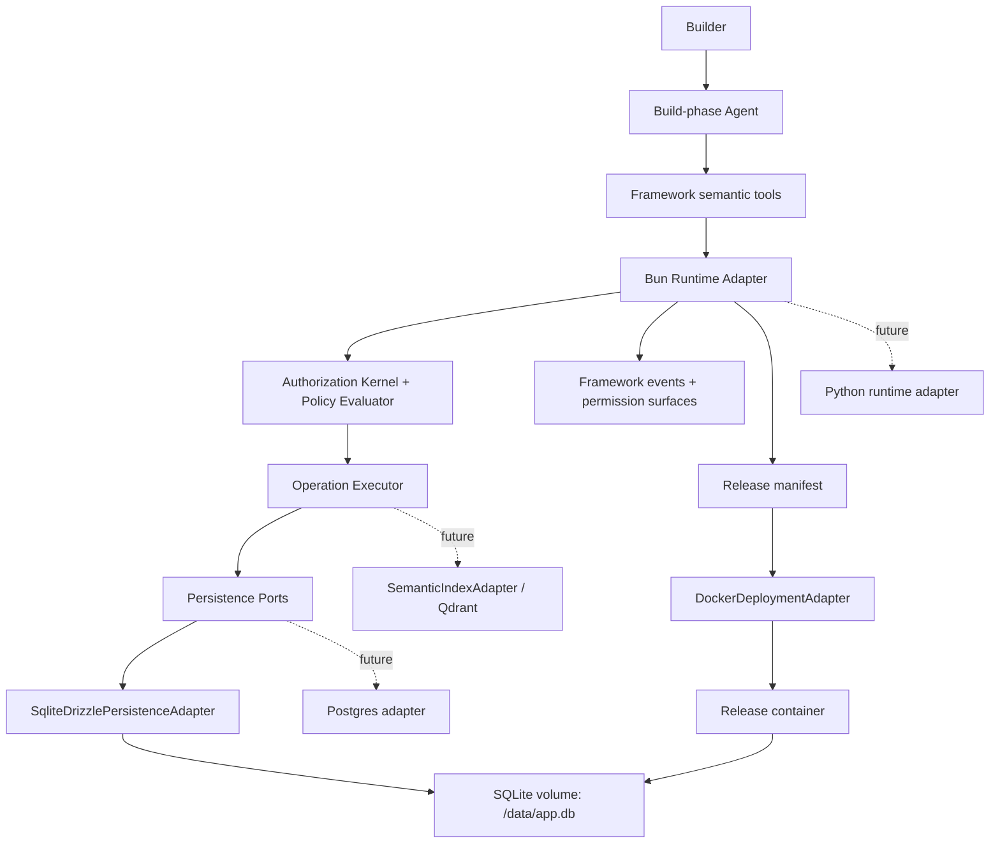

# M3 可部署 App Substrate 设计

**日期：** 2026-05-01
**状态：** Design input accepted；实现结果见 [M3 snapshot](./milestone-3-snapshot.zh-CN.md)
**Milestone：** M3 — Deployable App Substrate Prototype
**范围：** M1/M2 之后的第一个真实可部署 substrate；作为设计推理保留，不再作为当前状态总结。
**English version:** [M3 Deployable App Substrate Design](./milestone-3-deployable-substrate-design.md)

## 中文摘要

M1 证明 app definition 可以作为 framework primitive 被治理；M2 证明 AI-created software capability 可以进入一条可解释的治理链。M3 不继续把 enterprise security 做满，而是转向真实 substrate：一个有真实 backend、真实持久化、真实 release artifact、Docker 打包和重启持久性的可运行 pneuma-app 原型。

目标是用真实实现反查抽象，而不是在 demo runtime 上继续加抽象。

## 命题

M3 应该证明：

```text
Builder/Agent 创造出的 app capability 可以被持久化、打包、运行、重启，
并且仍然能通过同一套 framework primitive 被解释。
```

这和 M2 之后继续做 enterprise hardening 是两条不同路线。

```text
M1 proved the primitive.
M2 proved the governance chain.
M3 should prove a deployable app substrate.
```

在真实 app substrate 存在之前，项目应该暂停 full enterprise security hardening。否则我们可能会在 demo runtime 上把治理抽象打磨得很漂亮，最后才发现真实 persistence、release packaging、deployment 会反过来改变地基。

## 为什么现在转向

M2 之后有一个很自然的诱惑：继续做 production Permission Center、IAM、threat model、distributed concurrency、更强的 protocol replay。这些都是真问题，但不是最高杠杆的下一步证明。

当前更大的风险是：

> Pneuma 的 primitives 碰到真实 backend、真实数据库、真实 migration system、真实 deployable artifact 后，还成立吗？

M3 是这件事的第一次压力测试。

## 非目标

M3 明确不 claim：

- Production enterprise IAM、SSO、SCIM、org sync、external policy engine integration。
- Multi-tenant SaaS isolation。
- Multi-approver approval workflow。
- Distributed locks 或 cross-store ACID guarantees。
- Production-grade Permission Center workflows。
- Qdrant 或任何 vector database implementation。
- Postgres adapter implementation。
- Python runtime implementation。
- Worker / scheduler / supervisor implementation。
- Full hot reload。
- Builder-authored arbitrary code handler sandbox。

M3 可以为这些事情预留 extension point，但不实现它们。

## 第一版实现选择

M3 选择一个具体、简单的第一版 substrate：

| Layer | M3 choice | Why |
|---|---|---|
| Backend runtime | Bun + TypeScript | 和当前 repo/tooling 匹配；最快获得真实 backend，不引入 framework churn。 |
| HTTP server | minimal Bun server | 避免过早选择 web framework；让 runtime contract 保持可见。 |
| Physical database | SQLite file under a volume | 真实持久化；local/dev/release story 简单；运维负担低。 |
| Migration tooling | Drizzle + drizzle-kit | TS 生态里成熟的 schema definition + SQL migration 路径。 |
| Release target | Docker image + volume | 第一个 deployable artifact；容易验证 restart persistence。 |
| Reference app | Reader Bookmarks / Knowledge Inbox continuation | 降低认知负担；压力在 substrate，不在新产品故事。 |
| Scaffold | thin reference scaffold | 给 agent 足够结构去扩展；暂时不是 polished generator。 |

这些是 implementation choices，不是 framework semantics。

## 设计护栏

### 1. Implementation Choice, Not Semantic Boundary

下面这些不能泄漏到 framework domain model：

```text
Bun.serve
Drizzle table objects
SQLite file paths
Docker image layout
TypeScript-only helper types
```

它们应该留在 adapters、manifests、ports 后面。Pneuma concepts 仍然是：

```text
Table
CellType
Operation
View
PolicyRule
app_history
permission ledger
framework events
runtime / lifecycle contracts
```

### 2. Protocol-First Runtime

未来要支持 Python，前提是 runtime contract 是 protocol-level，而不是 TS-library-level。

稳定 contract 应该是：

```text
/healthz
/api/config
Operation invocation
framework operation endpoints
framework events
permission prompt / ledger surfaces
lifecycle scripts
release manifest
```

未来实现可以是：

```text
BunRuntimeAdapter
PythonRuntimeAdapter
GoRuntimeAdapter
```

M3 只实现 Bun/TS，但设计不能暗示 pneuma-app backend 永远必须是 TypeScript。

### 3. Storage-Port-First Persistence

Drizzle 管第一版 physical schema。它不定义 domain model。

Framework 应该依赖这些 ports：

```text
DefinitionStore
RowStore
HistoryStore
PermissionLedgerStore
MigrationStore
```

M3 implementation：

```text
SqliteDrizzlePersistenceAdapter
```

未来 implementation：

```text
PostgresDrizzlePersistenceAdapter
PythonPostgresPersistenceAdapter
```

M3 physical schema 应保持 portable：

- Prefer text ids、integer timestamps、JSON text、explicit indexes。
- 避免 domain 依赖 SQLite rowid、file paths、dialect-specific upsert behavior、SQLite-only locking semantics。
- 把 SQLite single-process behavior 视为 M3 constraint，不是永久 architecture assumption。

### 4. App Definition Is Runtime Data, Not Database Migration

Drizzle migrations 管 framework-owned physical schema：

```text
framework physical tables
app row/cell storage
system-owned definition tables
app_history
permission ledger
migration metadata
```

Builder/Agent definition evolution 仍然是 runtime governed data：

```text
add_table
add_table_column
add_operation
add_view
add_policy_rule
```

这些不变成 Drizzle migrations。Builder 说 “add a column” 不应该生成并 apply physical DDL。第一版真实 substrate 应保持 M1/M2 模型：

```text
physical SQLite schema:
  pneuma_tables
  pneuma_table_columns
  pneuma_operations
  pneuma_views
  pneuma_policy_rules
  app_rows
  app_cells
  app_history
  permission_ledger
```

这样 runtime app creation 才保持 governed、reversible、portable。

### 5. Relational Source Of Truth, Vector As Derived Index

未来 Qdrant 支持应该建模为：

```text
SemanticIndexAdapter
```

而不是：

```text
StorageService replacement
```

Relational storage 仍然是 source of truth：

```text
rows
cells
definition rows
app_history
permission ledger
document metadata
vector index metadata
```

Qdrant 或其它 vector store 只保存 derived index state：

```text
collection
point id
vector
payload
source row id
source cell id
embedding model
embedding version
chunk range
```

Semantic retrieval flow：

```text
row / cell changed
  -> persist source data in relational DB
  -> enqueue indexing job
  -> embed chunk
  -> upsert point to vector store
  -> semantic query returns source row/cell ids
  -> framework evaluates policy against source rows
  -> return allowed results
```

Vector index 回答的是 “哪些东西语义相关？” 它不能回答 “这个用户能不能看？”

### 6. Artifact-First Deployment

M3 是 Docker-first，不是 Docker-semantic。

Framework deploy semantics 应该是：

```text
deploy = produce a release artifact + run it under a target runtime
```

Docker 是第一个 deployment adapter：

```text
DockerDeploymentAdapter
```

未来 adapters 可能面向：

```text
local process
Fly.io / Render / Railway
Cloud Run
Kubernetes
serverless / edge, if constraints allow
```

Release artifact 应该描述：

```text
build output
backend entry
static assets
migrations
runtime config contract
process manifest
healthcheck
data directory / volume expectation
```

### 7. Process-Model-First Runtime

M3 不应该把 “pneuma-app 永远只是一个 HTTP server” 写死。

Process model 应允许：

```text
web
worker
scheduler
supervisor
```

M3 只实现：

```text
web
```

但 manifest 应该给未来留口：

```json
{
  "processes": {
    "web": {
      "command": "bun run start",
      "health": "/healthz"
    },
    "worker": {
      "command": "bun run worker",
      "optional": true
    }
  }
}
```

这很重要，因为未来很可能需要这些 background responsibilities：

- semantic indexing worker
- embedding queue consumer
- scheduled sync
- adapter webhook reconciliation
- outbox retry
- checkpoint compaction
- history cleanup
- permission ledger retention
- deployment health monitor
- agent session supervisor

M3 如有需要可以用 in-process queue，但不实现完整 worker system。

### 8. Thin Scaffold, Not Full Generator

M3 应该探索 agent 开始开发 pneuma-app 时到底需要多少 scaffold。

推荐立场：

```text
Provide a reference scaffold template.
Do not build create-pneuma-app yet.
Do not ask the agent to start fully from scratch.
```

原因：

- Fully from scratch 测的是 agent 随机工程能力，不是 framework。
- Heavy generator 会过早固化错误抽象。
- Thin scaffold 给出足够可重复的结构，同时保留设计压力。

M3 scaffold 应该包括：

```text
backend entry
storage adapter wiring
migration command
lifecycle scripts
release manifest
Dockerfile
docker-compose.yml
README contract
minimal app viewer
seed data hook
```

## Proposed Architecture



## M3 Acceptance Demo

Demo 应该证明 persistence 和 packaging，而不只是 UI 动起来：

```text
1. 用 Bun backend 和 SQLite database 启动 dev mode。
2. seed Reader Bookmarks / Knowledge Inbox data。
3. Builder 让 Agent 新增一个 capability。
4. definition.apply 把 definition rows 和 app_history 写进 SQLite。
5. Runtime restart 或 refresh 后，/api/config 暴露新 capability。
6. Data、definition rows、app_history、permission ledger 都能在 SQLite 中看到。
7. Build release artifact。
8. Build Docker image。
9. 用 mounted volume 运行 container。
10. Restart container。
11. 验证 data 和 Builder-created capability 仍然存在。
12. Rollback supported definition rows，并验证 restart 后仍持久。
```

成功句：

> Builder/Agent 创造出的 capability 可以穿过 build、Docker packaging、container restart，并且仍然能通过 Pneuma primitives 被检查。

## Slice Plan

这还不是 implementation plan，但可以作为实现顺序建议：

| Slice | Goal | Exit evidence |
|---|---|---|
| M3.0 Design close | 锁定 substrate boundaries 和 non-goals | 本文档 review 并接受 |
| M3.1 Persistence ports | 引入 DefinitionStore / RowStore / HistoryStore / PermissionLedgerStore ports | existing tests 可以针对 memory adapter 和 SQLite adapter shape |
| M3.2 SQLite + Drizzle migration | 加 physical SQLite schema 和 migration command | fresh DB 可 migrate；schema 可 inspect；没有 Builder definition DDL |
| M3.3 Bun backend substrate | 在 persistence ports 上跑最小真实 backend | `/healthz`, `/api/config`, operation invocation, definition rows persist |
| M3.4 Reference scaffold | 加 backend/viewer/lifecycle 的 thin scaffold | agent 有可重复起点 |
| M3.5 Release artifact | 生成 release manifest 和 build output | artifact 可脱离 Docker inspect |
| M3.6 Docker adapter | 用 SQLite volume package/run app | container restart 保留 data/definition/history/ledger |
| M3.7 End-to-end prototype demo | 完整 dev-to-release loop | scripted smoke test + team-readable demo runbook |

## Testing Strategy

M3 应该在 substrate boundary 上重测试：

| Test layer | What to prove |
|---|---|
| Port contract tests | memory 和 SQLite implementations 满足同一 store semantics |
| Migration tests | empty DB 可 migrate；重复 migration 安全；schema version 被记录 |
| Persistence tests | rows、cells、definition rows、app_history、permission ledger survive process restart |
| Runtime tests | `/api/config` 和 operation invocation 从 persistent store 读取 |
| Lifecycle tests | setup/dev/build/migrate/package commands 产出 expected artifacts |
| Docker smoke | container starts、healthcheck passes、mounted volume persists app state |
| E2E demo | Builder-created capability survives release packaging and restart |

## Key Tradeoffs

| Decision | Benefit | Cost |
|---|---|---|
| SQLite first | 简单真实持久化；Docker volume demo 容易 | single-process constraint；不够 production multi-runtime |
| Drizzle first | TS-native schema + migration path | 必须防止 Drizzle object 泄漏到 domain |
| Docker first | 容易证明 release artifact | 必须避免把 deploy 定义为 Docker-only |
| Thin scaffold | 给 agent 好起点，避免过早 generator | developer experience 还不够 polish |
| No Qdrant in M3 | 保持 source-of-truth boundary 清楚 | semantic search pressure 延后 |
| No worker in M3 | prototype 聚焦 | background process model 仍未测试 |

## Open Questions For Review

实现计划前需要回答：

1. M3 reference app 继续叫 **Reader Bookmarks**，还是改名/重构为 **Knowledge Inbox**，同时保持同一 primitive story？
2. 第一版 SQLite schema 用纯 row/cell EAV shape，还是混合少量 typed JSON columns，以提高性能和可读性？
3. release artifact generation 应该是 framework command、lifecycle script，还是两者都有？
4. Docker packaging 应该放在 reference app scaffold 下，还是 framework deployment adapter package 下？
5. M3 smoke test 应该复用现有 p5 viewer approval E2E harness，还是新建 deployable-substrate E2E harness？

## 推荐 M3 边界

当团队能看到这条真实流程时，M3 才算 complete：

```text
dev mode
  -> Builder/Agent creates capability
  -> SQLite persists app data + app definition + history + ledger
  -> build release artifact
  -> Docker image runs with volume
  -> restart keeps data and capability
  -> framework still explains and rolls back the supported definition rows
```

如果结果只是另一个 in-memory state 的 browser demo，M3 不算 complete。

如果实现只能靠把 SQLite、Bun、Drizzle 或 Docker 烧进 framework conceptual model 才工作，M3 也不算 complete。
