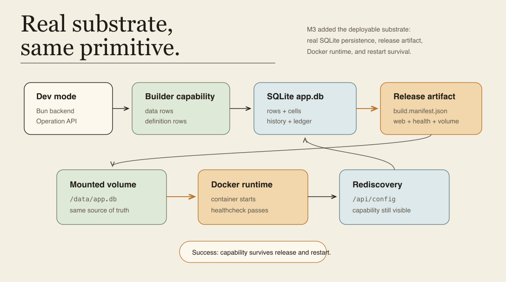
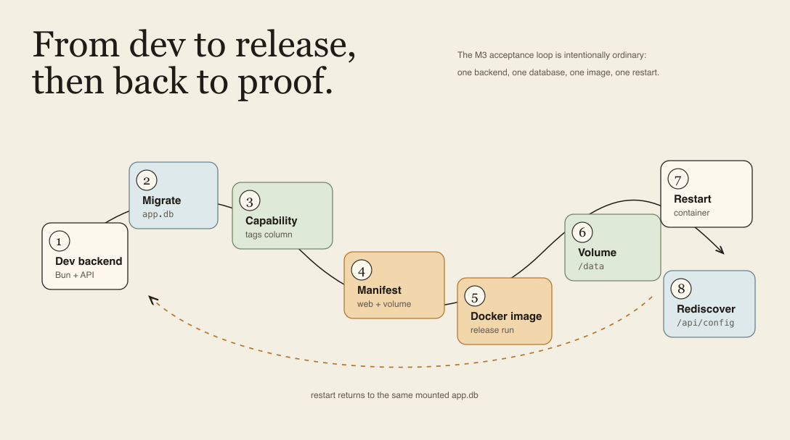
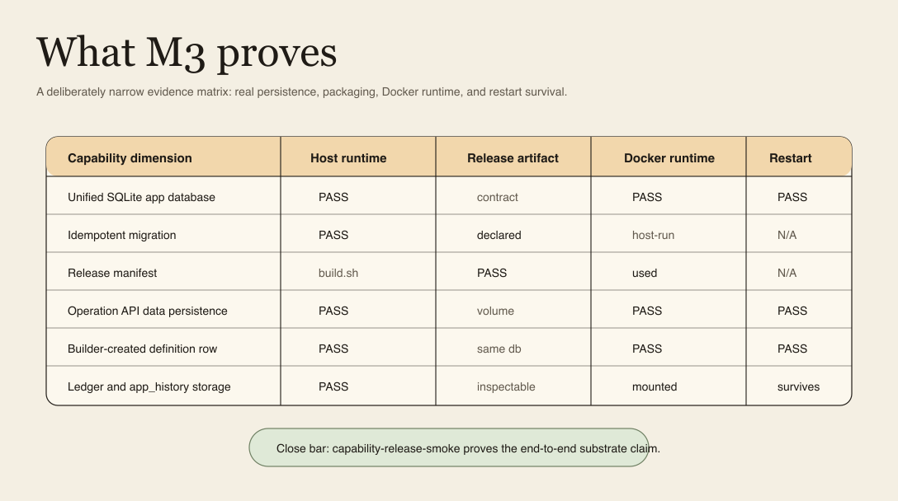
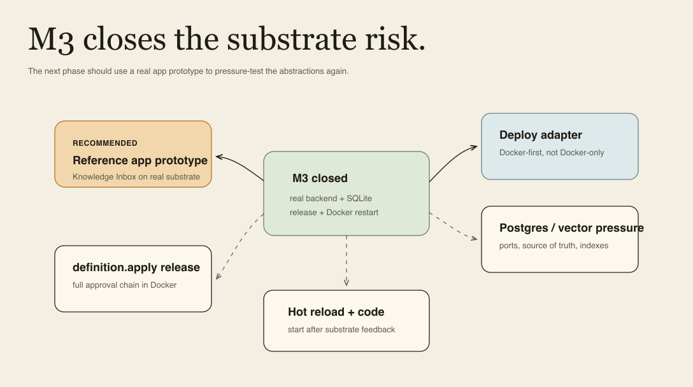

# Milestone 3 Snapshot: Deployable App Substrate

**Date:** 2026-05-01
**Status:** Closed snapshot for team alignment
**Audience:** teammates with zero Pneuma context
**Scope:** what M3 proves, what it deliberately does not prove, and how the team should read the next decision gate.
**中文版：** [Milestone 3 快照](./milestone-3-snapshot.zh-CN.md)

中文摘要：

> M1 证明 app definition 可以作为 runtime primitive 被治理。M2 证明 AI-created software capability 可以进入企业级治理证据链。M3 证明这条 primitive chain 不只活在 demo runtime 里：它可以落到真实 SQLite app database、release manifest、Docker image、mounted volume，并在容器重启后继续被 runtime rediscover。

## Executive Summary

M3 is the first "real substrate" milestone. It does not try to finish enterprise security, hot reload, or multi-tenant runtime. It answers a more basic question: **do Pneuma's M1/M2 primitives survive contact with real persistence and deployment?**

The current proof chain is:

```text
dev mode
  -> SQLite app database
  -> Builder-created data + definition rows
  -> app_history + permission ledger in the same app.db
  -> release manifest
  -> Docker image
  -> mounted /data/app.db volume
  -> container restart
  -> /api/config rediscovers the Builder-created capability
```

The milestone is intentionally narrow. SQLite, Bun, Drizzle, and Docker are implementation choices, not new framework semantics. The durable claim is that a pneuma-app can become a deployable unit without turning app-definition evolution into codegen, DDL generation, or a side-channel file overlay.

| Before M3 | After M3 |
|---|---|
| M1/M2 ran mostly in framework/demo runtime state. | The canonical template can run on a real SQLite app database. |
| App data, app definition, history, and ledger had separate in-memory paths. | They have a unified SQLite substrate for the reference app. |
| `build.sh` / `deploy.sh` were lifecycle concepts. | `build.sh` emits a release manifest and Docker can run the app. |
| Restart persistence was a design claim. | Docker smoke tests verify data and capability survival after restart. |
| "Deployable app" was still mostly architectural intent. | There is now a Docker-first proof with mounted volume and `/healthz`. |

## Milestone Thesis

> A Builder/Agent-created app capability can be persisted, packaged, run, restarted, and rediscovered through the same Pneuma primitive model.

What M3 proves:

- **Persistence substrate:** app rows, definition rows, `app_history`, migration metadata, and permission ledger events can live in one SQLite `app.db`.
- **Release substrate:** the bookmarks reference template can produce a release manifest with web process, healthcheck, migration command, and volume contract.
- **Deployable runtime:** Docker can run the app against `/data/app.db`, restart it, and keep both user data and Builder-created capability surface.

What M3 is not:

- not production IAM;
- not multi-tenant SaaS;
- not distributed transaction/concurrency hardening;
- not full hot reload;
- not a claim that Docker or SQLite are the permanent platform.

## System At A Glance

The architectural insight of M3: **the first real substrate is below the primitive, not above it.** SQLite and Docker do not replace Table / Operation / View / PolicyRule. They make those primitives durable and deployable.



Read left to right: Dev mode and the Builder capability write into the same SQLite `app.db`; the release manifest names the web process, health endpoint, migration command, and volume contract; Docker runs the app with `/data/app.db`; after restart, `/api/config` still exposes the capability.

## What Is Proven

| Capability | Current proof |
|---|---|
| Unified SQLite app database | `openPneumaSqliteDatabase(...)` opens one `app.db` with runtime schema and migration metadata. |
| Idempotent physical migration | SQLite migration tests create the schema, record schema version, and safely rerun migration. |
| Persistent runtime substrate | Runtime tests verify rows, definition rows, `app_history`, and config rediscovery after reopening the app database. |
| Durable permission ledger | `SqlitePermissionLedgerStore` records and reopens permission events from the same SQLite substrate. |
| Template lifecycle integration | `templates/bookmarks-core-domain/scripts/migrate.sh` creates `data/app.db`; `build.sh` emits release metadata. |
| Release manifest contract | `build.manifest.json` validates web process, healthcheck, migrations, and volume + SQLite path. |
| Docker-first deployment | `templates/bookmarks-core-domain/Dockerfile` and `docker-compose.yml` run the reference app with `/data/app.db`. |
| Operation API persistence | Docker smoke writes a bookmark through the real HTTP Operation API, restarts the container, and reads it back. |
| Builder-created capability survival | Capability smoke writes a `bookmarks.tags` definition row before release, runs Docker, verifies `/api/config`, restarts, and verifies `/api/config` again. |

## Current Substrate Surface

M3 adds a concrete substrate layer under the existing primitive surface:

```text
Primitive surface
  Table / CellType / Operation / View / PolicyRule / app_history / permission ledger

Runtime substrate
  Bun HTTP server
  SQLite app.db
  idempotent migrations
  release manifest
  Docker image
  mounted /data volume
```

The boundary matters. Builder/Agent definition evolution remains runtime governed data:

```text
add_table
add_table_column
add_operation
add_view
add_policy_rule
```

Those changes do **not** become Drizzle migrations or physical DDL. Drizzle/SQLite manage the framework-owned physical schema; Pneuma primitives manage app evolution.

## Acceptance Loop

The M3 demo should be told as a release loop, not as a UI animation:



1. Start with the bookmarks reference backend in dev mode.
2. Migrate a real SQLite `data/app.db`.
3. Create or seed a Builder-created capability, currently the `bookmarks.tags` column.
4. Build a release manifest with web process, healthcheck, migration command, and volume contract.
5. Build and run the Docker image.
6. Mount the same app database as `/data/app.db`.
7. Restart the container.
8. Verify `/api/config` still exposes the capability.

Demo success sentence:

```text
A Builder/Agent-created capability survives SQLite persistence, release manifest generation, Docker packaging, container restart, and remains inspectable through Pneuma primitives.
```

## Evidence Matrix



Copy-paste verification set:

```bash
bun test packages/core-domain/test/persistence/sqlite-database.test.ts packages/core-domain/test/persistence/sqlite-migrations.test.ts packages/runtime/test/deployable-substrate.test.ts packages/core/test/permission-ledger-sqlite.test.ts templates/bookmarks-core-domain/test/deployable-substrate.test.ts examples/m3-deployable-substrate/smoke.test.ts examples/m3-deployable-substrate/docker-smoke.test.ts examples/m3-deployable-substrate/capability-release-smoke.test.ts

bun test packages/runtime/test/definition-loader.test.ts packages/runtime/test/definition-apply.test.ts packages/core/test/permission-ledger.test.ts packages/core/test/artifact.test.ts

docker compose -f templates/bookmarks-core-domain/docker-compose.yml config

bun run typecheck

git diff --check
```

Latest local verification result before this snapshot:

```text
M3 substrate suite: 10 pass, 0 fail
M1/M2 guard suite: 31 pass, 0 fail
docker compose config: pass
typecheck: pass
diff check: pass
```

## Demo Runbook

Use [`examples/m3-deployable-substrate/README.md`](../../examples/m3-deployable-substrate/README.md) as the command-level demo runbook.

Recommended team-share flow:

| Step | What to show | What to say |
|---|---|---|
| 1 | M1/M2 one-slide recap | "We already proved governed app evolution and governance evidence." |
| 2 | `m3-deployable-substrate.png` | "M3 asks whether that primitive survives real persistence and release." |
| 3 | `m3-release-loop.png` | "This is the whole acceptance loop: dev, migrate, capability, build, Docker, volume, restart, rediscover." |
| 4 | Run or quote `docker-smoke.test.ts` | "The operation API writes real data into a mounted SQLite volume and reads it after restart." |
| 5 | Run or quote `capability-release-smoke.test.ts` | "A Builder-created definition row survives the same release/restart path." |
| 6 | `m3-evidence-matrix.png` | "This is what is proven; the blank spaces are deliberate." |
| 7 | `m3-next-gate.png` | "Now we should use a real app prototype to pressure-test the abstractions, not keep polishing demo infrastructure." |

## Why These Design Choices

| Choice | Why | Cost |
|---|---|---|
| SQLite first | Real persistence with low operational overhead and easy volume semantics. | Single-process constraint; not production multi-runtime. |
| Drizzle-shaped physical schema | Mature TypeScript migration path while staying inside the current monorepo stack. | Must keep Drizzle objects out of the domain model. |
| Docker-first deployment | Concrete release artifact and restart proof. | Docker must remain the first adapter, not the definition of deploy. |
| Reference template first | Keeps cognitive load low; pressure is substrate, not product scope. | Still only one domain; a second reference app remains important. |

## What This Does Not Prove Yet

| Not proven | Why it matters |
|---|---|
| Full `definition.apply` approval chain inside Docker | The capability smoke writes the definition row directly into SQLite before release; it proves substrate persistence, not the full M2 approval path in release runtime. |
| Production migration strategy | M3 migration is idempotent and sufficient for the prototype; rollback/down migrations and hosted operational workflows are not solved. |
| Postgres adapter | The schema is portable enough to keep the door open, but no Postgres implementation exists. |
| Qdrant / semantic index | M3 keeps relational DB as source of truth; vector store remains a future derived index adapter. |
| Multi-runtime concurrency | SQLite proof assumes a simple runtime; no distributed lock or database compare-and-swap is implemented. |
| Production deployment adapter | Docker files exist for the reference template; there is no generalized deploy-adapter package yet. |
| Runtime Agent in release mode | The release app runs the app backend; it does not yet embed a Runtime Agent for end users. |
| Rich real product app | Reader Bookmarks is still a teaching/reference app, not a full product prototype. |

## Strategic Read

M1 and M2 answered whether Pneuma has a defensible primitive. M3 answers whether that primitive can leave the demo room. That is a meaningful milestone: the framework can now talk about real app deployment without changing its ontology.

The biggest remaining risk is no longer "can we persist something?" It is whether a real product-shaped reference app will stress the abstraction in ways Reader Bookmarks does not. That pressure should come before production-grade IAM, full Permission Center workflows, or custom-code hot reload.

The next best move is therefore not to harden every enterprise surface immediately. It is to build a small but real prototype, likely Knowledge Inbox, on this substrate and force the framework to serve a coherent product experience.

## Recommended Next Phase

Recommended M4 direction:

> Build a real reference app prototype on the M3 substrate, then use it to re-prioritize governance, deployment adapters, hot reload, and semantic search.



| Candidate | Why choose it |
|---|---|
| Reference app prototype | Highest learning value: turns substrate into a real product-shaped app and reveals missing framework contracts. |
| Full `definition.apply` release smoke | Closes the remaining gap between M2 governance chain and M3 release runtime. |
| Deployment adapter abstraction | Turns Docker-first proof into a portable deployment model. |
| Postgres / vector pressure | Tests whether storage ports and source-of-truth boundaries stay clean. |
| Hot reload + custom code | Important, but should follow real-product feedback so it solves the right bottleneck. |

## Team Decision Gate

Use these questions in the team share:

1. Do we agree M3 is closed as a **deployable substrate proof**, not a production deployment platform?
2. Do we accept SQLite + Docker as first implementations while keeping them outside the semantic model?
3. Should the next reference app be Reader Bookmarks continuation or a renamed/reframed Knowledge Inbox?
4. Should the next slice close the full `definition.apply` release smoke before product prototype work, or run both in parallel?

Milestone boundary:

```text
Before M3:
  Pneuma proved governed app evolution and governance evidence.

After M3:
  Pneuma has a real app substrate where the same primitive survives persistence, release, Docker, and restart.
```

## Evidence

Recent M3 commits:

```text
8e3e77a test: prove capability survives docker release restart
36366a1 test: verify docker data persistence through operation api
530b199 test: add docker runtime smoke for M3 substrate
f923ec1 feat: add docker-first deployable substrate demo
b219080 feat: wire bookmarks template to deployable substrate
8cb1e3b feat: describe deployable release manifests
16b3275 feat: persist permission ledger in sqlite
359d9bd feat: persist runtime substrate state in unified sqlite
7045d9a feat: add sqlite migration substrate
468232a feat: add unified sqlite app database wiring
561a784 docs: add M3 deployable substrate plan
```

Reading path for zero-context teammates:

1. [Architecture README](./README.md) for the current map.
2. [M1 snapshot](./milestone-1-snapshot.md) for governed app-definition primitive.
3. [M2 snapshot](./milestone-2-snapshot.md) for enterprise governance evidence.
4. This M3 snapshot for the deployable substrate proof.
5. [M3 demo README](../../examples/m3-deployable-substrate/README.md) for commands and runbook.

## Appendix — Slice Ledger

| Slice | Durable result |
|---|---|
| M3.0 design close | Bilingual design doc captured the pivot from enterprise hardening to real substrate. |
| M3.1 unified SQLite database | Runtime storage opens one migrated `app.db`. |
| M3.2 migrations | Physical schema and idempotent migration tests landed. |
| M3.3 runtime persistence | Rows, definition rows, and `app_history` survive database reopen. |
| M3.4 permission ledger persistence | Permission ledger has a SQLite-backed store. |
| M3.5 release manifest | Build artifact describes process, healthcheck, migrations, and volume contract. |
| M3.6 template Docker substrate | Bookmarks reference template builds and runs as a Docker image with `/data/app.db`. |
| M3.7 Docker data smoke | Operation API data survives container restart. |
| M3.8 capability release smoke | Builder-created `bookmarks.tags` capability survives Docker restart and runtime rediscovery. |
