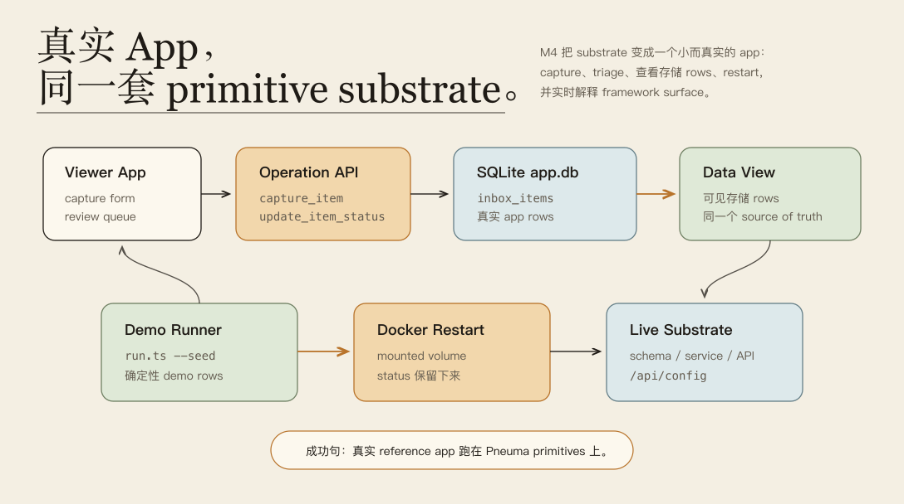
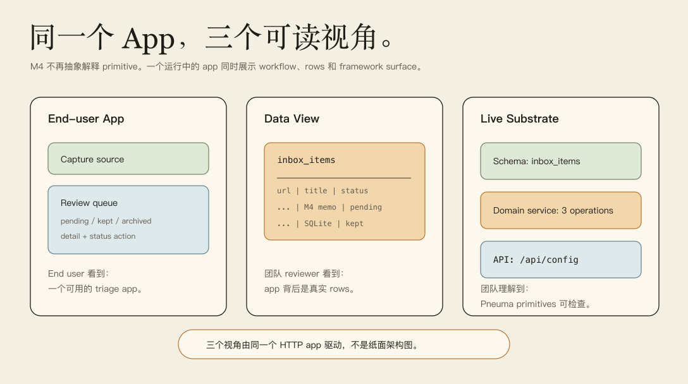
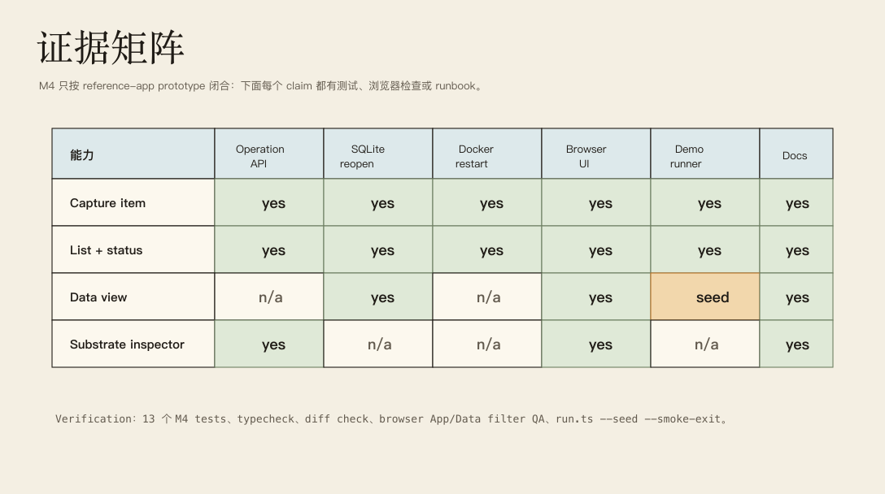

# Milestone 4 快照：Knowledge Inbox Reference App

**日期：** 2026-05-01
**状态：** 用于团队对齐的 closed snapshot
**受众：** 0 预备知识的团队成员
**范围：** M4 证明了什么、明确没有证明什么，以及下一阶段应该如何选择 product pressure。
**English version:** [Milestone 4 Snapshot](./milestone-4-snapshot.md)

摘要：

> M1 证明 app definition 可以被治理；M2 证明治理证据链可以解释企业级安全边界；M3 证明 primitive 可以穿过 SQLite / Docker / restart。M4 证明这条链路可以支撑一个小而真实的 reference app：Knowledge Inbox。它不是烟雾测试页面，而是有 capture、triage、data view、live substrate inspector、SQLite 持久化、Docker restart 和一键 demo runner 的产品原型。

## Executive Summary

M4 是第一个 product-shaped reference app 里程碑。它不试图把 Knowledge Inbox 做成完整知识管理产品。它回答一个更窄但重要的问题：**真实 app 体验能不能跑在 Pneuma primitives 上，同时又不把 framework 模型藏起来？**

当前证明链路是：

```text
end-user capture
  -> capture_item Operation
  -> inbox_items row in SQLite app.db
  -> review queue + status triage
  -> 同一批 stored rows 的 Data view
  -> schema / domain service / API 的 Live substrate inspector
  -> mounted volume 的 Docker restart
  -> 团队可复现的一键 demo runner
```

| M4 之前 | M4 之后 |
|---|---|
| M3 用 teaching template 证明 substrate。 | M4 有一个命名的 reference app 跑在 substrate 上。 |
| 团队 demo 仍然要求先理解 primitive story。 | app 通过 product、data、substrate 三个视角解释 primitive story。 |
| 浏览器验证主要靠手工。 | viewer contract、runner contract、Docker smoke、browser QA 覆盖 demo path。 |
| 启动 demo 需要记多条命令。 | `examples/m4-knowledge-inbox/run.ts --seed` 成为 canonical live entry。 |
| Knowledge Inbox 只是 proposed pressure test。 | Knowledge Inbox 已经是具体 template 和 example。 |

## Milestone Thesis

> 一个 Pneuma reference app 可以先作为 app 有用，同时仍然作为 framework primitive system 可检查。

这个区别很重要。M4 不是说 Pneuma 已经有完成品；它说 substrate 不再只是基础设施，它已经能承载一个团队能从外部理解的 app loop。

## System At A Glance



M4 的关键是 App/Data/Substrate 三视角：

- **App view：** end user 做什么——capture、review、keep、archive。
- **Data view：** 系统存什么——`inbox_items` rows。
- **Live substrate：** framework 暴露什么——schema、domain service Operations、`/api/config`、`/healthz`。

所以这个 demo 比之前只讲 primitive 的屏幕更容易理解。团队成员可以先从 app 进入，再下钻到 rows，再旁观 framework contract。

## What Is Proven

| 能力 | 当前证明 |
|---|---|
| Product-shaped reference app | `templates/knowledge-inbox-core-domain` 提供可用 viewer、backend、lifecycle scripts、SQLite config、Dockerfile 和 compose file。 |
| Domain schema | `inbox_items` 存 URL、title、source、summary、status、created timestamp。 |
| Operation contract | `capture_item`、`list_inbox_items`、`update_item_status` 有 declaration tests 和真实 HTTP invocation tests。 |
| SQLite persistence | local smoke 启动 runtime、capture item、重新打开同一个 app database、再读回。 |
| Docker restart survival | Docker smoke 构建 image，通过 HTTP 写入并更新 row，restart container 后从 `/data/app.db` 读回同一 row/status。 |
| Product UI | vanilla viewer 支持 capture、review queue、status filters、selected detail、App/Data view 切换。 |
| Live substrate explanation | viewer fetch `/api/config` 和 `/healthz`，展示 Schema、Domain Service、API 三条 lane。 |
| Deterministic demo replay | `examples/m4-knowledge-inbox/run.ts --seed` 启动真实 app，并通过 public Operations seed 三条确定性 rows。 |
| Browser confidence | in-app browser QA 验证了 seeded App view、Data view、kept filter 行为和 0 console errors。 |
| M3/M4 bridge | `definition-apply-release-smoke` 证明 governed `definition.apply` capability 可以在 Docker release 前创建，并穿过 restart。 |

## Reference App Surface



当前 Knowledge Inbox 有意保持小：

```text
Schema:
  inbox_items(url, title, source, summary, status, created_at_cell)

Domain service:
  capture_item(input: url, title?, source?, summary?) -> { id, url, status }
  list_inbox_items() -> inbox_items[]
  update_item_status(item_id, status) -> { id, status }

App:
  capture form
  pending / kept / archived queue filters
  selected item detail
  Data view table
  live substrate inspector
```

重要的不是功能多，而是每个可见产品行为都能映射到 declared Operation 和 stored row，并且 viewer 把这个映射显露出来。

## Demo Runbook

Canonical live demo：

```bash
bun run examples/m4-knowledge-inbox/run.ts --seed --port 8876
```

如果端口被占用：

```bash
bun run examples/m4-knowledge-inbox/run.ts --seed --port 0
```

自动 smoke mode：

```bash
bun run examples/m4-knowledge-inbox/run.ts --seed --smoke-exit --port 0
```

推荐团队分享流程：

| Step | 展示什么 | 讲什么 |
|---|---|---|
| 1 | M1-M3 recap | “我们已经证明 governance、enterprise evidence、deployable substrate。” |
| 2 | Knowledge Inbox App view | “现在 primitive chain 承载了一个产品 loop。” |
| 3 | Capture one source | “UI 调的是 declared Operation，不是 ad-hoc code。” |
| 4 | Data view | “app 背后是真实 SQLite rows。” |
| 5 | Live substrate inspector | “运行中的 app 能解释自己的 schema、domain service 和 API。” |
| 6 | Docker smoke 或引用输出 | “同一 row/status 穿过 release 和 restart。” |
| 7 | Evidence matrix | “这就是 M4 已证明范围；空白处是有意保留。” |

## Evidence Matrix



可直接运行的 verification set：

```bash
bun test templates/knowledge-inbox-core-domain/test/operation-declarations.test.ts templates/knowledge-inbox-core-domain/test/deployable-substrate.test.ts templates/knowledge-inbox-core-domain/test/viewer-contract.test.ts examples/m4-knowledge-inbox/smoke.test.ts examples/m4-knowledge-inbox/docker-smoke.test.ts examples/m4-knowledge-inbox/run.test.ts

bun run examples/m4-knowledge-inbox/run.ts --seed --smoke-exit --port 0

bun test examples/m3-deployable-substrate/definition-apply-release-smoke.test.ts

bun run typecheck

git diff --check
```

这份 snapshot 前最后一次本地验证结果：

```text
M4 focused suite: 13 pass, 0 fail
Live runner smoke: pass
M3/M4 bridge smoke: 1 pass, 0 fail
Browser QA: seeded App view, Data view, kept filter, 0 console errors
Typecheck: pass
Diff check: pass
```

## What This Does Not Prove Yet

| 尚未证明 | 为什么重要 |
|---|---|
| 完整知识管理产品 | M4 是 reference app prototype，不是产品发布。Search、ingestion、deduping、collaboration 仍是未来工作。 |
| Release mode Runtime Agent | end user 可以使用 app，但 release app 里还没有嵌 Runtime Agent。 |
| Semantic search / vector store | Qdrant-like search 仍是未来 derived index；SQLite rows 仍是 source of truth。 |
| Postgres adapter | M4 保持 SQLite + volume first implementation；storage boundary 仍给 Postgres 留路。 |
| Definition changes hot reload | M4 仍接受 restart-based rediscovery，适合 substrate proof。 |
| 这个 app 的 multi-user enterprise workflow | M2 primitives 已经存在，但 Knowledge Inbox 还没有暴露完整 admin / permission center workflow。 |
| Knowledge Inbox 内部由 Builder 继续改 app | M3/M4 bridge 已证明 governed definition.apply through release，但当前 Knowledge Inbox demo 本身还不是 agent-evolving app。 |
| Production deployment adapter | Docker 仍是第一个具体 release target，不是 generalized deployment abstraction。 |

## Strategic Read

M4 改变了项目讨论方式。我们现在可以停止问 substrate 到底能不能承载 app；它可以。更好的问题是：下一个真实 product pressure 应该压哪条抽象边界？

最强的下一步不是“继续 polish demo”，而是挑一个会逼出 framework boundary 的能力：

- **semantic retrieval：** 加 derived vector/search index，但不让它成为 source of truth；
- **agent-built app evolution inside Knowledge Inbox：** 让 Builder 通过 `definition.apply` 加 priority/tags/review views；
- **scaffold：** 验证 agent / developer 启动新 reference app 时，是需要 scaffold 还是可以 from scratch；
- **runtime agent：** 让 finished app 可以回答 end-user 对自己 rows 的问题；
- **deployment adapter：** 让 Docker 只是一个 adapter，而不是 deploy model 本身。

## Recommended Next Gate

推荐 M5 方向：

> 加一个会逼 Knowledge Inbox 压力测试缺失 framework boundary 的能力，同时保持 app 仍然能被当作产品理解。

最有价值的候选：

| Candidate | 为什么选择 |
|---|---|
| Semantic search as derived index | 测试 source-of-truth boundary 和未来 Qdrant path。 |
| Builder 通过 `definition.apply` 增加 `priority` / `topic` | 把 M1/M2 app evolution 直接接进 M4 reference app。 |
| Reference app scaffold | 测试 agent 应该从 scaffold 开始还是 from scratch。 |
| Runtime Agent over inbox rows | 测试第二类 agent lifetime 和 release-mode user value。 |
| Deployment adapter abstraction | 把 Docker-first proof 推成 portable deployment story。 |

## Team Decision Gate

团队分享时可以问这几个问题：

1. 我们是否同意 M4 以 **reference app prototype** 闭合，而不是完整产品？
2. App/Data/Substrate 三视角是否让 0 预备知识同事更容易理解 Pneuma？
3. M5 应该先压 semantic retrieval，还是先把 `definition.apply` 直接接进 Knowledge Inbox？
4. 在做第二个 reference app 前，我们是否需要 scaffold/generator？

里程碑边界：

```text
M4 之前：
  Pneuma 有 governed primitives 和 deployable substrate。

M4 之后：
  Pneuma 有一个真实 reference app，能通过产品使用、数据检查和 runtime substrate inspection 把 primitive chain 讲清楚。
```

## Evidence

近期 M4 commits：

```text
a8d411d feat: add knowledge inbox data view
19a939e feat: expose knowledge inbox substrate
1b5fb1a feat: refine knowledge inbox viewer
1a8e84a test: add knowledge inbox docker smoke
ac572dd test: prove knowledge inbox persistence
927afdf feat: define knowledge inbox reference template
5f5acde test: prove governed capability survives release
0a05f70 docs: plan M4 knowledge inbox
```

0 预备知识团队成员建议阅读路径：

1. [Architecture README](./README.md) 理解当前地图。
2. [Milestone 1 Snapshot](./milestone-1-snapshot.md) 理解 governed app-definition evolution。
3. [Milestone 2 Snapshot](./milestone-2-snapshot.md) 理解 enterprise governance evidence。
4. [Milestone 3 Snapshot](./milestone-3-snapshot.md) 理解 deployable substrate。
5. 这份 M4 snapshot 理解第一个 product-shaped reference app。
6. [M4 Knowledge Inbox README](../../examples/m4-knowledge-inbox/README.md) 运行 demo。
