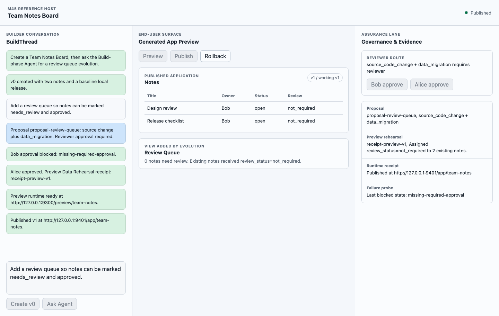

# Milestone 45 Snapshot

**Milestone:** M45，Creation Host Implementation Kit v0
**状态：** Closed；optional M45.1 pressure lanes 已实现
**日期：** 2026-05-16
**English version:** [milestone-45-snapshot.md](./milestone-45-snapshot.md)

## 决策

M45 开启 0.4.0 implementation-framework lane。

已接受方向：

```text
@pneuma-framework/core
  primitives, contracts, validators, evidence

@pneuma-framework/host-kit
  reusable Creation Host assembly helpers

examples/reference-creation-host
  canonical consumer and living conformance example
```

这保持了顶层模型：

```text
pneuma-framework
  -> Creation Host
  -> Generated Application
  -> Published Application
```

Host Kit 不是隐藏的 Creation Host product。它是 Developer 构建 Creation Host 时使用的显式 adapter orchestration layer。

## 交付内容

### `@pneuma-framework/host-kit`

新增 package：

```text
packages/host-kit/
```

当前提供：

- `evaluateHostKitApproval`
- `runHostKitCodeAgentDraft`
- `prepareHostKitCodeChangeReview`
- `applyApprovedHostKitCodeChange`
- `createDockerRuntimeAdapter`
- `runPreviewDataRehearsal`
- `dataEvolutionReceiptAllowsPublish`
- `publishVerifiedVersion`
- `rollbackPublishedVersion`
- `HostRuntimeAdapter`
- `DataEvolutionAdapter`

### Approval Boundary

Host Kit 包装 Enterprise Governance，并保留关键 invariant：

```text
Builder self-approval 不能满足 required Reviewer approval。
```

这是 Reference Host 所需的最小 enterprise governance shape。

### Real Code Agent Draft

M45.1 增加了 `runHostKitCodeAgentDraft`。

这个 helper 会让真实或假的 `AgentBackend` 在 draft workspace 上工作，然后在 Code Change Lane review 开始前验证 draft：

```text
opencode / other backend
  -> edits draft workspace
  -> Host verifies expected source shape
  -> Code Change Lane prepares review packet
  -> Reviewer approval
  -> guarded apply
```

Reference Host 的 live path 已用下面组合验证：

```text
opencode + openrouter/anthropic/claude-opus-4.7
```

关键边界是：真实 code agent 只创建 draft。它不 publish、不 migrate，也不绕过 reviewer approval。

### Code Change Lane

Host Kit 从 core Code Change Lane proposal 准备 Build Assurance review packet。它携带：

- changed files 和 diff；
- guardrail checks；
- source 和 migration proposed changes；
- risk classification；
- migration mode；
- recovery plan。

`applyApprovedHostKitCodeChange` 会在 approval 不允许时拒绝 apply。

### Preview Data Rehearsal

Host Kit 定义 semantic gate：

```text
clone representative data
  -> run Host-owned data evolution
  -> validate DataEvolutionReceipt
  -> continue only when receipt.status = completed
```

migration engine 仍然是 Host-owned。Host Kit 拥有 call order 和 fail-closed gate。

### Publish And Rollback

`publishVerifiedVersion` 会在缺少 required data receipt 时 fail closed，然后启动 published runtime，等待 ready evidence，stage/promote rollout state，并返回 `RuntimeControlReceipt`。如果 runtime readiness 或 rollout promotion 在 runtime 已启动后失败，Host Kit 会先 best-effort stop，再返回失败。

`rollbackPublishedVersion` 复用已有 Release Rollout state machine。

### Optional Docker Runtime Adapter

M45.1 增加 `createDockerRuntimeAdapter`，作为 local smoke tests 可选使用的 `HostRuntimeAdapter` implementation。

Docker 仍然是具体 adapter，不是 framework semantic。`publishVerifiedVersion` 仍然接受任何实现 Host runtime interface 的 adapter。

### Open-ended Host-owned Artifact Pressure

M45.1 在 Reference Host 下增加了 open-ended pressure test：

```text
focus-site source artifact
  -> add github_attention section
  -> reviewer approval
  -> guarded source apply
```

这证明 Host Kit 不只服务 schema/data-shaped apps。它也可以承载 Host-owned UI/module artifacts 的 review/apply lane。

### Reference Host

新增 canonical consumer：

```text
examples/reference-creation-host/
```

它实现 Team Notes Board：

```text
v0:
  notes list

Builder intent:
  Add a review queue.

v1:
  review_status field
  review queue preview
  carry-forward data receipt
```

Bob 是 Builder。Alice 是 Reviewer。

## Workbench



workbench 有三栏：

- BuildThread conversation；
- Generated App Preview；
- Governance & Evidence。

它故意保持 local 和 small，但它是 product workbench，不是 wireframe。

## 验证

必要验证已通过：

```bash
bun test packages/host-kit/test/*.test.ts
bun test examples/reference-creation-host/reference-host.test.ts examples/reference-creation-host/open-ended-host-kit.test.ts examples/reference-creation-host/ui-state.test.ts
bun run typecheck
git diff --check
```

真实 code-agent 验证已通过：

```bash
PNEUMA_KEEP_REFERENCE_HOST_WORKSPACE=1 bun run --cwd examples/reference-creation-host real-agent
```

观察结果：

```text
model: openrouter/anthropic/claude-opus-4.7
code_agent_receipt.status: completed
code_agent_receipt.backend_type: opencode
changed_paths: src/app.ts
Bob approval: blocked
Alice approval: ready_to_preview
publish: completed
rollback: v0 active
```

review 之后的回归验证也已通过：

```bash
bun test packages/host-kit/test/publish.test.ts examples/reference-creation-host/reference-host.test.ts
bun run typecheck
```

最终全量 review pass：

```text
bun test -> 1323 pass, 0 fail, 4880 expect() calls, 207 files
```

Browser evidence：

```text
create v0
ask agent
Bob approval blocked
Alice approval succeeds
preview starts
publish succeeds
rollback succeeds
```

截图：

```text
docs/architecture/images/m45-reference-host-workbench.png
```

## Review Addendum

这次重新 review M45/M45.1 时，锚点是 0.4.0 的目标：把已经稳定的 contracts 变成可执行 implementation framework，同时不把 Host 选型折叠成 framework semantic。

没有发现阻塞级架构问题。review 过程中修复了两个 sample-quality 问题：

1. `publishVerifiedVersion` 现在会在 readiness 或 rollout promotion 失败时清理已经启动的 published runtime。这样 helper 保持 fail-closed，不会留下半启动 release。
2. `examples/reference-creation-host` 现在按 generated application 隔离 release rollout state，而不是整个 Host workspace 共用一个 rollout file。这让 Reference Host 在多 generated apps 场景下仍然符合四层模型。

保留的边界仍然是：

- 真实 opencode path 只创建 draft；reviewer approval、guardrails、data rehearsal、publish 和 rollback 都不在 agent 直接权限内；
- Docker 只是 optional runtime adapter；
- open-ended UI/module artifacts 在这一阶段仍然是 Host-owned source artifacts；
- migration execution 仍然是 Host-owned，Host Kit 只拥有 fail-closed rehearsal 和 publish gates。

## Demo Route

运行：

```bash
PORT=8893 bun run --cwd examples/reference-creation-host serve
```

打开：

```text
http://127.0.0.1:8893/
```

按这个顺序点击：

```text
Create v0
Ask Agent
Bob approve
Alice approve
Preview
Publish
Rollback
```

关键不是 note table 多了一个字段。关键是一个 Builder intent 穿过 BuildThread、proposal、reviewer route、code-change guardrails、data rehearsal、publish receipt 和 rollback evidence。

## Pruning Candidates

M45 不删除历史 examples。它只标记 replacement coverage。

| Old example | Replacement coverage | Recommendation |
|---|---|---|
| `examples/m16-reference-creation-host/` | Creation、preview、inspect/evolve/approve/publish/rollback 现在由 `examples/reference-creation-host/` 更好表达。 | owner review 后删除或归档。 |
| `examples/m18-open-ended-personal-focus-site/` | M45.1 已用更小的 open-ended Host-owned UI artifact 覆盖 Host Kit pressure，但还没有覆盖完整 Personal Focus Site story。 | 保留到 owner 接受这个更小 pressure 已足够，或把完整 focus-site story 基于 Host Kit 重建。 |
| `examples/m43-enterprise-governance-demo/` | Reviewer route 已覆盖，但 M43 仍直接解释 enterprise governance narrative。 | 保留到 governance UX 完整合入 Reference Host。 |

## 剩余风险

1. 真实 opencode path 证明一个小的 source edit，不证明广泛 code-agent product quality。
2. local 和 Docker runtime adapters 仍然是 reference adapters，不是 cloud deployment providers。
3. data evolution handler 故意很小；真实 Host 仍需要 provider-specific migration implementation。
4. open-ended UI/module coverage 已有，但范围仍窄。
5. 历史 examples 仍需 replacement coverage review 后再清理。

## 下一步 lanes

M45.1 之后最有价值的 lanes：

1. 把真实 agent path 从一个 bounded edit 扩到更宽场景；
2. 判断较小的 open-ended pressure 是否足以替代 M18，或是否需要基于 Host Kit 重建完整 M18；
3. 只有在能推进 product boundary 时，再补 cloud/runtime adapter pressure；
4. replacement coverage 被接受后清理历史 examples。
