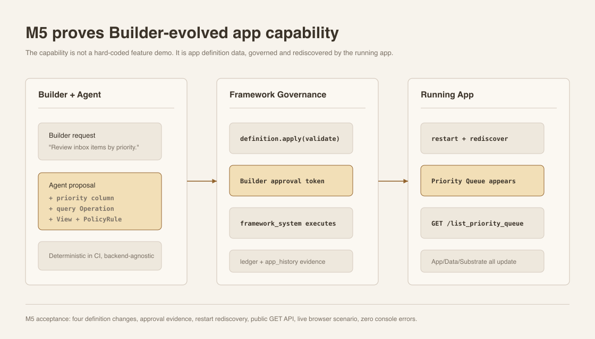
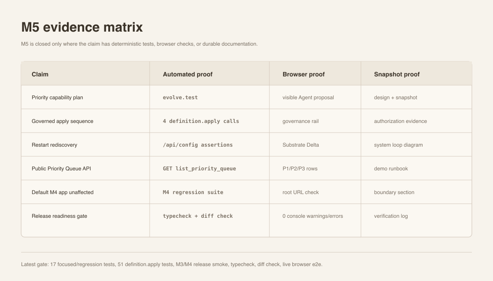

# Milestone 5 Snapshot: Builder Evolves Knowledge Inbox

**Date:** 2026-05-01
**Status:** Closed snapshot for team alignment
**Audience:** teammates with zero Pneuma context
**Scope:** what M5 proves, what it deliberately does not prove, and what the next milestone should pressure.
**中文版:** [Milestone 5 快照](./milestone-5-snapshot.zh-CN.md)

中文摘要：

> M1 证明 app definition 可以被治理；M2 证明治理证据链能解释企业安全边界；M3 证明 primitive 能穿过 SQLite / Docker / restart；M4 证明这些 primitive 能承载一个真实 reference app。M5 证明下一步：Builder 可以通过 Build-phase Agent 的提案演进这个真实 app，framework 负责 approval、definition.apply、restart rediscovery 和证据链，最终 Knowledge Inbox 出现新的 Priority Queue 能力。

## Executive Summary

M5 closes the first end-to-end Builder evolution loop inside the real Knowledge Inbox reference app.

The important claim is not "Knowledge Inbox has priority labels." The important claim is:

> A Builder request can become governed app-definition data, and the running app can rediscover it as a new product capability.

M5 does this with a deliberately small capability:

```text
Builder asks for priority review
  -> deterministic Build-phase Agent proposal
  -> Builder approval
  -> definition.apply adds column / Operation / View / PolicyRule
  -> dev service restarts
  -> /api/config rediscovers the new definition rows
  -> App/Data/Substrate surfaces show Priority Queue
```

## System At A Glance



M5 adds a new example:

```text
examples/m5-knowledge-inbox-builder-evolution/
  capability-plan.ts
  builder-evolution.ts
  evolve.test.ts
  run.ts
  run.test.ts
  README.md
```

The Build-phase Agent path is deterministic in M5. That is intentional. The milestone is testing the framework primitive, not LLM planning reliability.

## What Changed

The M5 capability is four definition changes:

| Change | Result |
|---|---|
| `add_table_column` | `inbox_items.priority` becomes a nullable Text column. |
| `add_operation` | `list_priority_queue` becomes a query-backed read Operation. |
| `add_view` | `priority_queue` becomes an Operation-backed table View. |
| `add_policy_rule` | `anyone-read-priority-queue` grants read access to the new View. |

The demo runner seeds three rows with priorities `P1`, `P2`, and `P3`, then verifies:

```text
GET /api/operations/list_priority_queue -> 3 rows
```

## Demo Surface

Canonical live demo:

```bash
bun run examples/m5-knowledge-inbox-builder-evolution/run.ts --port 0
```

Open the printed scenario URL:

```text
http://127.0.0.1:<port>/?scenario=builder-evolution
```

The M5 surface is split deliberately:

- **Left side:** end-user Knowledge Inbox, with App/Data tabs.
- **Right side:** Builder request, Agent proposal, Governance timeline, Substrate delta.

This lets zero-context teammates see both halves at once: the end-user app changed, and the framework can explain exactly what changed.

## What Is Proven

| Capability | Current proof |
|---|---|
| Builder-to-Agent proposal shape | `capability-plan.ts` declares the Builder request, Agent proposal, and four definition changes. |
| Governed definition mutation | `evolve.test.ts` applies all four changes through `definition.apply` with `require_approval: true`. |
| Authorization evidence | Each apply result proves requested principal `build_agent`, execution principal `framework_system`, and `reason_code: allowed`. |
| Restart rediscovery | After every apply, the dev service restarts and `/api/config` exposes the changed definition. |
| Public API | `GET /api/operations/list_priority_queue` returns the seeded P1/P2/P3 rows. |
| Demo runner | `run.test.ts` starts the real template, evolves it, seeds rows, verifies the API, and exits. |
| Default M4 app unaffected | Browser e2e verifies `/` does not show the M5 Builder rail; `?scenario=builder-evolution` does. |
| Viewer narrative | `viewer-contract.test.ts` covers the M5 Builder evolution surface. |

## Evidence Matrix



Latest verification before snapshot:

```text
M5 focused suite: 9 pass, 0 fail
M4 regression subset: 8 pass, 0 fail
Core definition.apply suite: 51 pass, 0 fail
M3/M4 governed release smoke: 1 pass, 0 fail
Typecheck: pass
Diff check: pass
Browser e2e:
  / default route: builder rail hidden, app visible, 0 console warnings/errors
  /?scenario=builder-evolution App view: Builder rail visible, P1/P2/P3 rows visible, 0 console warnings/errors
  /?scenario=builder-evolution Data view: row ids + priority column visible, 0 console warnings/errors
```

Copy-paste verification set:

```bash
bun test examples/m5-knowledge-inbox-builder-evolution/evolve.test.ts examples/m5-knowledge-inbox-builder-evolution/run.test.ts templates/knowledge-inbox-core-domain/test/viewer-contract.test.ts

bun test templates/knowledge-inbox-core-domain/test/operation-declarations.test.ts templates/knowledge-inbox-core-domain/test/deployable-substrate.test.ts examples/m4-knowledge-inbox/smoke.test.ts examples/m4-knowledge-inbox/run.test.ts

bun test packages/core/test/tools/definition-apply.test.ts

bun test examples/m3-deployable-substrate/definition-apply-release-smoke.test.ts

bun run typecheck

git diff --check
```

## What This Does Not Prove Yet

| Not proven | Why it matters |
|---|---|
| Real LLM planning reliability | M5 uses a deterministic Agent proposal so CI and team demos are stable. |
| Hot reload | The definition changes still require restart rediscovery. |
| Builder-authored code handlers | M5 only adds query-backed read Operations, matching the current safe primitive. |
| Full product priority workflow | Priority values are seeded for demo clarity; there is no end-user priority editing Operation yet. |
| Production enterprise security | M2 governance primitives are exercised, but production IAM/admin workflow is still future work. |
| Semantic search / vector index | M5 chooses app evolution over retrieval pressure. |
| Runtime Agent in release mode | The Build-phase Agent is represented; no end-user runtime agent ships yet. |

## Strategic Read

M5 closes the gap that M4 intentionally left open:

```text
M4: A real app can sit on Pneuma primitives.
M5: A Builder can evolve that real app through Pneuma primitives.
```

This is the first point where the project starts to look like the original vision again: not just "apps built with a framework," but "apps that can be shaped by conversation."

## Next Gate

Post-snapshot decision: **M6 is selected first.** The semantic index track is deferred until the real backend-agent evolution path is proven.

| Direction | Why |
|---|---|
| **M6: make app evolution interactive with a real backend agent** | Selected. Turns the deterministic M5 proposal into an actual Build-phase Agent session while preserving the same semantic tool contract. |
| **Future semantic index track** | Deferred. Pressures the storage boundary later: relational SQLite remains source of truth, vector search becomes derived infrastructure. |

## Evidence

M5 implementation commits before this snapshot:

```text
279b6f5 fix: include row ids in M5 priority queue
9c3054b feat: add M5 builder evolution demo
d17e39f test: prove M5 builder evolution
1b89526 docs: plan M5 builder evolution
```

Reading path for zero-context teammates:

1. [Architecture README](./README.md) for the current map.
2. [Milestone 4 Snapshot](./milestone-4-snapshot.md) for the Knowledge Inbox reference app.
3. This M5 snapshot for Builder-evolved app capability.
4. [M5 Knowledge Inbox README](../../examples/m5-knowledge-inbox-builder-evolution/README.md) for the runnable demo.
