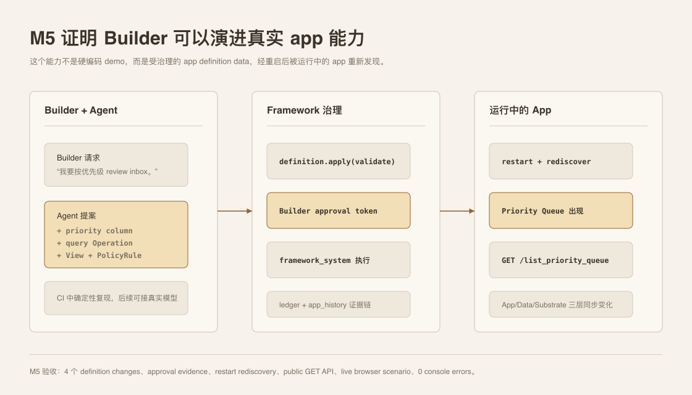
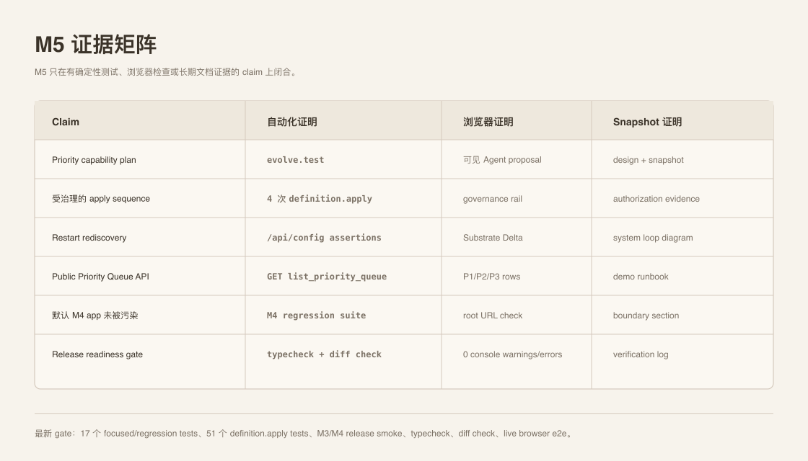

# Milestone 5 快照：Builder 演进 Knowledge Inbox

**日期：** 2026-05-01
**状态：** 面向团队对齐的 closed snapshot
**受众：** 0 预备知识团队成员
**范围：** M5 证明了什么、明确没有证明什么，以及下一阶段应该压哪条边界。
**English version:** [Milestone 5 Snapshot](./milestone-5-snapshot.md)

## 执行摘要

M5 关闭的是 Knowledge Inbox 里的第一个端到端 Builder evolution loop。

关键 claim 不是 “Knowledge Inbox 多了 priority label”，而是：

> Builder 的一句需求可以变成受治理的 app-definition data，并被运行中的 app 重新发现为新的产品能力。

M5 用一个刻意很小的能力证明这件事：

```text
Builder 请求按优先级 review
  -> deterministic Build-phase Agent proposal
  -> Builder approval
  -> definition.apply 增加 column / Operation / View / PolicyRule
  -> dev service restart
  -> /api/config 重新发现新的 definition rows
  -> App/Data/Substrate 三层都出现 Priority Queue
```

## 系统一览



M5 新增 example：

```text
examples/m5-knowledge-inbox-builder-evolution/
  capability-plan.ts
  builder-evolution.ts
  evolve.test.ts
  run.ts
  run.test.ts
  README.md
```

M5 的 Build-phase Agent 路径是 deterministic 的，这是有意选择。这个里程碑测试的是 framework primitive，不是 LLM 规划稳定性。

## 改了什么

M5 capability 由 4 个 definition changes 组成：

| Change | 结果 |
|---|---|
| `add_table_column` | `inbox_items.priority` 成为 nullable Text column。 |
| `add_operation` | `list_priority_queue` 成为 query-backed read Operation。 |
| `add_view` | `priority_queue` 成为 Operation-backed table View。 |
| `add_policy_rule` | `anyone-read-priority-queue` 授权读取新 View。 |

Demo runner 会 seed 3 条带 `P1`、`P2`、`P3` 的 rows，并验证：

```text
GET /api/operations/list_priority_queue -> 3 rows
```

## Demo Surface

Canonical live demo：

```bash
bun run examples/m5-knowledge-inbox-builder-evolution/run.ts --port 0
```

打开 runner 输出的 scenario URL：

```text
http://127.0.0.1:<port>/?scenario=builder-evolution
```

M5 surface 是刻意左右分屏：

- **左侧：** End-user Knowledge Inbox，含 App/Data tabs。
- **右侧：** Builder request、Agent proposal、Governance timeline、Substrate delta。

这样 0 预备知识的同事可以同时看到两件事：用户 app 发生了变化，framework 也能解释系统到底变了什么。

## 已证明范围

| Capability | 当前证据 |
|---|---|
| Builder-to-Agent proposal shape | `capability-plan.ts` 声明 Builder request、Agent proposal 和 4 个 definition changes。 |
| Governed definition mutation | `evolve.test.ts` 用 `require_approval: true` 通过 `definition.apply` 应用 4 个 changes。 |
| Authorization evidence | 每个 apply result 都证明 requested principal 是 `build_agent`，execution principal 是 `framework_system`，`reason_code: allowed`。 |
| Restart rediscovery | 每次 apply 后 dev service 都 restart，`/api/config` 暴露新的 definition。 |
| Public API | `GET /api/operations/list_priority_queue` 返回 seeded P1/P2/P3 rows。 |
| Demo runner | `run.test.ts` 启动真实 template，演进 app，seed rows，验证 API，然后退出。 |
| 默认 M4 app 未被污染 | Browser e2e 验证 `/` 不显示 M5 Builder rail，`?scenario=builder-evolution` 才显示。 |
| Viewer narrative | `viewer-contract.test.ts` 覆盖 M5 Builder evolution surface。 |

## 证据矩阵



Snapshot 前最新 verification：

```text
M5 focused suite: 9 pass, 0 fail
M4 regression subset: 8 pass, 0 fail
Core definition.apply suite: 51 pass, 0 fail
M3/M4 governed release smoke: 1 pass, 0 fail
Typecheck: pass
Diff check: pass
Browser e2e:
  / default route: builder rail hidden, app visible, 0 console warnings/errors
  /?scenario=builder-evolution App view: Builder rail visible, P1/P2/P3 rows visible, 0 console warnings/errors
  /?scenario=builder-evolution Data view: row ids + priority column visible, 0 console warnings/errors
```

Copy-paste verification set：

```bash
bun test examples/m5-knowledge-inbox-builder-evolution/evolve.test.ts examples/m5-knowledge-inbox-builder-evolution/run.test.ts templates/knowledge-inbox-core-domain/test/viewer-contract.test.ts

bun test templates/knowledge-inbox-core-domain/test/operation-declarations.test.ts templates/knowledge-inbox-core-domain/test/deployable-substrate.test.ts examples/m4-knowledge-inbox/smoke.test.ts examples/m4-knowledge-inbox/run.test.ts

bun test packages/core/test/tools/definition-apply.test.ts

bun test examples/m3-deployable-substrate/definition-apply-release-smoke.test.ts

bun run typecheck

git diff --check
```

## 尚未证明

| 未证明 | 为什么重要 |
|---|---|
| 真实 LLM planning reliability | M5 用 deterministic Agent proposal 保证 CI 和团队 demo 稳定。 |
| Hot reload | Definition changes 仍然依赖 restart rediscovery。 |
| Builder-authored code handlers | M5 只增加 query-backed read Operations，符合当前安全 primitive。 |
| 完整 priority workflow | Priority values 是为了 demo clarity seed 的；还没有 end-user priority editing Operation。 |
| 生产级企业安全 | M2 governance primitives 被调用了，但 production IAM/admin workflow 仍是未来工作。 |
| Semantic search / vector index | M5 选择 app evolution，而不是 retrieval pressure。 |
| Release-mode Runtime Agent | M5 表达的是 Build-phase Agent；还没有 end-user runtime agent。 |

## 战略判断

M5 关闭了 M4 刻意留下的 gap：

```text
M4：真实 app 可以跑在 Pneuma primitives 上。
M5：Builder 可以通过 Pneuma primitives 演进这个真实 app。
```

这是项目重新贴近原始愿景的一个点：不是“用 framework 写 app”，而是“app 可以被对话塑造”。

## 推荐下一门

下一阶段建议二选一：

| 方向 | 原因 |
|---|---|
| **M6-A：接入真实 backend agent，让 app evolution 变成交互式** | 把 deterministic M5 proposal 变成真实 Build-phase Agent session，同时保留同一 semantic tool contract。 |
| **M6-B：加入 derived semantic index** | 压 storage boundary：SQLite relational rows 继续是 source of truth，vector search 成为派生基础设施。 |

Snapshot 后决策：**先做 M6-A。** M6-B derived semantic index 后置，等真实 backend-agent evolution path 证明以后再压 storage extensibility。

## Evidence

M5 snapshot 前的 implementation commits：

```text
279b6f5 fix: include row ids in M5 priority queue
9c3054b feat: add M5 builder evolution demo
d17e39f test: prove M5 builder evolution
1b89526 docs: plan M5 builder evolution
```

0 预备知识阅读路径：

1. [Architecture README](./README.md) 理解当前地图。
2. [Milestone 4 Snapshot](./milestone-4-snapshot.zh-CN.md) 理解 Knowledge Inbox reference app。
3. 这份 M5 snapshot 理解 Builder-evolved app capability。
4. [M5 Knowledge Inbox README](../../examples/m5-knowledge-inbox-builder-evolution/README.md) 运行 demo。
