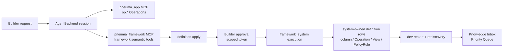
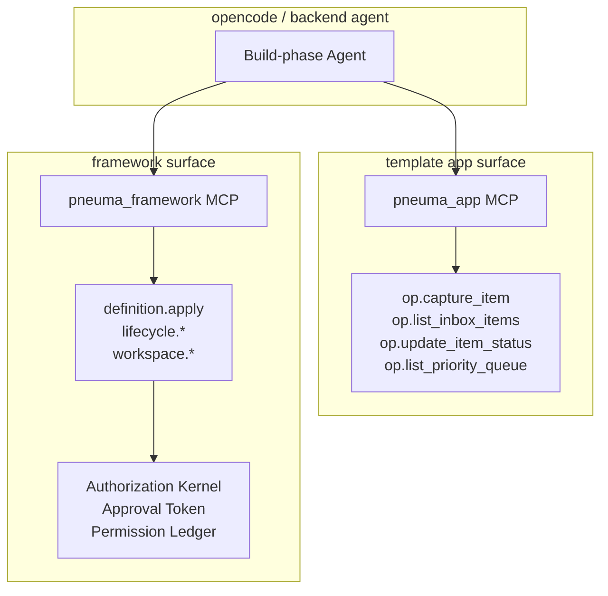
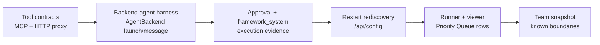

# Milestone 6 Snapshot: Real Backend-Agent Evolution

**Date:** 2026-05-01
**Status:** Closed snapshot for team alignment
**Audience:** teammates with zero Pneuma context
**Scope:** what M6 proves, what it deliberately does not prove, and what the next milestone should pressure.
**中文版:** [Milestone 6 快照](./milestone-6-snapshot.zh-CN.md)

中文摘要：

> M5 证明 Builder 的需求可以通过 governed `definition.apply` 演进 Knowledge Inbox，但 Agent proposal 仍是 deterministic script。M6 把这条路接到真正的 backend-agent 接入面：agent 通过 `AgentBackend.launch()` / `sendUserMessage()` 进入 session，看到 app `op.*` tools 和 framework semantic tools，并通过 `definition.apply` 完成同一个 Priority Queue evolution。

## Executive Summary

M6 closes the gap between a scripted Builder evolution and a backend-agent evolution path.

The important claim is not "a model can reliably invent a priority queue." The important claim is:

> A Build-phase Agent backend can be launched against a running pneuma-app, discover framework semantic tools, call `definition.apply`, pass through approval and restart rediscovery, and leave the app with a new governed capability.

M6 keeps the product slice from M5 but changes the initiating path:

```text
Builder asks for priority review
  -> AgentBackend session starts
  -> backend sees appUrl + frameworkToolUrl
  -> pneuma_app exposes template op.* tools
  -> pneuma_framework exposes framework semantic tools
  -> agent calls definition.apply
  -> Builder approval gates execution
  -> framework_system applies definition rows
  -> dev service restarts and rediscover /api/config
  -> Knowledge Inbox shows Priority Queue
```

## System At A Glance



M6 adds a new example:

```text
examples/m6-real-agent-evolution/
  backend-harness.ts
  evolve-through-backend.test.ts
  run.ts
  run.test.ts
  README.md
```

The CI path uses a deterministic backend agent. That is intentional. It proves the backend-agent surface and governance path without making CI depend on model planning.

## What Changed

| Area | Result |
|---|---|
| Framework MCP contract | `definition.apply` is explicitly described as a framework semantic tool for app-definition mutation. |
| Framework tool bridge | `packages/core/bin/framework-mcp-bridge.ts` exposes framework tools to out-of-process backends through stdio MCP. |
| HTTP tool proxy | `startFrameworkToolHttpProxy()` exposes `GET /api/framework/tools` and `POST /api/framework/tools/:name` around the in-process `ToolRegistry`. |
| opencode adapter | Launch options now support `frameworkToolUrl`; opencode gets `pneuma_app` and `pneuma_framework` MCP servers when both app and framework URLs are present. |
| M6 harness | `ScriptedPriorityReviewAgentBackend` enters through `AgentBackend.launch()` and `sendUserMessage()`, discovers `definition.apply`, then calls it through the framework tool proxy. |
| M6 runner | `run.ts --backend fake` is deterministic and CI-safe; `run.ts --backend opencode` is a manual live-backend path. |
| Viewer | `?scenario=real-agent-evolution` adds a Backend Agent Session panel and keeps App/Data views visible. |

## Tool Surface



The boundary matters: app Operations stay app-facing; framework mutation stays semantic and governed. Raw framework-internal runtime Operations still do not become public `op.*` tools.

## Demo Surface

Canonical deterministic demo:

```bash
bun run examples/m6-real-agent-evolution/run.ts --backend fake --port 0
```

Open the printed scenario URL:

```text
http://127.0.0.1:<port>/?scenario=real-agent-evolution
```

Manual opencode path:

```bash
OPENCODE_MODEL=openrouter/anthropic/claude-opus-4.7 \
bun run examples/m6-real-agent-evolution/run.ts --backend opencode --port 8876
```

The M6 surface is split deliberately:

- **Left side:** end-user Knowledge Inbox, with App/Data tabs and Priority Queue rows.
- **Right side:** Builder request, Backend Agent Session, Agent proposal, Governance timeline, Substrate delta.

This lets zero-context teammates see why M6 matters: the app changed, and the initiating actor is now a backend-agent session using framework semantic tools.

## What Is Proven

| Capability | Current proof |
|---|---|
| Framework semantic tool exposure | MCP tests prove `definition.apply` is agent-facing with stable object input schema. |
| Out-of-process bridge | `framework-mcp-bridge.test.ts` proves list/call proxy behavior and failure semantics. |
| HTTP tool proxy | `framework-tool-http.test.ts` proves `/api/framework/tools` list/call contract. |
| opencode dual tool wiring | `backend-opencode/test/adapter.test.ts` proves `pneuma_app` + `pneuma_framework` MCP config. |
| Backend-agent entry path | `evolve-through-backend.test.ts` launches an `AgentBackend`, sends a Builder prompt, captures four `definition.apply` tool calls. |
| Governance preserved | Each apply result still proves Builder approval, `build_agent` requester, and `framework_system` execution. |
| Restart rediscovery | The same Priority Queue definition rows are rediscovered through `/api/config`. |
| Public API | `run.test.ts` verifies `GET /api/operations/list_priority_queue -> 3 rows`. |
| Viewer narrative | `viewer-contract.test.ts` covers the M6 backend-agent scenario surface. |
| Browser e2e | Live browser check verified M6 scenario, Data view, P1/P2/P3 rows, and 0 console errors. |

## Evidence Matrix



Latest verification before snapshot:

```text
M6 focused suite: 50 pass, 0 fail
M5 + definition.apply regression: 61 pass, 0 fail
Operation bridge / agent backend contract subset: 18 pass, 0 fail
Typecheck: pass
Diff check: pass
Browser e2e:
  /?scenario=real-agent-evolution App view: Backend Agent Session visible, definition.apply proxy narrative visible, 0 console errors
  /?scenario=real-agent-evolution Data view: P1/P2/P3 rows visible, definition evidence visible, 0 console errors
```

Copy-paste verification set:

```bash
bun test packages/core/test/mcp-server.test.ts packages/core/test/template-mcp-bridge.test.ts packages/core/test/framework-mcp-bridge.test.ts packages/core/test/framework-tool-http.test.ts packages/backend-opencode/test/adapter.test.ts examples/m6-real-agent-evolution/evolve-through-backend.test.ts examples/m6-real-agent-evolution/run.test.ts templates/knowledge-inbox-core-domain/test/viewer-contract.test.ts

bun test examples/m5-knowledge-inbox-builder-evolution/evolve.test.ts examples/m5-knowledge-inbox-builder-evolution/run.test.ts templates/knowledge-inbox-core-domain/test/viewer-contract.test.ts packages/core/test/tools/definition-apply.test.ts

bun test packages/core/test/operation-tool-bridge.test.ts packages/core/test/agent-backend/types.test.ts

bun run typecheck

git diff --check
```

## What This Does Not Prove Yet

| Not proven | Why it matters |
|---|---|
| Production LLM planning reliability | CI uses a deterministic backend agent; opencode is manual because model output is not deterministic. |
| Full live opencode completion semantics | The adapter wires tools, but model prompting, wait-until-complete, transcript persistence, and retry UX still need hardening. |
| Dynamic app MCP refresh after random-port restart | `pneuma_app` is configured at launch time. Use a fixed port for manual live demos; future protocol work should refresh app service URLs after restart. |
| Hot reload | Definition changes still depend on restart rediscovery. |
| Builder-authored code handlers | The Priority Queue still uses safe query-backed Operations. |
| Production enterprise security | M2 governance is exercised, but production IAM/admin workflow remains future work. |
| Semantic/vector index | Still deferred. Relational rows remain source of truth; vector search should be a derived index later. |
| Release-mode Runtime Agent | M6 is Build-phase Agent only. |

## Strategic Read

M6 closes the most important caveat in M5:

```text
M5: A deterministic Agent proposal can evolve a real app.
M6: A backend-agent session can reach the same governed evolution path.
```

This is the first milestone where the project can honestly say the app-evolution loop is no longer just a script around framework primitives. The framework now has an agent-facing semantic tool surface that a real backend can attach to.

## Next Gate

M6 suggests a narrower next decision than "more enterprise security" or "semantic index immediately."

| Direction | Why |
|---|---|
| **Protocol / live-agent hardening** | Recommended next pressure if the team wants the opencode path to become demo-grade without caveats: completion events, restart URL refresh, permission prompt continuity, transcript replay. |
| **Semantic index track** | Still important, but should remain derived infrastructure over the now-real app substrate. |
| **Hot reload / custom code handlers** | Powerful, but higher blast radius. Better after live-agent continuity is less brittle. |

## Evidence

M6 implementation commits before this snapshot:

```text
f2d75f4 test: expose definition apply as framework MCP tool
5c15a75 feat: wire framework tools into opencode MCP
5eba725 test: evolve knowledge inbox through backend agent
f8a3d7a feat: add M6 backend agent runner
aae5cd3 feat: add M6 backend agent viewer narrative
1177b37 fix: make framework bridge helper fail without exiting
```

Reading path for zero-context teammates:

1. [Architecture README](./README.md) for the current map.
2. [Milestone 5 Snapshot](./milestone-5-snapshot.md) for Builder-evolved app capability.
3. This M6 snapshot for backend-agent evolution.
4. [M6 Real Backend-Agent Evolution README](../../examples/m6-real-agent-evolution/README.md) for the runnable demo.
