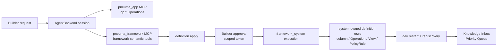
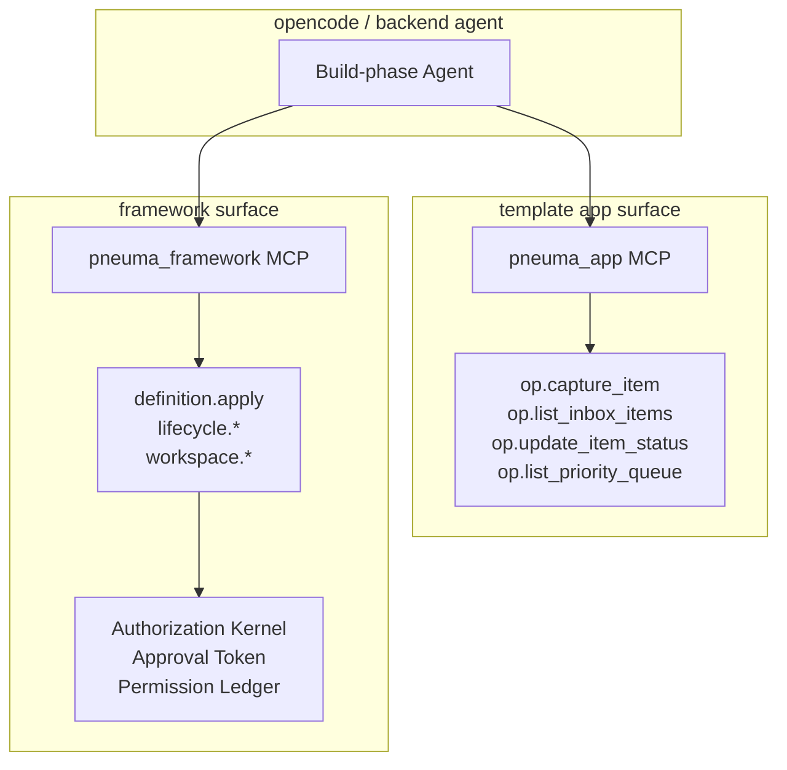
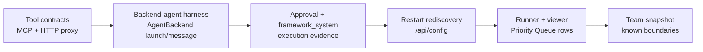

# Milestone 6 快照：真实 Backend-Agent 演进

**日期：** 2026-05-01
**状态：** 面向团队对齐的 closed snapshot
**受众：** 0 预备知识团队成员
**范围：** M6 证明了什么、明确没有证明什么，以及下一阶段应该压哪条边界。
**English version:** [Milestone 6 Snapshot](./milestone-6-snapshot.md)

## 执行摘要

M6 关闭的是 M5 deterministic Builder evolution 和真实 backend-agent evolution path 之间的缺口。

关键 claim 不是“模型已经能稳定规划 Priority Queue”，而是：

> Build-phase Agent backend 可以被接到运行中的 pneuma-app 上，发现 framework semantic tools，调用 `definition.apply`，穿过 approval 与 restart rediscovery，并让 app 获得新的受治理能力。

M6 沿用 M5 的产品切片，但替换发起路径：

```text
Builder 请求按优先级 review
  -> AgentBackend session 启动
  -> backend 收到 appUrl + frameworkToolUrl
  -> pneuma_app 暴露 template op.* tools
  -> pneuma_framework 暴露 framework semantic tools
  -> agent 调用 definition.apply
  -> Builder approval gate 执行
  -> framework_system 写入 definition rows
  -> dev service restart 并通过 /api/config rediscover
  -> Knowledge Inbox 出现 Priority Queue
```

## 系统一览



M6 新增 example：

```text
examples/m6-real-agent-evolution/
  backend-harness.ts
  evolve-through-backend.test.ts
  run.ts
  run.test.ts
  README.md
```

CI 路径使用 deterministic backend agent，这是有意选择。它验证 backend-agent surface 和治理路径，而不把 CI 绑定到模型规划稳定性上。

## 改了什么

| Area | 结果 |
|---|---|
| Framework MCP contract | `definition.apply` 被明确描述为用于 app-definition mutation 的 framework semantic tool。 |
| Framework tool bridge | `packages/core/bin/framework-mcp-bridge.ts` 通过 stdio MCP 把 framework tools 暴露给 out-of-process backend。 |
| HTTP tool proxy | `startFrameworkToolHttpProxy()` 在 in-process `ToolRegistry` 外包一层 `GET /api/framework/tools` 和 `POST /api/framework/tools/:name`。 |
| opencode adapter | Launch options 支持 `frameworkToolUrl`；同时有 app URL 和 framework URL 时，opencode 会拿到 `pneuma_app` 与 `pneuma_framework` 两个 MCP server。 |
| M6 harness | `ScriptedPriorityReviewAgentBackend` 通过 `AgentBackend.launch()` 和 `sendUserMessage()` 进入，发现 `definition.apply`，再通过 framework tool proxy 调用它。 |
| M6 runner | `run.ts --backend fake` 是 deterministic / CI-safe；`run.ts --backend opencode` 是手动 live-backend path。 |
| Viewer | `?scenario=real-agent-evolution` 新增 Backend Agent Session 面板，并保留 App/Data 双视图。 |

## Tool Surface



这个边界非常关键：app Operations 仍是 app-facing；framework mutation 仍走 semantic 且受治理的通路。Raw framework-internal runtime Operations 依旧不会变成 public `op.*` tools。

## Demo Surface

Canonical deterministic demo：

```bash
bun run examples/m6-real-agent-evolution/run.ts --backend fake --port 0
```

打开 runner 输出的 scenario URL：

```text
http://127.0.0.1:<port>/?scenario=real-agent-evolution
```

手动 opencode path：

```bash
OPENCODE_MODEL=openrouter/anthropic/claude-opus-4.7 \
bun run examples/m6-real-agent-evolution/run.ts --backend opencode --port 8876
```

M6 surface 是刻意左右分屏：

- **左侧：** End-user Knowledge Inbox，含 App/Data tabs 和 Priority Queue rows。
- **右侧：** Builder request、Backend Agent Session、Agent proposal、Governance timeline、Substrate delta。

这样 0 预备知识的同事可以看懂 M6 的意义：app 发生了变化，而且发起变化的是一个 backend-agent session，它使用的是 framework semantic tools。

## 已证明范围

| Capability | 当前证据 |
|---|---|
| Framework semantic tool exposure | MCP tests 证明 `definition.apply` 是 agent-facing，且有稳定 object input schema。 |
| Out-of-process bridge | `framework-mcp-bridge.test.ts` 证明 list/call proxy behavior 与失败语义。 |
| HTTP tool proxy | `framework-tool-http.test.ts` 证明 `/api/framework/tools` list/call contract。 |
| opencode dual tool wiring | `backend-opencode/test/adapter.test.ts` 证明 `pneuma_app` + `pneuma_framework` MCP config。 |
| Backend-agent entry path | `evolve-through-backend.test.ts` 启动 `AgentBackend`、发送 Builder prompt，并捕捉 4 次 `definition.apply` tool call。 |
| Governance preserved | 每次 apply result 仍证明 Builder approval、`build_agent` requester、`framework_system` execution。 |
| Restart rediscovery | 同一个 Priority Queue definition rows 通过 `/api/config` 被重新发现。 |
| Public API | `run.test.ts` 验证 `GET /api/operations/list_priority_queue -> 3 rows`。 |
| Viewer narrative | `viewer-contract.test.ts` 覆盖 M6 backend-agent scenario surface。 |
| Browser e2e | Live browser check 验证 M6 scenario、Data view、P1/P2/P3 rows、0 console errors。 |

## 证据矩阵



Snapshot 前最新 verification：

```text
M6 focused suite: 50 pass, 0 fail
M5 + definition.apply regression: 61 pass, 0 fail
Operation bridge / agent backend contract subset: 18 pass, 0 fail
Typecheck: pass
Diff check: pass
Browser e2e:
  /?scenario=real-agent-evolution App view: Backend Agent Session visible, definition.apply proxy narrative visible, 0 console errors
  /?scenario=real-agent-evolution Data view: P1/P2/P3 rows visible, definition evidence visible, 0 console errors
```

Copy-paste verification set：

```bash
bun test packages/core/test/mcp-server.test.ts packages/core/test/template-mcp-bridge.test.ts packages/core/test/framework-mcp-bridge.test.ts packages/core/test/framework-tool-http.test.ts packages/backend-opencode/test/adapter.test.ts examples/m6-real-agent-evolution/evolve-through-backend.test.ts examples/m6-real-agent-evolution/run.test.ts templates/knowledge-inbox-core-domain/test/viewer-contract.test.ts

bun test examples/m5-knowledge-inbox-builder-evolution/evolve.test.ts examples/m5-knowledge-inbox-builder-evolution/run.test.ts templates/knowledge-inbox-core-domain/test/viewer-contract.test.ts packages/core/test/tools/definition-apply.test.ts

bun test packages/core/test/operation-tool-bridge.test.ts packages/core/test/agent-backend/types.test.ts

bun run typecheck

git diff --check
```

## 尚未证明

| 未证明 | 为什么重要 |
|---|---|
| 生产级 LLM planning reliability | CI 使用 deterministic backend agent；opencode 路径是手动的，因为模型输出不够 deterministic。 |
| 完整 live opencode completion semantics | Adapter 已经 wire tools，但模型 prompt、等待完成、transcript persistence、retry UX 仍需 hardening。 |
| Random-port restart 后动态刷新 app MCP | `pneuma_app` 在 launch 时配置。手动 live demo 建议固定 port；后续 protocol work 应在 restart 后刷新 app service URL。 |
| Hot reload | Definition changes 仍依赖 restart rediscovery。 |
| Builder-authored code handlers | Priority Queue 仍使用安全的 query-backed Operations。 |
| 生产级企业安全 | M2 governance 被调用了，但 production IAM/admin workflow 仍是未来工作。 |
| Semantic/vector index | 仍后置。Relational rows 继续是 source of truth；vector search 后续应作为 derived index。 |
| Release-mode Runtime Agent | M6 只覆盖 Build-phase Agent。 |

## 战略判断

M6 关闭了 M5 最大的 caveat：

```text
M5：deterministic Agent proposal 可以演进真实 app。
M6：backend-agent session 可以抵达同一条受治理的 evolution path。
```

这是项目第一次可以比较诚实地说：app-evolution loop 不再只是围绕 framework primitives 的脚本。framework 现在有了真实 backend 可以挂载的 agent-facing semantic tool surface。

## 下一门

M6 之后的下一门应该比“继续做企业安全”或“立刻做 semantic index”更窄一点。

| 方向 | 原因 |
|---|---|
| **Protocol / live-agent hardening** | 推荐作为下一条压力线：completion events、restart URL refresh、permission prompt continuity、transcript replay，让 opencode path 从 manual smoke 变成 demo-grade。 |
| **Semantic index track** | 仍重要，但应保持为现在真实 app substrate 上的 derived infrastructure。 |
| **Hot reload / custom code handlers** | 价值很高，但 blast radius 更大。最好等 live-agent continuity 不那么脆弱之后再压。 |

## Evidence

M6 snapshot 前的 implementation commits：

```text
f2d75f4 test: expose definition apply as framework MCP tool
5c15a75 feat: wire framework tools into opencode MCP
5eba725 test: evolve knowledge inbox through backend agent
f8a3d7a feat: add M6 backend agent runner
aae5cd3 feat: add M6 backend agent viewer narrative
1177b37 fix: make framework bridge helper fail without exiting
```

0 预备知识阅读路径：

1. [Architecture README](./README.md) 理解当前地图。
2. [Milestone 5 Snapshot](./milestone-5-snapshot.zh-CN.md) 理解 Builder-evolved app capability。
3. 这份 M6 snapshot 理解 backend-agent evolution。
4. [M6 Real Backend-Agent Evolution README](../../examples/m6-real-agent-evolution/README.md) 运行 demo。
