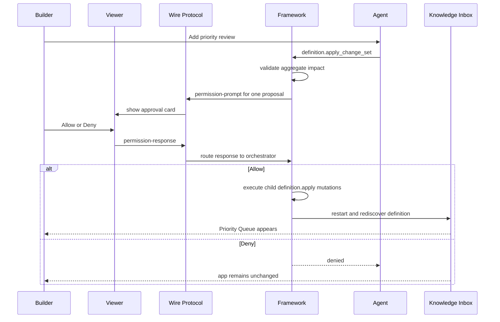

# Milestone 7 Snapshot: Capability Change-Set Approval

**Date:** 2026-05-02
**Status:** Closed after revised allow/deny verification and live demo review
**Audience:** teammates with zero Pneuma context
**Scope:** what M7 proves, what it deliberately does not prove, and what should come next.
**Chinese version:** [Milestone 7 Snapshot zh-CN](./milestone-7-snapshot.zh-CN.md)

## Executive Summary

M7 closes a product-semantics gap that the first live approval cut exposed.

M6 proved that a real backend Build-phase Agent can discover framework semantic tools and evolve Knowledge Inbox through governed app-definition mutation. The first M7 cut made the approval prompt visible in the viewer, but it still asked the Builder to approve four low-level mutations separately.

That was technically valid, but product-wrong. A Builder asked for one thing: "add priority review." The approval unit must therefore be one capability proposal, not four implementation steps.

M7 now proves this stronger claim:

> A backend Build-phase Agent can propose one coherent capability change set, the Builder can approve or deny that proposal once in the live app viewer, and the framework can execute all child definition mutations through the existing governance path or leave the app unchanged.

`definition.apply` remains the low-level primitive for one app-definition mutation. M7 adds `definition.apply_change_set` as the agent-facing tool for one Builder intent that expands into multiple governed definition changes.

## Story



## What Changed From The First M7 Cut

| Area | First cut | Revised M7 |
|---|---|---|
| Approval unit | One prompt per child `definition.apply`. | One prompt for the whole capability proposal. |
| Agent tool | Agent called `definition.apply` four times. | Agent calls `definition.apply_change_set` once. |
| Builder semantics | Builder could approve a half-solution. | Builder approves or denies one coherent request. |
| Execution semantics | Child mutations were independent approval moments. | Child mutations are internal execution steps after proposal approval. |
| Transcript | Four prompts on allow path. | Exactly one proposal prompt and one response on allow/deny paths. |

## What The Builder Sees

The demo still uses the Knowledge Inbox shell:

- Left side: the end-user app remains usable, with App/Data views and live rows.
- Right side: Builder request, one capability proposal, live approval card, execution transcript, and substrate delta.
- Drawer: full transcript with Builder request, assistant text, `definition.apply_change_set`, permission prompt, approval response, tool result, restart, and completion.

Before approval:


After allow:


After deny:


## What The Framework Guarantees

```text
Builder intent
  -> definition.apply_change_set
  -> aggregate validation and impact disclosure
  -> one framework-owned permission prompt
  -> viewer permission-response
  -> framework_system execution or denial
  -> child definition.apply mutations
  -> restart rediscovery
  -> transcript evidence
```

The important governance boundary remains:

- `build_agent` can propose definition evolution.
- `build_agent` cannot directly apply definition evolution.
- Builder approval creates scoped authority for `framework_system`.
- `framework_system` executes the approved change set.
- Denial stops before any child app-definition mutation.

M7 also makes a product-level choice explicit: partial approval is not a normal state. If a technical reviewer dislikes one child step, they deny the proposal and ask the Agent for a revised proposal.

## Implementation Surface

Core:

- `definition.apply_change_set` framework semantic tool
- `LifecycleOrchestrator.runDefinitionChangeSet(...)`
- proposal-level framework permission prompt and response routing
- aggregate predicted impact for schema / Operation / View / PolicyRule changes
- child execution through existing `definition.apply` restart/rediscovery path

M7 example:

```text
examples/m7-live-agent-approval-protocol/
  run.ts
  run.test.ts
  transcript.ts
  transcript.test.ts
  README.md
```

Knowledge Inbox:

- `GET /api/framework-session`
- `GET /api/agent-execution-transcript`
- `?scenario=live-approval`
- `data-testid="live-approval-card"`
- `permission-response` over the existing viewer WebSocket

## Verification Report

Focused revised M7 and governance suite:

```text
bun test \
  examples/m7-live-agent-approval-protocol/transcript.test.ts \
  examples/m7-live-agent-approval-protocol/run.test.ts \
  packages/core/test/tools/definition-apply.test.ts \
  packages/core/test/mcp-server.test.ts \
  packages/core/test/tools/build.test.ts \
  templates/knowledge-inbox-core-domain/test/viewer-contract.test.ts

71 pass, 0 fail
```

Focused behavior evidence:

```json
{
  "allowPath": {
    "tool": "definition.apply_change_set",
    "permissionPrompts": 1,
    "approvalResponses": 1,
    "childDefinitionMutations": 4,
    "priorityRows": 3,
    "status": "completed"
  },
  "denyPath": {
    "tool": "definition.apply_change_set",
    "permissionPrompts": 1,
    "approvalResponses": 1,
    "childDefinitionMutations": 0,
    "priorityQueuePresent": false,
    "status": "denied"
  }
}
```

Live HTTP/WebSocket sanity check:

```json
{
  "status": "completed",
  "prompts": 1,
  "approvals": 1,
  "rows": 3
}
```

Other checks:

```text
bun run typecheck -> pass
bun test $(rg --files -g '*.test.ts' | rg -v 'docker-smoke|release-smoke') -> 1036 pass, 0 fail
git diff --check -> pass
```

## What Is Proven

| Claim | Evidence |
|---|---|
| One Builder intent can become one governed proposal | `definition.apply_change_set` is exposed in framework tools and used by M7 runner. |
| Builder approval is proposal-level | Allow and deny tests assert exactly one `permission_prompt`. |
| Deny leaves the app unchanged | Deny path records no child mutation and Priority Queue stays absent. |
| Allow executes the whole capability | Allow path applies priority column, query Operation, View, PolicyRule, restart rediscovery, and seeded rows. |
| The viewer explains the right unit | Live approval card says `definition.apply_change_set prompt` and "one capability proposal." |
| Transcript is durable evidence | Runner writes `data/m7-agent-execution-transcript.json`; app serves it through `/api/agent-execution-transcript`. |

## What Is Not Proven

M7 does not claim:

- production IAM
- policy authoring UI
- production multi-user workflow
- model planning reliability
- full database transactionality for change-set execution
- hot reload
- semantic/vector search
- release-mode Runtime Agent
- raw opencode MCP transcript fidelity

The current execution model is intentionally pragmatic: this is a low-frequency Builder action, so M7 prefers clear proposal semantics plus recoverable failure state over a heavy transaction subsystem.

## Recommended M8 Options

1. **Release packaging hardening:** package the evolved Knowledge Inbox into Docker with persistent SQLite volume and a release manifest after Builder evolution.
2. **Real opencode interactive proposal quality:** make opencode reliably choose `definition.apply_change_set`, preserve richer raw events, and test live deny/retry.
3. **Protocol SDK polish:** extract approval UI behavior into reusable React/Vanilla SDK helpers.
4. **Semantic index return:** add semantic retrieval as an app capability, with SQLite rows as source of truth and vector index as derived infrastructure.

My recommendation: M8 should prioritize release packaging hardening if the next milestone should increase product confidence; choose real opencode proposal quality first only if the next team share must center on "real agent, real approval."
