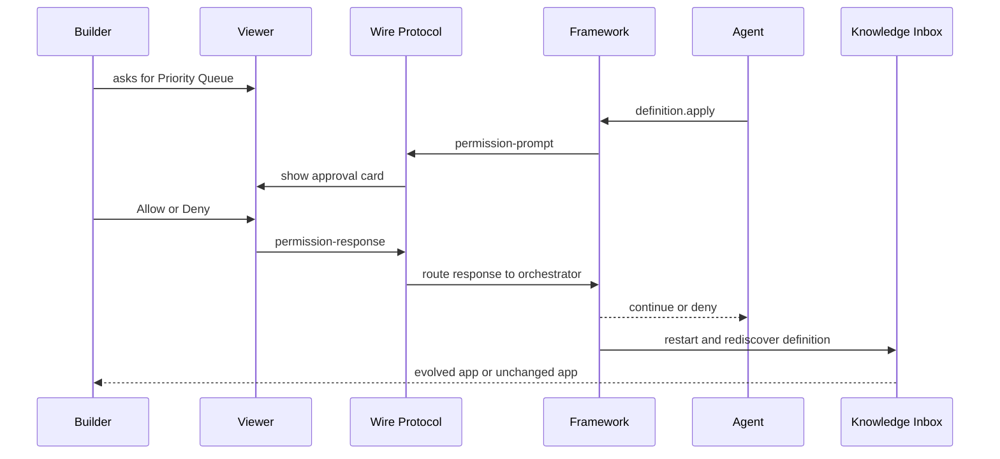

# Milestone 7 Snapshot: Live Agent Approval Protocol

**Date:** 2026-05-02
**Status:** Closed after deterministic allow/deny protocol verification and live browser screenshots
**Audience:** teammates with zero Pneuma context
**Scope:** what M7 proves, what it deliberately does not prove, and what should come next.
**中文版本:** [Milestone 7 快照](./milestone-7-snapshot.zh-CN.md)

中文摘要：

> M6 证明真实 backend-agent 可以通过 `pneuma_framework` 发现 `definition.apply` 并演进 Knowledge Inbox，但 approval 仍由 runner 自动通过。M7 把这一步变成可见的 Builder approval loop：agent 调用 `definition.apply` 后暂停，framework 通过已有 wire protocol 向 viewer 广播 permission prompt，Builder 在 Knowledge Inbox 里点击 Allow 或 Deny，响应通过 `permission-response` 回到 framework，最终 transcript 记录 before / work / after。Allow 路径产生 Priority Queue；Deny 路径保持 app 不变。

## Executive Summary

M7 closes the protocol gap left by M6.

The important claim is:

> A backend Build-phase Agent can pause on a framework-owned `definition.apply` prompt, a Builder can approve or deny that prompt in the live app viewer, and the framework can continue or block execution through the same governance path used by non-interactive tests.

M7 does not introduce a second mutation path. The app definition still changes only through `definition.apply`. The new work is the live approval and evidence surface around that primitive.

## Story



## What Changed From M6

| Area | M6 | M7 |
|---|---|---|
| Approval | Runner auto-approved prompts for demo completion. | Viewer shows approval card; Builder response travels over wire protocol. |
| Transcript | M6 trace stored agent text, tool calls, approval, results, after state. | M7 transcript stores Builder request, assistant text, tool calls, prompts, responses, results, restart, and completion as protocol-shaped events. |
| Viewer | Showed completed backend-agent trace after the fact. | Shows pending approval and live before/work/after evidence. |
| Deny path | Not the demo focus. | First-class path: deny leaves Priority Queue absent and records denied transcript. |
| Framework hook | Prompt broadcast only. | Adds permission response observer after the orchestrator accepts a framework prompt response. |

## What The Builder Sees

The M7 demo uses the same Knowledge Inbox app shell from M4-M6:

- Left side: the actual end-user app, with App/Data views and live rows.
- Right side: Builder request, live approval card, execution transcript, and substrate delta.
- Drawer: full transcript, including tool calls, permission prompts, approval responses, tool results, and completion.

Before approval:


After allow:


After deny:


## What The Framework Guarantees

```text
agent intent
  -> framework semantic tool call
  -> framework-owned permission prompt
  -> viewer permission-response
  -> authorization / approval ledger path
  -> framework_system execution or denial
  -> transcript evidence
```

The important governance boundary is unchanged:

- `build_agent` can propose a definition change.
- `build_agent` cannot directly apply that definition change.
- Builder approval creates the scoped authority.
- `framework_system` executes the mutation.
- Denial stops before app-definition mutation.

## Implementation Surface

New example:

```text
examples/m7-live-agent-approval-protocol/
  package.json
  run.ts
  run.test.ts
  transcript.ts
  transcript.test.ts
  README.md
```

Core additions:

- `LifecycleOrchestrator.setPermissionResponseHook(...)`
- `FrameworkPermissionResponseEvent`
- deterministic fake backend path with `--auto-decision allow|deny|none`
- Knowledge Inbox endpoints:
  - `GET /api/framework-session`
  - `GET /api/agent-execution-transcript`
- Knowledge Inbox viewer scenario:
  - `?scenario=live-approval`
  - `data-testid="live-approval-card"`
  - `permission-response` over the existing WebSocket

## Verification Report

Focused M7 and governance suite:

```text
bun test examples/m7-live-agent-approval-protocol/transcript.test.ts examples/m7-live-agent-approval-protocol/run.test.ts packages/core/test/tools/definition-apply.test.ts templates/knowledge-inbox-core-domain/test/viewer-contract.test.ts

65 pass, 0 fail
```

Non-Docker full suite:

```text
bun test $(rg --files -g '*.test.ts' | rg -v 'docker-smoke|release-smoke')

1034 pass, 0 fail
```

Other checks:

```text
bun run typecheck -> pass
git diff --check -> pass
```

Live protocol allow path:

```json
{
  "status": "completed",
  "transcriptApprovals": 4,
  "rows": 3,
  "hasPriority": true
}
```

Live protocol deny path:

```json
{
  "status": "denied",
  "approvals": 1,
  "priorityHttpStatus": 404,
  "hasPriority": false
}
```

Full `bun test` was attempted, but the Docker smoke path hung in `docker-credential-desktop get` during Docker build. This is an environment/Docker credential blocker, not an M7 regression. The Docker/release smoke tests were excluded from the 1034-test non-Docker run above.

## What Is Proven

| Claim | Evidence |
|---|---|
| Framework prompt can be answered by viewer protocol | Wire `permission-response` routes to `handleFrameworkPermissionResponse`. |
| Approval response is observable without replacing governance | `setPermissionResponseHook` fires after the orchestrator accepts the prompt id. |
| Allow path continues app evolution | Live allow produced Priority Queue, 3 rows, and completed transcript. |
| Deny path blocks mutation | Live deny produced `status=denied`, no Priority Queue Operation, and 404 for the priority API. |
| Viewer can explain the process | Headless Chrome screenshots show pending, completed, and denied states. |
| Transcript is durable | Runner writes `data/m7-agent-execution-transcript.json`; app serves it through `/api/agent-execution-transcript`. |

## What Is Not Proven

M7 does not claim:

- production IAM
- policy authoring UI
- production multi-user workflow
- model planning reliability
- hot reload
- semantic/vector search
- release-mode Runtime Agent
- raw opencode MCP transcript fidelity

M7 proves a dev-mode Builder approval primitive, not a finished enterprise security product.

## Recommended M8 Options

1. **Real opencode interactive approval:** make the opencode-backed path pause/resume through the same viewer approval card and preserve richer raw tool events.
2. **Release packaging hardening:** package the evolved Knowledge Inbox into Docker with persistent SQLite volume and a release manifest after Builder evolution.
3. **Protocol SDK polish:** extract the live approval UI behavior into reusable React/Vanilla SDK helpers.
4. **Semantic index return:** add semantic retrieval as an app capability, keeping SQLite rows as source of truth and treating vector index as derived infrastructure.

My recommendation is option 1 if the next team share should focus on "real agent, real approval"; option 2 if the next milestone should move toward deployable product confidence.
