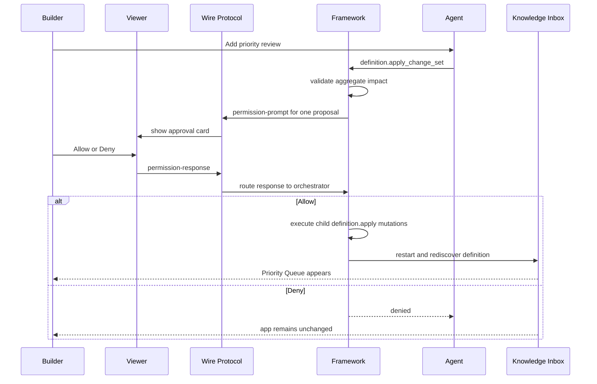
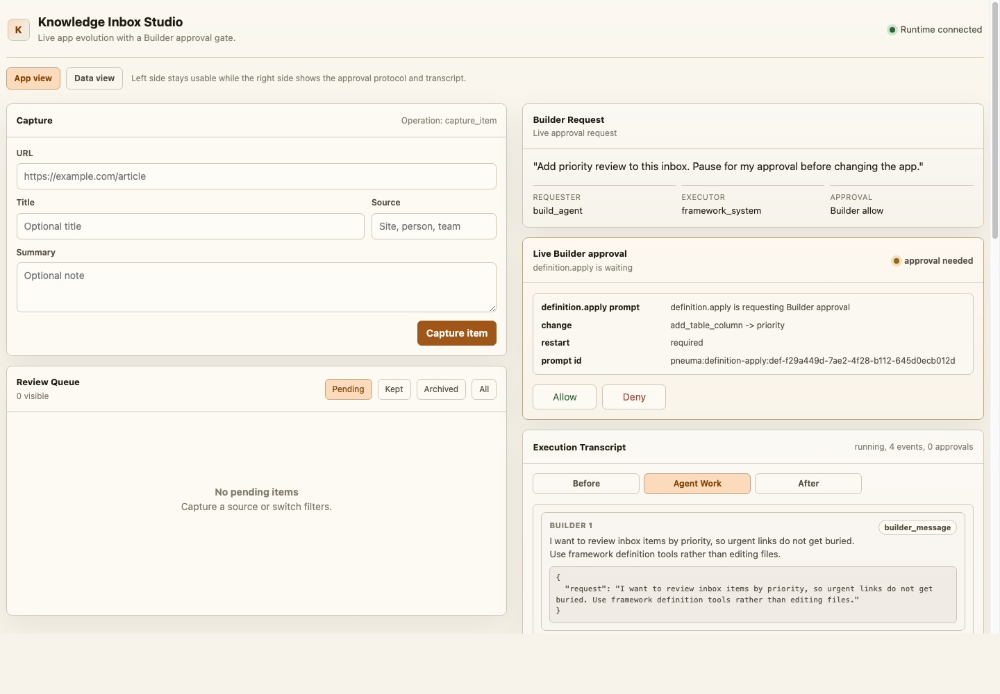
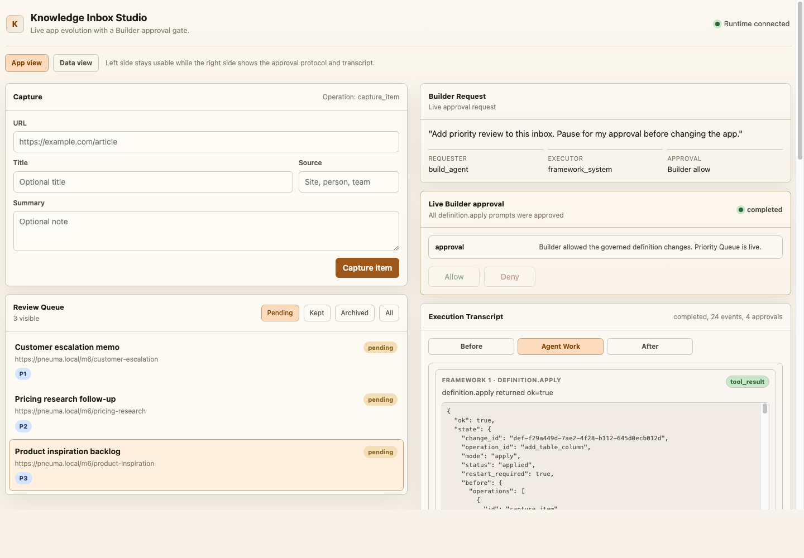
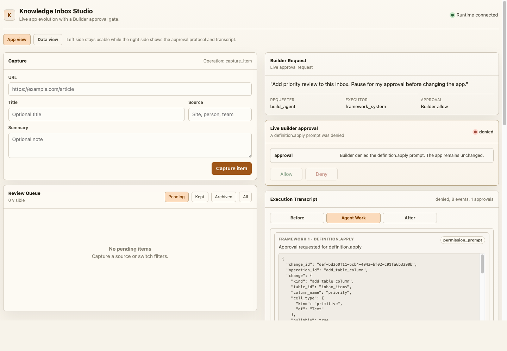

# Milestone 7 Snapshot: Capability Change-Set Approval

**Date:** 2026-05-02
**Status:** Re-closed after live opencode hardening, deferred approval, and full-capability completion review
**Audience:** teammates with zero Pneuma context
**Scope:** what M7 proves, what it deliberately does not prove, and what should come next.
**Chinese version:** [Milestone 7 Snapshot zh-CN](./milestone-7-snapshot.zh-CN.md)

## Executive Summary

M7 closes a product-semantics gap that the first live approval cut exposed.

M6 proved that a real backend Build-phase Agent can discover framework semantic tools and evolve Knowledge Inbox through governed app-definition mutation. The first M7 cut made the approval prompt visible in the viewer, but it still asked the Builder to approve four low-level mutations separately.

That was technically valid, but product-wrong. A Builder asked for one thing: "add priority review." The approval unit must therefore be one capability proposal, not four implementation steps.

The post-review M7 hardening closes one more gap: the opencode path no longer replays an exact fixture. The real backend agent receives the current app-definition snapshot, constructs the `definition.apply_change_set` proposal itself, submits it with deferred approval, and the runner only reports completion after the full Priority Queue capability is observable.

M7 now proves this stronger claim:

> A backend Build-phase Agent can propose one coherent capability change set, the Builder can approve or deny that proposal once in the live app viewer, denial leaves the app unchanged, and the allow path is only considered complete after schema, Operation, View, PolicyRule, and live rows are all observable.

`definition.apply` remains the low-level primitive for one app-definition mutation. M7 adds `definition.apply_change_set` as the agent-facing tool for one Builder intent that expands into multiple governed definition changes.

## Story



## What Changed From The First M7 Cut

| Area | First cut | Revised M7 |
|---|---|---|
| Approval unit | One prompt per child `definition.apply`. | One prompt for the whole capability proposal. |
| Agent tool | Agent called `definition.apply` four times. | Agent calls `definition.apply_change_set` once. |
| Builder semantics | Builder could approve a half-solution. | Builder approves or denies one coherent request. |
| Execution semantics | Child mutations were independent approval moments. | Child mutations are internal execution steps after proposal approval. |
| Transcript | Four prompts on allow path. | Exactly one proposal prompt and one response on allow/deny paths. |
| Live opencode path | The early M7 path could be understood as a scripted success. | The opencode path asks the real backend agent to construct the proposal from the app-definition snapshot. |
| Completion semantics | The runner could finish after a narrow operation check. | The runner now gates completion on column + Operation + View + PolicyRule + priority rows. |

## What The Builder Sees

The demo still uses the Knowledge Inbox shell:

- Left side: the end-user app remains usable, with App/Data views and live rows.
- Right side: Builder request, one capability proposal, live approval card, execution transcript, and substrate delta.
- Drawer: full transcript with Builder request, assistant text, `definition.apply_change_set`, permission prompt, approval response, tool result, restart, and completion.

Before approval:



After allow:



After deny:



## What The Framework Guarantees

```text
Builder intent
  -> definition.apply_change_set
  -> aggregate validation and impact disclosure
  -> one framework-owned permission prompt
  -> viewer permission-response
  -> framework_system execution or denial
  -> child definition.apply mutations
  -> restart rediscovery
  -> transcript evidence
```

The important governance boundary remains:

- `build_agent` can propose definition evolution.
- `build_agent` cannot directly apply definition evolution.
- Builder approval creates scoped authority for `framework_system`.
- `framework_system` executes the approved change set.
- Denial stops before any child app-definition mutation.
- The demo runner does not call the allow path "completed" until the evolved capability is visible through `/api/config` and `list_priority_queue`.

M7 also makes a product-level choice explicit: partial approval is not a normal state. If a technical reviewer dislikes one child step, they deny the proposal and ask the Agent for a revised proposal.

This is not a claim of database-level transactionality. M7 validates known child mutation shapes before approval and denies before mutation, but a post-approval runtime failure still lands in a recoverable failed state rather than a fully transactional rollback.

## Implementation Surface

Core:

- `definition.apply_change_set` framework semantic tool
- `approval_mode: "defer"` for live backend agents, so the MCP tool call can return after submitting the proposal while the Builder reviews it
- `LifecycleOrchestrator.runDefinitionChangeSet(...)`
- proposal-level framework permission prompt and response routing
- aggregate predicted impact for schema / Operation / View / PolicyRule changes
- pre-approval validation for CellType, query-backed Operation input/output/handler shape, View presentation, and PolicyRule shape
- child execution through existing `definition.apply` restart/rediscovery path

M7 example:

```text
examples/m7-live-agent-approval-protocol/
  run.ts
  run.test.ts
  transcript.ts
  transcript.test.ts
  README.md
```

Knowledge Inbox:

- `GET /api/framework-session`
- `GET /api/agent-execution-transcript`
- `?scenario=live-approval`
- `data-testid="live-approval-card"`
- `permission-response` over the existing viewer WebSocket

Live opencode hardening:

- opencode server launch can use an ephemeral port to avoid local server conflicts
- the prompt asks opencode to construct the proposal instead of applying an exact JSON fixture
- the runner waits for the Builder approval response before finalizing the run
- the completion gate verifies the full capability, not only a query endpoint

## Verification Report

Focused revised M7 and governance suite:

```text
bun test \
  examples/m7-live-agent-approval-protocol/transcript.test.ts \
  examples/m7-live-agent-approval-protocol/run.test.ts \
  packages/core/test/tools/definition-apply.test.ts \
  packages/core/test/mcp-server.test.ts \
  packages/core/test/tools/build.test.ts \
  packages/backend-opencode/test/adapter.test.ts \
  templates/knowledge-inbox-core-domain/test/viewer-contract.test.ts

84 pass, 0 fail
```

Focused behavior evidence:

```json
{
  "allowPath": {
    "tool": "definition.apply_change_set",
    "permissionPrompts": 1,
    "approvalResponses": 1,
    "childDefinitionMutations": 4,
    "priorityRows": 3,
    "status": "completed"
  },
  "denyPath": {
    "tool": "definition.apply_change_set",
    "permissionPrompts": 1,
    "approvalResponses": 1,
    "childDefinitionMutations": 0,
    "priorityQueuePresent": false,
    "status": "denied"
  }
}
```

Live HTTP/WebSocket sanity check:

```json
{
  "status": "completed",
  "prompts": 1,
  "approvals": 1,
  "rows": 3
}
```

Latest manual opencode run reviewed before this snapshot:

```json
{
  "backend": "opencode",
  "scenario": "live-approval",
  "status": "completed",
  "approval": "allow",
  "tool_call": "definition.apply_change_set",
  "tool_result_source": "live_completion_gate",
  "config_surfaces": ["priority column", "list_priority_queue operation", "priority_queue view", "priority_queue read policy"],
  "rows": ["P1", "P2", "P3"],
  "ledger_tail": [
    "permission_requested",
    "permission_responded",
    "approval_token_issued",
    "permission_execution_authorized",
    "permission_execution_completed"
  ]
}
```

Other checks:

```text
bun run typecheck -> pass
bun test $(rg --files -g '*.test.ts' | rg -v 'docker-smoke|release-smoke') -> 1044 pass, 0 fail
git diff --check -> pass
```

## What Is Proven

| Claim | Evidence |
|---|---|
| One Builder intent can become one governed proposal | `definition.apply_change_set` is exposed in framework tools and used by M7 runner. |
| Builder approval is proposal-level | Allow and deny tests assert exactly one `permission_prompt`. |
| Deny leaves the app unchanged | Deny path records no child mutation and Priority Queue stays absent. |
| Allow executes the whole capability | Allow path applies priority column, query Operation, View, PolicyRule, restart rediscovery, and seeded rows; the runner waits for every surface before completion. |
| The viewer explains the right unit | Live approval card says `definition.apply_change_set prompt` and "one capability proposal." |
| Transcript is durable evidence | Runner writes `data/m7-agent-execution-transcript.json`; app serves it through `/api/agent-execution-transcript`. |
| Real opencode can drive the proposal path | The manual opencode run constructs and submits `definition.apply_change_set` with deferred approval; the viewer approval response triggers execution. |
| Invalid proposals fail before approval | Focused tests reject invalid CellType, unsupported query Operation shapes, invalid View presentation, and expired deferred prompts before child mutations run. |

## What Is Not Proven

M7 does not claim:

- production IAM
- policy authoring UI
- production multi-user workflow
- statistically reliable model planning across many opencode runs
- full database transactionality or automatic rollback for every possible post-approval runtime failure
- hot reload
- semantic/vector search
- release-mode Runtime Agent
- raw opencode MCP transcript fidelity

The current execution model is intentionally pragmatic: this is a low-frequency Builder action, so M7 prefers clear proposal semantics, strong pre-approval validation, and recoverable failure state over a heavy transaction subsystem.

## Recommended M8 Options

1. **Release packaging hardening:** package the evolved Knowledge Inbox into Docker with persistent SQLite volume and a release manifest after Builder evolution.
2. **Change-set recovery semantics:** decide whether post-approval child mutation failure should reset to last-good definition, record a repair plan, or become an explicit transaction primitive.
3. **Protocol SDK polish:** extract approval UI behavior into reusable React/Vanilla SDK helpers.
4. **Semantic index return:** add semantic retrieval as an app capability, with SQLite rows as source of truth and vector index as derived infrastructure.

My recommendation: M8 should prioritize release packaging hardening if the next milestone should increase product confidence. If the team wants to keep pressure on enterprise correctness first, choose change-set recovery semantics before adding new user-facing capability.
