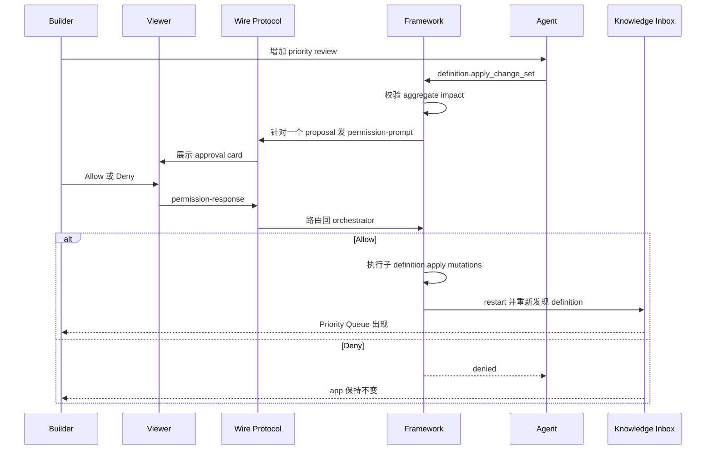

# Milestone 7 快照：Capability Change-Set Approval

**日期：** 2026-05-02
**状态：** live opencode hardening、deferred approval、full-capability completion review 后重新闭合
**受众：** 0 预备知识团队成员
**范围：** M7 证明了什么、明确没有证明什么，以及下一阶段应该压哪条边界。
**English version:** [Milestone 7 Snapshot](./milestone-7-snapshot.md)

## 执行摘要

M7 关闭的是第一版 live approval 暴露出来的产品语义问题。

M6 已经证明真实 backend Build-phase Agent 可以发现 framework semantic tools，并通过 governed app-definition mutation 演进 Knowledge Inbox。第一版 M7 又证明了 approval prompt 可以在 viewer 里可见、可点击。

但第一版 M7 仍然让 Builder 对 4 个低层 definition mutation 分别 approve。这在技术上成立，在产品语义上不成立。Builder 提出的需求是一个整体："给 inbox 增加 priority review。" 所以 approval 的单位也必须是一个 capability proposal，而不是 4 个实现步骤。

这次复盘后的 M7 又补上了一层：opencode 路径不再 replay 一份 exact fixture。真实 backend agent 会拿到当前 app-definition snapshot，自己构造 `definition.apply_change_set` proposal，用 deferred approval 提交；runner 只有在完整 Priority Queue capability 都可观察之后，才会宣布完成。

修正版 M7 证明了更强的主张：

> Backend Build-phase Agent 可以提出一个完整 capability change set；Builder 在真实 app viewer 里只 approve 或 deny 一次；deny 会让 app 保持不变；allow path 只有在 schema、Operation、View、PolicyRule、live rows 都可观察之后，才被视为完成。

`definition.apply` 仍然是单个 app-definition mutation 的底层 primitive。M7 新增 `definition.apply_change_set`，作为 agent 面向一个 Builder intent 时使用的语义工具。

## 故事线



## 相比第一版 M7 改了什么

| Area | 第一版 | 修正版 M7 |
|---|---|---|
| Approval unit | 每个子 `definition.apply` 一个 prompt。 | 整个 capability proposal 一个 prompt。 |
| Agent tool | Agent 调用 4 次 `definition.apply`。 | Agent 调用 1 次 `definition.apply_change_set`。 |
| Builder 语义 | Builder 可能 approve 半个方案。 | Builder approve 或 deny 一个完整需求。 |
| 执行语义 | 子 mutation 是彼此独立的 approval moments。 | 子 mutation 是 proposal approval 后的内部执行步骤。 |
| Transcript | Allow path 有 4 个 prompts。 | Allow / deny path 都只有 1 个 proposal prompt + 1 个 response。 |
| Live opencode path | 早期 M7 仍容易被理解成 scripted success。 | opencode path 要求真实 backend agent 基于 app-definition snapshot 自己构造 proposal。 |
| Completion 语义 | Runner 可能在较窄的 operation check 后结束。 | Runner 现在必须看到 column + Operation + View + PolicyRule + priority rows 才算完成。 |

## Builder 看到什么

Demo 继续沿用 Knowledge Inbox shell：

- 左侧：真实 end-user app 仍然可用，包含 App/Data views 和 live rows。
- 右侧：Builder request、一个 capability proposal、live approval card、execution transcript、substrate delta。
- 抽屉：完整 transcript，包含 Builder request、assistant text、`definition.apply_change_set`、permission prompt、approval response、tool result、restart、completion。

Approval 前：


Allow 后：


Deny 后：


## Framework 保证了什么

```text
Builder intent
  -> definition.apply_change_set
  -> aggregate validation and impact disclosure
  -> one framework-owned permission prompt
  -> viewer permission-response
  -> framework_system execution or denial
  -> child definition.apply mutations
  -> restart rediscovery
  -> transcript evidence
```

关键治理边界没有变化：

- `build_agent` 可以 propose definition evolution。
- `build_agent` 不能直接 apply definition evolution。
- Builder approval 为 `framework_system` 创建 scoped authority。
- `framework_system` 执行被批准的 change set。
- Denial 会在任何子 app-definition mutation 之前停止。
- Demo runner 不会在 evolved capability 通过 `/api/config` 和 `list_priority_queue` 可观察之前宣布 allow path completed。

M7 也明确了一个产品级选择：partial approval 不是正常状态。如果技术评审者认为某个子步骤不对，他应该 deny 整个 proposal，并要求 Agent 提出修正版 proposal。

这不是数据库级 transactionality 的声明。M7 会在 approval 前校验已知的子 mutation shape，也能保证 deny 在 mutation 前停止；但 approval 之后如果遇到新的 runtime failure，目前仍会进入可恢复的 failed state，而不是自动完成完整事务回滚。

## 实现面

Core：

- `definition.apply_change_set` framework semantic tool
- live backend agent 使用 `approval_mode: "defer"`，让 MCP tool call 在提交 proposal 后先返回，Builder 可以慢慢审阅
- `LifecycleOrchestrator.runDefinitionChangeSet(...)`
- proposal-level framework permission prompt and response routing
- schema / Operation / View / PolicyRule 的 aggregate predicted impact
- approval 前校验 CellType、query-backed Operation input/output/handler shape、View presentation、PolicyRule shape
- 子执行复用既有 `definition.apply` restart / rediscovery path

M7 example：

```text
examples/m7-live-agent-approval-protocol/
  run.ts
  run.test.ts
  transcript.ts
  transcript.test.ts
  README.md
```

Knowledge Inbox：

- `GET /api/framework-session`
- `GET /api/agent-execution-transcript`
- `?scenario=live-approval`
- `data-testid="live-approval-card"`
- 通过既有 viewer WebSocket 发送 `permission-response`

Live opencode hardening：

- opencode server launch 可以使用 ephemeral port，避免本地 server port 冲突
- prompt 要求 opencode 自己构造 proposal，而不是套用 exact JSON fixture
- runner 会等待 Builder approval response，再决定 finalize
- completion gate 校验完整 capability，而不只是一个 query endpoint

## Verification Report

Focused revised M7 and governance suite：

```text
bun test \
  examples/m7-live-agent-approval-protocol/transcript.test.ts \
  examples/m7-live-agent-approval-protocol/run.test.ts \
  packages/core/test/tools/definition-apply.test.ts \
  packages/core/test/mcp-server.test.ts \
  packages/core/test/tools/build.test.ts \
  packages/backend-opencode/test/adapter.test.ts \
  templates/knowledge-inbox-core-domain/test/viewer-contract.test.ts

84 pass, 0 fail
```

核心行为证据：

```json
{
  "allowPath": {
    "tool": "definition.apply_change_set",
    "permissionPrompts": 1,
    "approvalResponses": 1,
    "childDefinitionMutations": 4,
    "priorityRows": 3,
    "status": "completed"
  },
  "denyPath": {
    "tool": "definition.apply_change_set",
    "permissionPrompts": 1,
    "approvalResponses": 1,
    "childDefinitionMutations": 0,
    "priorityQueuePresent": false,
    "status": "denied"
  }
}
```

Live HTTP/WebSocket sanity check：

```json
{
  "status": "completed",
  "prompts": 1,
  "approvals": 1,
  "rows": 3
}
```

本次 snapshot 前复核过的最新 manual opencode run：

```json
{
  "backend": "opencode",
  "scenario": "live-approval",
  "status": "completed",
  "approval": "allow",
  "tool_call": "definition.apply_change_set",
  "tool_result_source": "live_completion_gate",
  "config_surfaces": ["priority column", "list_priority_queue operation", "priority_queue view", "priority_queue read policy"],
  "rows": ["P1", "P2", "P3"],
  "ledger_tail": [
    "permission_requested",
    "permission_responded",
    "approval_token_issued",
    "permission_execution_authorized",
    "permission_execution_completed"
  ]
}
```

其它检查：

```text
bun run typecheck -> pass
bun test $(rg --files -g '*.test.ts' | rg -v 'docker-smoke|release-smoke') -> 1044 pass, 0 fail
git diff --check -> pass
```

## 已证明

| Claim | Evidence |
|---|---|
| 一个 Builder intent 可以变成一个 governed proposal | `definition.apply_change_set` 已暴露在 framework tools，并被 M7 runner 使用。 |
| Builder approval 是 proposal-level | Allow / deny 测试都断言只有一个 `permission_prompt`。 |
| Deny 保持 app 不变 | Deny path 没有执行子 mutation，Priority Queue 仍不存在。 |
| Allow 执行完整 capability | Allow path 添加 priority column、query Operation、View、PolicyRule、restart rediscovery，以及 3 条 seeded rows；runner 会等所有 surface 都出现才完成。 |
| Viewer 解释的是正确单位 | Live approval card 显示 `definition.apply_change_set prompt` 和 "one capability proposal"。 |
| Transcript 是 durable evidence | Runner 写入 `data/m7-agent-execution-transcript.json`；app 通过 `/api/agent-execution-transcript` 暴露。 |
| 真实 opencode 能走 proposal path | Manual opencode run 会构造并提交 `definition.apply_change_set` + deferred approval；viewer approval response 触发执行。 |
| 无效 proposal 会在 approval 前失败 | Focused tests 覆盖 invalid CellType、unsupported query Operation shape、invalid View presentation、expired deferred prompt，并断言子 mutation 不执行。 |

## 尚未证明

M7 不声称已经解决：

- production IAM
- policy authoring UI
- production multi-user workflow
- 大量 opencode run 下的统计性 model planning reliability
- 任意 post-approval runtime failure 下的完整数据库事务性或自动 rollback
- hot reload
- semantic/vector search
- release-mode Runtime Agent
- raw opencode MCP transcript fidelity

当前 execution model 是有意的务实选择：这是低频 Builder action，所以 M7 优先保证 proposal 语义清楚、approval 前强校验、失败可恢复，而不是先引入沉重的 transaction subsystem。

## 推荐的 M8 选项

1. **Release packaging hardening**：把 Builder 演进后的 Knowledge Inbox 打包进 Docker，带 persistent SQLite volume 和 release manifest。
2. **Change-set recovery semantics**：决定 approval 后子 mutation 失败时，是 reset to last-good definition、记录 repair plan，还是正式引入 transaction primitive。
3. **Protocol SDK polish**：把 approval UI 行为抽取成 React / Vanilla SDK helpers。
4. **Semantic index return**：把 semantic retrieval 做成 app capability；SQLite rows 继续是 source of truth，vector index 作为 derived infrastructure。

我的建议：如果下一阶段要提高可部署产品信心，M8 优先做 release packaging hardening；如果团队想先继续压企业正确性，就先做 change-set recovery semantics，再加新的用户能力。
