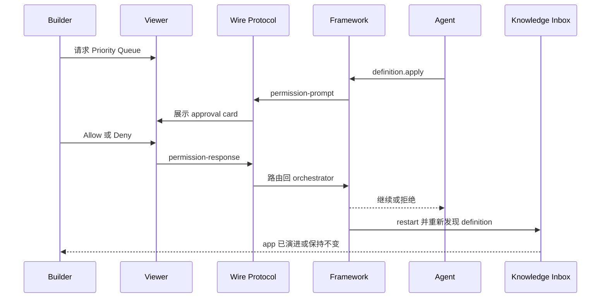

# Milestone 7 快照：Live Agent Approval Protocol

**日期：** 2026-05-02
**状态：** deterministic allow/deny protocol verification 与 live browser screenshots 之后闭合
**受众：** 0 预备知识团队成员
**范围：** M7 证明了什么、明确没有证明什么，以及下一阶段应该压哪条边界。
**English version:** [Milestone 7 Snapshot](./milestone-7-snapshot.md)

## 执行摘要

M7 关闭的是 M6 留下的 protocol gap。

M6 已经证明真实 backend Build-phase Agent 可以通过 `pneuma_framework` 发现 `definition.apply`，并演进 Knowledge Inbox。但 M6 的 approval 仍由 runner 自动通过，团队看到的是“agent 跑完之后的结果”。

M7 把这一步变成可见的 Builder approval loop：

> Backend Build-phase Agent 调用 framework-owned `definition.apply` 后会暂停；Builder 在真实 app viewer 里看到 approval card，可以点击 Allow 或 Deny；framework 通过同一条 governance path 继续执行或阻断 mutation。

M7 没有引入第二条 mutation path。App definition 仍然只能通过 `definition.apply` 变化。新增的是围绕这个 primitive 的 live approval 与 evidence surface。

## 故事线



## 相比 M6 改了什么

| Area | M6 | M7 |
|---|---|---|
| Approval | Runner 为了 demo completion 自动 approve prompt。 | Viewer 展示 approval card；Builder response 通过 wire protocol 回到 framework。 |
| Transcript | M6 trace 保存 agent text、tool calls、approval、results、after state。 | M7 transcript 保存 Builder request、assistant text、tool calls、prompts、responses、results、restart、completion，形状更接近 protocol event。 |
| Viewer | 主要展示 backend-agent 跑完之后的 trace。 | 能展示 pending approval，以及 live before / work / after evidence。 |
| Deny path | 不是 M6 demo 的重点。 | 成为一等路径：deny 后 Priority Queue 不会出现，transcript 记录 denied outcome。 |
| Framework hook | 已能 broadcast prompt。 | 新增 permission response observer，在 orchestrator 接受 framework prompt response 后记录证据。 |

## Builder 看到什么

M7 demo 沿用 M4-M6 的 Knowledge Inbox app shell：

- 左侧：真实 end-user app，包含 App/Data views 和 live rows。
- 右侧：Builder request、live approval card、execution transcript、substrate delta。
- 抽屉：完整 transcript，包含 tool calls、permission prompts、approval responses、tool results、completion。

Approval 前：


Allow 后：


Deny 后：


## Framework 保证了什么

```text
agent intent
  -> framework semantic tool call
  -> framework-owned permission prompt
  -> viewer permission-response
  -> authorization / approval ledger path
  -> framework_system execution or denial
  -> transcript evidence
```

关键治理边界没有变化：

- `build_agent` 可以 propose definition change。
- `build_agent` 不能直接 apply definition change。
- Builder approval 创建 scoped authority。
- `framework_system` 执行 mutation。
- Denial 会在 app-definition mutation 前停止。

## 实现面

新增 example：

```text
examples/m7-live-agent-approval-protocol/
  package.json
  run.ts
  run.test.ts
  transcript.ts
  transcript.test.ts
  README.md
```

Core additions：

- `LifecycleOrchestrator.setPermissionResponseHook(...)`
- `FrameworkPermissionResponseEvent`
- deterministic fake backend path：`--auto-decision allow|deny|none`
- Knowledge Inbox endpoints：
  - `GET /api/framework-session`
  - `GET /api/agent-execution-transcript`
- Knowledge Inbox viewer scenario：
  - `?scenario=live-approval`
  - `data-testid="live-approval-card"`
  - 通过既有 WebSocket 发送 `permission-response`

## Verification Report

Focused M7 and governance suite：

```text
bun test examples/m7-live-agent-approval-protocol/transcript.test.ts examples/m7-live-agent-approval-protocol/run.test.ts packages/core/test/tools/definition-apply.test.ts templates/knowledge-inbox-core-domain/test/viewer-contract.test.ts

65 pass, 0 fail
```

Non-Docker full suite：

```text
bun test $(rg --files -g '*.test.ts' | rg -v 'docker-smoke|release-smoke')

1034 pass, 0 fail
```

其它检查：

```text
bun run typecheck -> pass
git diff --check -> pass
```

Live protocol allow path：

```json
{
  "status": "completed",
  "transcriptApprovals": 4,
  "rows": 3,
  "hasPriority": true
}
```

Live protocol deny path：

```json
{
  "status": "denied",
  "approvals": 1,
  "priorityHttpStatus": 404,
  "hasPriority": false
}
```

完整 `bun test` 已尝试，但 Docker smoke path 在本机 Docker build 时卡在 `docker-credential-desktop get`。这是环境 / Docker credential blocker，不是 M7 regression。上面的 1034-test non-Docker run 明确排除了 Docker / release smoke tests。

## 已证明

| Claim | Evidence |
|---|---|
| Framework prompt 可以由 viewer protocol 回答 | Wire `permission-response` 路由到 `handleFrameworkPermissionResponse`。 |
| Approval response 可观察，且不替换 governance path | `setPermissionResponseHook` 在 orchestrator 接受 prompt id 后触发。 |
| Allow path 会继续 app evolution | Live allow 产生 Priority Queue、3 条 rows、completed transcript。 |
| Deny path 会阻断 mutation | Live deny 产生 `status=denied`，Priority Queue Operation 不存在，priority API 返回 404。 |
| Viewer 能解释过程 | Headless Chrome screenshots 展示 pending、completed、denied 三种状态。 |
| Transcript 是 durable evidence | Runner 写入 `data/m7-agent-execution-transcript.json`；app 通过 `/api/agent-execution-transcript` 提供读取。 |

## 尚未证明

M7 不声称已经解决：

- production IAM
- policy authoring UI
- production multi-user workflow
- model planning reliability
- hot reload
- semantic/vector search
- release-mode Runtime Agent
- raw opencode MCP transcript fidelity

M7 证明的是 dev-mode Builder approval primitive，不是完整企业安全产品。

## 推荐的 M8 选项

1. **Real opencode interactive approval**：让 opencode-backed path 也通过同一个 viewer approval card 暂停 / 继续，并保留更丰富的 raw tool events。
2. **Release packaging hardening**：把 Builder 演进后的 Knowledge Inbox 打包进 Docker，带 persistent SQLite volume 和 release manifest。
3. **Protocol SDK polish**：把 live approval UI 行为抽取成 React / Vanilla SDK helpers。
4. **Semantic index return**：把 semantic retrieval 做成 app capability；SQLite rows 继续是 source of truth，vector index 作为 derived infrastructure。

我的建议：如果下一次 team share 要强调“real agent, real approval”，优先做 1；如果下一阶段要提高可部署产品信心，优先做 2。
