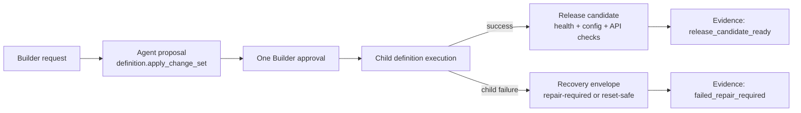
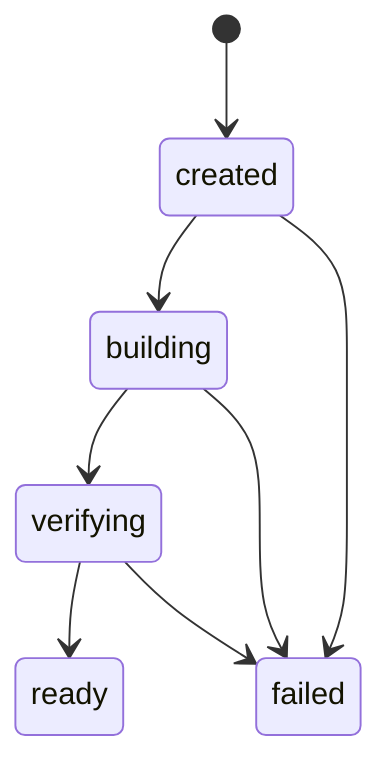

# Milestone 9 Snapshot: Creation-to-Release Integrity

**Date:** 2026-05-02  
**Status:** Closed after focused change-set, release-candidate, evidence, M9 runner, M8 Docker smoke, and typecheck verification  
**Audience:** teammates with zero Pneuma context  
**Scope:** what M9 proves, what it deliberately does not prove, and what should come next.  
**Chinese version:** [Milestone 9 Snapshot zh-CN](./milestone-9-snapshot.zh-CN.md)

## Executive Summary

M7 proved that one Builder intent can become one approved `definition.apply_change_set`. M8 proved that the evolved Knowledge Inbox can become a restartable Docker release artifact.

M9 connects those two claims:

> If a Builder approves one capability request, the framework can now explain the whole path from proposal to execution, failure/recovery, or release-candidate readiness.

M9 is a correctness milestone, not a new app feature. It closes the gap between "the app can be changed" and "the change has a trustworthy creation-to-release evidence trail."



## What Changed

M9 adds three framework-facing concepts and one milestone example:

| Area | What changed |
|---|---|
| Change-set execution | `definition.apply_change_set` now returns `execution.before_fingerprint` and ordered `child_progress`. |
| Recovery semantics | Failed change sets return `recovery.status`, reason, and repair options instead of an unexplained half-success. |
| Release candidate | `packages/core/src/release-candidate.ts` models `created -> building -> verifying -> ready` and fails closed on missing/failed checks. |
| Evidence | `examples/m9-creation-to-release-integrity/` writes success and failure JSON evidence for one approved capability request. |

## The Core Product Integrity Rule

The Builder approves a product intent, not four unrelated technical mutations.

M9 does not pretend the child mutations are a database-wide ACID transaction. Instead, it makes the product-level contract explicit:

```text
Approved capability change set
  -> record last-good definition fingerprint
  -> execute children in order
  -> record each child status
  -> if a child fails, explain what landed and what did not
  -> either produce a repair path or stop before release-candidate creation
```

That means a half-success can still occur at the storage/runtime layer, but it cannot remain invisible at the framework semantics layer.

## Change-Set Recovery Envelope

`definition.apply_change_set` now carries a structured execution result:

```json
{
  "status": "failed",
  "failed_change_index": 1,
  "execution": {
    "before_fingerprint": "...",
    "child_progress": [
      { "index": 0, "operation_id": "add_table_column", "status": "applied" },
      { "index": 1, "operation_id": "add_operation", "status": "failed" },
      { "index": 2, "operation_id": "add_view", "status": "pending" },
      { "index": 3, "operation_id": "add_policy_rule", "status": "pending" }
    ]
  },
  "recovery": {
    "status": "manual_repair_required",
    "options": ["definition.repair.status", "definition.repair.reset_to_last_good"]
  }
}
```

The important shift is that failure is no longer only "tool returned HTTP 500." It is now "child 1 succeeded, child 2 failed, children 3-4 never ran, release candidate was not created, and these are the repair tools."

## Release Candidate v0

M8 proved a release artifact. M9 adds a release-candidate object that can say whether the evolved app version is ready to promote later.



M9 v0 requires:

- source workspace
- app-definition fingerprint
- build manifest path
- image tag
- health check
- config check
- API check

M9 deliberately does **not** implement traffic switching. `ready` means "this candidate passed local release checks," not "production has been updated."

## Unified Evidence

The new M9 runner writes two files:

```text
$WORKSPACE/.pneuma/m9/success-evidence.json
$WORKSPACE/.pneuma/m9/failure-evidence.json
```

Both files use the same evidence shape:

```text
builder_request
proposal
approval
execution
recovery
release_candidate
final_status
timeline
```

Success path:

```text
Builder request
  -> definition.apply_change_set proposal
  -> allow
  -> all child changes applied
  -> release candidate built/verifying
  -> health/config/API checks passed
  -> final_status = release_candidate_ready
```

Failure path:

```text
Builder request
  -> definition.apply_change_set proposal
  -> allow
  -> add_table_column applied
  -> add_operation failed
  -> add_view/add_policy_rule pending
  -> recovery = manual_repair_required
  -> release_candidate = null
  -> final_status = failed_repair_required
```

## Verification Report

Focused M9 suite:

```text
bun test packages/core/test/tools/definition-apply.test.ts \
  packages/core/test/release-candidate.test.ts \
  examples/m9-creation-to-release-integrity/*.test.ts

66 pass, 0 fail
```

M8 release artifact regression:

```text
bun test examples/m8-release-packaging-hardening/release-packaging-smoke.test.ts

1 pass, 0 fail
```

Repository checks:

```text
bun run typecheck -> pass
git diff --check -> pass
```

## What Is Proven

| Claim | Evidence |
|---|---|
| One approved capability request has child-level execution evidence | `definition.apply_change_set` returns `child_progress` for every child mutation. |
| Partial failure cannot stay ambiguous | Partial failure test covers first child applied, second child runtime failure, later children pending, and recovery state. |
| Recovery is explicit | Failed change sets return `manual_repair_required` or a reset-safe state, with repair tool options. |
| Release candidate readiness is explicit | Core release candidate model fails closed unless manifest, image tag, and required checks pass. |
| Success and failure share one evidence language | M9 example writes success/failure JSON evidence using the same schema. |
| Release artifact boundary did not regress | M8 Docker smoke still passes after M9 changes. |

## What Is Not Proven

M9 does not claim:

- full ACID transactionality across every store
- automatic rollback of partially landed child mutations
- production rolling update
- registry push or cloud deployment
- production traffic switching
- production IAM
- release-mode Runtime Agent
- hot reload
- semantic/vector index
- statistically reliable model planning

M9 is the integrity layer between creation and release candidate. Production rollout remains a later deployment-adapter milestone.

## Strategic Read

The project now has a credible spine:

```text
M1: app definition is governed data
M2: governance leaves enterprise evidence
M3: app state lives in a real deployable substrate
M4: Knowledge Inbox is a real reference app
M5-M7: Builder/Agent can evolve that app through approval
M8: evolved app state can become a Docker release artifact
M9: approved creation can succeed into a release candidate or fail with recovery evidence
```

This is a healthy milestone boundary. The framework now has enough proof to pause "correctness plumbing" and choose the next product pressure deliberately.

## Recommended Next Options

1. **Semantic index return:** add derived semantic retrieval to Knowledge Inbox, with SQLite rows as source of truth and vector index as rebuildable infrastructure.
2. **Rollout adapter v0:** add local old/new release slots and promotion semantics on top of release candidates.
3. **Hot reload slice:** remove restart from a narrow definition-change path, likely Operation/View/PolicyRule before schema.
4. **Reusable evidence store:** graduate M9 JSON evidence into system-owned tables once the next consumer is clear.

My recommendation: return to the semantic index next if the team wants a visible product capability; choose rollout adapter if the next milestone should continue release/deploy correctness.
