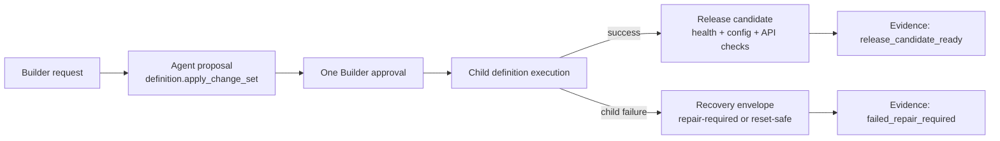
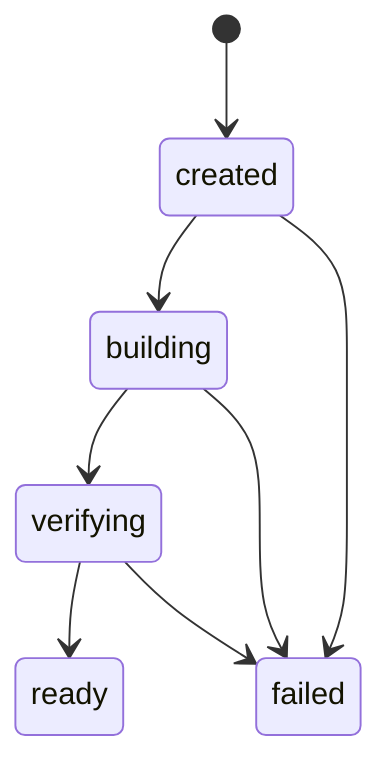

# Milestone 9 快照：Creation-to-Release Integrity

**日期：** 2026-05-02  
**状态：** focused change-set / release-candidate / evidence / M9 runner / M8 Docker smoke / typecheck 验证后闭合  
**受众：** 0 预备知识团队成员  
**范围：** M9 证明了什么、明确没有证明什么，以及下一步该压哪条边界。  
**English version:** [Milestone 9 Snapshot](./milestone-9-snapshot.md)

## 摘要

M7 证明了：一个 Builder intent 可以变成一次 approved `definition.apply_change_set`。M8 证明了：演进后的 Knowledge Inbox 可以变成一个可重启的 Docker release artifact。

M9 把这两个结论接起来：

> Builder 批准一个 capability request 之后，framework 现在能解释完整链路：proposal、execution、失败/恢复，或者 release-candidate ready。

M9 不是新 app feature，而是 correctness milestone。它补上的是：“app 可以被改变”到“这个改变有可信 creation-to-release 证据链”之间的缺口。



## 改了什么

M9 增加了三个 framework-facing concept 和一个 milestone example：

| Area | 改动 |
|---|---|
| Change-set execution | `definition.apply_change_set` 现在返回 `execution.before_fingerprint` 和有序的 `child_progress`。 |
| Recovery semantics | 失败的 change set 会返回 `recovery.status`、reason、repair options，不再留下无法解释的 half-success。 |
| Release candidate | `packages/core/src/release-candidate.ts` 建模 `created -> building -> verifying -> ready`，缺失/失败检查会 fail closed。 |
| Evidence | `examples/m9-creation-to-release-integrity/` 会为一个 approved capability request 写出 success/failure 两份 JSON evidence。 |

## 核心产品完整性规则

Builder approve 的是一个产品意图，不是四个互不相关的技术 mutation。

M9 不假装 child mutations 已经是数据库级别的全局 ACID transaction。它做的是把产品级 contract 明确化：

```text
Approved capability change set
  -> record last-good definition fingerprint
  -> execute children in order
  -> record each child status
  -> if a child fails, explain what landed and what did not
  -> either produce a repair path or stop before release-candidate creation
```

也就是说，storage/runtime 层仍然可能出现半成功；但 framework semantics 层不能再让半成功处在模糊状态。

## Change-Set Recovery Envelope

`definition.apply_change_set` 现在带有结构化 execution result：

```json
{
  "status": "failed",
  "failed_change_index": 1,
  "execution": {
    "before_fingerprint": "...",
    "child_progress": [
      { "index": 0, "operation_id": "add_table_column", "status": "applied" },
      { "index": 1, "operation_id": "add_operation", "status": "failed" },
      { "index": 2, "operation_id": "add_view", "status": "pending" },
      { "index": 3, "operation_id": "add_policy_rule", "status": "pending" }
    ]
  },
  "recovery": {
    "status": "manual_repair_required",
    "options": ["definition.repair.status", "definition.repair.reset_to_last_good"]
  }
}
```

关键变化是：失败不再只是 “tool returned HTTP 500”。现在它能说清楚：“第 1 个 child 成功了，第 2 个失败了，第 3/4 个没跑，没有创建 release candidate，接下来应该使用这些 repair tools。”

## Release Candidate v0

M8 证明了 release artifact。M9 新增 release-candidate object，用来表达这个演进后的 app version 是否可以进入后续 promotion。



M9 v0 要求：

- source workspace
- app-definition fingerprint
- build manifest path
- image tag
- health check
- config check
- API check

M9 明确不做 traffic switching。`ready` 的意思是“这个 candidate 通过了本地 release checks”，不是“生产已经更新”。

## 统一 Evidence

新的 M9 runner 写出两份文件：

```text
$WORKSPACE/.pneuma/m9/success-evidence.json
$WORKSPACE/.pneuma/m9/failure-evidence.json
```

两份文件使用同一套 evidence shape：

```text
builder_request
proposal
approval
execution
recovery
release_candidate
final_status
timeline
```

成功路径：

```text
Builder request
  -> definition.apply_change_set proposal
  -> allow
  -> all child changes applied
  -> release candidate built/verifying
  -> health/config/API checks passed
  -> final_status = release_candidate_ready
```

失败路径：

```text
Builder request
  -> definition.apply_change_set proposal
  -> allow
  -> add_table_column applied
  -> add_operation failed
  -> add_view/add_policy_rule pending
  -> recovery = manual_repair_required
  -> release_candidate = null
  -> final_status = failed_repair_required
```

## Verification Report

Focused M9 suite：

```text
bun test packages/core/test/tools/definition-apply.test.ts \
  packages/core/test/release-candidate.test.ts \
  examples/m9-creation-to-release-integrity/*.test.ts

66 pass, 0 fail
```

M8 release artifact regression：

```text
bun test examples/m8-release-packaging-hardening/release-packaging-smoke.test.ts

1 pass, 0 fail
```

Repository checks：

```text
bun run typecheck -> pass
git diff --check -> pass
```

## 已证明

| Claim | Evidence |
|---|---|
| 一个 approved capability request 有 child-level execution evidence | `definition.apply_change_set` 返回每个 child mutation 的 `child_progress`。 |
| Partial failure 不会继续模糊 | 测试覆盖第一个 child 已应用、第二个 child runtime failure、后续 child pending、recovery state。 |
| Recovery 是显式的 | 失败 change set 返回 `manual_repair_required` 或 reset-safe state，并附 repair tool options。 |
| Release candidate readiness 是显式的 | Core release candidate model 在 manifest、image tag、required checks 缺失时 fail closed。 |
| 成功和失败使用同一证据语言 | M9 example 用同一 schema 写 success/failure JSON evidence。 |
| Release artifact boundary 没退化 | M9 之后 M8 Docker smoke 仍然通过。 |

## 尚未证明

M9 不声称已经解决：

- 跨所有 store 的全局 ACID transactionality
- 部分 child mutation 落地后的自动 rollback
- production rolling update
- registry push 或 cloud deployment
- production traffic switching
- production IAM
- release-mode Runtime Agent
- hot reload
- semantic/vector index
- model planning 的统计可靠性

M9 是 creation 和 release candidate 之间的 integrity layer。生产 rollout 仍然属于后续 deployment-adapter milestone。

## 战略解读

项目现在已经有一条可信主干：

```text
M1: app definition is governed data
M2: governance leaves enterprise evidence
M3: app state lives in a real deployable substrate
M4: Knowledge Inbox is a real reference app
M5-M7: Builder/Agent can evolve that app through approval
M8: evolved app state can become a Docker release artifact
M9: approved creation can succeed into a release candidate or fail with recovery evidence
```

这是一个健康的 milestone 边界。framework 已经有足够证据暂时停下 correctness plumbing，接下来可以更主动地选择下一条 product pressure。

## 推荐下一步

1. **Semantic index return：** 给 Knowledge Inbox 增加 derived semantic retrieval，SQLite rows 仍然是 source of truth，vector index 是可重建基础设施。
2. **Rollout adapter v0：** 在 release candidate 之上增加本地 old/new release slots 和 promotion semantics。
3. **Hot reload slice：** 从窄定义变更路径移除 restart，优先 Operation/View/PolicyRule，再考虑 schema。
4. **Reusable evidence store：** 等下一个消费者清楚后，把 M9 JSON evidence 升级成 system-owned tables。

我的建议：如果团队想看到更直观的产品能力，下一步可以回到 semantic index；如果下一阶段仍要压 release/deploy correctness，就做 rollout adapter。
