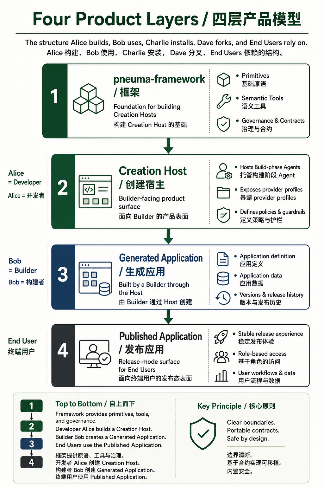
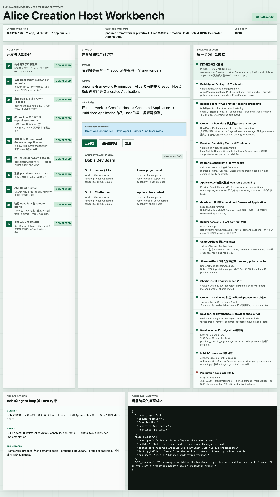

# Release Candidate 快照：pneuma-rc-0.1.0

**状态：** 接受为第一个 developer-facing release-candidate tag。

**日期：** 2026-05-06

**英文版：** [release-candidate-snapshot.md](./release-candidate-snapshot.md)

**Patches：** [pneuma-rc-0.1.1 developer-contract snapshot](./release-candidate-0.1.1-snapshot.zh-CN.md)、`pneuma-rc-0.1.2` BuildThread patch（[升级指南](../developer/upgrading-to-rc-0.1.2.zh-CN.md)）、[pneuma-rc-0.1.3 Code Change Lane snapshot](./release-candidate-0.1.3-snapshot.zh-CN.md)

**Post-RC stabilization：** M26-M31 已关闭 Code Change Lane hardening、Runtime Diagnostic Surface、HostExtension slots、AgentBackend `runTurn`、Host Credential Broker utilities 和 downstream credential adoption pressure。这些 snapshot 是 `pneuma-rc-0.1.3` 之后的 developer contract refinement，不是新的 release tag。

## 决策

```text
GO for pneuma-rc-0.1.0。
NO-GO for production-readiness claims。
```

这是 framework 当前模型的 candidate release，不是 production SaaS、marketplace、hosted identity、production credential store 或 hosted deployment product。

这次 RC 接受的主张很窄：

```text
Developer 构建 Creation Host
  -> Builder 通过 Build-phase Agent 创建 Generated Applications
  -> Generated Applications 可以通过明确的 Host/framework contracts 进行 preview、inspect、evolve、package、publish、restart、rollback、share、install、fork
  -> End Users 使用 Published Applications
```

## 为什么现在可以进入 RC

M19 认为项目技术健康度已经接近 RC，但正确地阻止了当时的 tag：open-ended app governance 边界必须先写清楚。M20 接受 ADR-0031，并 pin 住这个边界：

```text
framework-governed app definition rows:
  Table / Column / Operation / View / PolicyRule / PolicySetting / Rollback

v0 里的 Host-governed open-ended artifacts:
  routes / sections / style tokens / dynamic modules / profile-owned UI artifacts
```

M21-M23 随后关闭 Developer path 和 sharing/forking contract path。M24 用真实的 Alice/Bob/Charlie/Dave 故事做 contract pressure。M25 把这个故事从 Alice 的 outside-in Developer cognition path 讲清楚。

所以现在 pre-RC 问题不再是“还缺哪个 primitive？”而是“仓库是否有足够的、经过验证的证据，让一个 Developer 可以诚实地评估这个 framework？”

答案是：可以。





## Acceptance Matrix

| Gate | 结果 | 证据 |
|---|---:|---|
| 四层产品模型明确，没有被折叠 | Accepted | [Creation Host model](./spec/creation-host-model.md), [M25 snapshot](./milestone-25-snapshot.md), M25 Story Kit |
| Operation + definition-as-data 仍是核心 primitive | Accepted | [ADR-0018](./adr/0018-operations-as-primitive.md), [ADR-0029](./adr/0029-supersede-v0-design-spec.md), [M1 snapshot](./milestone-1-snapshot.md) |
| 安全接受门已关闭 | Accepted | [M17 snapshot](./milestone-17-snapshot.md)：reserved HTTP identity、internal token、fail-closed query/View invocation、rollback failure evidence |
| open-ended app 边界已 pin | Accepted | [ADR-0031](./adr/0031-open-ended-definition-artifact-boundary.md), [M20 snapshot](./milestone-20-snapshot.md) |
| Developer onboarding 存在 | Accepted | [M21 snapshot](./milestone-21-snapshot.md), [Getting Started](../developer/getting-started.md), `scaffold-host`, `doctor-host` |
| Creation Host Authoring Kit 可测试 | Accepted | [M22 snapshot](./milestone-22-snapshot.md)：Build Agent Package、Provider Capability Matrix、Share Artifact |
| Sharing Governance 可测试 | Accepted | [M23 snapshot](./milestone-23-snapshot.md)：SharingGovernanceManifest、CredentialRebindingEvidence、rights、revocation |
| Alice/Bob/Charlie/Dave pressure 可执行 | Accepted | [M24 snapshot](./milestone-24-snapshot.md), `tests/pressure/creation-host-rc-pressure.test.ts` |
| Developer-first RC story 可运行 | Accepted | [M25 snapshot](./milestone-25-snapshot.md), [M25 prototype](../../examples/m25-alice-creation-host-prototype/README.md), [Story Kit](../../examples/m25-alice-creation-host-prototype/STORY.zh-CN.md) |
| 剩余缺口都是显式 productization lanes | Accepted | [OPEN-QUESTIONS](./OPEN-QUESTIONS.md), M24/M25 non-goals, 本文的 post-RC lanes |

## Verification Evidence

2026-05-06 fresh verification：

```bash
PATH="$HOME/.bun/bin:/opt/homebrew/bin:/usr/local/bin:$PATH" bun test
```

```text
1194 pass
0 fail
4448 expect() calls
Ran 1194 tests across 181 files. [71.94s]
```

```bash
PATH="$HOME/.bun/bin:/opt/homebrew/bin:/usr/local/bin:$PATH" bun run typecheck
```

```text
exit 0
```

```bash
PATH="$HOME/.bun/bin:/opt/homebrew/bin:/usr/local/bin:$PATH" bun test tests/pressure/creation-host-rc-pressure.test.ts examples/m24-creation-host-rc-pressure-walkthrough/run.test.ts examples/m25-alice-creation-host-prototype/prototype-model.test.ts examples/m25-alice-creation-host-prototype/run.test.ts
```

```text
16 pass
0 fail
69 expect() calls
```

```bash
PATH="$HOME/.bun/bin:/opt/homebrew/bin:/usr/local/bin:$PATH" bun run examples/m24-creation-host-rc-pressure-walkthrough/run.ts --port 0 --smoke-exit
PATH="$HOME/.bun/bin:/opt/homebrew/bin:/usr/local/bin:$PATH" bun run examples/m25-alice-creation-host-prototype/run.ts --port 0 --smoke-exit
```

```text
M24 smoke verification: passed
M25 smoke verification: passed
```

Architecture markdown link check：

```text
checked 99 architecture markdown files
exit 0
```

Browser acceptance：

```text
http://127.0.0.1:8886/
Reset -> Run full path -> RC path ready
Console warn/error logs -> []
Screenshot -> docs/architecture/assets/rc-acceptance-m25-browser.png
```

Whitespace check：

```bash
git diff --check
```

```text
exit 0
```

## Demo Route

给零背景团队成员讲解时，推荐这个路径：

1. 先读 [Creation Host Model](./spec/creation-host-model.md)，建立四层边界。
2. 打开 [M25 Story Kit 中文版](../../examples/m25-alice-creation-host-prototype/STORY.zh-CN.md)。
3. 启动 M25 prototype：

```bash
PATH="$HOME/.bun/bin:/opt/homebrew/bin:/usr/local/bin:$PATH" bun run examples/m25-alice-creation-host-prototype/run.ts --port 8886
```

4. 打开 `http://127.0.0.1:8886/`。
5. 点击 `Run full path` / `跑完整路径`。
6. 按这个顺序讲：

```text
Alice 先问自己是在写 app 还是 app builder
  -> Alice 定义 Host profiles 和 Build Agent Package
  -> Bob 创建 dev-board
  -> Charlie 通过 credential rebinding 安装
  -> Dave fork 时必须通过 provider-profile compatibility checks
  -> RC judgment 明确保留 productization gaps
```

## Known Non-Goals

这次 RC 不声称：

- 真实 OAuth/account binding；
- production credential storage 和 account-linking UX；
- signed artifacts；
- marketplace/share transport；
- 真实 Postgres adapter；
- production install/fork governance UI；
- production multi-tenant identity mapping；
- production Permission Center workflows；
- hot reload；
- Published Application 内的 Runtime Agent；
- 对 pneuma-skills 2.x 所有 mode 的完整 dogfood。

这些不是隐藏的 RC blocker，而是 post-RC productization 和 pressure lanes。

## Post-RC Productization Lanes

tag 之后推荐的后续路线：

| Lane | 为什么放在 RC 之后 |
|---|---|
| Production credential store + OAuth/account-linking UX | M30 增加本地 / reference Host utilities；M31 证明 DevBoard 下游可以采用 session/OAuth/credential-ref helpers。durable secret storage、encryption、refresh 和 account-linking product UX 仍然 Host-owned。 |
| 真实 provider adapter profile，优先 Postgres | M24 已证明 contract shape；具体 adapter 可以开始压力测试 parity 和 migration 假设。 |
| Install/fork governance UI | M23 已证明 decision；产品 UI 可以基于 reason codes 和 evidence refs 构建。 |
| Signed artifact / provenance | cross-host marketplace claims 之前需要；local RC 不需要。 |
| Runtime Agent | 与 Build-phase Agent 正交；应等到 end-user job 明确后再引入。 |
| Hot reload + custom code lane | 重要的 UX/performance lane，但 restart-based evidence 已足够支持本次 RC。 |
| Pneuma 2.x dogfood | RC 后最强 generality proof：把已有 modes 重建成 Creation Host profiles/templates。 |

## Tag

推荐 tag：

```bash
git tag pneuma-rc-0.1.0
```

tag 应指向包含本文和上述 verification evidence 的 commit。
