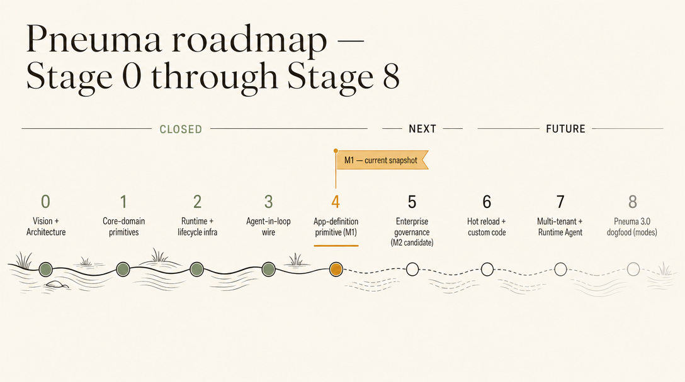

# Roadmap

**Last updated:** 2026-05-06
**Status:** 项目当前唯一 roadmap，单一 source of truth
**Supersedes:** v0 design spec 的 M0–M6（见 [ADR-0029](./adr/0029-supersede-v0-design-spec.md)）

> 本文档**不**累积历史进度报告。已完成阶段只留一句话总结 + 关键 ADR 链接。
> 已闭合阶段的细节进 milestone snapshot；未闭合阶段的开放问题进 OPEN-QUESTIONS。

---

## 阶段总览



```text
Stage 0   Vision + Architecture           ✅  CLOSED
Stage 1   Core-domain primitives          ✅  CLOSED
Stage 2   Runtime + lifecycle infra       ✅  CLOSED
Stage 3   Agent-in-loop wire              ✅  CLOSED
Stage 4   App-definition primitive        ✅  M1 closed
Stage 5   Enterprise governance hardening ✅  M2 closed
Stage 6   Deployable app substrate         ✅  M3 closed
M4        Reference app prototype          ✅  Knowledge Inbox closed
M5        Builder evolves reference app    ✅  Closed
M6        Real backend-agent evolution     ✅  Closed
M7        Capability change-set approval   ✅  Closed
M8        Release packaging hardening      ✅  Closed
M9        Creation-to-release integrity    ✅  Closed
M10       Derived semantic index           ✅  Closed
M11       Rollout adapter v0               ✅  Closed
M12       Reference Creation Host substrate ✅  Closed
M13       Host-level governed evolution    ✅  Closed
M14       Host publish / monitor / rollback ✅  Closed
M15       Generality pressure app          ✅  Closed
M16       Reference Creation Host integration ✅ Closed
M17       Security + architecture acceptance ✅ Closed
M18       Open-ended app pressure          ✅ Closed
M19       Release candidate review         ✅ Closed
M20       Open-ended definition boundary   ✅ Closed
M21       Developer onboarding             ✅ Closed
DDD       Post-M21 domain realignment      ✅ Creation Host Authoring / Sharing model pinned
M22       Creation Host Authoring Kit      ✅ Closed
M23       Team / org sharing governance    ✅ Closed
M24       Creation Host RC pressure        ✅ Closed
M25       Alice Creation Host prototype    ✅ Closed
RC        Candidate release decision       ✅ Accepted
Stage 7   Hot reload + custom code         ⏳  Deferred until host workflow proves the need
Stage 8   Multi-tenant + Runtime Agent     ⏳
Stage 9   Pneuma 3.0 dogfood (modes)       ⏳
```

> 上图是 share-deck 主视觉；text-only 阅读器看下面的 ASCII 块。

---

## Stage details

### Stage 0 — Vision + Architecture ✅

定位：让 Builder 通过对话创造应用的 framework，而不是更快写代码的工具。

- ADR 集合、12 场景 pressure test、领域模型 + 6 张架构图。
- archetype scope 锁定 A + B；C/D 留接口（[ADR-0001](./adr/0001-archetype-scope.md)）。

### Stage 1 — Core-domain primitives ✅

8 个 first-class primitive 落地：Table / CellType / Ref / Adapter / Transform / Operation / WhereClause / PermissionContext。

- 5 domain services + 6 value objects（见 [`spec/domain-model.md`](./spec/domain-model.md)）。
- 关键 ADR：[0002](./adr/0002-storage-typed-cells.md), [0003](./adr/0003-transform-primitive.md), [0007](./adr/0007-permission-dsl.md), [0018](./adr/0018-operations-as-primitive.md), [0019](./adr/0019-where-clause-ast.md)。

### Stage 2 — Runtime + lifecycle infra ✅

`packages/runtime/` HTTP gateway；`packages/core/` lifecycle / process / agent-backend / wire-protocol / shadow-git。

- `/api/config` 暴露 Operation introspection；SSE 实时事件流；wire protocol 携带 framework events。
- 关键 ADR：[0026](./adr/0026-agent-tool-call-binding.md), [0027](./adr/0027-live-event-stream-sse.md), [0028](./adr/0028-framework-event-protocol.md)。

### Stage 3 — Agent-in-loop wire ✅

opencode backend 接入；MCP bridge 把 template Operation 暴露给 agent；第一次完整 round-trip：Builder 输入 → Agent tool-call → Operation 执行 → viewer 实时更新。

- 关键 ADR：[0025](./adr/0025-agent-conversation-persistence.md), [0026](./adr/0026-agent-tool-call-binding.md)。

### Stage 4 — App-definition primitive ✅ (M1 closed)

**已闭合**——细节见 [`milestone-1-snapshot.md`](./milestone-1-snapshot.md) / [`中文版`](./milestone-1-snapshot.zh-CN.md)。

简介：5 个系统级定义表（`pneuma_tables / pneuma_table_columns / pneuma_operations / pneuma_views / pneuma_policy_rules`）；`definition.apply` 5 个 mutation；approval / impact disclosure / rollback validate-prepare-execute / app_history attribution；request-scoped View visibility policy；live browser demo（capability-lifecycle studio variant）。

**M1 闭合时留下的 Stage 4 边界**（部分已在 Stage 5 处理；完整状态看 M2 snapshot）：

- 仍依赖 restart，无 hot reload。（仍开放）
- 仅支持 query-backed Operation；不支持 builder-authored code handler。（仍开放）
- 仅支持 additive allow PolicyRule；无 deny / edit / delete。（M2.5 已处理核心语义）
- 不支持 restored definition rollback。（M2 rollback 覆盖面已扩展，但 full restore 仍需继续验证）
- 跨 store 原子性、并发 definition 写未保证。（M2.6 已有 recoverable dirty guard；full ACID / distributed concurrency 仍开放）
- 自定义 React 组件分发未支持。（仍开放）

### Stage 5 — Enterprise governance hardening ✅ (M2 closed)

**主题：让 primitive 在企业级治理需求下扛得住，不再加新 primitive。**

Closed snapshot: [`milestone-2-snapshot.md`](./milestone-2-snapshot.md) / [`中文版`](./milestone-2-snapshot.zh-CN.md) is the team-facing state after M2.8 closure hardening. The first design cut remains [`m2-authorization-kernel-design.md`](./m2-authorization-kernel-design.md).

Workstream 状态（见 [OPEN-QUESTIONS.md](./OPEN-QUESTIONS.md) "Governance Gaps"）：

| Workstream | 当前状态 |
|---|---|
| Authorization model | Authorization Kernel + principal boundary 已落地；framework 权限是开发期扩展边界，不是 Builder 可改的 runtime policy。 |
| Approval execution chain | Builder approval -> scoped single-use approval token -> `framework_system` execution 已落地。 |
| Raw framework op boundary | Framework internal Operations 不再作为 agent `op.*` 暴露；framework policy injection 覆盖同 ID caller policy rule。 |
| Permission center | Durable permission ledger + v0 summary/search/filter viewer panel 已落地；生产级 retention、assignment、bulk actions、admin workflow、policy authoring 仍未做。 |
| Policy lifecycle | add/update/delete、explicit deny、deny-over-allow、default posture、explain、rollback support 已落地；产品化 authoring/review surface 仍未做。 |
| Protocol hardening | ADR-0028 framework events 已落地；Operation bridges 已按 `invocation_method` 分流 GET/POST；持久 replay、versioned envelopes、hard-restart tool-call continuity 仍未做。 |
| Transaction & concurrency | M2.6 已有单进程 writer latch + durable dirty guard；cross-store ACID、DB CAS、distributed lock 仍未做。 |
| Pressure-test app | 第二个 reference app 仍未做，用于检验 primitive 是否超出 Reader Bookmarks。 |

**M2 已闭合。下一阶段改为 M3 substrate 原型**：先验证真实 backend / persistence / release / Docker 部署，再回头审视 enterprise hardening 和 hot reload。见 [`milestone-3-deployable-substrate-design.md`](./milestone-3-deployable-substrate-design.md) / [`中文版`](./milestone-3-deployable-substrate-design.zh-CN.md)。

### Stage 6 — Deployable app substrate ✅ (M3 closed)

**主题：用真实可部署 substrate 反查 M1/M2 primitive，而不是继续在 demo runtime 上打磨企业安全。**

Closed snapshot: [`milestone-3-snapshot.md`](./milestone-3-snapshot.md) / [`中文版`](./milestone-3-snapshot.zh-CN.md). Design input: [`milestone-3-deployable-substrate-design.md`](./milestone-3-deployable-substrate-design.md) / [`中文版`](./milestone-3-deployable-substrate-design.zh-CN.md).

M3 第一版实现选择：

| Layer | First implementation |
|---|---|
| Backend runtime | Bun + TypeScript |
| Physical database | SQLite file under volume |
| Migration tooling | Drizzle + drizzle-kit |
| Release target | Docker image + mounted `/data` volume |
| Reference app | Reader Bookmarks / Knowledge Inbox continuation |
| Scaffold | thin reference scaffold, not full generator |

M3 关键原则：

- Bun / Drizzle / SQLite / Docker 是 implementation choices，不是 semantic boundaries。
- App definition 仍是 runtime governed data，不变成 Drizzle migration。
- Relational DB 是 source of truth；未来 Qdrant 只能作为 derived semantic index。
- Docker 是第一个 deployment adapter，不是 deploy 的定义。
- M3 只实现 web process，但 manifest 要给 worker / scheduler / supervisor 留口。

M3 closed proof:

```text
dev mode
  -> SQLite app database
  -> Builder-created data + definition rows
  -> app_history + permission ledger in the same app.db
  -> build release artifact
  -> Docker image runs with mounted /data/app.db
  -> container restart
  -> /api/config rediscovers the Builder-created capability
```

M3 deliberately does not claim production deployment, production migration operations, Postgres/Qdrant adapters, distributed concurrency, or full `definition.apply` approval chain inside the Docker release runtime. Those boundaries are explicit in the M3 snapshot.

### Post-M21 DDD realignment ✅

Canonical DDD anchor: [`spec/creation-host-ddd-review.md`](./spec/creation-host-ddd-review.md) / [`中文版`](./spec/creation-host-ddd-review.zh-CN.md).

Post-M21 review reframes the next pressure:

```text
Creation Host Authoring Kit first
Team / org sharing governance second
```

The core distinction is now explicit:

```text
Build Agent Package = Developer-authored capability and guardrail package.
Build Agent Session = Builder-specific runtime instance created from that package.
```

This keeps the model honest:

- `BuildAgentPackage` starts Host-owned and may later become a framework manifest contract after a test-first slice.
- `BuildAgentSession` remains Host-owned session lifecycle over framework backend/tool/wire/evidence primitives.
- provider portability means semantic re-materialization plus parity tests, not raw DB migration.
- share artifacts are portable manifests and recipes, not databases and not secret containers.
- enterprise governance should shape the model now, but implementation should follow Authoring Kit closure.

### M4 — Reference app prototype ✅ (Knowledge Inbox closed)

Closed snapshot: [`milestone-4-snapshot.md`](./milestone-4-snapshot.md) / [`中文版`](./milestone-4-snapshot.zh-CN.md).

M4 主题：**把 M3 substrate 变成一个小而真实的 reference app，并让 0 预备知识团队成员能从外部理解 primitive chain。**

M4 closed proof:

```text
end-user capture
  -> capture_item Operation
  -> inbox_items row in SQLite app.db
  -> review queue + status triage
  -> Data view over the same stored rows
  -> Live substrate inspector for schema / domain service / API
  -> Docker restart with mounted volume
  -> deterministic demo runner for team replay
```

M4 deliberately does not claim a finished knowledge-management product, runtime agent in release mode, semantic/vector search, Postgres adapter, hot reload, or a full multi-user enterprise workflow inside Knowledge Inbox. M5 closed the chosen next gate: direct Builder/Agent `definition.apply` evolution inside Knowledge Inbox.

### M5 — Builder evolves reference app ✅ (closed)

Closed snapshot: [`milestone-5-snapshot.md`](./milestone-5-snapshot.md) / [`中文版`](./milestone-5-snapshot.zh-CN.md). Design input: [`../superpowers/specs/2026-05-01-m5-builder-evolves-knowledge-inbox-design.md`](../superpowers/specs/2026-05-01-m5-builder-evolves-knowledge-inbox-design.md). Implementation plan: [`../superpowers/plans/2026-05-01-m5-builder-evolves-knowledge-inbox.md`](../superpowers/plans/2026-05-01-m5-builder-evolves-knowledge-inbox.md).

M5 theme: **prove that Knowledge Inbox can be evolved by a Builder/Agent loop through governed app-definition changes.**

M5 closed proof:

```text
Builder asks for priority review
  -> deterministic Build-phase Agent proposal
  -> Builder approval + permission ledger evidence
  -> definition.apply adds priority column / query Operation / View / PolicyRule
  -> dev service restarts and rediscovers definition rows
  -> App/Data/Substrate surfaces show the new Priority Queue capability
```

M5 deliberately does not claim real LLM planning reliability, hot reload, Builder-authored code handlers, a full priority workflow, Postgres/Qdrant, runtime end-user agent, or production IAM.

Post-snapshot result: **M6 closed.** The semantic index track remained deferred until M10, where it closed as a derived capability without changing business row schema.

| Direction | Why |
|---|---|
| **M6: real backend-agent interaction for app evolution** | Closed. Turned the deterministic M5 proposal into a backend-agent session with app + framework MCP tool surfaces. |
| **M10 semantic index track** | Closed. SQLite rows remain source of truth, vector search is derived infrastructure. |

### M6 — Real backend-agent evolution ✅ (closed)

Closed snapshot: [`milestone-6-snapshot.md`](./milestone-6-snapshot.md) / [`中文版`](./milestone-6-snapshot.zh-CN.md). Design input: [`../superpowers/specs/2026-05-01-m6-real-backend-agent-evolution-design.md`](../superpowers/specs/2026-05-01-m6-real-backend-agent-evolution-design.md). Implementation plan: [`../superpowers/plans/2026-05-01-m6-real-backend-agent-evolution.md`](../superpowers/plans/2026-05-01-m6-real-backend-agent-evolution.md).

M6 theme: **replace M5's deterministic Agent proposal with a backend-agent path.**

M6 closed proof:

```text
Builder asks for priority review
  -> AgentBackend session receives appUrl + frameworkToolUrl
  -> pneuma_app exposes template op.* tools
  -> pneuma_framework exposes framework semantic tools
  -> agent calls definition.apply through the framework tool proxy
  -> Builder approval turns into scoped execution authority
  -> framework_system applies definition changes
  -> dev service restarts and rediscover definition rows
  -> runner + viewer show Priority Queue
  -> execution trace shows before / work / after / diff
```

M6 deliberately does not claim semantic/vector search, hot reload, production LLM reliability, Builder-authored code handlers, production IAM, release-mode Runtime Agent, human-clickable approval cards, or raw opencode MCP transcript persistence. M7 closed the first protocol-hardening pressure by replacing runner auto-approval with one visible Builder approval for one capability proposal.

### M7 — Capability change-set approval ✅ (closed)

Closed snapshot: [`milestone-7-snapshot.md`](./milestone-7-snapshot.md) / [`中文版`](./milestone-7-snapshot.zh-CN.md). Revised design: [`../superpowers/specs/2026-05-02-m7-capability-change-set-approval-design.md`](../superpowers/specs/2026-05-02-m7-capability-change-set-approval-design.md). Revised plan: [`../superpowers/plans/2026-05-02-m7-capability-change-set-approval.md`](../superpowers/plans/2026-05-02-m7-capability-change-set-approval.md).

M7 theme: **replace per-mutation approval with one Builder approval for one capability proposal.**

M7 closed proof:

```text
agent calls definition.apply_change_set
  -> framework validates aggregate impact
  -> framework emits one permission-prompt over wire protocol
  -> Knowledge Inbox renders a live approval card
  -> Builder sends permission-response over WebSocket
  -> framework records approval response and executes or denies
  -> transcript captures before / work / after evidence
  -> allow path creates Priority Queue
  -> deny path leaves the app unchanged
```

M7 deliberately does not claim production IAM, policy authoring UI, statistically reliable model planning, full post-approval change-set transactionality, hot reload, semantic/vector search, release-mode Runtime Agent, or raw opencode MCP transcript fidelity. The recommended M8 choice is either release packaging hardening or change-set recovery semantics, depending on whether the next milestone optimizes for deployable product confidence or enterprise correctness.

### M8 — Release packaging hardening ✅ (closed)

Closed snapshot: [`milestone-8-snapshot.md`](./milestone-8-snapshot.md) / [`中文版`](./milestone-8-snapshot.zh-CN.md). Design input: [`../superpowers/specs/2026-05-02-m8-release-packaging-hardening-design.md`](../superpowers/specs/2026-05-02-m8-release-packaging-hardening-design.md). Implementation plan: [`../superpowers/plans/2026-05-02-m8-release-packaging-hardening.md`](../superpowers/plans/2026-05-02-m8-release-packaging-hardening.md).

M8 theme: **turn the Builder/Agent-evolved Knowledge Inbox into a restartable release artifact.**

M8 closed proof:

```text
governed Priority Queue evolution
  -> SQLite app.db
  -> build.manifest.json
  -> Docker image
  -> mounted /data volume
  -> release container healthcheck
  -> /api/config rediscovers priority column / Operation / View / PolicyRule
  -> list_priority_queue returns P1/P2/P3
  -> docker restart
  -> same release surfaces still pass
```

M8 deliberately does not claim rolling traffic shift, registry push, cloud deployment, automatic rollback, online migration compatibility windows, multi-runtime SQLite concurrency, production secrets, production IAM, release-mode Runtime Agent, or model planning reliability. M9 closed the recommended next pressure: change-set recovery semantics before true rollout protocol.

### M9 — Creation-to-release integrity ✅ (closed)

Closed snapshot: [`milestone-9-snapshot.md`](./milestone-9-snapshot.md) / [`中文版`](./milestone-9-snapshot.zh-CN.md). Design input: [`../superpowers/specs/2026-05-02-m9-creation-to-release-integrity-design.md`](../superpowers/specs/2026-05-02-m9-creation-to-release-integrity-design.md). Implementation plan: [`../superpowers/plans/2026-05-02-m9-creation-to-release-integrity.md`](../superpowers/plans/2026-05-02-m9-creation-to-release-integrity.md).

M9 theme: **turn one approved creation request into either a verified release candidate or explicit recovery evidence.**

M9 closed proof:

```text
Builder-approved Priority Queue proposal
  -> definition.apply_change_set child progress
  -> success path applies all children
  -> release candidate verifies health / config / API
  -> final evidence = release_candidate_ready

Builder-approved Priority Queue proposal
  -> child mutation failure after first child lands
  -> recovery envelope explains applied / failed / pending children
  -> no release candidate is produced
  -> final evidence = failed_repair_required
```

M9 deliberately does not claim full ACID transactionality, automatic partial-mutation rollback, production rolling update, registry push, cloud deployment, production traffic switching, production IAM, release-mode Runtime Agent, hot reload, semantic/vector index, or model planning reliability.

Post-snapshot result: **M10 closed semantic index return** for visible product capability. The release/deploy pressure then moved to M11 rollout adapter v0.

### M10 — Derived semantic index ✅ (closed)

Closed snapshot: [`milestone-10-snapshot.md`](./milestone-10-snapshot.md) / [`中文版`](./milestone-10-snapshot.zh-CN.md). Design input: [`../superpowers/specs/2026-05-02-m10-derived-semantic-index-design.md`](../superpowers/specs/2026-05-02-m10-derived-semantic-index-design.md). Implementation plan: [`../superpowers/plans/2026-05-03-m10-derived-semantic-index.md`](../superpowers/plans/2026-05-03-m10-derived-semantic-index.md).

M10 theme: **add visible semantic retrieval while preserving SQLite app rows as the source of truth.**

M10 closed proof:

```text
Knowledge Inbox rows in inbox_items
  -> rebuild_semantic_index projects title/source/summary
  -> deterministic EmbeddingProvider in tests
  -> semantic_index_entries derived SQLite store
  -> semantic_search_items returns current source rows with scores
  -> viewer shows rebuild/search/status controls
  -> Docker release restart keeps semantic search working
```

M10 deliberately does not claim production-scale vector search, Qdrant/Postgres vector adapters, background incremental indexing, multi-tenant index isolation, concurrent online reindexing, release-mode Runtime Agent, hot reload, or model planning reliability.

Post-snapshot result: **M11 closed rollout adapter v0** for release/deploy confidence. Qdrant adapter v0 and hot reload remain open pressure lines.

### M11 — Rollout adapter v0 ✅ (closed)

Closed snapshot: [`milestone-11-snapshot.md`](./milestone-11-snapshot.md) / [`中文版`](./milestone-11-snapshot.zh-CN.md). Design input: [`../superpowers/specs/2026-05-03-m11-rollout-adapter-v0-design.md`](../superpowers/specs/2026-05-03-m11-rollout-adapter-v0-design.md). Implementation plan: [`../superpowers/plans/2026-05-03-m11-rollout-adapter-v0.md`](../superpowers/plans/2026-05-03-m11-rollout-adapter-v0.md).

M11 theme: **turn release candidate readiness into explicit stage / promote / rollback release state.**

M11 closed proof:

```text
ready release candidate
  -> release.stage records candidate slot
  -> release.promote moves healthy candidate into active
  -> old active is preserved as previous
  -> release.rollback restores previous active release
  -> local Docker smoke verifies baseline/candidate capability evidence
```

M11 deliberately does not claim production traffic switching, stable active hostname, reverse proxy integration, cloud deploy, registry push, zero-downtime rollout, automatic rollback daemon, release-mode Runtime Agent, or schema compatibility windows between old/new app versions.

Post-snapshot planning correction: the next release-candidate path should target a **reference Creation Host** rather than another direct app-template milestone. Stable active endpoint adapter, Qdrant adapter v0, and hot reload remain useful pressure lines, but they should not outrank the host-level workflow: Builder creates, previews, inspects, publishes, monitors, and rolls back a Generated Application.

Formal master plan: [`../superpowers/plans/2026-05-03-creation-host-rc-path.md`](../superpowers/plans/2026-05-03-creation-host-rc-path.md).

### M12 — Reference Creation Host substrate ✅

Theme: **build the first Builder-facing Creation Host surface instead of another direct app example.**

Closed snapshot: [`milestone-12-snapshot.md`](./milestone-12-snapshot.md) / [`中文版`](./milestone-12-snapshot.zh-CN.md).

Proof path:

```text
Developer-configured host profile
  -> Builder creates a Generated Application project
  -> host creates v0 application version
  -> host starts preview process
  -> preview exposes app behavior
  -> host inspection surfaces show schema / data / operations / logs
```

M12 closed proof:

```text
Reference Creation Host
  -> creates team-knowledge-inbox Generated Application project
  -> creates v0 version workspace
  -> starts Knowledge Inbox preview runtime
  -> seeds three demo rows
  -> host inspection surfaces show schema / seeded data / operations / logs
  -> browser workbench shows preview and Builder inspection together
```

M12 deliberately does not claim real backend-agent planning, publish/rollback, production deployment, multi-tenant isolation, runtime agent, or hot reload. It proves the host-level workspace exists and that a Builder can understand the app through surfaces, not just chat.

This comes before Stage 7 because hot reload only matters once the host has a real preview/inspection workflow where reload pain is visible.

### M13 — Host-level governed evolution ✅

Theme: **move M7/M9 governed agent evolution into the Creation Host context.**

Snapshot: [Milestone 13 Snapshot](./milestone-13-snapshot.md) / [中文版](./milestone-13-snapshot.zh-CN.md)

Proof path:

```text
Builder asks inside the host
  -> real backend agent receives current app context
  -> agent proposes one change set
  -> host shows one approval prompt for the intent
  -> allow path applies governed definition changes
  -> deny path leaves app unchanged
  -> transcript preserves before / work / after evidence
```

M13 closed proof:

```text
Creation Host
  -> Builder asks to add Priority Queue
  -> backend agent calls one definition.apply_change_set
  -> Host shows one approval prompt for the intent
  -> allow path applies schema / operation / view / policy together
  -> deny path leaves list_priority_queue absent
  -> transcript preserves builder / agent / tool / approval / result / completion evidence
```

M13 deliberately does not claim model planning reliability at production scale, arbitrary code generation, production IAM, or release-mode Runtime Agent. It proves the Creation Host can coordinate agent evolution without collapsing back into per-mutation approval or blind file edits.

This comes before publish work because publishing an app whose creation/evolution path is not governed would validate the wrong product story.

### M14 — Host publish / monitor / rollback ✅

Theme: **turn a Generated Application version into a Published Application from the host.**

Closed snapshot: [`milestone-14-snapshot.md`](./milestone-14-snapshot.md) / [`中文版`](./milestone-14-snapshot.zh-CN.md).

Proof path:

```text
Generated Application version
  -> host publishes selected version
  -> End User opens the Published Application
  -> host reports health and logs
  -> host restarts active process
  -> host rolls back to previous version
```

The reference path should use Bun TypeScript, local process management, and version directories. It should avoid Docker as a required dependency for the Creation Host demo, while still reusing the release state concepts proved in M11.

M14 closed proof:

```text
Creation Host
  -> creates team-knowledge-inbox@v0
  -> forks v1 and applies M13 Priority Queue evolution
  -> publishes v0 as active Published Application
  -> publishes v1 and preserves v0 as previous
  -> restarts active process and rechecks health/config/API
  -> rolls back active to v0
  -> browser workbench keeps End User app and Host Console visible together
```

M14 deliberately should not claim production traffic switching, cloud deploy, registry push, zero-downtime rollout, automatic rollback daemon, or schema compatibility windows.

Post-snapshot result: **M15 is next** to prove the Host is not a Knowledge Inbox-specific shell.

### M15 — Generality pressure app ✅

Theme: **prove the host is not a Knowledge Inbox-specific product shell.**

Closed snapshot: [`milestone-15-snapshot.md`](./milestone-15-snapshot.md) / [`中文版`](./milestone-15-snapshot.zh-CN.md).

Proof path:

```text
same Creation Host
  -> creates Knowledge Inbox style app
  -> creates a second app with different domain shape
  -> both have distinct schema / operations / views / policies
  -> both can be previewed and inspected through the same host surfaces
```

Default second-app candidate: **Team Decision Log**. It should be intentionally small but structurally different: different primary table, different write operation, different read view, and at least one role/user-aware policy.

M15 closed proof:

```text
same Creation Host
  -> creates team-knowledge-inbox with inbox_items / capture_item / list_inbox_items
  -> creates team-decision-log with decisions / record_decision / list_decisions
  -> previews both generated apps
  -> inspects distinct schema / operations / views / policies / data through one Host surface
  -> shows owner-can-read-decisions user/role-aware policy
```

M15 deliberately should not become a product suite. It is a framework generality pressure test.

Post-snapshot result: **M16 closed as the Reference Creation Host integration gate**, not an automatic release.

### M16 — Reference Creation Host integration gate ✅

Theme: **connect the M12-M15 Creation Host pieces into one Builder-facing workbench.**

Proof path:

```text
choose Host profile
  -> create Generated Application
  -> preview / inspect schema / operations / policies / data
  -> evolve Knowledge Inbox through one proposal-level approval
  -> publish v0 / v1 as active Published Application
  -> restart active runtime
  -> rollback to previous version
  -> create and inspect Team Decision Log through the same Host shell
```

Closed snapshot: [`milestone-16-snapshot.md`](./milestone-16-snapshot.md) / [`中文版`](./milestone-16-snapshot.zh-CN.md).

M16 closed proof:

```text
Reference Creation Host
  -> creates team-knowledge-inbox@v0
  -> previews and inspects it
  -> forks v1 and applies governed Priority Queue evolution after one approval
  -> publishes v0 and v1
  -> restarts active release
  -> rolls back to v0 with fresh runtime URL/health evidence
  -> creates team-decision-log and inspects its distinct app shape
```

M16 deliberately does not claim production IAM, cloud deploy, zero-downtime rollout, arbitrary app generation, production LLM reliability, hot reload, Runtime Agent in published apps, or commercial-grade Host UX. Live browser E2E found and fixed rollback stale URL and multi-app selection state leakage.

### M17 — Security + architecture acceptance ✅

Theme: **accept the model replacement explicitly and close security issues that would make any release-candidate review misleading.**

Closed snapshot: [`milestone-17-snapshot.md`](./milestone-17-snapshot.md) / [`中文版`](./milestone-17-snapshot.zh-CN.md).

Proof path:

```text
accept ADR-0029 and the four-artifact model
  -> block spoofed framework HTTP identity
  -> route internal framework calls through a private runtime token
  -> fail closed for query Operation and View source invoke checks
  -> record rollback failure evidence after pre-rollback backup
  -> lock lifecycle as a runtime subsystem ADR
  -> move concrete provider/adapter packages out of the core semantics story
```

M17 closed without adding a major product feature. It exists because RC would have been premature while the project had unresolved identity spoofing, fail-open query semantics, rollback failure opacity, and unaccepted model replacement.

### M18 — Open-ended app pressure ✅

Theme: **prove the framework is not overfit to schema-driven queue/list applications.**

Closed snapshot: [`milestone-18-snapshot.md`](./milestone-18-snapshot.md) / [`中文版`](./milestone-18-snapshot.zh-CN.md).

Proof path:

```text
same Creation Host model
  -> create Personal Focus Site
  -> preview open-ended site surface, not a table/list app
  -> inspect routes / sections / style tokens / modules / GitHub attention evidence
  -> evolve one Builder intent into one approval
  -> change section copy, visual tone, and ranking module definition
  -> publish v0/v1, restart active runtime, rollback to v0
  -> capture whether a new primitive is missing before RC
```

M18 closed the RC-blocking generality pressure without adding a new core primitive. `Surface / Route / ComponentTree` remain watch items for Stage 7 if more open-ended apps repeat the same definition shape.

### M19 — Release candidate review ✅

Theme: **decide whether the integrated Reference Creation Host plus open-ended pressure path is ready to tag as a candidate release.**

Closed snapshot: [`milestone-19-snapshot.md`](./milestone-19-snapshot.md) / [`中文版`](./milestone-19-snapshot.zh-CN.md).

Proof path:

```text
project-goal review
  -> full test sweep
  -> docs navigation check
  -> example health check
  -> open-ended app pressure evidence review
  -> third-party review
  -> decide whether to tag a candidate release
```

M19 found the repo technically close but did **not** tag RC. It fixed stale governance tests, Creation Host core contract leakage, M18 transcript accuracy, root onboarding docs, and rollout evidence shape. Full `bun test` was green: 1136 pass / 0 fail.

RC tag was deferred until M20 pinned the open-ended definition governance boundary. M20 has now accepted that boundary in ADR-0031.

### M20 — Open-ended definition boundary ✅

Theme: **pin whether open-ended UI/module artifacts are Host-owned or framework-governed definition data before RC.**

Decision: **Host-owned artifact + Host-level approval**. See [ADR-0031](./adr/0031-open-ended-definition-artifact-boundary.md) and the closed snapshot ([English](./milestone-20-snapshot.md) / [中文](./milestone-20-snapshot.zh-CN.md)).

Closed boundary:

```text
open-ended UI/module artifacts
  -> Host-owned artifacts in v0
  -> Host-level approval / transcript / inspection / release / rollback evidence
  -> not framework definition rows
  -> not definition.apply_change_set artifacts
```

M18 now exposes this boundary as an executable contract in the Personal Focus Site profile, inspect output, and evolution transcript:

```text
artifact_kind = host_owned_open_ended_definition
governance_scope = host_approval
framework_definition_rows = false
framework_definition_apply_change_set = false
```

M20 closed the definition-governance boundary, but developer onboarding still needed a concrete external path before RC. M21 closed that gap.

### M21 — Developer onboarding ✅

Theme: **make the framework approachable to a new Developer without adding a new primitive.**

Closed snapshot: [`milestone-21-snapshot.md`](./milestone-21-snapshot.md) / [`中文版`](./milestone-21-snapshot.zh-CN.md).

Proof path:

```text
Developer starts outside the repo's internal history
  -> scaffold starter Creation Host
  -> validate profile contract
  -> run Host workspace diagnostics
  -> read Creation Host contract guide
  -> follow M16 schema-driven loop
  -> follow M18 open-ended loop
```

M21 adds `scaffold-host`, `doctor-host`, core profile contract helpers, workspace diagnostics, and developer guides. It deliberately does not add hosted deployment, Runtime Agent productization, or another app primitive.

### M22 — Creation Host Authoring Kit ✅

Theme: **make Creation Host authoring testable without turning the framework into a specific Host product.**

Closed snapshot: [`milestone-22-snapshot.md`](./milestone-22-snapshot.md) / [`中文版`](./milestone-22-snapshot.zh-CN.md).

Proof path:

```text
Developer authors a Build Agent Package
  -> declares provider capability profiles
  -> declares credential requirements
  -> declares a portable share/fork artifact shape
  -> scaffold emits the files
  -> doctor diagnoses them
  -> core validators make the contract testable
```

M22 adds `agent-package.json`, `provider-capabilities.json`, `share-artifact.example.json`, and `agent-policy.md` to scaffolded Hosts, plus core validators and Host doctor diagnostics. It deliberately does not add a credential broker, marketplace, installer, provider migration engine, or team/org sharing governance.

### M23 — Team / org sharing governance ✅

Theme: **make sharing/forking governance testable without implementing a marketplace, enterprise IdP, or credential broker.**

Closed snapshot: [`milestone-23-snapshot.md`](./milestone-23-snapshot.md) / [`中文版`](./milestone-23-snapshot.zh-CN.md).

M22 makes the portable unit explicit:

```text
share artifact = app definition + idempotent semantic init recipe + provider requirements
not share artifact = source database + secrets + private derived cache
```

M23 adds the first governance contract around that unit:

```text
SharingGovernanceManifest
  -> owner / maintainers / operators / explicit grants
  -> source artifact/app/version lineage
  -> share/fork/install/approve/publish/rollback/revoke rights
  -> revocation
  -> required credential rebinding policy

CredentialRebindingEvidence
  -> no secrets
  -> subject/app/artifact binding status
  -> requirement refs and provider account refs
```

M23 adds `sharing-governance.example.json` and `credential-rebinding.example.json` to scaffolded Hosts, plus core validators, a decision helper, and Host doctor diagnostics. It deliberately does not add real OAuth, enterprise identity providers, artifact signing, org admin UI, credential broker implementation, marketplace transport, or generated-app runtime policy changes.

### M24 — Creation Host RC pressure ✅

Theme: **pressure-test whether the post-M23 contract set can describe a realistic Developer-built Creation Host sharing/forking story before candidate release.**

Closed snapshot: [`milestone-24-snapshot.md`](./milestone-24-snapshot.md) / [`中文版`](./milestone-24-snapshot.zh-CN.md).

M24 turns the mawidget / dev-board discussion into executable contract evidence:

```text
Alice authors a Creation Host contract set
  -> Bob builds dev-board on local SQLite + Docker
  -> Charlie installs Bob's artifact with his own GitHub/Linear credentials
  -> Dave forks to remote Postgres + Docker
  -> Dave removes Apple Notes before publish
```

M24 adds an RC pressure story and bilingual walkthrough under `examples/m24-creation-host-rc-pressure-walkthrough/`, with repo-level pressure tests importing the same story model from `tests/pressure/`. It composes the M22 Build Agent Package / Provider Capability Matrix / Share Artifact contracts with the M23 Sharing Governance Bundle and Credential Rebinding Evidence contracts. It proves the Build-phase Agent sees capability contracts, not provider-specific implementation branches, and it fails closed for stale credential evidence, wrong grant scope, unsupported capability leakage, and provider-specific migration. The pressure story consumes core contracts; it is not exported as a core API.

M24 deliberately does not add a product UI, real OAuth, real credential broker, real Postgres adapter, or marketplace transport. It closes the pre-RC contract pressure line and returns the project to a candidate-release decision.

### M25 — Alice Creation Host prototype ✅

Theme: **turn the M24 contract pressure into a Developer-first RC prototype that explains Alice's cognitive path before Bob/Charlie/Dave outcomes.**

Closed snapshot: [`milestone-25-snapshot.md`](./milestone-25-snapshot.md) / [`中文版`](./milestone-25-snapshot.zh-CN.md).

Proof path:

```text
Alice asks "am I building an app or an app builder?"
  -> names framework / Creation Host / Generated Application / Published Application
  -> chooses Host profiles
  -> packages Bob's Build Agent
  -> declares provider capability contracts
  -> creates Bob's dev-board
  -> validates portable share, Charlie install, and Dave fork evidence
  -> forms an RC judgment with productization gaps explicit
```

M25 adds `examples/m25-alice-creation-host-prototype/`, a runnable browser workbench whose primary axis is a 10-step Developer cognition path. It reuses M24 pressure evidence and core validators; it does not export scenario builders from core.

M25 deliberately does not implement a real macOS app, OAuth, credential broker, signed artifact transport, marketplace, real Postgres adapter, or production install/fork governance UI. It closes the pre-RC demo-cognition lane and returns the project to a candidate-release decision.

### RC — Candidate release decision ✅ Accepted

Theme: **accept the first developer-facing release candidate after M24 Creation Host RC pressure and M25 Developer-first prototype.**

Accepted snapshot: [`release-candidate-snapshot.md`](./release-candidate-snapshot.md) / [`中文版`](./release-candidate-snapshot.zh-CN.md).
Patch snapshot: [`release-candidate-0.1.1-snapshot.md`](./release-candidate-0.1.1-snapshot.md) / [`中文版`](./release-candidate-0.1.1-snapshot.zh-CN.md).

The RC decision stays narrow:

```text
M24 verification evidence
M25 Developer-cognition prototype evidence
  -> docs/index health
  -> authoring-kit + sharing-governance contract health
  -> RC pressure contract health
  -> full static/test verification
  -> pneuma-rc-0.1.0
  -> pneuma-rc-0.1.1 developer-contract patch
```

It explicitly does not claim production readiness, real OAuth/account binding, credential broker, signed artifacts, marketplace/share transport, real Postgres adapter, production install/fork governance UI, Runtime Agent productization, or hot reload. Those move to post-RC productization and pressure lanes.

### Stage 7 — Hot reload + custom code ⏳

- definition 变更不再依赖 restart：先支持 Operation 与 PolicyRule（rediscovery 即可），再考虑 schema 与 View。
- builder-authored code handler：how does framework approve agent-authored handler code? sandbox? capability allowlist?
- custom view component 分发：how does template ship custom React components for views, while keeping `pneuma_views` 治理通路？

### Stage 8 — Multi-tenant + Runtime Agent ⏳

- ADR-0001 留好的 archetype C 接口正式落地：per-tenant credential / isolation / 审计分轨 / 计费度量。
- Runtime Agent 真正在 Release artifact 里跑起来——双轨 agent（Build-phase + Runtime）首次真验证。
- ADR-0011 (per-user / shared adapter credential) 在生产真用上。

### Stage 9 — Pneuma 3.0 dogfood (modes) ⏳

- pneuma-skills 2.x 的 10 个 mode 改造为 pneuma-framework 上的 template。
- 验证 framework 能完整覆盖 webcraft / gridboard / doc / slide 等差异极大的模板形态——dogfood 是 framework 完备性的最终判决。

---

## 约束与原则

**M2 没有新增 primitive。** M1 已经把"app definition is data"立住了；M2 是把这条 primitive 在企业级语境下扛住，而不是再加新 primitive。

**M3 不是 enterprise security hardening。** M3 的主题是 deployable substrate：真实 backend、真实 persistence、release artifact、Docker-first deployment。enterprise hardening 会在 substrate 跑通后重新排序。

**Reader Bookmarks 是教学 demo，不是产品。** 长期保留作为 framework 自检 + 团队 onboarding 的 canonical demo；它的简单是有意为之。

**lifecycle 子系统保留为 runtime 实施层。** 见 [ADR-0029](./adr/0029-supersede-v0-design-spec.md) 与 [ADR-0030](./adr/0030-lifecycle-subsystem-contract.md)。`dev.sh / build.sh / deploy.sh` 等仍然是现有模板和 generated app 的启动 / 构建 / 部署实施层；Creation Host 也可以用 Bun 进程管理等方式包装这些语义。不在 framework primitive 故事里的是脚本本身，而不是 lifecycle semantic tools。

**模板与 example 状态标签。** `templates/` 与 `examples/` 的状态分类（canonical / reference / archived / scratch）维护在 [`templates/README.md`](../../templates/README.md) 与 [`examples/README.md`](../../examples/README.md)。新 contributor 应先读这两份再选起步路径，避免把 dormant 模板当 canonical 路径读。

**具体 integration 不等于 core semantics。** `packages/adapter-linear` 与 `packages/provider-openrouter` 被标记为 `reference-integration`：它们验证 Adapter / Provider SPI 能接真实系统，但不把 Linear 或 OpenRouter 提升成 framework primitive。未来 Qdrant、Postgres、云部署等也先作为 profile candidate 或 reference integration 进入，除非有 ADR 明确提升边界。
