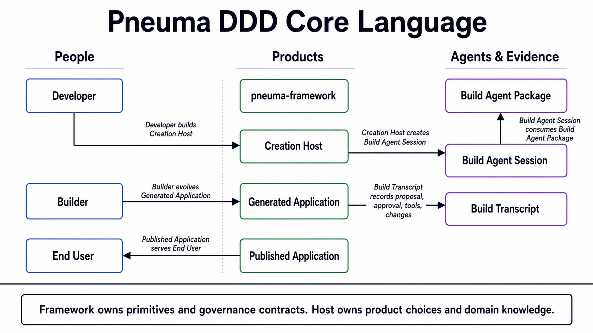
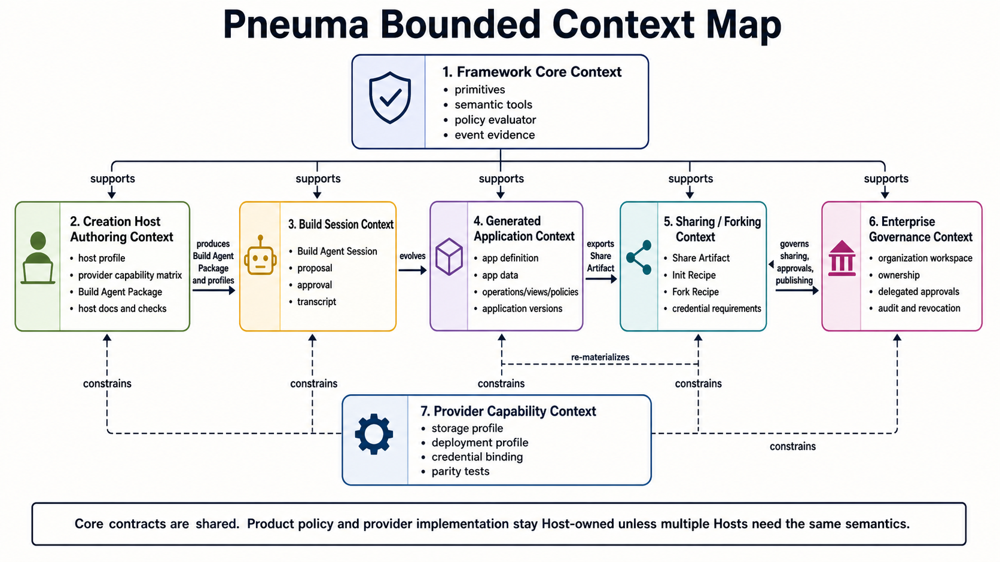
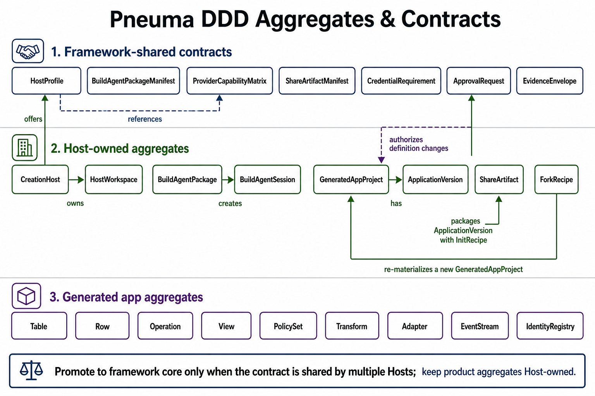

# Creation Host DDD Review

**Status:** Current DDD review anchor, not an ADR.
**Last updated:** 2026-05-10
**Chinese version:** [creation-host-ddd-review.zh-CN.md](./creation-host-ddd-review.zh-CN.md)
**Purpose:** Re-align the domain model after M37 and the Production Readiness v0 pass around two core problems: how a Developer builds a Creation Host, and how team / org sharing and enterprise governance attach without collapsing Host product logic into framework core.

This document does not replace [domain-model.md](./domain-model.md). That file remains the aggregate model for the **Generated Application** bounded context. This review adds the higher-level DDD map around Creation Host authoring, Build Agent packages, sharing/forking, provider profiles, and enterprise governance.

## 1. Why Revisit DDD Now

M1-M37 proved a strong set of generated-app and Creation Host primitives:

- app definition is governed data;
- Operation is the shared UI / Agent / API action primitive;
- Builder intent can become one approved change-set;
- a real backend agent can use framework semantic tools;
- Builder-created capabilities can be packaged, restarted, published, monitored, and rolled back;
- open-ended UI/module artifacts can be Host-owned without pretending they are framework definition rows;
- a new Developer has a scaffold, doctor, and Creation Host contract guide;
- draft source changes can enter Code Change Lane with guardrails, readable diff, apply/rollback evidence, and BuildThread receipts;
- runtime composition has explicit diagnostics and readiness helpers;
- Host-owned open-ended contributions can be packaged through HostExtension slots;
- backend turns can use BuildThread as source of truth through `AgentBackend.runTurn`;
- Host credential broker utilities can support local session cookies, OAuth state, credential refs, no-secret credential rebinding evidence, and test OAuth fixtures;
- Build Assurance can make Builder + Build-phase Agent changes visible through review packets, persisted assurance cases, recovery drills, and adoption guidance;
- Production Readiness v0 adds execution-level sharing governance decisions, portable artifact safety scanning, Host readiness summaries, and BuildThread inspection summaries.

The new pressure is different. It is no longer only:

```text
Can Bob build an app?
```

It is:

```text
Can Alice build a Creation Host that gives Bob, Charlie, and Dave safe Build Agent sessions, provider choices, share/fork recipes, credential boundaries, and deploy paths?
```

That shift exposed two large problems. M22-M37 closed their first framework-level contracts, and Production Readiness v0 tightened the places downstream Hosts had started to re-invent:

1. **Creation Host Authoring:** how a Developer expresses the Host's profiles, Build Agent Package, provider matrix, credential boundary, review rules, scaffold/source boundary, extension slots, and verification hooks.
2. **Team / Org Sharing Governance:** how generated apps can be shared, forked, re-bound, approved, published, revoked, audited, and governed across people and organizations.

This DDD review now provides the vocabulary and aggregate candidates for those two lanes plus the post-RC source-change, extension, backend-turn, credential, assurance, and production-readiness contracts.

## 2. Core Language



| Term | Definition | Owner |
|---|---|---|
| **pneuma-framework** | Library/runtime providing primitives, semantic tools, governance contracts, lifecycle/release tools, wire protocol, agent backend abstraction, and evidence surfaces. | Framework |
| **Creation Host** | Builder-facing product surface built by a Developer. It offers profiles, creation sessions, preview, inspection, publish, monitor, rollback, and Host policy. | Host-owned product |
| **Generated Application** | App created through a Creation Host. It owns app definition, app data, operations/views/policies, versions, and generated-app evidence. | Host-managed app |
| **Published Application** | A selected generated-app version exposed to End Users. | Host/runtime |
| **Build Agent Package** | Versioned package authored by the Developer. It contains system prompt material, allowed tools, provider matrix, credential rules, review checklist, and verification hooks for Build Agent Sessions. | Host-owned; candidate framework contract |
| **Build Agent Session** | Per-app/per-session agent runtime created by the Creation Host from a Build Agent Package. It is bound to a Builder, generated app, active profile, credentials, approval channel, and workspace. | Host/session |
| **BuildThread** | Framework-owned semantic transcript for Builder intent, agent proposal, approval/denial, execution receipt, and resulting changes. Backend-native sessions are cache/optimization. | Shared evidence contract |
| **Host Profile** | A Developer-declared stack and capability choice set, such as local SQLite + local Docker or remote Postgres + server Docker image. | Host-owned; framework validates minimum shape |
| **Provider Capability Matrix** | Declares what a profile/provider combination supports and how unsupported capabilities fail closed. | Host-owned; candidate framework contract |
| **Credential Requirement** | Non-secret declaration that a capability needs a credential with provider, scopes, account binding mode, and runtime placement. | Shared contract |
| **Credential Binding Ref** | Reference to a user/host/deployment credential stored outside app data. It is not a secret. | Host/governance |
| **Share Artifact** | Portable package that contains app definition, version manifest, provider requirements, default policies/views/ops, and init recipe. It excludes private secrets and private derived cache. | Host-owned; candidate framework manifest |
| **Init Recipe** | Idempotent initialization steps that materialize portable defaults through semantic operations. | Host/sharing |
| **Fork Recipe** | Recipe for creating a new Generated Application lineage from a share artifact or version, potentially with a different Host Profile. | Host/sharing |
| **Organization Workspace** | Governance boundary for multi-user ownership, approval, publish/deploy rights, audit retention, revocation, and credential brokering. | Enterprise governance |

The key new distinction is:

```text
Build Agent Package = Developer-authored capability and guardrail package.
Build Agent Session = Builder-specific runtime instance created from that package.
```

Bob owns his Build Agent Session for `dev-board`, but Alice prepared the package that makes that session safe and useful.

## 3. Bounded Context Map



### 3.1 Framework Core Context

**Purpose:** provide the shared primitives and governance contracts that every Creation Host can rely on.

**Already proven:**

- Table / Row / Operation / View / PolicySet / Transform / Adapter / EventStream / IdentityRegistry;
- definition-as-data via system-owned definition tables;
- semantic tools such as `definition.apply`, `definition.apply_change_set`, lifecycle and release tools;
- approval token and permission ledger evidence;
- query/View fail-closed behavior;
- release rollout evidence;
- Creation Host profile/project/version minimum store.

**Should own:**

- shared primitive contracts;
- semantic tool contracts;
- policy and approval primitives;
- common evidence envelopes;
- minimum host/profile/project/version schemas when multiple Hosts need the same semantics;
- validation/test-kit helpers for Host-authored contracts.

**Should not own by default:**

- Alice's product UX;
- Bob's domain data model;
- provider-specific implementation code;
- `mawidget`-specific prompt content;
- organization policy product workflows;
- concrete cloud deploy adapters unless multiple Hosts converge on the same contract.

### 3.2 Creation Host Authoring Context

**Purpose:** help the Developer produce a Creation Host that can safely create governed Build Agent Sessions.

**Core question:**

```text
How does Alice express what Bob's Build Agent is allowed to know, call, modify, verify, and ship?
```

**Candidate aggregates:**

| Aggregate | Identity | Owns | Invariants |
|---|---|---|---|
| **CreationHost** | `host_id` | Host metadata, supported profiles, authoring packages, global Host policy references | Profile ids unique; every published profile validates; Host policy cannot grant secrets into app DB. |
| **HostWorkspace** | `host_workspace_id` | Local or hosted work area for generated apps, packages, diagnostics, and reference evidence | Workspace state must be readable by Host diagnostics; generated app ids unique within workspace. |
| **HostProfile** | `profile_id` | Stack choices, capability ids, provider bindings, deployment target type, unsupported capability posture | Unsupported capabilities fail closed; profile references an existing ProviderCapabilityMatrix. |
| **ProviderCapabilityMatrix** | `matrix_id` | Storage/deploy/agent/provider capabilities and parity requirements | Capability names stable; every capability declares supported/unsupported/error behavior. |
| **BuildAgentPackage** | `package_id + version` | prompt material, allowed tools, provider matrix refs, credential boundary, review rules, verification hooks | Package is immutable once used by a session; no raw secrets; tool allowlist is explicit; provider-specific implementation docs are separated from Builder-mode instructions. |

**Candidate domain services:**

- `HostAuthoringValidator`
- `BuildAgentPackageCompiler`
- `ProviderCapabilityMatrixValidator`
- `HostDoctor`
- `ProviderParityTestRunner`

**Promotion rule:** start Host-owned. Promote to framework core only when at least two independent Creation Hosts need the same manifest semantics.

### 3.3 Build Session Context

**Purpose:** run the Builder-facing creation/evolution loop.

**Core question:**

```text
How does one Builder intent become one proposal, one approval decision, a bounded set of tool calls, and durable evidence?
```

**Candidate aggregates:**

| Aggregate | Identity | Owns | Invariants |
|---|---|---|---|
| **BuildAgentSession** | `session_id` | backend session binding, Builder principal, app/version/profile refs, active package version, approval channel | Session must reference one immutable package version; active profile is explicit; session cannot bypass semantic tools. |
| **BuildProposal** | `proposal_id` | Builder intent, proposed capability changes, impact disclosure, required approvals | Proposal belongs to one session; proposal cannot execute before approval; denied proposal leaves app unchanged. |
| **BuildTranscript** | `transcript_id` | intent, model messages, tool calls, framework events, approvals, result evidence | Transcript is append-only; tool calls reference known tool ids; approval response is correlated to a proposal. |
| **ApprovalRequest** | `approval_request_id` | requested action, impact, approver scope, response, token linkage | Approval token is single-use and scoped; approval cannot be replayed across proposals. |

**Candidate domain services:**

- `BuildSessionFactory`
- `ProposalImpactAnalyzer`
- `ApprovalCoordinator`
- `TranscriptRecorder`
- `AgentToolSurfaceResolver`

**Boundary:** a Build Agent Session may know the active profile as context, but it must not implement provider-specific behavior. It calls semantic tools and receives fail-closed capability feedback.

### 3.4 Generated Application Context

**Purpose:** hold the app that is being generated and later published.

This context is already detailed in [domain-model.md](./domain-model.md). The aggregate roots remain:

```text
Table
Row
Operation
View
PolicySet
Transform
Adapter
EventStream
IdentityRegistry
```

**M21-aligned correction:** open-ended UI/module artifacts are Host-owned in v0 per [ADR-0031](../adr/0031-open-ended-definition-artifact-boundary.md). They can be previewed, approved, released, and rolled back through Host evidence, but they are not framework definition rows until a later ADR promotes that artifact shape.

**Candidate nearby aggregate:**

| Aggregate | Identity | Owns | Invariants |
|---|---|---|---|
| **GeneratedAppProject** | `app_id` | app identity, active profile, version lineage, current version pointer, sharing posture | One current version; profile changes go through fork/re-materialization, not silent DB migration. |
| **ApplicationVersion** | `app_id + version_id` | definition snapshot, data boundary refs, artifact refs, release readiness evidence | Immutable once published; can be forked into a new candidate; version evidence must identify profile and package version. |

These two are Host-level aggregates around the generated-app runtime, not replacements for the generated-app internal aggregate roots.

### 3.5 Sharing / Forking Context

**Purpose:** make Bob's app portable without leaking Bob's database, secrets, or private derived cache.

**Core question:**

```text
What exactly moves when Bob shares, Charlie installs, and Dave forks?
```

**Candidate aggregates:**

| Aggregate | Identity | Owns | Invariants |
|---|---|---|---|
| **ShareArtifact** | `share_artifact_id + version` | app definition envelope, version manifest, provider requirements, default views/ops/policies, init recipe, provenance metadata | No secrets; no private derived cache; manifest declares required credentials and unsupported capabilities. |
| **InitRecipe** | `recipe_id + version` | idempotent semantic steps for portable defaults | Steps call semantic operations or Host import hooks; raw SQL is not the default portability path. |
| **ForkRecipe** | `recipe_id + version` | source artifact/version, target profile, capability removals, credential rebinding requirements, re-materialization steps | Fork cannot silently preserve incompatible provider state; unsupported capabilities must be removed or fail closed. |
| **InstallSession** | `install_session_id` | installer principal, target workspace, credential binding status, recipe execution evidence | Install completes only after required credentials are bound or explicitly skipped when optional. |

**Candidate domain services:**

- `ShareArtifactBuilder`
- `ShareArtifactVerifier`
- `InitRecipeExecutor`
- `ForkMaterializer`
- `CredentialRebindingCoordinator`

**Important rule:** SQLite to Postgres is not a raw database migration. It is re-materialization from app definition + init recipe + provider re-sync under a different Host Profile.

### 3.6 Provider Capability Context

**Purpose:** express implementation choices without letting the Build Agent special-case providers.

**Candidate value objects and contracts:**

| Object | Description |
|---|---|
| **StorageProfile** | Logical storage capability such as relational rows, transactions, vector index, file artifacts. |
| **DeploymentProfile** | Local process, local Docker, remote Docker image, managed platform, or host-specific deployment target. |
| **ProviderCapability** | One named capability with supported operations, limitations, and fail-closed behavior. |
| **CredentialRequirement** | Provider, scopes, binding mode, placement, and rotation expectations. |
| **CredentialBindingRef** | Non-secret pointer to an actual credential in Keychain, secret manager, KMS, env, or Host credential broker. |
| **ParityTestSuite** | Tests that prove two profiles satisfy the same semantic contract for the capabilities they both claim. |

**Boundary:** provider-specific code belongs to Developer/adapter-authoring mode. Normal Builder-mode Build Agent Sessions should call semantic tools and read capability feedback, not write raw provider code.

### 3.7 Enterprise Governance Context

**Purpose:** later support team/org sharing, delegated approval, policy, audit, and revocation.

This is not the immediate next implementation lane, but it must shape the model now.

**Candidate aggregates:**

| Aggregate | Identity | Owns | Invariants |
|---|---|---|---|
| **OrganizationWorkspace** | `org_id + workspace_id` | members, roles, app ownership, Host policies, retention settings | Every generated app has an owner; ownership transfer is audited. |
| **GovernancePolicySet** | `policy_set_id` | share/fork/publish/deploy/revoke/approve rules | Rules are explainable; default posture is explicit; policy changes are audited. |
| **DelegatedApprovalGrant** | `grant_id` | who may approve what action, for which app/profile/provider/deployment target | Grants are scoped, revocable, and time-bounded when needed. |
| **CredentialBrokerPolicy** | `policy_id` | per-user/shared/admin-delegated credential rules | Secrets never enter share artifacts or app data; rotation and revocation are observable. |
| **AuditRetentionPolicy** | `policy_id` | retention windows, export controls, legal hold, evidence visibility | Evidence cannot be deleted before policy allows it. |

**Candidate domain services:**

- `OrganizationPolicyEvaluator`
- `DelegatedApprovalResolver`
- `CredentialBroker`
- `RevocationCoordinator`
- `AuditExporter`

**Dependency:** this context depends on the Creation Host Authoring Context. Enterprise governance is weak if Build Agent Package, Host Profile, credential requirements, and share/fork semantics are still implicit.

## 4. Aggregate And Contract Map



The model separates three layers:

1. **Framework-shared contracts** - candidate schemas that multiple Hosts may need.
2. **Host-owned aggregates** - product/domain state that belongs to a Creation Host implementation.
3. **Generated app aggregates** - already implemented and tested in `packages/core-domain`.

### 4.1 Framework-Shared Contract Candidates

These are not all implementation commitments. They are the candidates most likely to become framework contracts after one Authoring Kit slice proves the shape.

| Contract | Why it may belong in framework | First validation path |
|---|---|---|
| **HostProfile** | Already minimally exists in `packages/core/src/creation-host.ts`; multiple Hosts need profile identity/capabilities/metadata. | Extend only with test-first schema helpers if M22 needs it. |
| **BuildAgentPackageManifest** | Build Agent Sessions need a stable package boundary independent of backend provider. | Start as Host-owned file; add framework validator/test-kit before runtime enforcement. |
| **ProviderCapabilityMatrix** | Prevents Build Agent provider-special-casing and makes profile parity testable. | Add docs + sample + validator; no concrete provider prescription. |
| **ShareArtifactManifest** | Sharing/forking needs a portable, inspectable, no-secret envelope. | Start with reference Host share export/import pressure. |
| **CredentialRequirement** | Share/fork and provider profiles need credential declarations without secrets. | Add value-object tests when implemented. |
| **ApprovalRequest** | Already partially proven through M7; may need a more explicit shared shape for Host-level approvals. | Reconcile current permission prompt / ledger / token contracts before adding new schema. |
| **EvidenceEnvelope** | Build transcript, release evidence, share install, fork, and enterprise audit all need durable evidence. | Start by documenting common fields; promote only after two consumers. |

### 4.2 Host-Owned Aggregates

These should stay Host-owned unless multiple independent Hosts converge:

- `CreationHost`
- `HostWorkspace`
- `BuildAgentPackage`
- `BuildAgentSession`
- `GeneratedAppProject`
- `ApplicationVersion`
- `ShareArtifact`
- `InitRecipe`
- `ForkRecipe`
- `InstallSession`

The framework can provide validators and test kits for their manifest boundaries. It should not own Alice's product workflow, product copy, UI surface, provider business rules, or domain-specific agent knowledge.

### 4.3 Generated-App Aggregates

These are already core primitives:

- `Table`
- `Row`
- `Operation`
- `View`
- `PolicySet`
- `Transform`
- `Adapter`
- `EventStream`
- `IdentityRegistry`

They remain the core domain of the generated app runtime. The new DDD work should not dilute them by forcing Host authoring concerns into `core-domain`.

## 5. Core Contract Adjustment Principles

The current `packages/core/src/creation-host.ts` contract is intentionally small:

```text
CreationHostProfile
CreationHostProject
CreationHostVersion
CreationHostState
CreationHostStore
```

That should remain true until a concrete Authoring Kit slice needs more.

Recommended adjustment principles:

1. **Do not move product aggregates into framework core.** `BuildAgentPackage` may become a manifest contract; Alice's package content remains Host-owned.
2. **Do not make provider portability magical.** Support re-materialization and parity tests, not silent database migration.
3. **Do not let Builder-mode agents special-case providers.** Enforce this with tool allowlists, capability matrix validation, review checks, and tests.
4. **Do not store secrets in generated-app data or share artifacts.** Store credential requirements and refs only.
5. **Promote only stable shared shapes.** A contract graduates to framework core only after it has at least two consumers or one strong reference Host plus a clear extension path.
6. **Every promoted contract needs tests first.** Core package domain contracts should have value-object or service tests before implementation changes.

## 6. Testing Implications

Existing tests already cover the generated-app core:

```text
packages/core-domain/test/aggregates/*
packages/core-domain/test/value-objects/*
packages/core-domain/test/services/*
packages/core-domain/test/lifecycle/*
packages/core/test/creation-host.test.ts
packages/core/test/tools/definition-*.test.ts
packages/core/test/permission-ledger*.test.ts
packages/core/test/release-*.test.ts
```

M22-M37 and Production Readiness v0 added the first Creation Host authoring, sharing-governance, source-change, runtime, extension, backend-turn, credential, assurance, and adoption contract tests:

| Contract area | Required tests now carried by the repo |
|---|---|
| BuildAgentPackageManifest validator | rejects missing tool allowlist, raw secret material, unsupported provider refs, and provider-specialized Builder sessions |
| ProviderCapabilityMatrix validator | rejects missing fail-closed behavior, unknown capability ids, profile references to absent provider capabilities, and missing parity coverage |
| CredentialRequirement value object | rejects malformed ids/providers/scopes/binding modes/placements/required flags |
| ShareArtifactManifest validator | rejects secrets, private cache, source database leakage, missing provider requirements, and non-idempotent init recipe shape |
| Host authoring kit cross-contract | binds package id/version, provider matrix id, source/target profiles, required capabilities, and verification hooks |
| SharingGovernanceManifest validator | validates subject refs, action/scope declarations, credential rebinding policy, revocation refs, and credential requirement shape |
| CredentialRebindingEvidence validator | binds no-secret evidence to artifact/app/version, subject, provider, and requirement refs |
| SharingGovernanceBundle validator | binds share artifact, governance, credential evidence, and provider matrix into one coherent share/fork/install bundle |
| SharingGovernanceBundle decision | fails closed before execution when artifact/governance/evidence/request do not align |
| Portable artifact safety scanner | rejects generic and provider-shaped secret material and raw source database material before bundle export |
| Code Change Lane executor | proves draft evidence, protected-path checks, stale-base rejection, approved apply, rollback, rejection, and BuildThread receipts |
| Runtime Diagnostic Surface | proves runtime mode, boot options, health diagnostics, route fallback, and readiness helper behavior |
| HostExtension Slot Contract | proves slot compatibility, no-secret portability, approval governance, and versioned manifest refs |
| AgentBackend runTurn / BuildThread | proves BuildThread replay, backend session cache, decision+receipt helper, inspection summary, and legacy transport compatibility |
| Host credential utilities | prove cookie hashing, server-side revoke, OAuth state/callback binding, credential refs, and no-secret rebinding evidence |
| Build Assurance | proves review packet validation, approval statement formatting, persisted assurance cases, release evidence, and recovery drill matrices |

For any future change to these contracts, add the negative test before changing implementation. The minimum verification remains:

```bash
bun test packages/core-domain packages/core
bun run typecheck
```

If a future slice changes `packages/core` or `packages/core-domain`, run the narrower failing tests first, then the broader commands above.

## 7. Current Boundary After M37 + Production Readiness v0

M22-M37 plus Production Readiness v0 are still not "enterprise security" as a hosted product. They close the first framework-level contract boundary that lets Alice build a Creation Host without leaking product-specific behavior into framework core, while giving downstream Hosts fewer chances to skip safety-critical checks by accident.

What is now explicit:

1. Alice can describe the Build-phase Agent package as a Host-owned contract: instructions, tool allowlist, provider specialization policy, credential boundary, review checklist, and verification hooks.
2. Alice can describe provider capabilities and parity expectations without letting the Builder-mode Agent write provider-specific branches.
3. A share artifact is a portable app/version recipe, not a database copy. It excludes secrets, private derived cache, and source database material.
4. Credential requirements are declarative and no-secret. Receiving Builders bind their own credentials through Host broker refs.
5. Sharing governance evaluates artifact/fork/published-app scoped share/fork/install/publish/rollback/revoke rights against owner/maintainer/operator/grant semantics.
6. `doctor-host` can validate individual files and the bundle relationship across share artifact, governance, credential evidence, and provider matrix.
7. Code Change Lane can turn guarded draft source changes into proposal evidence, approved apply, rollback evidence, and BuildThread receipts.
8. Runtime Diagnostic Surface lets Hosts inspect runtime mode, boot options, route fallback, health, and readiness without becoming a deployment framework.
9. HostExtension slots make portable Host-owned widget/hook/tool/API contribution bundles explicit without promoting them to framework definition rows.
10. `AgentBackend.runTurn` gives backend adapters a BuildThread-backed turn contract while treating native sessions as cache.
11. Host credential utilities give local/reference Hosts shared session, OAuth, credential-ref, and no-secret rebinding helpers without becoming hosted identity or production secret storage.
12. Build Assurance gives Hosts a visible engineering-control loop around Builder + Build-phase Agent changes: proposal status, review packet, approval statement, persisted assurance case, release evidence, and recovery drill matrix.
13. Production Readiness v0 provides canonical execution/adoption helpers: `evaluateSharingGovernanceBundle`, `validatePortableArtifactSafety`, `createCreationHostReadinessSummary`, and `summarizeBuildThreadTurns`.

What remains open:

1. Production credential persistence, hosted account linking, and organization identity remain Host/product responsibilities unless a later shared contract emerges.
2. Organization workspace membership, delegated approvals, and durable audit retention remain future enterprise-governance implementation work.
3. Productized fork/install materialization from share artifact into a new target profile is still not a framework-provided runtime.
4. Real SQLite/Postgres parity runner remains beyond manifest-level parity declarations.
5. Productized install/fork governance UI on top of the contract evidence remains Host-owned.
6. Provider-native event normalization and read-only tool-result replay for richer backend turns remain open.
7. A larger dogfood pass such as rebuilding Pneuma 2.x modes as Creation Host profiles/templates remains the strongest broad validation lane.

## 8. Decisions To Carry Forward

| Decision | Current recommendation |
|---|---|
| Is `BuildAgentPackage` first-class? | Yes as a Host-owned aggregate and framework manifest contract. The framework validates the boundary; Alice owns package content. |
| Is `BuildAgentSession` framework-owned? | No. The framework provides backend/tool/wire/evidence primitives; the Host owns session lifecycle and product policy. |
| Is provider profile selection part of Builder context? | Yes. The agent may know it, but may not use it to write provider-specific implementation in normal Builder mode. |
| Is SQLite-to-Postgres migration a framework promise? | No. The promise is semantic re-materialization through app definition, init recipe, provider rebinding, and profile parity. |
| Are share artifacts databases? | No. They are portable manifests plus recipes and approved artifacts, without secrets or private cache. |
| Does enterprise governance start now? | Yes as contract shape, validation, execution decisions, and evidence helpers. Real org security, audit retention, hosted identity, and production credential persistence remain later implementation work. |
