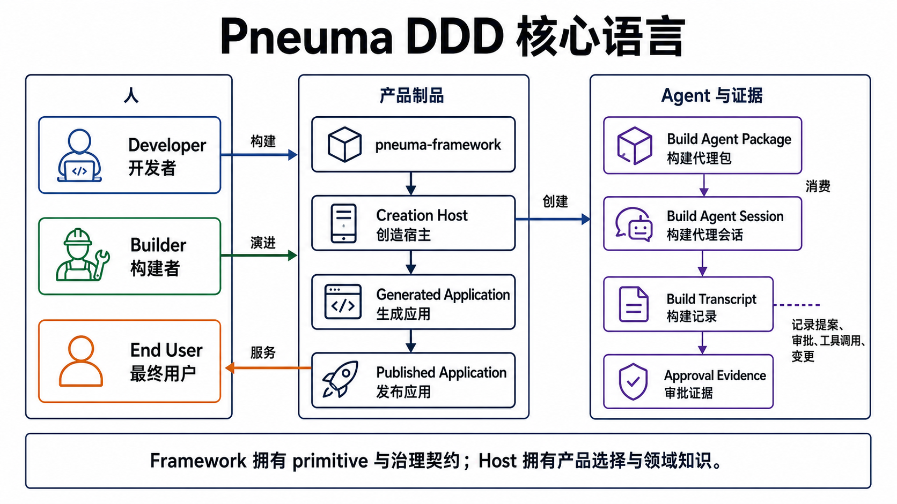
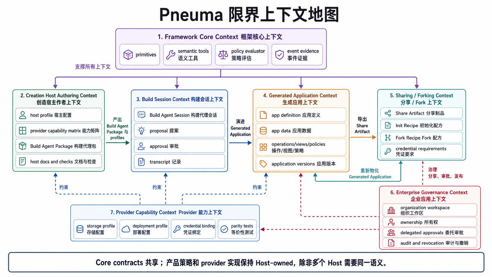
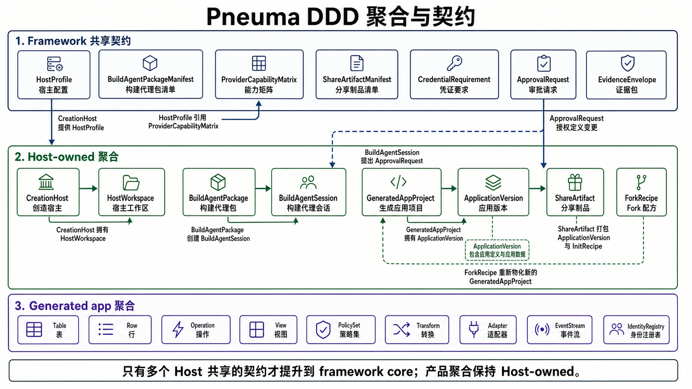

# Creation Host DDD Review

**状态：** 当前 DDD review anchor，不是 ADR。
**最后更新：** 2026-05-08
**英文版：** [creation-host-ddd-review.md](./creation-host-ddd-review.md)
**目的：** 在 M29 之后重新对齐领域模型，面向两个核心问题：Developer 如何构建自己的 Creation Host，以及 team / org sharing 和 enterprise governance 如何接到这个模型上。

本文不替代 [domain-model.md](./domain-model.md)。那份文档仍然描述 **Generated Application** bounded context 的聚合模型。本文补上更高一层的 DDD 地图：Creation Host authoring、Build Agent package、sharing/forking、provider profile、enterprise governance。

## 1. 为什么现在重新做 DDD

M1-M29 已经证明了一组很强的 generated-app 和 Creation Host primitive：

- app definition 是受治理的数据；
- Operation 是 UI / Agent / API 共用的动作 primitive；
- 一个 Builder intent 可以变成一个 approved change-set；
- 真实 backend agent 可以使用 framework semantic tools；
- Builder 创建的能力可以被 package、restart、publish、monitor、rollback；
- open-ended UI/module artifact 在 v0 是 Host-owned，不强行伪装成 framework definition row；
- 新 Developer 已经有 scaffold、doctor、Creation Host contract guide；
- draft source changes 可以通过 Code Change Lane 进入 guardrails、readable diff、apply/rollback evidence 和 BuildThread receipts；
- runtime composition 已有显式 diagnostics 和 readiness helpers；
- Host-owned open-ended contributions 可以通过 HostExtension slots 打包；
- backend turns 可以通过 `AgentBackend.runTurn` 使用 BuildThread 作为 source of truth。

现在的新压力已经不只是：

```text
Bob 能不能做一个 app？
```

而是：

```text
Alice 能不能构建一个 Creation Host，让 Bob、Charlie、Dave 拥有安全的 Build Agent session、provider choices、share/fork recipes、credential boundaries 和 deploy paths？
```

这暴露出两个大问题，而 M22-M29 已经关闭了它们的第一层 framework-level contracts：

1. **Creation Host Authoring：** Developer 如何表达 Host 的 profiles、Build Agent Package、provider matrix、credential boundary、review rules、scaffold/source boundary、extension slots、verification hooks。
2. **Team / Org Sharing Governance：** generated apps 如何在人和组织之间 share、fork、re-bind、approve、publish、revoke、audit、govern。

这份 DDD review 为这两条线，以及 post-RC source-change / extension / backend-turn contracts，提供统一语言和聚合候选。

## 2. 核心语言



| 术语 | 定义 | 所属边界 |
|---|---|---|
| **pneuma-framework** | 提供 primitives、semantic tools、governance contracts、lifecycle/release tools、wire protocol、agent backend abstraction、evidence surfaces 的 library/runtime。 | Framework |
| **Creation Host** | Developer 构建的 Builder-facing 产品表面。它提供 profiles、creation sessions、preview、inspection、publish、monitor、rollback、Host policy。 | Host-owned product |
| **Generated Application** | 通过 Creation Host 创建出来的 app。拥有 app definition、app data、operations/views/policies、versions、generated-app evidence。 | Host-managed app |
| **Published Application** | 暴露给 End User 的某个 generated-app version。 | Host/runtime |
| **Build Agent Package** | Developer 编写的 versioned package。包含 system prompt material、allowed tools、provider matrix、credential rules、review checklist、verification hooks，用于创建 Build Agent Sessions。 | Host-owned；候选 framework contract |
| **Build Agent Session** | Creation Host 基于 Build Agent Package 创建出来的 per-app/per-session agent runtime。绑定 Builder、generated app、active profile、credentials、approval channel、workspace。 | Host/session |
| **BuildThread** | Builder intent、agent proposal、approval/denial、execution receipt、result changes 的 framework-owned semantic transcript。backend-native sessions 是 cache/optimization。 | Shared evidence contract |
| **Host Profile** | Developer 声明的 stack 和 capability choice set，例如 local SQLite + local Docker，或 remote Postgres + server Docker image。 | Host-owned；framework 验证最小形状 |
| **Provider Capability Matrix** | 声明 profile/provider 组合支持什么、不支持什么，以及不支持时如何 fail closed。 | Host-owned；候选 framework contract |
| **Credential Requirement** | 非 secret 声明：某个 capability 需要什么 provider、scopes、account binding mode、runtime placement。 | Shared contract |
| **Credential Binding Ref** | 指向外部 secret store 中真实 credential 的非 secret 引用。它不是 secret。 | Host/governance |
| **Share Artifact** | Portable package，包含 app definition、version manifest、provider requirements、default policies/views/ops、init recipe。不包含 private secrets 和 private derived cache。 | Host-owned；候选 framework manifest |
| **Init Recipe** | 通过 semantic operations 物化 portable defaults 的幂等初始化步骤。 | Host/sharing |
| **Fork Recipe** | 从 share artifact 或 version 创建新的 Generated Application lineage 的 recipe，可能选择不同 Host Profile。 | Host/sharing |
| **Organization Workspace** | 多人治理边界：ownership、approval、publish/deploy rights、audit retention、revocation、credential brokering。 | Enterprise governance |

这里最重要的新区分是：

```text
Build Agent Package = Developer 编写的能力与约束包。
Build Agent Session = 基于 package 创建出来的 Builder-specific runtime instance。
```

Bob 拥有 `dev-board` 的 Build Agent Session，但 Alice 预先准备了让这个 session 安全、有用的 package。

## 3. 限界上下文地图



### 3.1 Framework Core Context

**目的：** 提供所有 Creation Host 都能依赖的 shared primitives 和 governance contracts。

**已经证明：**

- Table / Row / Operation / View / PolicySet / Transform / Adapter / EventStream / IdentityRegistry；
- 通过 system-owned definition tables 实现 definition-as-data；
- `definition.apply`、`definition.apply_change_set`、lifecycle、release 等 semantic tools；
- approval token 和 permission ledger evidence；
- query/View fail-closed 行为；
- release rollout evidence；
- Creation Host profile/project/version 最小 store。

**应该拥有：**

- shared primitive contracts；
- semantic tool contracts；
- policy 和 approval primitives；
- common evidence envelopes；
- 多个 Host 需要同一语义时的 minimum host/profile/project/version schema；
- Host-authored contracts 的 validation/test-kit helpers。

**默认不应该拥有：**

- Alice 的产品 UX；
- Bob 的领域数据模型；
- provider-specific implementation code；
- `mawidget`-specific prompt content；
- organization policy product workflows；
- 具体云 deploy adapter，除非多个 Host 收敛到同一 contract。

### 3.2 Creation Host Authoring Context

**目的：** 帮助 Developer 生产一个可以安全创建 governed Build Agent Sessions 的 Creation Host。

**核心问题：**

```text
Alice 如何表达 Bob 的 Build Agent 可以知道什么、调用什么、修改什么、验证什么、发布什么？
```

**候选聚合：**

| 聚合 | 身份 | 拥有什么 | 不变量 |
|---|---|---|---|
| **CreationHost** | `host_id` | Host metadata、supported profiles、authoring packages、global Host policy refs | Profile id 唯一；每个 published profile 必须通过验证；Host policy 不能把 secrets 授权进入 app DB。 |
| **HostWorkspace** | `host_workspace_id` | generated apps、packages、diagnostics、reference evidence 的 local 或 hosted 工作区 | workspace state 必须可被 Host diagnostics 读取；generated app id 在 workspace 内唯一。 |
| **HostProfile** | `profile_id` | stack choices、capability ids、provider bindings、deployment target type、unsupported capability posture | unsupported capability 必须 fail closed；profile 引用存在的 ProviderCapabilityMatrix。 |
| **ProviderCapabilityMatrix** | `matrix_id` | storage/deploy/agent/provider capabilities 和 parity requirements | capability names 稳定；每个 capability 都声明 supported/unsupported/error behavior。 |
| **BuildAgentPackage** | `package_id + version` | prompt material、allowed tools、provider matrix refs、credential boundary、review rules、verification hooks | package 一旦被 session 使用即 immutable；不能含 raw secrets；tool allowlist 显式；provider-specific implementation docs 必须和 Builder-mode instructions 分离。 |

**候选领域服务：**

- `HostAuthoringValidator`
- `BuildAgentPackageCompiler`
- `ProviderCapabilityMatrixValidator`
- `HostDoctor`
- `ProviderParityTestRunner`

**提升规则：** 起点保持 Host-owned。只有至少两个独立 Creation Hosts 需要同一 manifest 语义时，才提升到 framework core。

### 3.3 Build Session Context

**目的：** 运行 Builder-facing creation/evolution loop。

**核心问题：**

```text
一个 Builder intent 如何变成一个 proposal、一个 approval decision、一组有边界的 tool calls、以及 durable evidence？
```

**候选聚合：**

| 聚合 | 身份 | 拥有什么 | 不变量 |
|---|---|---|---|
| **BuildAgentSession** | `session_id` | backend session binding、Builder principal、app/version/profile refs、active package version、approval channel | session 必须引用一个 immutable package version；active profile 显式；session 不能绕过 semantic tools。 |
| **BuildProposal** | `proposal_id` | Builder intent、proposed capability changes、impact disclosure、required approvals | proposal 属于一个 session；approval 前不能执行；denied proposal 不改变 app。 |
| **BuildTranscript** | `transcript_id` | intent、model messages、tool calls、framework events、approvals、result evidence | transcript append-only；tool calls 引用已知 tool ids；approval response 必须能关联到 proposal。 |
| **ApprovalRequest** | `approval_request_id` | requested action、impact、approver scope、response、token linkage | approval token single-use 且 scoped；approval 不能跨 proposal replay。 |

**候选领域服务：**

- `BuildSessionFactory`
- `ProposalImpactAnalyzer`
- `ApprovalCoordinator`
- `TranscriptRecorder`
- `AgentToolSurfaceResolver`

**边界：** Build Agent Session 可以知道 active profile 作为上下文，但不能实现 provider-specific behavior。它调用 semantic tools，并接收 fail-closed capability feedback。

### 3.4 Generated Application Context

**目的：** 持有正在生成并最终被发布的 app。

这个上下文已经在 [domain-model.md](./domain-model.md) 里详细描述。聚合根仍然是：

```text
Table
Row
Operation
View
PolicySet
Transform
Adapter
EventStream
IdentityRegistry
```

**M21 后的修正：** open-ended UI/module artifacts 在 v0 按 [ADR-0031](../adr/0031-open-ended-definition-artifact-boundary.md) 归 Host-owned。它们可以通过 Host evidence 被 preview、approve、release、rollback，但在后续 ADR 提升前，不是 framework definition rows。

**相邻候选聚合：**

| 聚合 | 身份 | 拥有什么 | 不变量 |
|---|---|---|---|
| **GeneratedAppProject** | `app_id` | app identity、active profile、version lineage、current version pointer、sharing posture | 只有一个 current version；profile change 走 fork/re-materialization，不能静默 DB migration。 |
| **ApplicationVersion** | `app_id + version_id` | definition snapshot、data boundary refs、artifact refs、release readiness evidence | published 后 immutable；可以 fork 成新的 candidate；version evidence 必须标识 profile 和 package version。 |

这两个是围绕 generated-app runtime 的 Host-level aggregates，不替代 generated-app 内部聚合根。

### 3.5 Sharing / Forking Context

**目的：** 让 Bob 的 app 可以 portable，同时不泄露 Bob 的数据库、secrets 或 private derived cache。

**核心问题：**

```text
Bob 分享、Charlie 安装、Dave fork 时，到底移动了什么？
```

**候选聚合：**

| 聚合 | 身份 | 拥有什么 | 不变量 |
|---|---|---|---|
| **ShareArtifact** | `share_artifact_id + version` | app definition envelope、version manifest、provider requirements、default views/ops/policies、init recipe、provenance metadata | 不含 secrets；不含 private derived cache；manifest 声明 required credentials 和 unsupported capabilities。 |
| **InitRecipe** | `recipe_id + version` | portable defaults 的 idempotent semantic steps | steps 调 semantic operations 或 Host import hooks；raw SQL 不是默认 portability path。 |
| **ForkRecipe** | `recipe_id + version` | source artifact/version、target profile、capability removals、credential rebinding requirements、re-materialization steps | fork 不能静默保留 incompatible provider state；unsupported capabilities 必须移除或 fail closed。 |
| **InstallSession** | `install_session_id` | installer principal、target workspace、credential binding status、recipe execution evidence | 只有 required credentials 已绑定或 optional credentials 被显式跳过时，install 才能完成。 |

**候选领域服务：**

- `ShareArtifactBuilder`
- `ShareArtifactVerifier`
- `InitRecipeExecutor`
- `ForkMaterializer`
- `CredentialRebindingCoordinator`

**关键规则：** SQLite 到 Postgres 不是 raw database migration。它是基于 app definition + init recipe + provider re-sync，在另一个 Host Profile 下重新 materialize。

### 3.6 Provider Capability Context

**目的：** 表达 implementation choices，但不让 Build Agent special-case providers。

**候选值对象和契约：**

| 对象 | 说明 |
|---|---|
| **StorageProfile** | 逻辑存储能力，例如 relational rows、transactions、vector index、file artifacts。 |
| **DeploymentProfile** | local process、local Docker、remote Docker image、managed platform、host-specific deployment target。 |
| **ProviderCapability** | 一个命名 capability，含 supported operations、limitations、fail-closed behavior。 |
| **CredentialRequirement** | Provider、scopes、binding mode、placement、rotation expectations。 |
| **CredentialBindingRef** | 指向 Keychain、secret manager、KMS、env 或 Host credential broker 中真实 credential 的非 secret 指针。 |
| **ParityTestSuite** | 证明两个 profiles 在双方都声明支持的 capabilities 上满足同一 semantic contract。 |

**边界：** provider-specific code 属于 Developer/adapter-authoring mode。正常 Builder-mode Build Agent Session 应该调用 semantic tools、读取 capability feedback，而不是写 raw provider code。

### 3.7 Enterprise Governance Context

**目的：** 未来支持 team/org sharing、delegated approval、policy、audit、revocation。

这不是立即实现方向，但必须现在影响模型。

**候选聚合：**

| 聚合 | 身份 | 拥有什么 | 不变量 |
|---|---|---|---|
| **OrganizationWorkspace** | `org_id + workspace_id` | members、roles、app ownership、Host policies、retention settings | 每个 generated app 都有 owner；ownership transfer 必须 audited。 |
| **GovernancePolicySet** | `policy_set_id` | share/fork/publish/deploy/revoke/approve rules | rules 可解释；default posture 显式；policy changes audited。 |
| **DelegatedApprovalGrant** | `grant_id` | 谁能批准什么 action，针对哪个 app/profile/provider/deployment target | grant scoped、revocable，必要时时间有界。 |
| **CredentialBrokerPolicy** | `policy_id` | per-user/shared/admin-delegated credential rules | secrets 永远不进入 share artifacts 或 app data；rotation/revocation 可观测。 |
| **AuditRetentionPolicy** | `policy_id` | retention windows、export controls、legal hold、evidence visibility | evidence 在 policy 允许前不能删除。 |

**候选领域服务：**

- `OrganizationPolicyEvaluator`
- `DelegatedApprovalResolver`
- `CredentialBroker`
- `RevocationCoordinator`
- `AuditExporter`

**依赖关系：** 这个上下文依赖 Creation Host Authoring Context。如果 Build Agent Package、Host Profile、credential requirements、share/fork semantics 还是隐式的，enterprise governance 会很脆弱。

## 4. 聚合与契约地图



模型分三层：

1. **Framework-shared contracts** - 多个 Host 可能需要的候选 schema。
2. **Host-owned aggregates** - 属于 Creation Host 实现的 product/domain state。
3. **Generated app aggregates** - 已经在 `packages/core-domain` 实现并测试的聚合。

### 4.1 Framework-shared contract 候选

这些不全是实现承诺。它们是一个 Authoring Kit slice 证明形状后，最可能成为 framework contract 的候选。

| Contract | 为什么可能属于 framework | 第一验证路径 |
|---|---|---|
| **HostProfile** | 已经在 `packages/core/src/creation-host.ts` 有最小实现；多个 Host 都需要 profile identity/capabilities/metadata。 | 只有 M22 需要时，才 test-first 扩展 schema helper。 |
| **BuildAgentPackageManifest** | Build Agent Session 需要一个不依赖 backend provider 的稳定 package 边界。 | 先作为 Host-owned 文件；runtime enforcement 前先加 framework validator/test-kit。 |
| **ProviderCapabilityMatrix** | 防止 Build Agent provider-special-casing，并让 profile parity 可测试。 | 加 docs + sample + validator；不规定具体 provider implementation。 |
| **ShareArtifactManifest** | Sharing/forking 需要 portable、inspectable、no-secret envelope。 | 先用 reference Host share export/import pressure 验证。 |
| **CredentialRequirement** | Share/fork 和 provider profiles 需要无 secret 的 credential declarations。 | 实现时补 value-object tests。 |
| **ApprovalRequest** | M7 已经部分证明；Host-level approval 可能需要更显式的 shared shape。 | 新 schema 前先 reconcile 当前 permission prompt / ledger / token contracts。 |
| **EvidenceEnvelope** | Build transcript、release evidence、share install、fork、enterprise audit 都需要 durable evidence。 | 先记录 common fields；至少两个 consumers 后再提升。 |

### 4.2 Host-owned aggregates

这些应该保持 Host-owned，除非多个独立 Hosts 收敛：

- `CreationHost`
- `HostWorkspace`
- `BuildAgentPackage`
- `BuildAgentSession`
- `GeneratedAppProject`
- `ApplicationVersion`
- `ShareArtifact`
- `InitRecipe`
- `ForkRecipe`
- `InstallSession`

framework 可以为它们的 manifest boundary 提供 validators 和 test kits。它不应该拥有 Alice 的 product workflow、product copy、UI surface、provider business rules、domain-specific agent knowledge。

### 4.3 Generated-app aggregates

这些已经是 core primitives：

- `Table`
- `Row`
- `Operation`
- `View`
- `PolicySet`
- `Transform`
- `Adapter`
- `EventStream`
- `IdentityRegistry`

它们仍然是 generated app runtime 的核心领域。新的 DDD 工作不应该把 Host authoring concerns 硬塞进 `core-domain`。

## 5. 核心契约调整原则

当前 `packages/core/src/creation-host.ts` contract 故意很小：

```text
CreationHostProfile
CreationHostProject
CreationHostVersion
CreationHostState
CreationHostStore
```

在具体 Authoring Kit slice 需要更多之前，它应该继续保持小。

推荐调整原则：

1. **不要把 product aggregates 搬进 framework core。** `BuildAgentPackage` 可以成为 manifest contract；Alice 的 package 内容仍然 Host-owned。
2. **不要把 provider portability 说成魔法。** 支持 re-materialization 和 parity tests，不承诺 silent database migration。
3. **不要让 Builder-mode agents special-case providers。** 用 tool allowlists、capability matrix validation、review checks、tests 来约束。
4. **不要把 secrets 存进 generated-app data 或 share artifacts。** 只存 credential requirements 和 refs。
5. **只提升稳定共享形状。** 一个 contract 只有在至少两个 consumers，或一个强 reference Host + 明确 extension path 后，才进入 framework core。
6. **每个提升的 contract 必须测试先行。** core package domain contracts 应该先有 value-object 或 service tests，再改实现。

## 6. 测试含义

已有测试覆盖 generated-app core：

```text
packages/core-domain/test/aggregates/*
packages/core-domain/test/value-objects/*
packages/core-domain/test/services/*
packages/core-domain/test/lifecycle/*
packages/core/test/creation-host.test.ts
packages/core/test/tools/definition-*.test.ts
packages/core/test/permission-ledger*.test.ts
packages/core/test/release-*.test.ts
```

M22-M29 已经加入第一批 Creation Host authoring、sharing governance、source-change、runtime、extension、backend-turn contract tests：

| Contract area | 当前 repo 承担的必要测试 |
|---|---|
| BuildAgentPackageManifest validator | 拒绝缺失 tool allowlist、raw secret material、unsupported provider refs、provider-specialized Builder sessions |
| ProviderCapabilityMatrix validator | 拒绝缺失 fail-closed behavior、unknown capability ids、profile 引用不存在的 provider capabilities、missing parity coverage |
| CredentialRequirement value object | 拒绝 malformed ids/providers/scopes/binding modes/placements/required flags |
| ShareArtifactManifest validator | 拒绝 secrets、private cache、source database leakage、missing provider requirements、non-idempotent init recipe shape |
| SharingGovernanceBundle validator | 把 share artifact、governance、credential evidence、provider matrix 绑定成一致 bundle |
| Code Change Lane executor | 证明 draft evidence、protected-path checks、stale-base rejection、approved apply、rollback、rejection 和 BuildThread receipts |
| Runtime Diagnostic Surface | 证明 runtime mode、boot options、health diagnostics、route fallback、readiness helper |
| HostExtension Slot Contract | 证明 slot compatibility、no-secret portability、approval governance、versioned manifest refs |
| AgentBackend runTurn | 证明 BuildThread replay、backend session cache、decision+receipt helper、legacy transport compatibility |

任何未来 contract 变更都应先补 negative test，再改实现。最低验证仍然是：

```bash
bun test packages/core-domain packages/core
bun run typecheck
```

如果未来 slice 修改 `packages/core` 或 `packages/core-domain`，先跑更窄的失败测试，再跑上面的 broader commands。

## 7. M29 后的当前边界

M22-M29 还不是“企业安全”本身。它们关闭的是第一层 framework-level contract boundary：Alice 能构建 Creation Host，而不把产品特定行为泄漏进 framework core。

现在已经明确的是：

1. Alice 可以把 Build-phase Agent package 描述为 Host-owned contract：instructions、tool allowlist、provider specialization policy、credential boundary、review checklist、verification hooks。
2. Alice 可以描述 provider capabilities 和 parity expectations，而不是让 Builder-mode Agent 写 provider-specific branches。
3. share artifact 是 portable app/version recipe，不是 database copy。它排除 secrets、private derived cache、source database material。
4. Credential requirements 是 declarative/no-secret。接收方 Builder 通过 Host broker refs 绑定自己的 credentials。
5. Sharing governance 可以用 artifact/fork/published-app scoped rights 评估 share/fork/install/publish/rollback/revoke。
6. `doctor-host` 可以验证单文件和 share artifact、governance、credential evidence、provider matrix 之间的 bundle 关系。
7. Code Change Lane 可以把 guarded draft source changes 变成 proposal evidence、approved apply、rollback evidence 和 BuildThread receipts。
8. Runtime Diagnostic Surface 让 Host inspect runtime mode、boot options、route fallback、health、readiness，而不把 framework 变成 deployment framework。
9. HostExtension slots 让 Host-owned widget/hook/tool/API contribution bundles 明确可移植，但不把它们提升为 framework definition rows。
10. `AgentBackend.runTurn` 给 backend adapters 一个 BuildThread-backed turn contract，同时把 native sessions 保持为 cache。

仍然开放的是：

1. 真实 Host credential broker integration 和 account linking flows。
2. Organization workspace membership、delegated approvals、durable audit retention。
3. 从 share artifact 到新 target profile 的 fork/install materialization 产品化。
4. 真实 SQLite/Postgres parity runner，不只是 manifest-level parity declarations。
5. 基于 contract evidence 的 install/fork governance UI。
6. provider-native event normalization 和 read-only tool-result replay。
7. 更大的 dogfood，例如把 Pneuma 2.x modes 重建为 Creation Host profiles/templates。

## 8. 后续要带走的决策

| 决策 | 当前推荐 |
|---|---|
| `BuildAgentPackage` 是否 first-class？ | 是，先作为 Host-owned aggregate；M22 之后很可能成为 framework manifest contract。 |
| `BuildAgentSession` 是否 framework-owned？ | 否。framework 提供 backend/tool/wire/evidence primitives；Host 拥有 session lifecycle 和 product policy。 |
| provider profile selection 是否属于 Builder context？ | 是。agent 可以知道它，但正常 Builder mode 不能用它写 provider-specific implementation。 |
| SQLite-to-Postgres migration 是否是 framework promise？ | 否。承诺是 app definition、init recipe、provider rebinding、profile parity 下的 semantic re-materialization。 |
| share artifact 是数据库吗？ | 否。它是 portable manifest + recipes + approved artifacts，不含 secrets 或 private cache。 |
| enterprise governance 现在是否开始实现？ | 现在应该影响模型，但实现应在 Authoring Kit 闭合之后。 |
