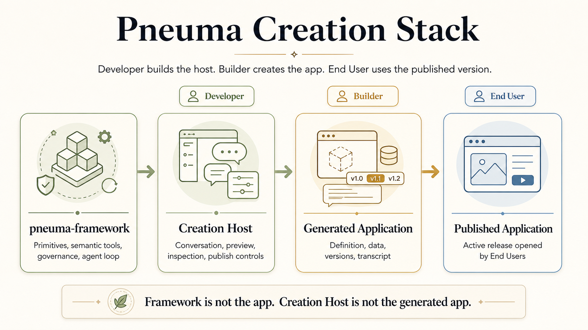
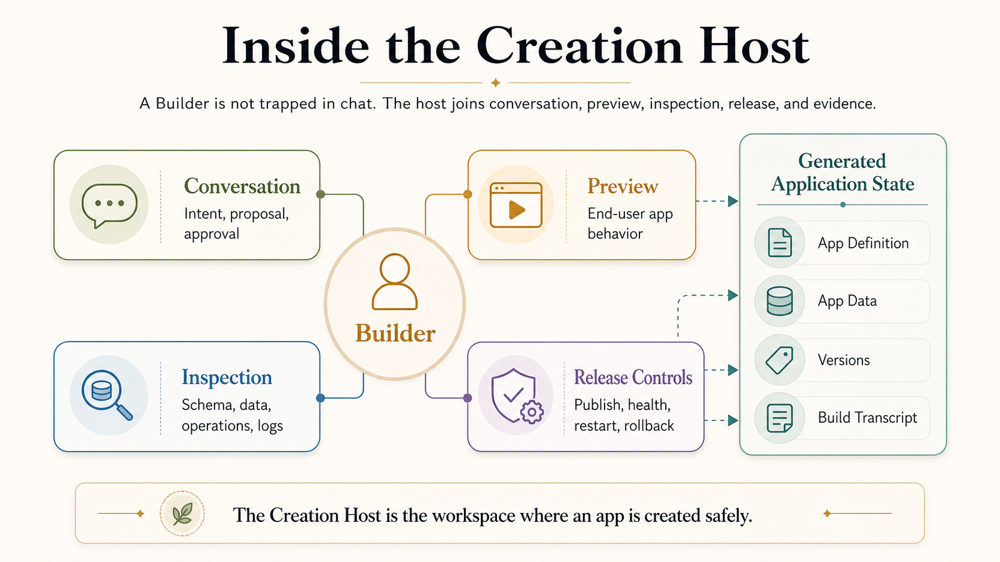
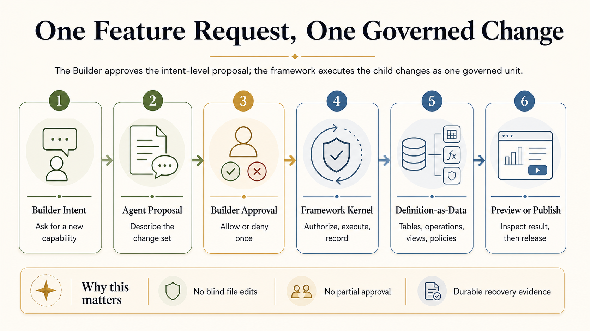
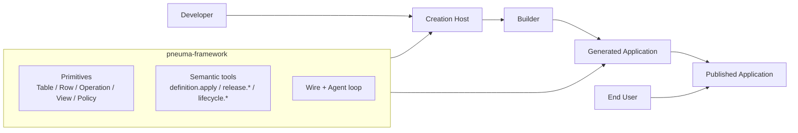
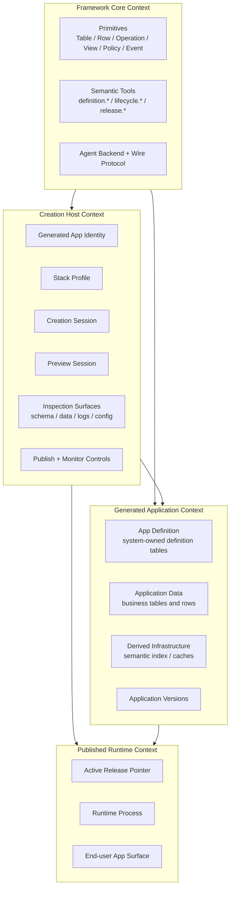
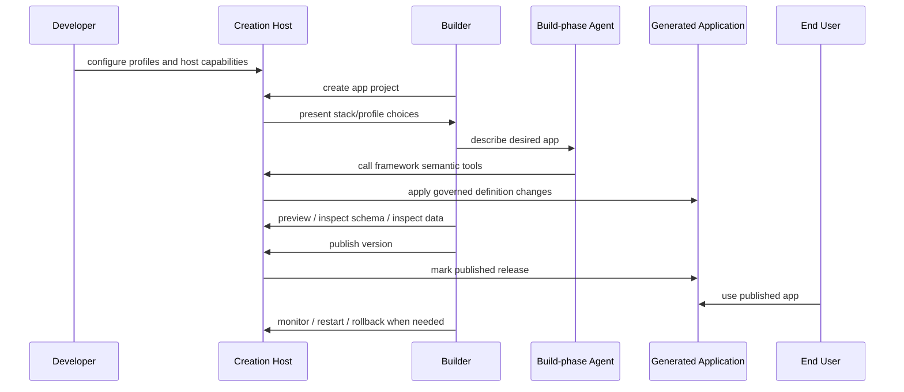
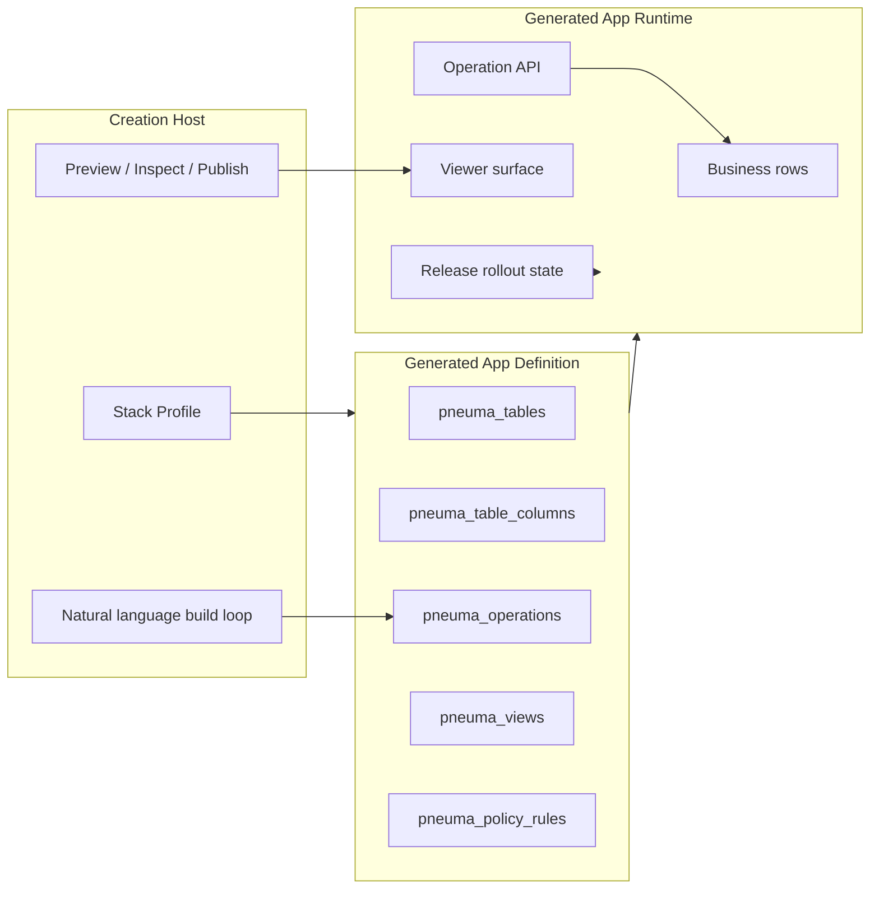

# Creation Host Model

**Status:** Top-level domain alignment accepted during M17  
**Last updated:** 2026-05-04  
**Audience:** developers and teammates who need to understand what Pneuma is ultimately for before reading aggregate-level details  
**Chinese version:** [Creation Host Model zh-CN](./creation-host-model.zh-CN.md)

## 0. Purpose

M1-M16 proved many app-domain primitives: governed app definitions, enterprise approval evidence, real persistence, a reference app, real backend-agent evolution, release candidates, semantic retrieval, rollout state, and an integrated Reference Creation Host.

Those milestones also exposed a terminology risk: **"pneuma app" can be misunderstood as a single app that a developer writes directly.** If that were the whole goal, many Pneuma primitives would be unnecessary.

The top-level goal is more specific:

> pneuma-framework supports **Creation Hosts**: product surfaces where a Builder creates, inspects, evolves, previews, publishes, and monitors generated applications through framework primitives and agents.

A reference demo may implement a Creation Host as a Bun TypeScript web app with version directories and local processes. That is an implementation choice, not the domain model.

M17 accepts this model as the top-level project boundary:

- **ADR-0029 is accepted.** Operation + definition-as-data is the framework's core primitive. Lifecycle scripts remain a runtime subsystem, not the primary mental model.
- **The four artifacts are accepted.** Framework, Creation Host, Generated Application, and Published Application are distinct design objects.
- **Creation Host contracts may exist in framework core.** The framework can define minimal shared contracts for profiles, projects, versions, preview sessions, and rollout state. Concrete workbench UX, session registry, marketplace, and product policy remain host/meta-app concerns.
- **Release-candidate review must include open-ended app pressure.** Knowledge Inbox and Team Decision Log prove schema-driven app creation; RC still needs a webcraft-style or similarly open-ended pressure line.
- **Concrete domain integrations are not core semantics.** Linear, OpenRouter, Qdrant, Docker, SQLite, Bun, and similar implementations can exist as reference integrations or profile candidates, but the framework primitive story must not depend on them.

## 1. Zero-Knowledge Visual Primer

This section is the fastest way to build the first mental model. The later sections define the same concepts more precisely.

### 1.1 The whole story in one picture



Read it from left to right:

```text
Developer builds the Creation Host.
Builder uses the Creation Host to create a Generated Application.
End User uses a Published Application version.
```

This is the key correction: **the framework is not the app, and the Creation Host is not the generated app.**

### 1.2 What the Builder actually sees



The Builder should not be trapped in blind chat. The Creation Host is the place where conversation, preview, inspection, release, and evidence meet.

### 1.3 What changes when the Builder asks for a feature



This is why Operation, Policy, approval evidence, rollback, release state, and transcript evidence are not isolated features. They are the control plane for safely creating and evolving applications through an agent.

## 2. Core Vocabulary



| Term | Meaning |
|---|---|
| **pneuma-framework** | The library/runtime providing primitives, semantic tools, wire protocol, agent backend abstraction, process supervision, and governance machinery. |
| **Creation Host** | A product surface built with the framework. It lets a Builder create and evolve Generated Applications. It may be a personal app builder, SaaS self-service builder, enterprise internal builder, or Pneuma 3.0 itself. |
| **Generated Application** | The app created through a Creation Host. It has an app definition, data, runtime surface, and versions. |
| **Application Version** | A restorable, previewable, and publishable version of a Generated Application. A reference host may store versions as `v0/v1/v2` directories, but the version-directory layout is not the domain model. |
| **Published Application** | A particular Application Version currently exposed to End Users. |
| **Stack Profile** | A Creation Host-declared capability/implementation choice set: persistence, semantic index backend, runtime, viewer SDK, rollout adapter, and agent backend. Profiles are selected at development time or creation time, not freely migrated at runtime by default. |
| **Creation Session** | The Builder-facing session where natural language, approval prompts, preview state, schema/data inspection, and agent activity come together. |
| **Build Transcript** | Durable evidence of the Builder request, agent proposal, approval, tool calls, framework events, and resulting app changes. |

## 3. Role Map

The same person may occupy multiple roles in a solo scenario, but the model stays separate:

| Role | Uses | Creates / Changes | Main Concern |
|---|---|---|---|
| **Developer** | pneuma-framework | Creation Host | Defines the builder product, allowed profiles, domain constraints, runtime choices, and host UX. |
| **Builder** | Creation Host | Generated Application versions | Shapes app behavior and UI through natural language, preview, inspection, approval, and publish actions. |
| **End User** | Published Application | App data through normal app operations | Uses the generated app. May never see the Build-phase Agent. |

The important correction:

```text
Developer does not merely "write a pneuma app".
Developer builds or configures a Creation Host.
Builder uses that host to create Generated Applications.
End User uses a Published Application.
```

## 4. Bounded Context Map



### Generated Application Bounded Context

The aggregate-level domain model in [domain-model.md](./domain-model.md) primarily describes this context:

```text
Table / Row / Operation / Transform / Adapter / PolicySet / EventStream / IdentityRegistry
```

Those primitives belong to the Generated Application's definition and runtime behavior.

### Creation Host Context

A Creation Host usually manages:

- generated app identity;
- stack profile selection;
- creation sessions and build transcripts;
- preview process/session state;
- schema/data/log/config inspection;
- application versions;
- publish, monitor, restart, and rollback controls.

These concepts do not automatically become `core-domain` aggregate roots. They become framework core contracts only when multiple Creation Hosts need the same semantics.

### Published Runtime Context

Published runtime is the End User-facing process/surface for a selected Application Version. M11 proved the first rollout state primitive (`active`, `candidate`, `previous`) but not production traffic switching.

## 5. Creation Flow



The Builder should not be forced into blind chat. A useful Creation Host gives the Builder at least four surfaces:

| Surface | Purpose |
|---|---|
| **Conversation** | Builder intent, agent proposal, approval prompts, execution feedback. |
| **Preview** | Running app behavior as the End User would experience it. |
| **Inspection** | Schema, data, operations, views, policy, logs, framework events. |
| **Release Controls** | Publish, health, restart, rollback, and release history. |

## 6. Where Existing Primitives Fit



Existing primitives remain valuable precisely because the Creation Host must safely generate and evolve applications:

| Primitive / Subsystem | Creation Host relevance |
|---|---|
| **Operation** | The shared action contract for UI, Agent, and public API. |
| **Definition-as-data** | Lets Builder/Agent evolve app structure through governed changes, not file edits. |
| **PolicySet / PermissionContext** | Lets generated apps express role/user-aware behavior, even in simple demos with typed `role` and `user_id`. |
| **View** | Lets the host and generated app expose app state without custom UI every time. |
| **Semantic tools** | Keep agents operating on framework state rather than scripts or Docker commands. |
| **ReleaseRolloutState** | Lets the Creation Host reason about active/candidate/previous published versions. |
| **SemanticIndexStore** | An optional generated-app derived capability selected by profile, not a universal runtime migration target. |

## 7. Stack Profiles Are Choice Boundaries

Stack Profiles prevent infinite generalization.

They should express candidate choices such as:

```text
persistence: sqlite | postgres
semantic_index: none | sqlite-local | qdrant
runtime: bun-ts | python
viewer: react | vanilla
rollout: local-process | local-docker | cloud
agent_backend: opencode | codex | claude
```

But an early Creation Host does not need to implement every candidate. It needs to make the choice boundary explicit.

Default leaning:

```text
Profile choice is fixed at development time or generated-app creation time.
Runtime migration between profiles is not supported unless a future host explicitly owns that migration.
```

This means Qdrant, Postgres, Python, or cloud deployment are future profile candidates. They are not required before the framework can reach a credible release candidate.

## 8. Reference Implementation vs Domain Model

The next reference Creation Host may use:

```text
Bun TypeScript
local process management
role/user_id demo inputs
version directories v0/v1/v2
no Docker dependency
no real authentication
```

Those are useful constraints for a demo and RC pressure test. They are not top-level domain requirements.

The domain model should only require:

- the host can create a generated app;
- the host can track app versions;
- the host can run preview sessions;
- the host can expose inspection surfaces;
- the host can publish a version;
- the host can monitor, restart, and rollback a published version;
- the generated app still uses framework primitives for data, operations, policy, and governance.

## 9. Implications For RC Planning

The next milestone path should target a **reference Creation Host**, not just another app template.

Healthy RC pressure:

```text
Developer configures a Creation Host
  -> Builder creates a Generated Application
  -> Builder previews and inspects it
  -> Builder evolves it through an agent
  -> Builder publishes it
  -> End User uses the Published Application
  -> Builder can monitor, restart, and rollback
```

This path tests whether Pneuma's abstractions are complete enough for real app creation. It avoids two failure modes:

- building a generic app framework that does not need Pneuma's domain model;
- endlessly generalizing adapters, databases, deployment targets, and vector stores before a Creation Host can be used.
