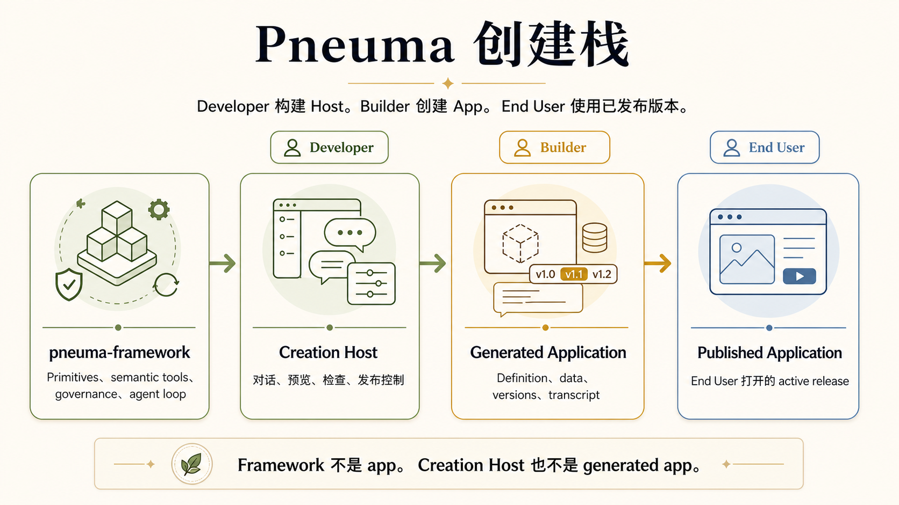
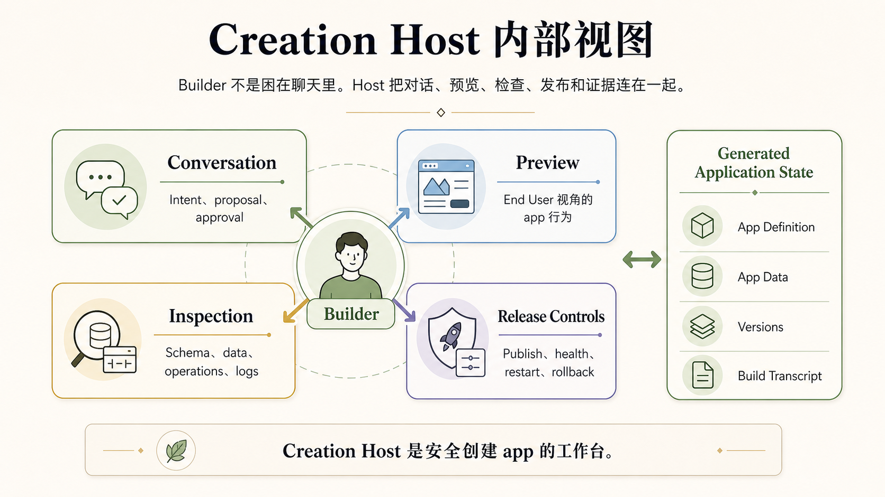
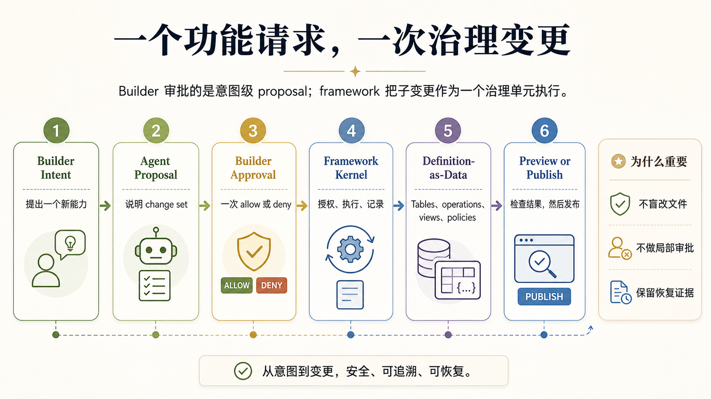
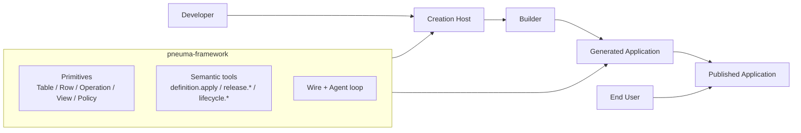
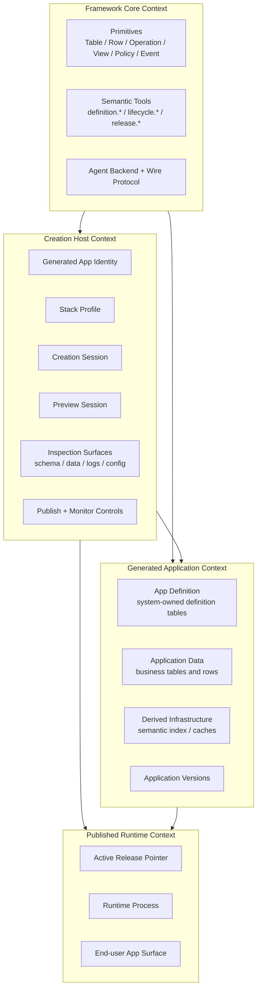
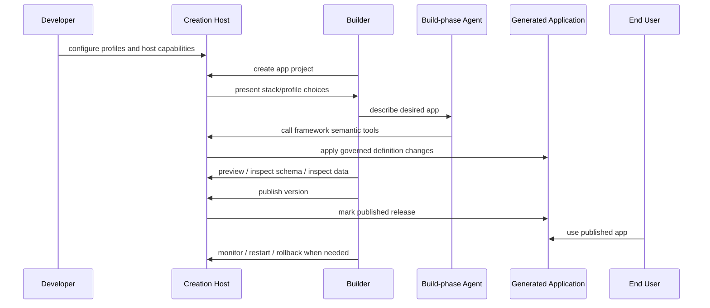
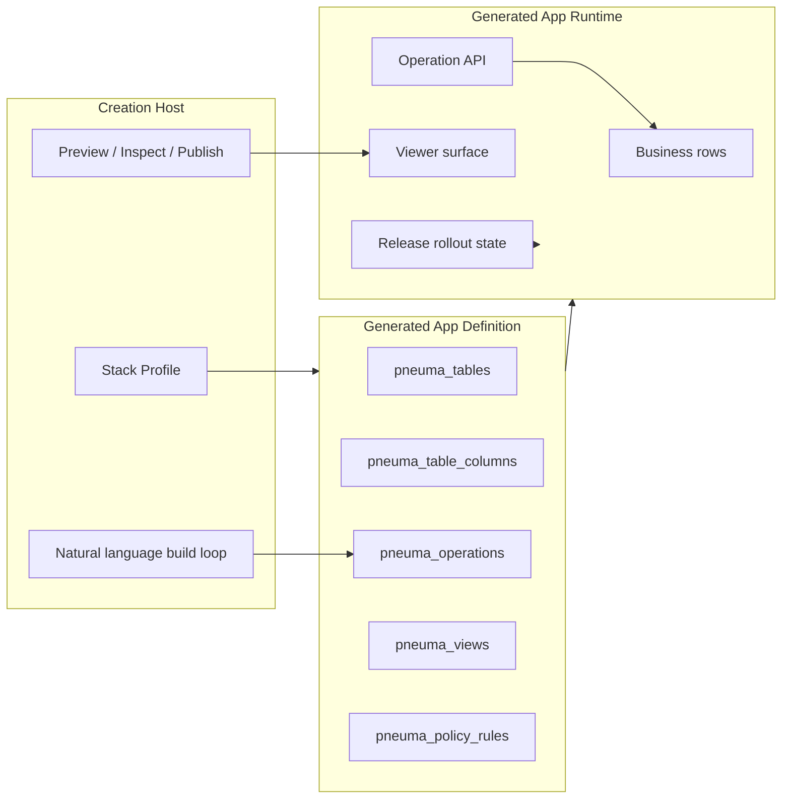

# Creation Host 模型

**状态：** M17 中正式接受的顶层领域模型；已根据 post-RC M29 更新
**最后更新：** 2026-05-08
**受众：** 在阅读 aggregate-level 细节前，需要先理解 Pneuma 最终目标形态的开发者和团队成员
**English version:** [Creation Host Model](./creation-host-model.md)

## 0. 目的

M1-M25 已经证明了完整的 Creation Host 模型：governed app definition、enterprise approval evidence、真实 persistence、reference apps、真实 backend-agent evolution、release candidate、semantic retrieval、rollout state、integrated Creation Host workflow、open-ended app pressure、authoring/sharing governance contracts，以及 Alice/Bob/Charlie/Dave Developer story。

M26-M29 随后稳定了 post-RC developer contract：Code Change Lane、Runtime Diagnostic Surface、HostExtension slots，以及建立在 BuildThread 上的 AgentBackend `runTurn`。

这些 milestone 也暴露了一个术语风险：**“pneuma app” 很容易被误解成 developer 直接写出来的某个单一 app。** 如果目标只是这个，那么很多 Pneuma primitives 就显得过度设计了。

更准确的顶层目标是：

> pneuma-framework 支持 **Creation Host**：一种产品表面，让 Builder 可以通过 framework primitives 和 agent 创建、检查、演进、预览、发布、监控 generated applications。

某个 reference demo 可以把 Creation Host 实现成 Bun TypeScript web app、version directories、本地进程管理。这些是实现选择，不是领域模型。

M17 正式接受这组顶层边界：

- **接受 ADR-0029。** Operation + definition-as-data 是 framework 的核心 primitive。Lifecycle scripts 仍然保留为 runtime subsystem，但不再是最主要的心智模型。
- **接受四制品模型。** Framework、Creation Host、Generated Application、Published Application 是四个不同的设计对象。
- **Creation Host contract 可以进入 framework core。** Framework 可以定义 profile、project、version、preview session、rollout state 等最小共享 contract。具体 workbench UX、session registry、marketplace、product policy 仍然属于 host/meta-app。
- **open-ended app pressure 已接受，但边界明确。** M18/M20 已证明 Host-governed open-ended artifacts，但没有把任意 UI/module artifact 提升为 framework definition rows。
- **具体领域 integration 不是 core semantics。** Linear、OpenRouter、Qdrant、Docker、SQLite、Bun 等实现可以作为 reference integration 或 profile candidate 存在，但 framework primitive story 不能依赖它们。

## 1. 零基础视觉导读

这一节是最快建立第一层心智模型的入口。后面的章节会把同一组概念定义得更精确。

### 1.1 一张图看完整故事



从左到右读：

```text
Developer 构建 Creation Host。
Builder 用 Creation Host 创建 Generated Application。
End User 使用某个 Published Application 版本。
```

关键修正是：**framework 不是 app，Creation Host 也不是 generated app。**

### 1.2 Builder 实际看到什么



Builder 不应该被困在盲聊里。Creation Host 是 conversation、preview、inspection、release 和 evidence 汇合的地方。

### 1.3 Builder 提出一个新功能时，系统发生什么



这就是为什么 Operation、Policy、approval evidence、rollback、release state、transcript evidence 不是一组孤立 feature。它们共同构成了通过 agent 安全创建和演进应用的控制平面。

## 2. 核心术语



| 术语 | 含义 |
|---|---|
| **pneuma-framework** | 提供 primitives、semantic tools、wire protocol、agent backend abstraction、process supervision、governance machinery 的 library/runtime。 |
| **Creation Host** | 用 framework 构建出来的产品表面。它让 Builder 创建和演进 Generated Applications。它可以是个人 app builder、SaaS 自助构建界面、企业内部 builder，或者 Pneuma 3.0 本身。 |
| **Generated Application** | Builder 通过 Creation Host 创建出来的 app。它拥有 app definition、data、runtime surface、versions。 |
| **Application Version** | Generated Application 的一个可恢复、可预览、可发布版本。reference host 可以用 `v0/v1/v2` 目录存版本，但 version-directory layout 不是领域模型。 |
| **Published Application** | 当前暴露给 End User 的某个 Application Version。 |
| **Stack Profile** | Creation Host 声明的能力/实现选择集合：persistence、semantic index backend、runtime、viewer SDK、rollout adapter、agent backend。Profile 通常在开发期或创建期选定，不默认支持 runtime 自由迁移。 |
| **Creation Session** | Builder-facing session：自然语言、approval prompts、preview state、schema/data inspection、agent activity 在这里汇合。 |
| **BuildThread** | Builder request、agent proposal、Builder decision、host/framework execution receipt、最终 app changes 的 framework-owned semantic transcript。backend-native sessions 是 cache/optimization，不是 source of truth。 |

## 3. 角色映射

Solo 场景里同一个人可以同时扮演多个角色，但模型上仍然分开：

| 角色 | 使用什么 | 创建 / 改变什么 | 主要关注点 |
|---|---|---|---|
| **Developer** | pneuma-framework | Creation Host | 定义 builder 产品、允许的 profiles、领域约束、runtime choices、host UX。 |
| **Builder** | Creation Host | Generated Application versions | 通过自然语言、preview、inspection、approval、publish actions 塑造 app。 |
| **End User** | Published Application | 通过正常 app operations 改变 app data | 使用 generated app。可能完全看不到 Build-phase Agent。 |

关键修正：

```text
Developer 不是仅仅“写一个 pneuma app”。
Developer 构建或配置 Creation Host。
Builder 用这个 Host 创建 Generated Applications。
End User 使用 Published Application。
```

## 4. Bounded Context Map



### Generated Application Bounded Context

[domain-model.md](./domain-model.md) 里的 aggregate-level 模型主要描述这个 context：

```text
Table / Row / Operation / Transform / Adapter / PolicySet / EventStream / IdentityRegistry
```

这些 primitives 属于 Generated Application 的 definition 和 runtime behavior。

### Creation Host Context

Creation Host 通常管理：

- generated app identity；
- stack profile selection；
- creation sessions 和 BuildThreads；
- preview process/session state；
- schema/data/log/config inspection；
- application versions；
- publish、monitor、restart、rollback controls。

这些概念不会自动变成 `core-domain` aggregate roots。只有当多个 Creation Hosts 都需要同一套语义时，它们才应该上升为 framework core contract。

### Published Runtime Context

Published runtime 是 End User-facing process/surface，运行的是某个选定的 Application Version。M11 已经证明第一版 rollout state primitive（`active`、`candidate`、`previous`），但没有证明 production traffic switching。

## 5. 创建流程



Builder 不应该被迫盲聊。一个有用的 Creation Host 至少应该给 Builder 四个表面：

| Surface | 作用 |
|---|---|
| **Conversation** | Builder intent、agent proposal、approval prompts、execution feedback。 |
| **Preview** | 以 End User 视角查看正在运行的 app behavior。 |
| **Inspection** | Schema、data、operations、views、policy、logs、framework events。 |
| **Release Controls** | Publish、health、restart、rollback、release history。 |

## 6. 现有 primitives 放在哪里



现有 primitives 的价值，正是因为 Creation Host 必须安全地生成和演进应用：

| Primitive / Subsystem | 和 Creation Host 的关系 |
|---|---|
| **Operation** | UI、Agent、public API 共享的 action contract。 |
| **Definition-as-data** | 让 Builder/Agent 通过 governed changes 演进 app structure，而不是直接改文件。 |
| **PolicySet / PermissionContext** | 让 generated app 能表达 role/user-aware behavior，即使 demo 里只是手动输入 `role` 和 `user_id`。 |
| **View** | 让 host 和 generated app 不必每次都写 custom UI，也能展示 app state。 |
| **Semantic tools** | 让 agent 操作 framework state，而不是直接跑 scripts 或 Docker。 |
| **ReleaseRolloutState** | 让 Creation Host 可以理解 active/candidate/previous published versions。 |
| **SemanticIndexStore** | 一个由 profile 选择的 generated-app derived capability，不是 universal runtime migration target。 |
| **BuildThread** | 让 Builder conversation、proposal、decision 和 receipt 可以被 inspect，并能跨 backend adapter 保持可移植。 |
| **Code Change Lane** | 让 Host 把 draft source changes 变成 proposal evidence、approval、guarded apply、rollback 和 BuildThread receipt。 |
| **Runtime Diagnostic Surface** | 让 runtime mode、boot options、route fallback、readiness 和 health evidence 对 Host 可预测。 |
| **HostExtension Slot Contract** | 为 Host-owned open-ended contribution bundles 提供 portable distribution boundary，但不把它们变成 framework definition rows。 |
| **AgentBackend.runTurn** | 给 backend adapters 一个 BuildThread-backed turn contract，同时把 backend-native sessions 保持为 cache。 |

## 7. Stack Profile 是选择边界

Stack Profiles 用来防止无限泛化。

它们可以表达候选选择：

```text
persistence: sqlite | postgres
semantic_index: none | sqlite-local | qdrant
runtime: bun-ts | python
viewer: react | vanilla
rollout: local-process | local-docker | cloud
agent_backend: opencode | codex | claude
```

但早期 Creation Host 不需要实现所有候选。它需要把选择边界显式化。

默认倾向：

```text
Profile choice 在开发期或 generated-app 创建期固定。
除非未来某个 Host 明确拥有 migration 能力，否则不支持 runtime profile migration。
```

这意味着 Qdrant、Postgres、Python、cloud deployment 都是未来 profile candidates。它们不是 framework 到 RC 前的必需实现。

## 8. Reference Implementation vs Domain Model

当前 reference Creation Hosts 可以使用：

```text
Bun TypeScript
local process management
role/user_id demo inputs
version directories v0/v1/v2
no Docker dependency
no real authentication
```

这些是 demo 和 RC pressure test 的有用约束。它们不是顶层领域要求。

领域模型只要求：

- host 能创建 generated app；
- host 能追踪 app versions；
- host 能运行 preview sessions；
- host 能提供 inspection surfaces；
- host 能 publish 一个 version；
- host 能 monitor、restart、rollback published version；
- generated app 仍然使用 framework primitives 表达 data、operations、policy、governance。

## 9. 对 Post-RC 规划的影响

RC 路径已经瞄准 **reference Creation Host**，而不只是再做一个 app template。后续 milestone 应该明确选择 productization lane 或 pressure lane。

健康的 RC 压力应该是：

```text
Developer configures a Creation Host
  -> Builder creates a Generated Application
  -> Builder previews and inspects it
  -> Builder evolves it through an agent
  -> Builder publishes it
  -> End User uses the Published Application
  -> Builder can monitor, restart, and rollback
```

这条路径继续测试的是：Pneuma 的抽象是否足够完整，可以支撑真实 app creation。它避免两种失败模式：

- 变成一个根本不需要 Pneuma 领域模型的 generic app framework；
- 在 Creation Host 真正可用之前，过早无限泛化 adapter、database、deployment target、vector store。

Post-RC 工作应该持续追问：

```text
这件事是否帮助 Developer 构建更好的 Creation Host？
它是否保持 Framework -> Host -> Generated App -> Published App 边界？
它是否有足够跨 Host 证据，值得进入 framework core？
```
