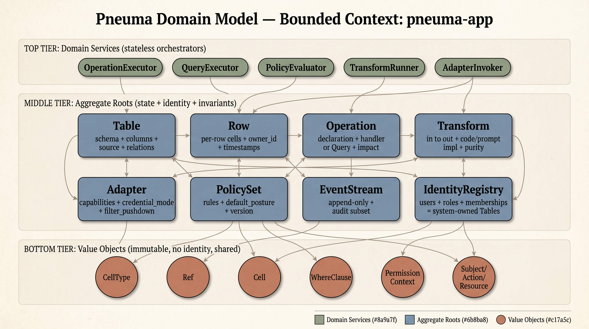
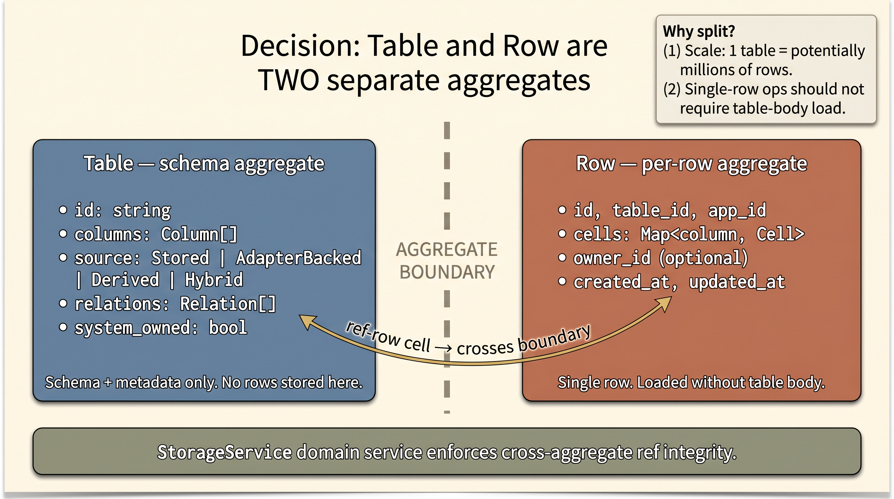
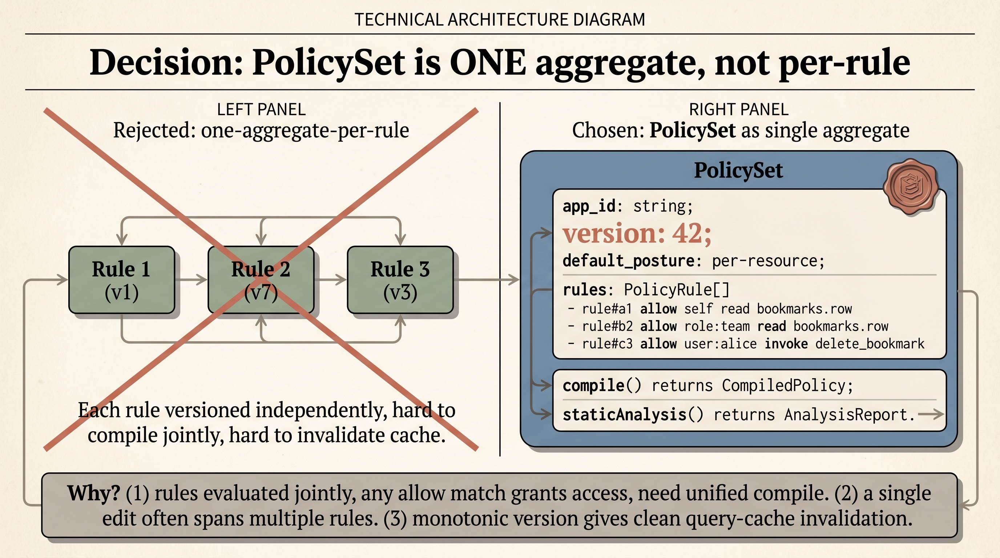
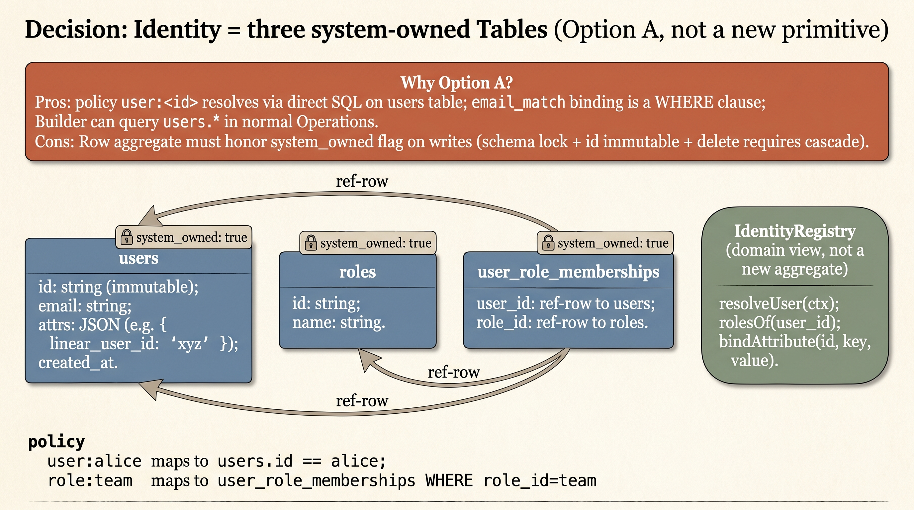
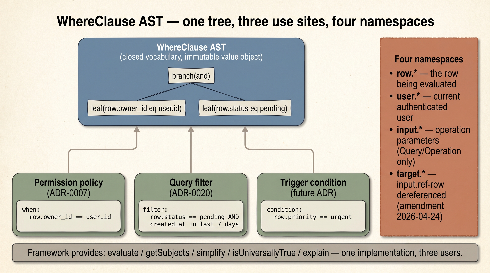
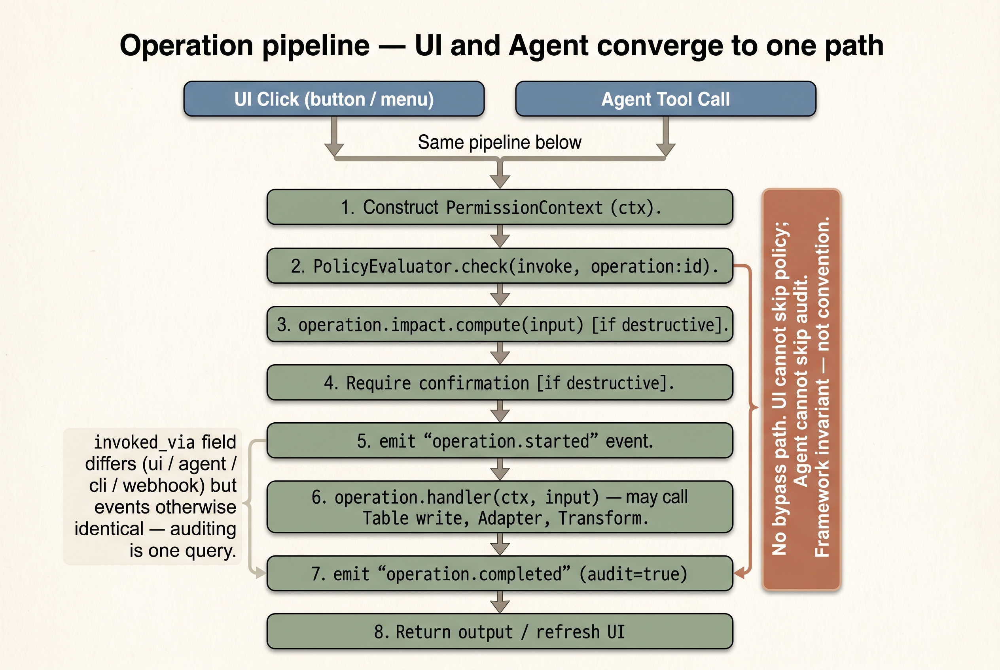

# Pneuma Domain Model — 聚合根 / 值对象 / 领域服务

> **状态**：Draft v0，基于 21 条 ADR + 3 条 amendments 推导，用于驱动 MVP prototype 实现。
> **目标读者**：准备进 step 5 DDD 实现的人（可能是作者本人，也可能是后续参与者）。
> **配套**：[architecture/README.md](../README.md)（入门）→ [ADR index](../README.md#所有-adr-索引)（为什么）→ 本文（是什么 / 怎么切）
> **最后更新**：2026-04-24

---

## 0. TL;DR

Pneuma 的领域模型围绕 **8 个 aggregate roots + 6 类 value objects + 5 个 domain services** 组织。一个 pneuma-app 是一个 **bounded context**；`app_id` 贯穿一切，但 App 本身不是 aggregate。



```
Aggregate Roots (有状态、有身份、聚合不变量单位)
  1. Table              ─── schema (columns / source / relations)
  2. Row                ─── per-row aggregate，装 cells + ref 完整性自查
  3. Operation          ─── declaration + handler ref + bindings + impact
  4. Transform          ─── in→out + impl (code/prompt) + purity
  5. Adapter            ─── definition + capabilities + credential mode
  6. PolicySet          ─── 一个 app 的全部 policy rules（整体编译）
  7. EventStream        ─── append-only，audit 子集独立 sink
  8. IdentityRegistry   ─── users / roles / memberships（Option A = System Tables 的 domain view）

Value Objects (无身份、不可变、跨 aggregate 共享)
  CellType · Ref · Cell · WhereClause · PermissionContext · Subject/Action/Resource

Domain Services (无状态、协调多 aggregate)
  OperationExecutor · QueryExecutor · PolicyEvaluator · TransformRunner · AdapterInvoker
```

MVP 暂不建模：`DeploymentVersion`、`DevSandbox`、`SnapshotBundle`——prototype 跑不到生命周期切换，等 step 6 场景验证激活再加。

---

## 1. Bounded Context: 一个 pneuma-app

一个 pneuma-app 的 **所有 aggregate 实例** 共享一个 `app_id`（MVP 单 app 部署可为 `"default"`，per [ADR-0001](../adr/0001-archetype-scope.md)）。跨 app 协作**不在 MVP 范围**。

Context 内隐含约定：
- `users` / `roles` / `user_role_memberships` 作为 **system-owned Tables**（决策 3 = Option A），schema 锁定，受特殊不变量保护（id 不可改、delete 需级联清理 grants）
- `PermissionContext` 是 request-scoped 值，在所有 domain service 调用里显式传递（不用 AsyncLocalStorage，per [ADR-0013](../adr/0013-telemetry-event-model.md) 的"显式优于隐式"）

---

## 2. Aggregate Roots

每条列：**Purpose / Contains / 不变量 / 不拥有 / 关键方法签名**。

### 2.1 Table

> **决策 1 — Table 和 Row 拆成两个独立 aggregate**：规模 + 单行操作不需要加载全表。跨 aggregate 的 ref 完整性由 `StorageService` 协调。
>
> 

```typescript
class Table {
  readonly id: string;                  // e.g. "bookmarks"
  readonly app_id: string;
  columns: Column[];                    // ordered
  source: TableSource;                  // Stored | AdapterBacked | Derived | Hybrid
  relations: Relation[];                // ADR-0020 follow-up 的 0002 amend 内容先落在这
  system_owned: boolean;                // true → schema 锁定；delete/rename 需特殊路径
}
```

**不变量**（所有写入方法进入前必须保持）：
- `columns[].name` 在表内唯一；保留名 `id / _version / _created_at / _updated_at` 不可用作用户列
- `source.kind === "adapter-backed"` 时 `columns` 必须是 adapter 声明的 externalType 的 subset
- `relations[].to` 必须引用同 app_id 下存在的 Table
- `system_owned === true` 时 column schema 不可变更（只能 framework 代码推动迁移）
- 每列的 `CellType` 必须属于封闭集（[ADR-0002](../adr/0002-storage-typed-cells.md)）

**不拥有**：Rows。Rows 是独立 aggregate。Table 持有 **schema 和迁移元信息**，不装数据。

**关键方法**：
```typescript
Table.addColumn(col: Column): void
Table.dropColumn(name: string): void         // 只对 Stored 有效
Table.changeColumnType(name: string, to: CellType, transformer?: TransformRef): void
Table.addRelation(r: Relation): void
Table.validateRow(row: Row): Result<void, SchemaViolation>    // schema check，但不触 ref 完整性
```

### 2.2 Row

```typescript
class Row {
  readonly id: string;                  // 全局唯一（app 内）
  readonly table_id: string;
  readonly app_id: string;
  cells: Map<string, Cell>;             // column name → Cell 值对象
  readonly created_at: number;
  updated_at: number;
  readonly owner_id?: string;           // policy 常用；system-owned table 下含义特殊
}
```

**不变量**：
- `cells` 的每个 key 都在 `Table.columns` 里；类型匹配
- `Cell.kind === "ref-row"` 时指向的目标 row 必须存在（eager check on write）
- `system_owned` 表（如 `users`）的 `id` 字段不可变更
- `updated_at >= created_at`

**不拥有**：引用的目标 Row（那是另一个 Row aggregate）。

**关键方法**：
```typescript
Row.setCell(col: string, value: Cell): Result<void, InvariantViolation>
Row.getCell(col: string): Cell | undefined
Row.diff(other: Row): Record<string, { before: Cell; after: Cell }>
```

**ref 完整性**不在 Row aggregate 内闭环——跨 aggregate 的完整性由 `StorageService` domain service 在 commit 时校验。

### 2.3 Operation

```typescript
class Operation {
  readonly id: string;
  readonly app_id: string;
  name: string;
  description: string;
  input: InputSchema;
  output: CellType | "void" | "row-list";
  affects: AffectDeclaration;
  handler: HandlerRef | QueryBody;      // mutually exclusive
  ui_binding?: UIBinding;
  agent_tool?: AgentToolConfig;
  impact?: ImpactDescriptor;
}
```

**不变量**（per [ADR-0018](../adr/0018-operations-as-primitive.md) + [ADR-0020](../adr/0020-query-dsl.md)）：
- `affects.reads_only === true` ⟹ `handler` 是 `QueryBody`（不是 HandlerRef）
- `affects.destructive === true` ⟹ `impact` 必填
- `affects.mutations[]` 引用的 Table 都在同 app 存在
- `input.fields[].type` 是合法 CellType
- `affects.adapter_writes[]` 引用的 Adapter 声明的 capabilities 允许该写操作

**不拥有**：实际 handler 代码（是 ref，不是代码本体）。Impl 解析在 `OperationExecutor` domain service。

**关键方法**：
```typescript
Operation.bindDefaults(): void           // 从 affects 推 ui_binding / agent_tool 默认
Operation.validateInput(input: unknown): Result<ValidatedInput, InputViolation>
Operation.isQuery(): boolean             // handler is QueryBody
```

### 2.4 Transform

```typescript
class Transform {
  readonly id: string;
  readonly app_id: string;
  in: TransformInputShape;
  out: CellType;
  impl: CodeImpl | PromptImpl;
  purity: "pure" | "pure-with-ttl" | "impure";   // ADR-0003 amend pending
  ttl_seconds?: number;                            // purity === "pure-with-ttl" 时必填
}
```

**不变量**：
- `impl.kind === "prompt"` ⟹ `impl.outputSchema` 必填且匹配 `out`
- `impl.kind === "code"` ⟹ handler 可解析到确定函数
- `purity === "pure"` ⟹ 结果按 input hash 可缓存（无副作用承诺）
- **sandbox 边界**（[ADR-0003 amend pending](../adr/0003-transform-primitive.md)）：impl 不得调 Adapter / Fetch / Table write——违反即拒绝注册

**不拥有**：缓存结果（那在 `TransformRunner` 或 sink）、prompt 执行用的 LLM provider（由 runner 注入）。

**关键方法**：
```typescript
Transform.validateInput(v: unknown): Result<void, Mismatch>
Transform.validateOutput(v: unknown): Result<void, Mismatch>   // PromptImpl 产出 schema 校验
```

### 2.5 Adapter

```typescript
class Adapter {
  readonly id: string;
  readonly app_id: string;
  schemaVersion: 1;
  externalTypes: ExternalTypeDef[];
  auth: AuthStrategy;
  capabilities: Capabilities;          // list/read/insert/update/delete + updatableColumns + filter_pushdown
  credential_mode: "shared" | "per-user" | "admin_delegated";
  identity_binding?: IdentityBinding;  // credential_mode === "admin_delegated" 时必填
  attribution?: AttributionConfig;
}
```

**不变量**（per [ADR-0004](../adr/0004-adapter-protocol.md) / [0005](../adr/0005-adapter-capabilities.md) / [0011](../adr/0011-adapter-credential-modes.md) / [0021](../adr/0021-admin-delegated-credential.md)）：
- `credential_mode === "admin_delegated"` ⟹ `identity_binding` + `capabilities.filter_pushdown.required_for_admin_delegated` 都必填，且 `required_for_admin_delegated[].column` 在 externalTypes 的 schema 里
- `capabilities.update === true` ⟹ `updatableColumns` 非空
- `capabilities.filter_pushdown?.supported_ops` 的 column 名都在 externalTypes 中

**不拥有**：credentials（存在 SecretStore domain service 管理的外部位置）、HTTP client（由 invoker 注入）。

**关键方法**：
```typescript
Adapter.canWrite(column: string): boolean
Adapter.canPushdownFilter(column: string, op: ComparisonOp): boolean
Adapter.requiresAdminDelegatedFilter(): { column: string; ops: ComparisonOp[] }[] | null
```

### 2.6 PolicySet

> **决策 2 — PolicySet 整体是一个 aggregate（不是每 rule 独立）**：rules 联合求值需统一编译，单次编辑常跨多 rule，monotonic version 让 query cache 失效干净。
>
> 

```typescript
class PolicySet {
  readonly app_id: string;
  rules: PolicyRule[];
  default_posture: DefaultPosture;     // per-resource public/restricted，per ADR-0009
  version: number;                      // 单调递增，每次编辑 +1
}

interface PolicyRule {
  id: string;                           // 稳定 id（从规则内容 hash 派生）
  allow: Subject[];                     // closed vocabulary
  do: Action[];
  on: Resource;
  when?: WhereClause;                   // optional; if absent, unconditionally allow
}
```

**为什么一个 PolicySet 是一个 aggregate，而不是每条 rule 单独？**
- 多条 rule 联合求值（"任一 allow 命中即允许"，per [ADR-0007](../adr/0007-permission-dsl.md) 待 amend）→ 需要整体编译
- 一次 policy 修改通常影响多条 rule（加 role 要同时改 membership + rule）→ 整体一致性
- `version` 单调让 cache key 失效简单

**不变量**：
- `rules[].allow[]` 来自封闭 subject 词汇表（[ADR-0007](../adr/0007-permission-dsl.md)）
- `rules[].do[]` 来自封闭 action 词汇表
- `rules[].on` 是合法 resource path；引用的 table/column/operation/adapter 都在同 app 存在
- `rules[].when` 静态可分析（`getSubjects` 能解析所有 subject path；`simplifyClause` 能 normalize）
- 任何 rule 的 resource 被删除后 → PolicySet 被标记 "stale"，下一次 deploy 前必须修

**不拥有**：evaluator（由 `PolicyEvaluator` domain service 拿编译后的决策树做运行时判定）。

**关键方法**：
```typescript
PolicySet.addRule(r: PolicyRule): Result<void, ViolatesVocabulary>
PolicySet.removeRule(id: string): void
PolicySet.compile(): CompiledPolicy             // 产出 decision tree，给 evaluator
PolicySet.staticAnalysis(): AnalysisReport      // 用于 deploy-time gate + impact preview
```

### 2.7 EventStream

```typescript
class EventStream {
  readonly app_id: string;
  append(event: PneumaEvent): void;             // audit 子集独立 sink
  // 不提供 update / delete / truncate
}
```

**为什么是 aggregate 而不是 value object**：
- 有单调 sequence number（[ADR-0014](../adr/0014-audit-subset.md)）
- append-only 契约**由 aggregate 本体保证**，不交给 caller
- audit subset 需独立 sink 通路（debug sink 丢了没事，audit sink 不丢）

**不变量**：
- sequence number 严格单调；append 不可回溯
- `event.audit === true` 的事件必须写入 audit sink，失败则**阻断 mutation**（[ADR-0014 amend pending](../adr/0014-audit-subset.md)）
- `event.ctx.app_id === this.app_id`

**不拥有**：sink 实现（在 infrastructure 层注入）、查询 API（有单独 `EventQueryService`，但 MVP 可合并）。

### 2.8 IdentityRegistry (= System Tables 的 domain view)

> **决策 3 — Identity 不是独立 primitive，就是 3 张 system-owned Tables**：好处是 policy `user:<id>` 直接可 query `users` 表，email_match binding 就是 SQL WHERE 子句。代价是 Row aggregate 必须认 `system_owned` flag 走 protected code path。
>
> 

```typescript
// 不是独立实体类型，是三个 system-owned Tables 的组合：
//   users                   → columns: id, email, attrs (JSON), created_at
//   roles                   → columns: id, name
//   user_role_memberships   → columns: user_id (ref-row→users), role_id (ref-row→roles)
//
// IdentityRegistry 是一组跨这三张表的 invariant + 查询 helper，不是新 aggregate

namespace IdentityRegistry {
  function resolveUser(ctx: PermissionContext): User | null
  function rolesOf(user_id: string): Role[]
  function bindAttribute(user_id: string, key: string, value: unknown): void   // admin_delegated 用
  // 不提供 deleteUser（走 Operation，要级联清理 grants + emit audit）
}
```

**额外不变量**（由 framework 强制，即便 System Tables 的 schema 本身允许）：
- `users.id` 不可变（schema 锁）
- 删除 user 必须级联删除 memberships + emit audit event
- `user_role_memberships.user_id` / `.role_id` 的 ref-row 完整性强制校验

**为什么这么做（对应决策 3 Option A）**：避免引入独立 primitive。好处是 Builder 可直接 query `users` 表、policy 可 `user:<id>` 直接映射、email_match binding 可写 `select ... from users where email = ?`。代价是 framework 必须在 Row aggregate 和 Operation executor 里识别 `system_owned` flag，走 protected code path。

---

## 3. Value Objects

Immutable、无身份、可跨 aggregate 共享。

### 3.1 CellType — 封闭类型集

```typescript
type CellType =
  | { kind: "primitive"; of: "Text" | "RichText" | "Number" | "Bool" | "Date" | "Duration" | "URL" }
  | { kind: "vector"; dim: number }
  | { kind: "blob"; mime: string }
  | { kind: "json"; schema?: unknown }            // [ADR-0002 amend (b) 2026-04-24]
  | { kind: "ref-row"; table: string }
  | { kind: "ref-row-list"; table: string }       // [ADR-0002 amend (a) 2026-04-24]
  | { kind: "ref-external"; adapter: string; externalType: string }
  | { kind: "derived"; transform: string; output: CellType }
```

### 3.2 Cell — CellType 的具体实例

```typescript
type Cell = {
  type: CellType;
  value: unknown;       // 按 type 取形：string / number / Ref / vector number[] / ...
}
```

### 3.3 Ref

```typescript
type Ref =
  | { kind: "row"; table: string; id: string }
  | { kind: "external"; adapter: string; externalType: string; external_id: string }
```

### 3.4 WhereClause — 跨 policy/query/trigger 共享 AST

> **决策 4 的核心样本 — WhereClause 作为跨 aggregate 共享的 value object**：一棵封闭 AST 被 Permission / Query / Trigger 三处复用，一套静态分析能力全部受益。
>
> 

详见 [ADR-0019](../adr/0019-where-clause-ast.md)。完全 immutable，无身份，可 memo。核心能力：

```typescript
namespace WhereClause {
  function evaluate(clause: WhereClause, ctx: EvalContext): boolean
  function getSubjects(clause: WhereClause): SubjectPath[]
  function simplify(clause: WhereClause): WhereClause
  function requiresUserContext(clause: WhereClause): boolean
  function explain(clause: WhereClause, lang: "zh" | "en"): string
}
```

### 3.5 PermissionContext — runtime-only

```typescript
interface PermissionContext {
  app_id: string;
  tenant_id: string;                    // MVP 固定 "default"，但字段存在（ADR-0001 约束 1）
  user?: { id: string; attrs: Record<string, unknown>; roles: string[] };
  anonymous: boolean;
  trace_id: string;
  span_id?: string;
  parent_span_id?: string;
  invoked_via: "ui" | "agent" | "cli" | "webhook" | "system";
}
```

**不是 aggregate** 的原因：无持久化、无 id、每次请求重新构造、没有"修改"只有"派生"（子 span 派生自父 span）。

### 3.6 Subject / Action / Resource

所有都来自封闭词汇表。见 [ADR-0007](../adr/0007-permission-dsl.md)。

---

## 4. Domain Services

Stateless、协调多 aggregate、不持有业务身份。Step 5 的 MVP 就把 service 写出接口 + mock 实现跑测。

### 4.1 OperationExecutor

**职责**：走 [ADR-0018 pipeline](../adr/0018-operations-as-primitive.md#统一调用路径)——perm check → impact → handler → event emit。

```typescript
interface OperationExecutor {
  invoke(
    op: Operation,
    input: ValidatedInput,
    ctx: PermissionContext
  ): Promise<Result<OperationOutput, OperationError>>;
}
```

**依赖**：PolicyEvaluator、StorageService（Row write）、AdapterInvoker、EventStream。

### 4.2 QueryExecutor

**职责**：执行 `reads_only: true` 的 Operation（body 是 `QueryBody`）——filter 求值、relation resolve、pagination。

```typescript
interface QueryExecutor {
  run(
    op: Operation,
    input: ValidatedInput,
    ctx: PermissionContext
  ): Promise<QueryResult>;
}
```

**依赖**：PolicyEvaluator（对每行再做 row-level filter）、StorageService、AdapterInvoker、Cache（per [ADR-0020 amend](../adr/0020-query-dsl.md)）。

### 4.3 PolicyEvaluator

**职责**：把 PolicySet 编译结果 + ctx + 候选 resource 塞进去，给出 allow/deny + reason + matched rule ids。

```typescript
interface PolicyEvaluator {
  check(
    action: Action,
    resource: Resource,
    ctx: PermissionContext,
    row?: Row,                          // row-level 时传入
    target?: Record<string, Row>        // operation policy 的 target namespace（ADR-0019 amend）
  ): PolicyDecision;

  whoCan(action: Action, resource: Resource): Subject[];   // ADR-0008
  explain(decision: PolicyDecision, audience: "builder" | "denied_user"): string;
}
```

### 4.4 TransformRunner

**职责**：执行 Transform、按 purity 决定 cache、PromptImpl 对接 LLM、校验 outputSchema。

```typescript
interface TransformRunner {
  apply(tx: Transform, input: unknown, ctx: PermissionContext): Promise<unknown>;
}
```

**sandbox**：TransformRunner 拒绝给 Transform impl 传入能调 Adapter / Fetch 的 handle（[ADR-0003 amend pending](../adr/0003-transform-primitive.md)）。

### 4.5 AdapterInvoker

**职责**：根据 `credential_mode` 解析 credentials（`admin_delegated` 注入 admin token、`per-user` 取 user token、`shared` 用 app token）、下推 filter（[ADR-0005 amend](../adr/0005-adapter-capabilities.md)）、fail-closed 校验、attribution injection、event emit。

```typescript
interface AdapterInvoker {
  list(adapter: Adapter, query: PushableQuery, ctx: PermissionContext): Promise<Row[]>;
  get(adapter: Adapter, externalId: string, ctx: PermissionContext): Promise<Row>;
  insert(adapter: Adapter, row: Row, ctx: PermissionContext): Promise<string>;
  update(adapter: Adapter, externalId: string, patch: Patch, ctx: PermissionContext): Promise<void>;
  delete(adapter: Adapter, externalId: string, ctx: PermissionContext): Promise<void>;
}
```

---

## 5. 典型调用链示例

> **Pneuma 最独特的承诺：UI 和 Agent 走同一条 Operation pipeline**——policy / impact / audit 无 bypass path。
>
> 

### 5.1 UI 按钮点击 `delete_bookmark`

```
Caller (HTTP handler)
  │ ctx = buildPermissionContext(request)           // value object 构造
  ▼
OperationExecutor.invoke(op, input, ctx)
  │
  ├─ PolicyEvaluator.check(invoke, operation:delete_bookmark, ctx)
  │    │ reads PolicySet (aggregate)
  │    ▼ → decision
  │
  ├─ Operation.impact.compute(input)                // 读但不写
  │    │ uses StorageService to peek affected rows
  │    ▼ → ImpactReport
  │
  ├─ if destructive → require confirmation
  │
  ├─ op.handler(ctx, input) 执行                    // user code via HandlerRef
  │    │
  │    ├─ StorageService.deleteRow(table, id, ctx)
  │    │    │ loads Row aggregate
  │    │    │ cascade: ref-row / ref-row-list 列 cascade_on_target_delete=true 的关联 row 也删（Column 级标志，StorageService 扫列驱动；Relation.cascade_delete vestigial）
  │    │    ▼ commits to RowRepository
  │    │
  │    └─ (no adapter write in this op)
  │
  ├─ EventStream.append({ category: "operation", audit: true, ... })
  │
  └─ returns OperationOutput
```

### 5.2 Agent 调 tool `list_my_linear_issues`（admin_delegated query）

```
Agent backend → tool call → HTTP handler → ctx
  ▼
QueryExecutor.run(op, input, ctx)
  │
  ├─ PolicyEvaluator.check(invoke, operation:list_my_linear_issues, ctx)  // allow
  │
  ├─ validate filter static analysis (ADR-0021 contract)
  │    │ getSubjects(query.filter) must include user.attrs.linear_user_id
  │    │ pushdown availability check
  │    ▼
  │
  ├─ IdentityRegistry.resolveUser(ctx)
  │    │ fetch user.attrs.linear_user_id
  │    ▼
  │
  ├─ AdapterInvoker.list(linear_adapter, pushableQuery, ctx)
  │    │ credential_mode === "admin_delegated" → inject admin token
  │    │ filter with user.attrs.linear_user_id → pushed down to Linear API
  │    │ fail_closed: Linear returns "unsupported op" → refuse
  │    ▼ returns Row[]
  │
  ├─ cache key = hash(query_id, spec_version, input_values, user.attrs.linear_user_id, tenant_id)
  │
  ├─ EventStream.append({ category: "operation", reads_only: true, audit: true })
  │
  └─ returns QueryResult (rows + next_cursor)
```

---

## 6. MVP Prototype 实现 scope（给 step 5）

### 6.1 Layer 1 — 必须实现（核心闭环）

> **状态：✅ 完成（2026-04-24）**。8 个 aggregate root + 6 个 VO + 5 个 domain service 全部实现；354 条 core-domain 测试通过。3 个生产模板验证端到端栈：`templates/ai-bookmarks-core-domain`、`templates/weekly-linear-digest`、`templates/bookmarks-core-domain`。

| 项 | 实现形式 |
|---|---|
| **Aggregate Table** | 全部字段 + 不变量校验 |
| **Aggregate Row** | 全部字段 + cell 类型校验 + ref-row 完整性（跨 aggregate 由 StorageService 接力）|
| **Aggregate Operation** | 全字段；handler 只认 `code` 不认 `prompt` |
| **Aggregate PolicySet** | rules + compile + staticAnalysis + evaluator |
| **Aggregate EventStream** | append + audit subset sink（两路：memory + ndjson 文件）|
| **Aggregate IdentityRegistry** | 按 Option A 的三张 system table 实现 |
| **VO CellType** | 全部 kind，除 `derived`（step 6 再说）|
| **VO Cell / Ref** | 全部 |
| **VO WhereClause** | 全 AST + evaluate + getSubjects + simplify + explain (zh) |
| **VO PermissionContext** | 全字段；从 request 构造 helper |
| **Service OperationExecutor** | 全 pipeline |
| **Service QueryExecutor** | filter + sort + fields + 单层 `with`（2 层 MVP 限制推后）|
| **Service PolicyEvaluator** | 默认 public + rules + when + target namespace |
| **Service StorageService** | 协调 Table + Row + ref 完整性 |

### 6.2 Layer 2 — 写契约、mock 实现（step 5 测试走得通就行）

| 项 | mock 形式 |
|---|---|
| **Aggregate Transform** | `code` impl + 一个 echo transform 测试；`prompt` impl 写类型不写调用 |
| **Aggregate Adapter** | 一个 `in-memory` reference adapter（跟 `file` 类似但更简化）；其它 `supported_credential_modes` 字段、`filter_pushdown` 声明写完但不跑 admin_delegated pushdown |
| **Service AdapterInvoker** | 能调 in-memory adapter；`admin_delegated` 模式写静态校验但实际 list 时走 shared 路径 |
| **Service TransformRunner** | 能跑 code impl + cache；prompt impl 抛 "NotImplementedInMVP" |

### 6.3 Agent Integration Layer（协调层，非持久化原语）

> **状态：已实现（2026-04-23 ~ 2026-04-24）**。以下 4 个组件不属于 Layer 1 的持久化原语——它们不定义新的 CellType / Table / Operation / Policy shape——而是将 Layer 1 对接到外部运行时（agent、viewer、LLM vendor）的**协调层**。

- **`EmbeddingProvider`**（`packages/core-domain/src/services/embedding-provider.ts`）— 与 `LLMProvider` 对等的接口：`embed(text) → Promise<number[]>`。实现：`MockEmbeddingProvider`、`OpenRouterEmbeddingProvider`。注入 `TransformRunner`，供 `embed_text` 等 code-impl transform 调用。

- **`EventBroadcaster` + SSE `/api/events/stream`**（`packages/runtime/src/event-broadcaster.ts`）— 内存级 pub/sub hub。`OperationExecutor` 的 `execute()` 封装在完成后 emit `RuntimeEvent{ type:"operation-executed", operation_id, success, ts }`；HTTP handler 将此流作为 Server-Sent Events 推送给 viewer，驱动 viewer 自动刷新。参见 ADR-0027。

- **`session-index`**（`packages/core/src/session-index.ts`）— JSON 文件 `workspace/.pneuma/sessions.json`，保存 `{ backend_session_id, app_id, builder_id, created_at, last_resumed_at, initial_prompt }` 指针。opencode 持有对话内容（SQLite at `~/.local/share/opencode/opencode.db`）；pneuma 持有指针，负责会话生命周期管理。参见 ADR-0025。

- **`OperationToolBridge` + `template-mcp-bridge`**（`packages/core/src/operation-tool-bridge.ts` + `packages/core/bin/template-mcp-bridge.ts`）— 将模板的 Operation（`/api/operations/:id` REST）翻译为 MCP tool 协议（stdio）。bridge 作为独立子进程由 opencode 启动；它拉取 `/api/config` 发现 Operation 列表，每个 Operation 广播为 `op.<id>` MCP tool，工具调用按 `invocation_method` 代理回 HTTP GET/POST。参见 ADR-0026。

**此层与 Layer 1 的关系**：
- **消费** `Operation`、`Transform`、`EventStream` 的输出，但不写入 Layer 1 状态。
- **不绕过** `OperationExecutor.invoke()`——agent 的工具调用落在 `/api/operations/:id`（GET 或 POST 由 `invocation_method` 决定），走完整的 policy / impact / audit pipeline，与 UI 点击等价。
- **依赖** `/api/config` 作为 Layer 1 的声明性表面（ADR-0018 Operation metadata + ADR-0019 input_schema as JSON Schema）。

### 6.4 Layer 3 — 先不管（step 6 或更后）

- `DeploymentVersion` / `DevSandbox` aggregates（对应 [ADR-0016](../adr/0016-dev-prod-data-isolation.md) / [ADR-0017](../adr/0017-rollback-data-semantics.md) 的 lifecycle）
- `View` / `Dashboard` aggregates（未写 ADR-0022）
- `Trigger` aggregate + `EventBus`
- 实际 LLM 调用、Jina embedding、真 adapter 认证

---

## 7. Step 5 的抽象级测试目标

> "只有抽象时跑通完整测试" = 把上面 Layer 1 的 aggregate + service 接口写出来，用 mock repository / mock clock / in-memory sink 把**不变量**和**典型调用链**跑全。

最小测试集（每个 aggregate / service 至少 3 条）：

```
aggregate.table
  - test: 同名列重复 addColumn → InvariantViolation
  - test: system_owned 表不允许 dropColumn
  - test: AdapterBacked 表 columns 必须是 externalType subset

aggregate.row
  - test: setCell 类型不匹配 → InvariantViolation
  - test: ref-row 指向不存在 row → InvariantViolation
  - test: system_owned 表 id 字段修改 → reject

aggregate.operation
  - test: reads_only=true 但有 handler → InvariantViolation
  - test: destructive=true 但无 impact → InvariantViolation
  - test: adapter_writes 引用不存在 adapter → InvariantViolation

aggregate.policyset
  - test: 封闭词汇表外的 subject → reject
  - test: 引用被删 table 的 rule → staticAnalysis 报 stale
  - test: when 里 target.* 在非 operation policy → reject (ADR-0019 amend)

aggregate.eventstream
  - test: sequence 单调
  - test: audit=true 事件 sink 失败 → 阻断 caller mutation
  - test: append 不允许 update

vo.whereclause
  - test: getSubjects 对复合 and/or 正确展开
  - test: simplify(and(x, universally_true)) === x
  - test: evaluate 日期 sub_op.last_n_days 正确

service.operation_executor
  - test: policy deny → event emit "access deny" 且不执行 handler
  - test: destructive 未确认 → 不执行 handler
  - test: handler 抛错 → event emit "operation.failed" + 不污染数据

service.query_executor
  - test: filter + sort + cursor 正确翻页
  - test: with=[rel] 嵌套 filter 正确
  - test: admin_delegated 模式 query 无 user binding → deploy-time refuse

service.policy_evaluator
  - test: 默认 public → anonymous read 通过
  - test: explicit restricted + 无命中 rule → deny
  - test: target namespace 在 operation policy 正确解析

service.storage_service
  - test: 删除被 ref 的 row → 依 relation cascade 级联 or reject
  - test: 并发写 same row → 至少"后写覆盖" 或显式 optimistic lock
```

这些跑通即标志 step 5 完成。Step 6 开始用 ai-bookmarks / weekly-linear-digest 的**真实场景 YAML**做验证。

---

## 8. 有意识推迟的设计

以下在本模型里**故意不触碰**，等 step 6 场景验证激活再加：

| 项 | 触发条件 |
|---|---|
| DeploymentVersion / DevSandbox | step 6 跑"改 policy → deploy → rollback"流程时 |
| ViewAggregate / Dashboard | UI 层场景（例：weekly-linear-digest 需要 view 呈现）|
| Trigger / EventBus | 事件驱动场景（新 row → 自动 embed）|
| Transform composition / pipeline | 多级 transform 串联场景 |
| Hybrid Table | adapter-backed + 本地扩展字段同时需要时 |
| Prompt-based Operation handler | 确认"一句话做一件事"真需要 prompt 时 |
| Actor-level audit (per-user mode) | 强合规场景 |

---

## 9. 开放问题 / 可能打回 ADR 的点

以下是写本模型时产生的、**ADR 没完全覆盖**的边角：

1. **Row 的 `owner_id` 怎么来**：是 `system_owned === false` 的 table 自动挂一列 `owner_id: ref-row→users`？还是 Builder 声明？倾向"框架默认挂，Builder 可显式关"。待 step 5 落代码时定。
2. **Ref 删除的级联语义**：Column 上 `cascade_on_target_delete: true`（ref-row / ref-row-list 列）表示目标 row 删除时本 row 跟着删；StorageService 扫列驱动此行为（`Relation.cascade_delete` 在当前代码里是 vestigial 字段，不参与实际 cascade 判定）。尚未定义的场景：`cascade_on_target_delete=false` 时目标 row 被删，源 cell 应变 null、报错还是保留悬空 ref？ADR-0002 没定；进 open-questions.md。
3. **PolicySet `version` 如何 bump**：每条 rule 增删是一次 version，还是一批 edit 一次？影响 query cache invalidation 频率。
4. **System Tables 的 migration 机制**：framework 升级时 `users` 表加新列，不走常规 migration 路径，具体怎么走？
5. **Transform 的 `impl` 在 Row aggregate 序列化后怎么保存**：是 `ref: "./transforms/foo.ts"` 的路径字符串，还是函数体 hash？prompt 是 text 直接存。MVP 倾向路径字符串 + 一次加载。

这几条会在 step 5 实现过程中被迫敲定，敲定后补 ADR 或 amend。

---

**Next**（step 5）：基于本文写 TypeScript 接口 + mock 实现 + 抽象测试。建议目录：`packages/core-domain/` 下起新 workspace package。
