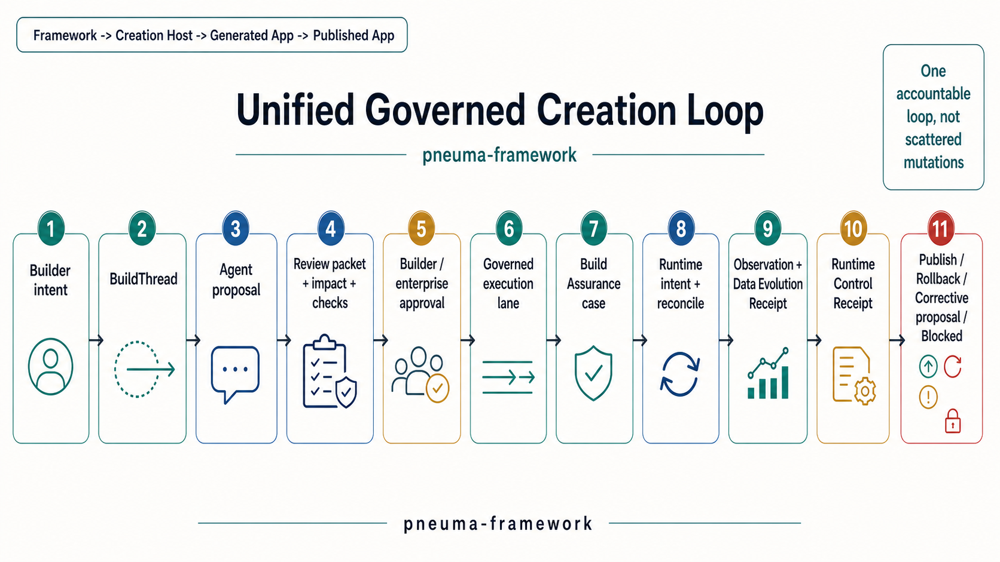

# Global Alignment Review 0.3

**Status:** Current top-level model snapshot after M44, before the next real implementation-framework phase.  
**Date:** 2026-05-14  
**Chinese version:** [global-alignment-review-0.3.zh-CN.md](./global-alignment-review-0.3.zh-CN.md)

## Purpose

This review answers one question:

> After Build Assurance, Enterprise Governance, and Runtime / Data Governance, is Pneuma still aligned with the original goal?

The answer should be explicit enough that the next implementation phase can start without re-litigating the model.

## Current North Star

`pneuma-framework` exists to help Developers build Creation Hosts where Builders can create and evolve Generated Applications with Build-phase Agents, while the framework constrains AI uncertainty through proposal, approval, evidence, verification, governance, publish, runtime/data outcome, and recovery contracts.

This is still the center of the project. The vocabulary has expanded, but the top-level object has not changed.

## Four-Layer Model

| Layer | Owns | Must not absorb |
|---|---|---|
| **Framework** | Shared primitives, contracts, validators, semantic tools, evidence vocabularies, local/reference helpers. | Host product UX, provider SDK implementations, hosted identity, deployment control planes. |
| **Creation Host** | Builder product surface, profiles, real provider wiring, credentials, preview/publish UX, policy choices. | Framework invariants or hidden bypasses around approval/evidence. |
| **Generated Application** | App definition, source/artifact boundary, data, versions, BuildThread, assurance cases. | Host-wide product preferences or marketplace concerns. |
| **Published Application** | Active release runtime and End User surface. | Build-time authority or framework-internal mutation privileges. |

The most important product boundary remains:

```text
pneuma-framework
  -> Creation Host
  -> Generated Application
  -> Published Application
```

## Unified Control Loop



The current framework model can now describe the full governed creation path:

```text
Builder intent
  -> BuildThread
  -> Agent proposal
  -> review packet / impact / checks
  -> Builder or enterprise approval
  -> governed definition/code/host execution lane
  -> Build Assurance case
  -> Runtime Intent / Reconcile Attempt
  -> Runtime Observation / Data Evolution Receipt
  -> Runtime Control Receipt
  -> publish, rollback, corrective proposal, or blocked state
```

The critical point is that this is one accountable control loop. It is not a pile of independent features.

## Domain Map

| Domain | Primary question | Framework owns | Host owns |
|---|---|---|---|
| **Creation** | What is being built, through which Host/profile/session? | Creation Host contracts and diagnostics. | Product surface, project creation, profile choices. |
| **Agent Loop** | What did the Builder ask and what did the Agent propose? | BuildThread and AgentBackend turn contract. | Prompting, domain tools, conversation UX. |
| **App Definition** | What app capability changed? | Operation, definition-as-data, policy/view/table contracts. | Domain-specific app model and generated UI/API shape. |
| **Code / Artifact** | What source or open-ended artifact changed? | Scaffold Project, Code Change Lane, HostExtension slots. | Source layout, guardrail commands, generated-app implementation. |
| **Assurance** | Is the change understandable, bounded, verified, and recoverable? | Build Change Assurance, review packets, recovery drills. | Evidence producers and product checks. |
| **Enterprise Governance** | Which human role must approve before publish readiness? | Role vocabulary, route evaluator, decision evidence. | Real identity, org mapping, notification/workflow UX. |
| **Runtime / Data** | What happened after approval to runtime and provider data? | Runtime/Data evidence contracts and data policy vocabulary. | Provider SDKs, migrations, backups, restore, process management. |
| **Sharing / Forking** | Can this artifact move without secrets and be safely rebound? | Share artifact, sharing governance, credential rebinding evidence. | Distribution product, access UX, real credential lifecycle. |

## Application Governance And Data Governance

Application governance and data governance are related but not the same boundary.

Application governance answers:

```text
What did the Builder ask the Agent to change in the app,
what was proposed,
who approved,
what changed,
and was the result verified?
```

Data governance answers:

```text
When that approved change affects runtime data or provider data,
what was the intended data evolution,
which runtime generation was allowed to act,
what was observed,
and what receipt proves migration, carry-forward, snapshot, restore, or branch behavior?
```

The relationship is:

```text
Application governance decides whether the change may proceed.
Data governance explains and constrains what happens to live or carried-forward data after that decision.
```

This keeps M44 aligned with the project goal. It does not turn Pneuma into a generic database governance platform.

## Key Invariants

1. Agents operate through semantic tools or Host-declared domain tools, not hidden provider-specific branches.
2. One Builder business intent should become one reviewable proposal or an explicit clarification, not scattered unowned mutations.
3. Approval must bind to the whole proposal evidence the human saw.
4. Framework-internal authority cannot be derived from user-controlled HTTP headers or normal End User runtime context.
5. Provider capabilities are declared as contracts; provider implementations stay Host-owned.
6. Data evolution that changes active or carried-forward data requires evidence, especially receipts for carry-forward, snapshot, restore, branch, or irreversible migration.
7. Failure is first-class: denied, blocked, failed-recovered, failed-unrecovered, rolled-back, stale, and superseded states must remain distinguishable.
8. Documentation and examples may use Bun, SQLite, Docker, GitHub, Linear, OpenRouter, or local version directories; none of those are framework semantics.

## What Has Become Clearer

The model is more concrete than it was at M1:

- the framework is not "an app generator"; it is a control plane for Creation Hosts;
- application/code governance and data governance are two cooperating evidence lanes;
- enterprise governance is review routing around AI-assisted business changes, not a generic admin product;
- provider abstraction is a capability and evidence boundary, not a license for the Build Agent to special-case providers;
- the next implementation phase should build real Host/runtime usability on top of these contracts, not add endless abstract provider options.

## What Would Be Drift

Avoid these directions unless a later explicit product decision promotes them:

- treating Pneuma as a hosted IAM or workflow engine;
- turning provider integrations into framework primitives;
- optimizing for marketplace artifact signing before Builder/Agent build safety;
- claiming production readiness without real Host-owned identity, credentials, migration, and monitoring;
- expanding adapters endlessly before the reference implementation proves a coherent Developer workflow.

## Current Health Assessment

| Area | Health | Reason |
|---|---|---|
| Four-layer model | Healthy | M40-M44 added governance and runtime/data contracts without collapsing Host or provider implementation into framework core. |
| Builder + Agent control loop | Healthy | BuildThread, review packets, Assurance, governance decisions, and receipts now describe intent through outcome. |
| Provider boundary | Improving | Provider Capability Matrix and Runtime/Data Governance give a better abstraction, but real provider-backed pressure is still needed. |
| Developer experience | Improving | Start Here, Creation Host Contract, downstream briefs, and upgrade guides exist, but next phase needs a real implementation framework rather than more isolated contracts. |
| Production claim | Intentionally limited | The framework has enterprise-governance vocabulary, not hosted enterprise infrastructure. |

## Next Implementation Runway

The next phase should start building the real implementation framework around the now-stable contracts:

1. Reference Creation Host runtime that consumes BuildThread, Code Change Lane, Assurance, Enterprise Governance, and Runtime / Data Governance as one visible loop.
2. Real provider-backed profile pressure, with provider capability declarations and fail-closed evidence, but no provider-special-case Agent behavior.
3. Published runtime/data lifecycle implementation, including migration/carry-forward receipt production and stale-generation rejection.
4. Developer-facing authoring experience that makes scaffold, profiles, agent package, provider matrix, and governance policies easy to create and verify.
5. A downstream validation pass from zero context after the implementation framework is usable.

## Decision

The project remains aligned with its original goal. The vocabulary has expanded, but the center has not moved:

```text
Make AI-assisted app creation governable enough that a Developer can build a real Creation Host and an organization can trust the Builder + Build Agent change process.
```

The right next move is not another abstract governance layer. It is a real implementation framework that uses these contracts end to end.
