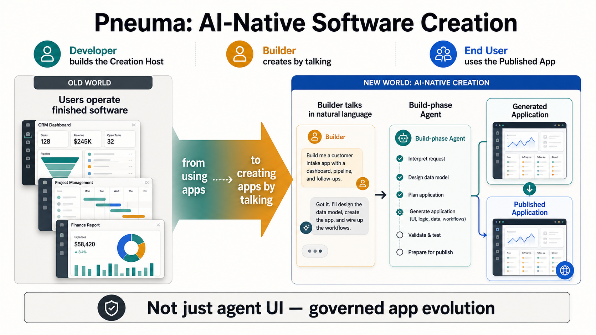
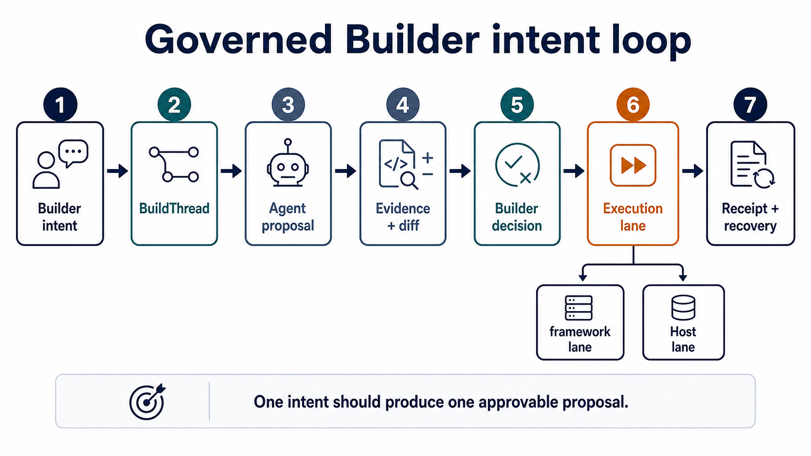
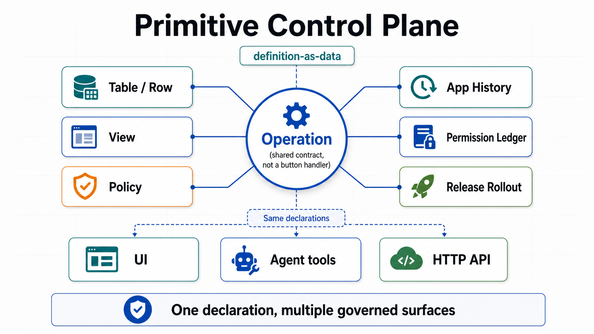
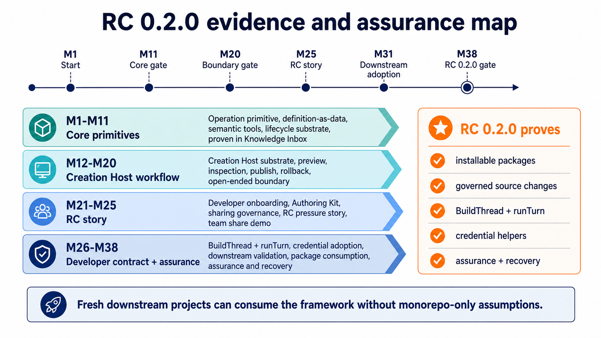

# Pneuma Team Share Package

**Date:** 2026-05-11
**Status:** RC 0.2.0 team-share package; tag pending owner confirmation
**Audience:** teammates with zero Pneuma context who understand normal software products
**Format:** 45-60 minute team share with optional local demos
**Chinese version:** [team-share-demo.zh-CN.md](./team-share-demo.zh-CN.md)

This is the top-down share package for explaining Pneuma after RC acceptance, M26-M38 stabilization, Build Assurance adoption, package-consumption gating, and fresh downstream validation.

For a Developer's self-serve reading path, start with [Start Here: Build A Creation Host](../developer/start-here.md). This document is for a team conversation.

## What The Team Should Remember

After the share, the team should be able to say:

```text
Pneuma is infrastructure for building AI-native Creation Hosts.
A Developer uses the framework to build the Host.
A Builder uses the Host to create, inspect, evolve, approve, publish, monitor, and roll back Generated Applications by talking to a Build-phase Agent.
End Users use the Published Application.
```

The second sentence they should remember:

```text
Pneuma is not proving that an agent can edit files.
It is proving that app evolution can become a governed software primitive.
```

The 0.2.0-specific takeaway:

```text
The framework is now package-consumable by a fresh downstream Creation Host.
The remaining question is productization, not whether the core model is coherent.
```

## 1. Why This Exists

Most software assumes the Developer finishes the app shape before users arrive. Users then operate the finished surface: click buttons, fill forms, read dashboards.

Pneuma tests a different contract:

```text
The Builder can change the app's behavior, data model, UI surface, release state, and source-level extension points in-session by talking to an Agent.
```



The important distinction:

| Normal app interaction | Pneuma creation interaction |
|---|---|
| Add one data row | Add or evolve a capability |
| Filter a list | Create a View, Operation, source change, or Host extension |
| Ask an assistant for help | Ask an Agent to propose an app change under governance |
| Deploy a build produced only by developers | Publish a Generated Application version produced through the Host workflow |

If Pneuma only created one hard-coded app, primitives like Operation, definition-as-data, approval tokens, BuildThread, permission ledger, runtime diagnostics, code-change evidence, rollout state, and rollback would be unnecessary overhead.

## 2. The Four-Artifact Model

The most common misunderstanding is to collapse everything into "a pneuma app." The current model deliberately keeps four artifacts separate:


| Artifact | Meaning |
|---|---|
| **pneuma-framework** | The library/runtime providing primitives, semantic tools, governance, lifecycle, backend-agent contracts, diagnostics, and release evidence. |
| **Creation Host** | A Developer-built product surface where Builders create and operate Generated Applications. |
| **Generated Application** | The app instance created through the Host. It has definition, data, source/artifact boundary, versions, runtime surface, and release history. |
| **Published Application** | A selected Generated Application version exposed to End Users. |

Role boundary:

| Role | Main job |
|---|---|
| **Developer** | Builds or configures the Creation Host, stack profiles, Host UX, agent package, guardrails, and domain constraints. |
| **Builder** | Uses the Creation Host to shape a Generated Application through conversation, preview, inspection, approval, and publish. |
| **End User** | Uses the Published Application like a normal app. They may never see the Build-phase Agent. |

Presenter line:

> Framework is the primitive. Creation Hosts and generated apps are products built on top.

## 3. AI Build As An Engineering Control Problem

The hard problem is not "can the Agent make a change?" The hard problem is:

```text
Can a non-expert Builder ask an Agent to change software
without losing accountability, inspection, recovery, and release discipline?
```

Common failure modes:

| Failure | Framework response |
|---|---|
| The Agent proposes too broad a change | Proposal evidence, diff, impact disclosure, and Builder approval. |
| The Builder regrets the request | Rejection turns, scoped approval, rollback/recovery evidence. |
| The Agent deletes a field or source file unexpectedly | Scaffold Project boundaries, Code Change Lane guardrails, readable diff, protected paths. |
| A migration or rollout partially fails | Release rollout state, recovery evidence, restart/rollback discipline. |
| A future reviewer asks why something changed | BuildThread, app history, permission ledger, execution receipts. |

This is why the next conceptual lane is **AI Build Assurance**. It is not generic artifact signing. It is the assurance case around Builder + Build-phase Agent changes:

```text
who asked,
what was proposed,
what evidence was shown,
who approved,
which lane executed,
what changed,
what failed,
how recovery works.
```

## 4. The Governed Creation Loop

The core loop is one Builder intent becoming one governed app change:



```text
Builder intent
  -> BuildThread turn
  -> Agent proposal
  -> impact / diff / evidence disclosure
  -> Builder approval or rejection
  -> scoped approval authority
  -> framework or Host lane execution
  -> execution receipt
  -> preview, publish, rollback, and inspection evidence
```

The authority split is non-negotiable:

| Actor | Allowed to do |
|---|---|
| Build-phase Agent | Propose changes through framework or Host semantic tools. |
| Builder | Approve or deny the proposal. |
| framework_system / Host executor | Spend scoped approval authority and execute the governed mutation lane. |
| End User | Use the published app through normal app policy. |

Approval evidence is product state, not a debug log.

## 5. The Framework Contract Stack

Pneuma is not a UI builder plus chat. It is a control plane where the same contracts feed UI, Agent tools, HTTP API, policy, history, runtime composition, release evidence, and portable Host contracts.



| Contract / subsystem | Why it exists |
|---|---|
| **Operation + definition-as-data** | App structure and actions can be governed, rediscovered, approved, and rolled back. |
| **Policy / Authorization Kernel** | Proposer, approver, executor, and runtime user authority stay separate. |
| **BuildThread** | Builder intent, Agent proposal, decision, and execution receipt have a semantic transcript. |
| **Scaffold Project + Code Change Lane** | Source changes become draft evidence, guarded approval, apply, rollback, and receipt. |
| **Runtime Diagnostic Surface** | Host/runtime composition has explicit mode, boot, health, readiness, and route fallback behavior. |
| **HostExtension Slot Contract** | Host-owned open-ended artifacts can be portable without pretending they are framework definition rows. |
| **AgentBackend.runTurn** | Backends consume BuildThread as source of truth; native sessions remain cache. |
| **Host Credential Broker utilities** | Sessions, OAuth callback binding, credential refs, and no-secret rebinding evidence have shared helpers. |
| **Release Rollout State** | Candidate, active, previous, restart, and rollback become inspectable Host state. |

The architecture shift from the original v0 spec is accepted:

```text
old mental model: lifecycle scripts are the core
current model: Operation + definition-as-data is the core
lifecycle remains a runtime subsystem
```

## 6. Evidence Ladder

The project did not jump directly to a polished demo. It built a proof ladder:



| Band | What it proved |
|---|---|
| **M1-M11** | Core primitives can govern definition, approval, permissions, recovery, deployable substrate, semantic index, and rollout. |
| **M12-M20** | A Creation Host can create, preview, inspect, evolve, approve, publish, restart, roll back, and carry a non-table-first app without blurring framework boundaries. |
| **M21-M25** | Developer onboarding, Authoring Kit, Sharing Governance, RC pressure, and Alice/Bob/Charlie/Dave made the RC story explainable and testable. |
| **M26-M38** | Code Change Lane, runtime diagnostics, HostExtension slots, AgentBackend `runTurn`, credential utilities, downstream adoption, visible/durable Build Change Assurance, approval-time review packets, recovery drill matrices, downstream adoption guidance, and package-consumption gating stabilized the post-RC developer contract. |

Current technical health for RC 0.2.0:

```text
bun test
1280 pass
0 fail
4755 expect() calls

bun run typecheck
exit 0

bun run test:package-consumption
exit 0
```

This does not mean production SaaS is done. It means the framework has a coherent developer-facing RC line, a package-consumable 0.2.0 contract surface, and a clearer Builder + Agent assurance lane for real Creation Hosts.

## 7. Demo Path

Use two live demos plus one contract walkthrough if time allows.

### Demo A: Developer cognition path

Purpose:

```text
Show why Alice is building a Creation Host, not merely one app.
```

Run:

```bash
bun run examples/m25-alice-creation-host-prototype/run.ts --port 8886
```

Open:

```text
http://127.0.0.1:8886/
```

Walkthrough:

1. Alice starts from the four-layer confusion.
2. Alice defines Host profiles and Build Agent Package.
3. Bob creates `dev-board`.
4. Charlie installs with credential rebinding.
5. Dave forks with provider-profile compatibility checks.
6. The RC judgment keeps productization gaps explicit.

### Demo B: Open-ended Personal Focus Site

Purpose:

```text
Show that the same Host workflow can carry a non-table-first generated app.
```

Run:

```bash
bun run examples/m18-open-ended-personal-focus-site/run.ts --port 8880
```

Open:

```text
http://127.0.0.1:8880/
```

Walkthrough:

1. Create `pandazki-focus-site`.
2. Preview a polished personal site, not a list workflow.
3. Inspect routes, sections, style tokens, modules, and deterministic GitHub attention evidence.
4. Evolve one Builder request.
5. Approve v1 at the Host layer.
6. Publish, restart, and roll back.

Key line:

> M18 proves the four-artifact workflow can carry open-ended UI/module state. ADR-0031 and ADR-0035 keep the boundary honest: these are Host-owned artifacts unless a later ADR promotes a repeated shape into framework definition rows.

### Walkthrough C: RC 0.2.0 developer contract

Open these documents:

1. [BuildThread](../developer/build-thread.md) - semantic transcript for Builder conversation.
2. [Scaffold Project Contract](../developer/scaffold-project-contract.md) - generated-app source boundary and guardrails.
3. [Code Change Lane](../developer/code-change-lane.md) - proposal evidence, readable diff, guarded apply, rollback, receipt.
4. [Runtime Composition](../developer/runtime-composition.md) - mode, boot options, internal token pattern, readiness helpers.
5. [HostExtension Slots](../developer/host-extension-slots.md) - portable Host-owned extension bundles.
6. [Host Credential Broker Utilities](../developer/credential-broker.md) - session cookies, OAuth state, credential refs, no-secret rebinding evidence.
7. [AI Build Assurance DDD Review](./spec/ai-build-assurance-domain-review.md) - the current assurance-domain anchor now carried into the RC 0.2.0 contract.
8. [Build Assurance Adoption Guide](../developer/build-assurance-adoption.md) - how a Host adopts assurance cases, review packets, stores, and recovery drills incrementally.
9. [Downstream Validation Brief](../developer/downstream-validation-brief.md) - what a fresh downstream project should build and report.
10. [RC 0.2.0 Snapshot](./release-candidate-0.2.0-snapshot.md) - package-consumption gate, full verification, and downstream validation evidence.

0.2.0 adds one more thing the team should explicitly understand:

```text
The framework can now be consumed from outside the monorepo by a fresh Bun/TypeScript Creation Host.
```

The package-consumption gate copies the developer-facing packages to an isolated temporary directory, installs them into a new consumer with `file:` dependencies, imports focused public subpaths, runs `scaffold-host`, runs `doctor-host`, executes a smoke program, and typechecks the consumer. A second fresh downstream Host, Release Radar Studio, then validated the same direction with no material framework blocker.

## 8. Recommended Share Run

| Time | Section | Goal |
|---:|---|---|
| 0-5 min | Why this exists | Separate using software from creating software by talking. |
| 5-12 min | Four artifacts | Prevent the "pneuma app" terminology collapse. |
| 12-20 min | AI build control problem | Explain why uncertainty, regret, partial failure, and recovery are first-class. |
| 20-30 min | Governed loop and contract stack | Map primitives to authority, evidence, runtime, source-change, and release. |
| 30-42 min | Demo A | Show Alice's Developer cognition path and Bob/Charlie/Dave outcomes. |
| 42-52 min | Demo B | Show open-ended app pressure. |
| 52-58 min | Walkthrough C | Explain the RC 0.2.0 package-consumable contract surface. |
| 58-60 min | Boundary | Align on the current evidence and the next concrete downstream pressure test. |

Presenter rules:

- Start from the problem, not from ADR numbers.
- Use "Builder changes app capability" instead of "Agent edits code."
- Show the End User app before showing inspectors.
- When showing approval, explicitly name proposer, approver, executor, lane, and receipt.
- Be precise about open-ended artifacts: Host-owned and portable, not framework definition rows.
- End with the current evidence and the next concrete pressure test, not a broad list of future features.

## FAQ

### Is Pneuma a website builder?

No. A website builder is one possible Creation Host or profile. Pneuma is the framework layer for building Creation Hosts whose generated apps may be workflow tools, knowledge apps, internal SaaS modules, open-ended sites, or future Pneuma 2.x modes.

### Is the Agent allowed to change production software directly?

No. The intended contract is proposal, impact/diff disclosure, approval, scoped authority, framework or Host-lane execution, evidence, and rollback/recovery.

### Why not just let the Agent edit files?

Because direct file edits make UI action, Agent tool-call, policy, approval evidence, audit history, rollback, and release semantics diverge. Code Change Lane still allows source changes, but only as draft evidence entering a governed approval/apply path.

### Is this production-ready enterprise security?

No. The framework now has the right authority shape and local/runtime hardening evidence, but production IAM, tenant administration, secret management, retention, assignment, hosted governance workflows, and long-running operational proof are later productization work.

### What would justify tagging RC 0.2.0?

The 0.2.0 tag is justified when the owner accepts the verification report: full suite green, package-consumption gate green, docs updated, and fresh downstream validation reporting no material framework blocker. Future tags should still be justified by concrete downstream pressure, not by adding another abstract assurance layer by default.

## Useful Links

- [Start Here: Build A Creation Host](../developer/start-here.md)
- [Downstream Validation Brief](../developer/downstream-validation-brief.md)
- [Architecture Index](./README.md)
- [Creation Host Model](./spec/creation-host-model.md)
- [AI Build Assurance DDD Review](./spec/ai-build-assurance-domain-review.md)
- [Release Candidate Snapshot](./release-candidate-snapshot.md)
- [RC 0.2.0 Snapshot](./release-candidate-0.2.0-snapshot.md)
