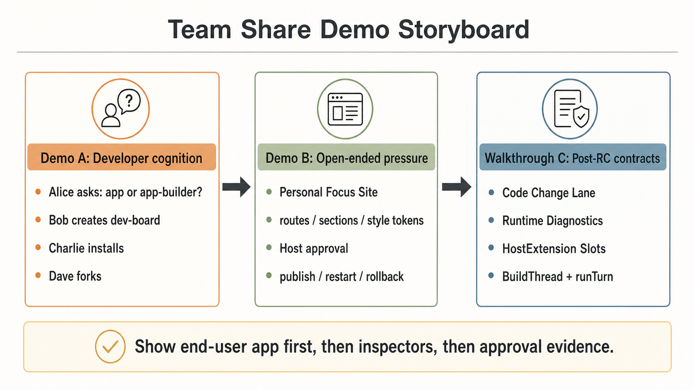
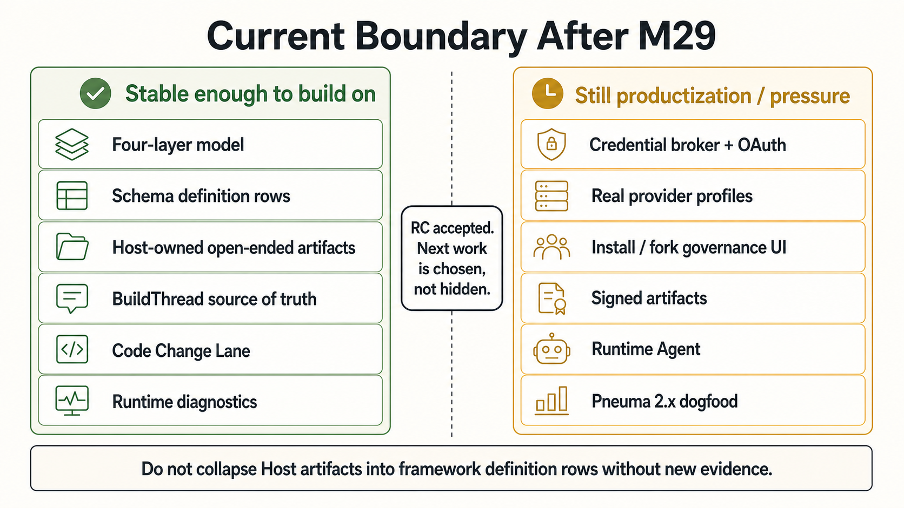

# Pneuma Team Share Package

**Date:** 2026-05-09
**Status:** Current post-RC team-share package after M31
**Audience:** teammates with zero Pneuma context who understand normal software products
**Format:** 45-60 minute team share with optional local browser demos and a contract walkthrough
**Chinese version:** [Pneuma Team Share Package zh-CN](./team-share-demo.zh-CN.md)

This is the top-down share package for explaining Pneuma after RC acceptance and the M26-M31 stabilization work.

Use it when the audience needs the full outside-in path:

```text
project goal
  -> four-layer product model
  -> governed creation loop
  -> framework control plane
  -> milestone evidence
  -> demos and post-RC contract walkthrough
  -> current decision boundary
```

For a Developer's first self-serve reading path, still start with [Start Here: Build A Creation Host](../developer/start-here.md).

## Outcome

After the share, the team should be able to say:

```text
Pneuma is infrastructure for building AI-native Creation Hosts.
A Developer uses the framework to build the Host.
A Builder uses the Host to create, inspect, evolve, approve, publish, monitor, and roll back Generated Applications by talking to a Build-phase Agent.
End Users use the Published Application.
```

The second sentence they should remember:

```text
Pneuma is not proving that an agent can edit files.
It is proving that app evolution can become a governed software primitive.
```

## 1. Why This Exists

Most software assumes the Developer finishes the app shape before users arrive. Users then operate the finished surface: click buttons, fill forms, read dashboards.

Pneuma tests a different contract:

```text
The Builder can change the app's behavior, data model, UI surface, release state, and source-level extension points in-session by talking to an Agent.
```


The important distinction is:

| Normal app interaction | Pneuma creation interaction |
|---|---|
| Add one data row | Add or evolve a capability |
| Filter a list | Create a View, Operation, source change, or Host extension |
| Ask an assistant for help | Ask an Agent to propose an app change under governance |
| Deploy a build produced only by developers | Publish a Generated Application version produced through the Host workflow |

This is why the project needs primitives such as Operation, definition-as-data, approval tokens, BuildThread, app history, permission ledger, runtime diagnostics, code-change evidence, rollout state, and rollback.

If Pneuma only created one hard-coded app, those primitives would be unnecessary overhead.

## 2. The Four-Artifact Model

The most common misunderstanding is to collapse everything into "a pneuma app." The current model deliberately keeps four artifacts separate:


| Artifact | Meaning |
|---|---|
| **pneuma-framework** | The library/runtime providing primitives, semantic tools, governance, lifecycle, backend-agent contracts, diagnostics, and release evidence. |
| **Creation Host** | A Developer-built product surface where Builders create and operate Generated Applications. |
| **Generated Application** | The app instance created through the Host. It has definition, data, source/artifact boundary, versions, runtime surface, and release history. |
| **Published Application** | A selected Generated Application version exposed to End Users. |

The role map:

| Role | Main job |
|---|---|
| **Developer** | Builds or configures the Creation Host, stack profiles, host UX, agent package, guardrails, and domain constraints. |
| **Builder** | Uses the Creation Host to shape a Generated Application through conversation, preview, inspection, approval, and publish. |
| **End User** | Uses the Published Application like a normal app. They may never see the Build-phase Agent. |

Use this line when presenting:

> Framework is the primitive. Creation Hosts and generated apps are products built on top.

## 3. The Governed Creation Loop

The core loop is one Builder intent becoming one governed app change:


```text
Builder intent
  -> Agent proposal
  -> impact / diff / evidence disclosure
  -> Builder approval
  -> scoped approval authority
  -> framework or Host lane execution
  -> BuildThread receipt
  -> preview, publish, rollback, and inspection evidence
```

The authority split is non-negotiable:

| Actor | Allowed to do |
|---|---|
| Build-phase Agent | Propose changes through framework or Host semantic tools. |
| Builder | Approve or deny the proposal. |
| framework_system / Host executor | Spend scoped approval authority and execute the governed mutation lane. |
| End User | Use the published app through normal app policy. |

This is why approval evidence is product state, not a debug log. A future enterprise surface needs to answer:

```text
Who proposed this?
Who approved it?
What exactly was approved?
Which lane executed it?
What changed?
Can we inspect, replay, or roll it back?
```

## 4. The Primitive Control Plane

Pneuma is not a UI builder plus chat. It is a control plane where the same primitives feed UI, Agent tools, HTTP API, policy, history, runtime composition, release evidence, and portable Host contracts.


Current important primitives and subsystems:

| Primitive / subsystem | Why it exists |
|---|---|
| **Operation** | Shared action contract. UI button, Agent tool, and HTTP operation come from one declaration. |
| **definition-as-data** | App structure is stored as governed rows: tables, columns, operations, views, policies. |
| **Policy / Authorization Kernel** | Separates proposer, approver, executor, and runtime user authority. |
| **Permission Ledger / App History** | Durable approval and definition-change evidence for product governance surfaces. |
| **BuildThread** | Framework-owned semantic transcript for Builder intent, Agent proposal, Builder decision, and execution receipt. |
| **Scaffold Project + Code Change Lane** | Developer-authored source boundary, guardrails, readable diff, proposal evidence, guarded apply, rollback, and receipt. |
| **Runtime Diagnostic Surface** | Explicit runtime mode, boot options, route fallback, health, readiness, and marker helpers. |
| **HostExtension Slot Contract** | Portable contribution bundles for Host-owned open-ended artifacts without claiming they are framework definition rows. |
| **AgentBackend.runTurn** | Backend turn contract that uses BuildThread as source of truth and backend-native sessions as cache. |
| **Release Rollout State** | Track candidate, active, previous, restart, and rollback at the Host level. |
| **Lifecycle subsystem** | Start, stop, build, deploy, migrate, restart through semantic tools rather than agent-edited scripts. |

The architectural shift from the original v0 spec is accepted:

```text
old mental model: lifecycle scripts are the core
current model: Operation + definition-as-data is the core
lifecycle remains a runtime subsystem
```

See [ADR-0029](./adr/0029-supersede-v0-design-spec.md), [ADR-0030](./adr/0030-lifecycle-subsystem-contract.md), [ADR-0034](./adr/0034-code-change-lane-executor.md), [ADR-0035](./adr/0035-host-extension-slot-contract.md), [ADR-0036](./adr/0036-agent-backend-run-turn.md), and [ADR-0037](./adr/0037-host-credential-broker-utilities.md).

## 5. Evidence From M1-M31

The project did not jump directly to a polished demo. It built a proof ladder:


| Band | What it proved |
|---|---|
| **M1-M2** | App definition can be governed, approved, attributed, policy-gated, and rolled back with enterprise authority separation. |
| **M3-M4** | The primitive chain survives real substrate pressure: Bun, SQLite, Drizzle, Docker, mounted volume, and a usable Knowledge Inbox app. |
| **M5-M7** | Builder/Agent app evolution works with real backend-agent paths and one proposal-level approval for one intent. |
| **M8-M11** | Generated app state can enter release packaging, integrity evidence, semantic retrieval, and rollout state. |
| **M12-M16** | The Reference Creation Host can create, preview, inspect, evolve, approve, publish, restart, roll back, and switch profiles. |
| **M17-M20** | Security review, architecture acceptance, open-ended app pressure, and ADR-0031 pinned the Host-owned open-ended artifact boundary. |
| **M21-M25** | Developer onboarding, Authoring Kit, Sharing Governance, RC pressure, and Alice's Developer cognition path made RC explainable and testable. |
| **M26-M31** | Code Change Lane, runtime diagnostics, HostExtension slots, AgentBackend `runTurn`, Host Credential Broker utilities, and downstream credential adoption pressure stabilized the post-RC developer contract. |

Current technical health from M31:

```text
bun test
1242 pass
0 fail
4637 expect() calls

bun run typecheck
exit 0

targeted docs link check
exit 0
```

That does not mean production SaaS is done. It means the framework has a coherent developer-facing RC line and a clearer post-RC contract surface for real Creation Hosts.

## 6. Demo Path

Use two live demos plus one document walkthrough if time allows:



### Demo A: Developer cognition path

Purpose:

```text
Show why Alice is building a Creation Host, not merely one app.
```

Run:

```bash
bun run examples/m25-alice-creation-host-prototype/run.ts --port 8886
```

Open:

```text
http://127.0.0.1:8886/
```

Walkthrough:

1. Alice starts from the four-layer confusion.
2. Alice defines Host profiles and Build Agent Package.
3. Bob creates `dev-board`.
4. Charlie installs with credential rebinding.
5. Dave forks with provider-profile compatibility checks.
6. The RC judgment keeps productization gaps explicit.

### Demo B: Open-ended Personal Focus Site

Purpose:

```text
Show that the same Host workflow can carry a non-table-first generated app.
```

Run:

```bash
bun run examples/m18-open-ended-personal-focus-site/run.ts --port 8880
```

Open:

```text
http://127.0.0.1:8880/
```

Walkthrough:

1. Create `pandazki-focus-site`.
2. Preview a polished personal site, not a list workflow.
3. Inspect routes, sections, style tokens, modules, and deterministic GitHub attention evidence.
4. Evolve one Builder request.
5. Approve v1 at the Host layer.
6. Publish, restart, and roll back.

Key presenter line:

> M18 proves the four-artifact workflow can carry open-ended UI/module state. ADR-0031 and ADR-0035 keep the framework boundary honest: these are Host-owned artifacts unless a later ADR promotes a repeated shape into framework definition rows.

### Walkthrough C: Post-RC developer contracts

Purpose:

```text
Show what M26-M31 added for real downstream Hosts.
```

Open these documents:

1. [Code Change Lane](../developer/code-change-lane.md) — proposal evidence, readable diff, guarded apply, rollback, receipt.
2. [Runtime Composition](../developer/runtime-composition.md) — mode, boot options, internal token pattern, readiness helpers.
3. [HostExtension Slots](../developer/host-extension-slots.md) — portable Host-owned extension bundles.
4. [BuildThread](../developer/build-thread.md) and [M29 Snapshot](./milestone-29-snapshot.md) — BuildThread as source of truth for backend turns.
5. [Host Credential Broker Utilities](../developer/credential-broker.md), [M31 Snapshot](./milestone-31-snapshot.md), and [M30 Snapshot](./milestone-30-snapshot.md) — session cookies, OAuth state, credential refs, no-secret rebinding evidence, and downstream adoption evidence.

## 7. Current Decision Boundary

RC is accepted. The next work should not be framed as "what blocks RC?" It should be framed as "which post-RC productization or pressure lane is worth proving next?"



What is stable enough to build on:

| Area | Current claim |
|---|---|
| Four-layer model | Accepted: Framework -> Creation Host -> Generated Application -> Published Application. |
| Schema-driven app definition | Framework-governed rows through Operation + definition-as-data. |
| Host-owned open-ended artifacts | Supported through Host approval, Code Change Lane, and HostExtension slots; not framework definition rows. |
| Builder conversation | BuildThread is framework-owned semantic transcript; backend-native sessions are cache. |
| Source changes | Code Change Lane can produce proposal evidence and guarded apply for draft source changes. |
| Runtime composition | Runtime mode, readiness, health, and route fallback now have framework helpers. |

What remains productization / pressure work:

| Lane | Why it is not part of the current claim |
|---|---|
| Production credential store + OAuth/account-linking UX | Local/reference credential helpers exist; durable secret storage, encryption, refresh, and account-linking UX remain Host/product work. |
| Real provider adapter profile, likely Postgres first | Provider parity shape exists; concrete adapter pressure remains. |
| Install/fork governance UI | Governance reasons exist; product surface remains to be built. |
| Signed artifact / provenance | Needed before cross-host marketplace claims. |
| Runtime Agent | Orthogonal to Build-phase Agent; needs a specific End User job. |
| Hot reload and richer open-ended artifact execution | Useful product lane, but current evidence is restart/preview based. |
| Pneuma 2.x dogfood | Strongest generality proof: rebuild existing modes as Creation Host profiles/templates. |

## 8. Suggested Share Run

| Time | Section | Goal |
|---:|---|---|
| 0-5 min | Why this exists | Separate "using software" from "creating software by talking." |
| 5-12 min | Four artifacts | Prevent the "pneuma app" terminology collapse. |
| 12-20 min | Governed loop | Explain authority separation and why enterprise governance is core. |
| 20-30 min | Primitive control plane | Map primitives to UI, Agent tools, API, policy, history, runtime, source-change, and release. |
| 30-40 min | Demo A | Show Alice's Developer cognition path and Bob/Charlie/Dave outcomes. |
| 40-50 min | Demo B | Show open-ended app pressure. |
| 50-57 min | Walkthrough C | Explain what M26-M29 added for real downstream Hosts. |
| 57-60 min | Boundary | Align on which post-RC lane is worth proving next. |

Presenter rules:

- Start from the problem, not from ADR numbers.
- Use "Builder changes app capability" instead of "Agent edits code."
- Show the End User app before showing inspectors.
- When showing approval, explicitly name proposer, approver, executor, lane, and receipt.
- Be precise about open-ended artifacts: Host-owned and portable, not framework definition rows.
- End with the next lane decision, not a broad list of future features.

## 9. FAQ

### Is Pneuma a website builder?

No. A website builder is one possible Creation Host or profile. Pneuma is the framework layer for building Creation Hosts whose generated apps may be workflow tools, knowledge apps, internal SaaS modules, open-ended sites, or future Pneuma 2.x modes.

### Is the Agent allowed to change production software directly?

No. The intended contract is proposal, impact/diff disclosure, approval, scoped authority, framework or Host-lane execution, evidence, and rollback/recovery. M17 closed critical runtime bypasses; M26-M29 clarified the source-change and backend-turn lanes.

### Why not just let the Agent edit files?

Because file edits make UI action, Agent tool-call, policy, approval evidence, audit history, rollback, and release semantics diverge. Code Change Lane still allows source changes, but only as draft evidence entering a governed approval/apply path.

### Why not support every database, vector store, deployment target, and runtime now?

Because framework semantics should not be confused with implementation choices. Provider and deployment options become framework contracts only after concrete pressure proves the shared shape.

### Is this production-ready enterprise security?

No. The framework now has the right authority shape and local/runtime hardening evidence, but production IAM, tenant administration, secret management, retention, assignment, and hosted governance workflows are later productization work.

### What would justify the next release tag?

A chosen post-RC lane should close with executable evidence, updated docs, and no new top-level boundary confusion. Candidate lanes include credential broker/OAuth, provider profile pressure, install/fork governance UI, Runtime Agent, hot reload/custom code, or Pneuma 2.x dogfood.

## Appendix: Useful Links

- [Start Here: Build A Creation Host](../developer/start-here.md)
- [Creation Host Model](./spec/creation-host-model.md)
- [Release Candidate Snapshot](./release-candidate-snapshot.md)
- [M25 Alice Creation Host Prototype Snapshot](./milestone-25-snapshot.md)
- [M26 Code Change Lane Hardening Snapshot](./milestone-26-snapshot.md)
- [M27 Runtime Diagnostic Surface Snapshot](./milestone-27-snapshot.md)
- [M28 HostExtension Slot Snapshot](./milestone-28-snapshot.md)
- [M29 AgentBackend runTurn Snapshot](./milestone-29-snapshot.md)
- [M31 Downstream Credential Adoption Snapshot](./milestone-31-snapshot.md)
- [M30 Host Credential Broker Snapshot](./milestone-30-snapshot.md)
- [ADR-0031: Open-ended definition artifact boundary](./adr/0031-open-ended-definition-artifact-boundary.md)
- [ADR-0034: Code Change Lane executor](./adr/0034-code-change-lane-executor.md)
- [ADR-0035: HostExtension Slot Contract](./adr/0035-host-extension-slot-contract.md)
- [ADR-0037: Host Credential Broker Utilities](./adr/0037-host-credential-broker-utilities.md)
- [ADR-0036: AgentBackend runTurn](./adr/0036-agent-backend-run-turn.md)
- [BuildThread Guide](../developer/build-thread.md)
- [Code Change Lane Guide](../developer/code-change-lane.md)
- [HostExtension Slots Guide](../developer/host-extension-slots.md)
- [Runtime Composition Guide](../developer/runtime-composition.md)
